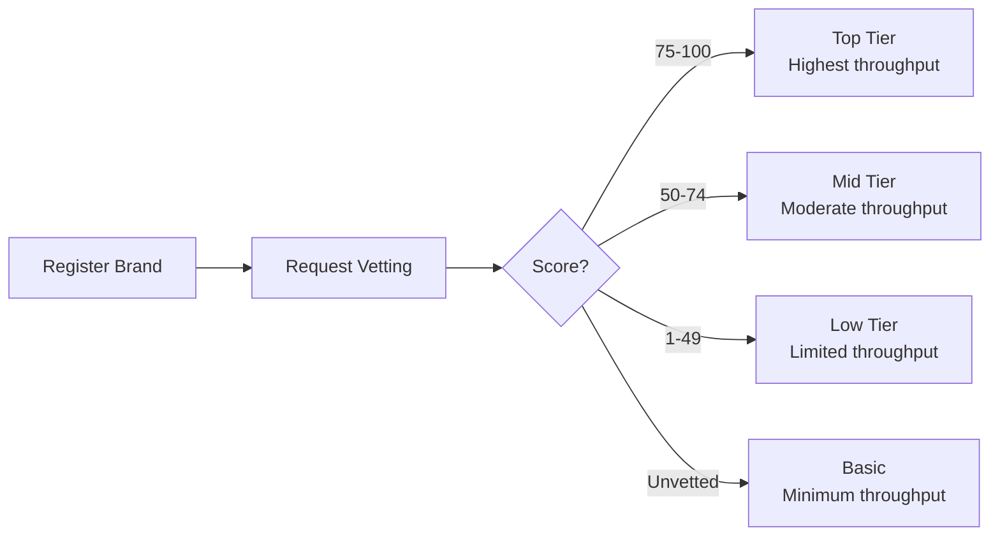

# 10DLC Rate Limits & Throughput

Understand AT&T and T-Mobile 10DLC rate limits by vetting score, campaign type, and carrier. Optimize your brand score for higher throughput.

Your 10DLC throughput is determined by your **brand vetting score** and **campaign type**. Each carrier (AT\&T, T-Mobile, Verizon) applies different rate limits. Understanding these limits helps you plan capacity and optimize for higher throughput.

***

## AT\&T throughput

AT\&T assigns throughput per campaign based on a **Message Class**, determined by your use case type and vetting score.

| Message Class | Use Case                   | Vetting Score | SMS TPM | MMS TPM |
| ------------- | -------------------------- | ------------- | ------- | ------- |
| A             | Standard (Dedicated)       | 75-100        | 4,500   | 2,400   |
| B             | Standard (Mixed/Marketing) | 75-100        | 4,500   | 2,400   |
| C             | Standard (Dedicated)       | 50-74         | 2,400   | 1,200   |
| D             | Standard (Mixed/Marketing) | 50-74         | 2,400   | 1,200   |
| E             | Standard (Dedicated)       | 1-49          | 240     | 150     |
| F             | Standard (Mixed/Marketing) | 1-49          | 240     | 150     |
| T             | Low Volume Mixed           | Any           | 75      | 50      |
| W             | Sole Proprietor            | N/A           | 15      | 50      |

**Special use cases** (fixed throughput regardless of vetting score):

| Message Class | Use Case                         | SMS TPM | MMS TPM |
| ------------- | -------------------------------- | ------- | ------- |
| K             | Political                        | 4,500   | 2,400   |
| P             | Charity / Nonprofit              | 2,400   | 1,200   |
| S             | Social                           | 9,000   | 2,400   |
| X             | Emergency / Public Safety        | 4,500   | 2,400   |
| G             | Proxy (per number)               | 60      | 50      |
| N             | Agents & Franchises (per number) | 60      | 50      |

> **Note:** **TPM = Throughput Per Minute.** AT\&T measures throughput in messages per minute, not per second. To convert: 4,500 TPM ≈ 75 MPS.

***

## T-Mobile throughput

T-Mobile uses **daily message caps** at the brand level, shared across all campaigns under that brand.

| Brand Tier      | Vetting Score | Daily SMS Cap |
| --------------- | ------------- | ------------- |
| Top             | 75-100        | 200,000       |
| High            | 50-74         | 40,000        |
| Medium          | 25-49         | 10,000        |
| Basic           | 1-24          | 2,000         |
| Sole Proprietor | N/A           | 1,000         |

> **Warning:** T-Mobile caps are **per brand**, not per campaign. If you have 3 campaigns under one brand, they share the same daily cap. Plan accordingly for high-volume use cases.

> **Note:** Unvetted brands default to the **Basic** tier (2,000/day) unless the business is listed on the Russell 3000 index.

***

## Verizon throughput

Verizon has not published specific throughput numbers for 10DLC. They use content-based filtering rather than explicit rate limits. Messages that comply with your registered campaign use case are generally delivered without throttling.

***

## Vetting score impact

Your brand's vetting score (0-100) is the single most important factor in determining throughput:



| Score Range | AT\&T SMS TPM | T-Mobile Daily Cap | Recommendation                         |
| ----------- | ------------- | ------------------ | -------------------------------------- |
| 75-100      | 4,500         | 200,000            | ✅ Ideal for production                 |
| 50-74       | 2,400         | 40,000             | ⚠️ Adequate for moderate volume        |
| 25-49       | 240           | 10,000             | ⚠️ Limited — consider enhanced vetting |
| 1-24        | 240           | 2,000              | ❌ Very limited — improve score         |
| Unvetted    | 240           | 2,000              | ❌ Get vetted immediately               |

***

## Check your brand and campaign scores

  ```bash
  # Get brand details including vetting score
  curl -s https://api.telnyx.com/v2/10dlc/brand/{brandId} \
    -H "Authorization: Bearer YOUR_API_KEY" | jq '{
      brandId: .data.brandId,
      displayName: .data.displayName,
      identityStatus: .data.identityStatus,
      vettingScore: .data.vettingScore
    }'

  # List campaigns with throughput info
  curl -s https://api.telnyx.com/v2/10dlc/campaign \
    -H "Authorization: Bearer YOUR_API_KEY" | jq '.data[] | {
      campaignId: .campaignId,
      usecase: .usecase,
      attMsgClass: .attMsgClass,
      attTpm: .attTpm,
      tMobileBrandTier: .tMobileBrandTier
    }'
  ```

  ```python
  import os
  import requests

  API_KEY = os.environ.get("TELNYX_API_KEY")
  headers = {"Authorization": f"Bearer {API_KEY}"}

  # Check brand vetting score
  brand_id = "your_brand_id"
  response = requests.get(
      f"https://api.telnyx.com/v2/10dlc/brand/{brand_id}",
      headers=headers,
  )
  brand = response.json()["data"]
  print(f"Brand: {brand['displayName']}")
  print(f"Vetting Score: {brand.get('vettingScore', 'Not vetted')}")
  print(f"Identity Status: {brand['identityStatus']}")

  # Check campaign throughput
  response = requests.get(
      "https://api.telnyx.com/v2/10dlc/campaign",
      headers=headers,
  )
  for campaign in response.json()["data"]:
      print(f"\nCampaign: {campaign['campaignId']}")
      print(f"  Use Case: {campaign['usecase']}")
      print(f"  AT&T Class: {campaign.get('attMsgClass', 'N/A')}")
  ```

  ```javascript
  const axios = require('axios');

  const headers = {
    Authorization: `Bearer ${process.env.TELNYX_API_KEY}`,
  };

  // Check brand vetting score
  const brandId = 'your_brand_id';
  const brand = await axios.get(
    `https://api.telnyx.com/v2/10dlc/brand/${brandId}`,
    { headers }
  );
  console.log(`Brand: ${brand.data.data.displayName}`);
  console.log(`Vetting Score: ${brand.data.data.vettingScore ?? 'Not vetted'}`);

  // Check campaigns
  const campaigns = await axios.get(
    'https://api.telnyx.com/v2/10dlc/campaign',
    { headers }
  );
  campaigns.data.data.forEach(c => {
    console.log(`\nCampaign: ${c.campaignId} (${c.usecase})`);
    console.log(`  AT&T Class: ${c.attMsgClass ?? 'N/A'}`);
  });
  ```

***

## Maximize your throughput

1. **Get vetted with a high score**

    The most impactful action. Ensure before vetting:

    * **Website is live** and matches your brand information
    * **EIN matches** your legal business name exactly (IRS records)
    * **Phone number** is findable via Google for your business
    * **Email domain** matches your website domain
    * **Business address** is verifiable

2. **Choose the right use case**

    Some use cases have higher default throughput:

    * **Social** campaigns get 9,000 TPM on AT\&T
    * **Political** and **Emergency** get 4,500 TPM
    * **Mixed** campaigns work for most businesses

    Don't misrepresent your use case — carriers audit campaigns.

3. **Request enhanced vetting**

    If your initial score is below 75, consider requesting enhanced vetting for a more thorough review. Contact [Telnyx support](mailto:support@telnyx.com) for guidance.

4. **Use multiple numbers for higher aggregate throughput**

    Assign multiple phone numbers to your campaign. While per-campaign limits still apply, distributing across numbers helps with carrier-level delivery patterns.

5. **Monitor and optimize**

    Track delivery rates via [Message Detail Records](message-detail-records.md). High error rates may indicate you're hitting limits. Adjust sending patterns accordingly.

***

## Compliance checklist

Carriers can reduce your throughput or reject campaigns that don't follow these guidelines:

| Requirement                      | Details                                         |
| -------------------------------- | ----------------------------------------------- |
| ✅ Website domain = email domain  | `admin@acme.com` + `acme.com`                   |
| ✅ Company name matches website   | Consistent branding across registration         |
| ✅ Clear opt-in on website        | SMS consent checkbox visible near submit button |
| ✅ Detailed campaign description  | Specific, not vague or generic                  |
| ✅ Sample messages match use case | Realistic and representative                    |
| ✅ No disallowed content          | No SHAFT, cannabis, payday lending, sweepstakes |
| ✅ Opt-out language in messages   | Include "Reply STOP to unsubscribe"             |

### Disallowed use cases

> **Warning:** The following use cases will be rejected or result in very low throughput:
> 
>   * Unsolicited messaging (cold outreach, lead generation spam)
>   * Non-direct lending (3rd party auto loans, payday loans)
>   * Indirect debt collection
>   * Cannabis or CBD marketing
>   * Gambling (unless licensed)
>   * SHAFT content (Sex, Hate, Alcohol, Firearms, Tobacco)
>   * Sweepstakes and "free giveaway" campaigns

***

## Related resources

  - [10DLC Quickstart](../tutorial/getting-started-with-10dlc.md) — Register your brand and campaign for 10DLC messaging.

  - [Event Notifications](10dlc-event-notifications.md) — Receive webhooks for brand vetting and campaign status changes.

  - [Rate Limiting](rate-limiting.md) — General messaging rate limits for all sender types.

  - [Message Detail Records](message-detail-records.md) — Track delivery rates and identify throughput issues.
