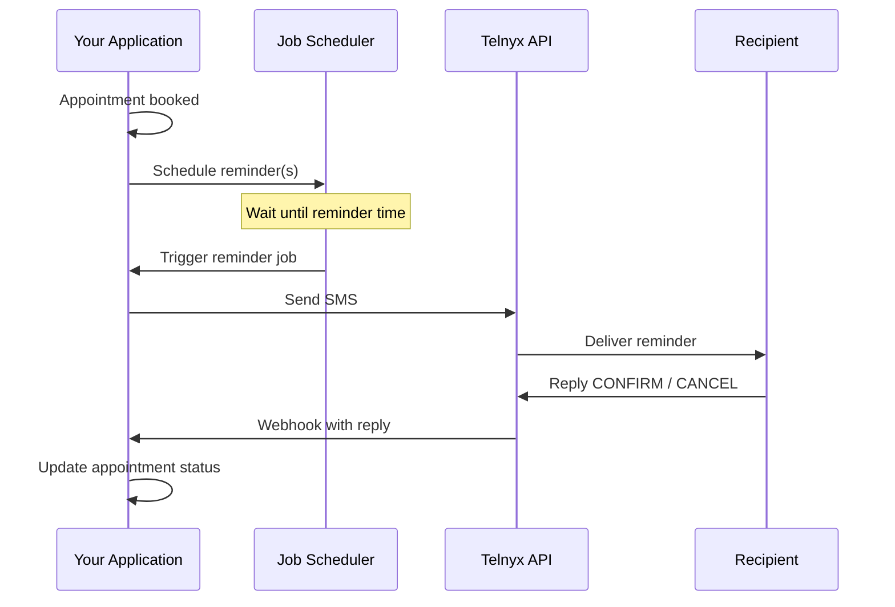

# Appointment Reminders via SMS

Send automated appointment reminders with the Telnyx Messaging API. Includes scheduling strategies, opt-out handling, and best practices.

Reduce no-shows by sending automated SMS appointment reminders with the Telnyx Messaging API. This guide covers scheduling strategies, message templates, opt-out handling, and timing best practices.

## How it works



***

## Send an appointment reminder

  ```python
  import os
  from datetime import datetime

  from telnyx import Telnyx

  client = Telnyx(api_key=os.environ.get("TELNYX_API_KEY"))

  def send_reminder(to: str, patient_name: str, appointment_time: datetime, location: str):
      """Send an appointment reminder SMS."""
      formatted_time = appointment_time.strftime("%A, %B %d at %I:%M %p")

      response = client.messages.send(
          from_=os.environ.get("TELNYX_FROM_NUMBER"),
          to=to,
          text=(
              f"Hi {patient_name}, this is a reminder for your appointment "
              f"on {formatted_time} at {location}. "
              f"Reply CONFIRM to confirm or CANCEL to cancel."
          ),
      )
      return response.data

  # Example
  send_reminder(
      to="+15559876543",
      patient_name="Jane",
      appointment_time=datetime(2026, 3, 15, 14, 30),
      location="123 Main St, Suite 200",
  )
  ```

  ```javascript
  import Telnyx from 'telnyx';

  const client = new Telnyx({ apiKey: process.env.TELNYX_API_KEY });

  async function sendReminder(to, patientName, appointmentTime, location) {
    const formatted = appointmentTime.toLocaleDateString('en-US', {
      weekday: 'long', month: 'long', day: 'numeric',
      hour: 'numeric', minute: '2-digit',
    });

    const response = await client.messages.send({
      from: process.env.TELNYX_FROM_NUMBER,
      to,
      text: `Hi ${patientName}, this is a reminder for your appointment on ${formatted} at ${location}. Reply CONFIRM to confirm or CANCEL to cancel.`,
    });

    return response.data;
  }

  // Example
  await sendReminder(
    '+15559876543',
    'Jane',
    new Date('2026-03-15T14:30:00'),
    '123 Main St, Suite 200'
  );
  ```

  ```ruby
  require "telnyx"

  Telnyx.api_key = ENV["TELNYX_API_KEY"]

  def send_reminder(to:, patient_name:, appointment_time:, location:)
    formatted = appointment_time.strftime("%A, %B %d at %I:%M %p")

    Telnyx::Message.create(
      from: ENV["TELNYX_FROM_NUMBER"],
      to: to,
      text: "Hi #{patient_name}, this is a reminder for your appointment " \
            "on #{formatted} at #{location}. " \
            "Reply CONFIRM to confirm or CANCEL to cancel."
    )
  end

  # Example
  send_reminder(
    to: "+15559876543",
    patient_name: "Jane",
    appointment_time: Time.new(2026, 3, 15, 14, 30),
    location: "123 Main St, Suite 200"
  )
  ```

  ```go
  package main

  import (
  	"context"
  	"fmt"
  	"os"
  	"time"

  	"github.com/team-telnyx/telnyx-go"
  	"github.com/team-telnyx/telnyx-go/option"
  )

  func sendReminder(client *telnyx.Client, to, name, location string, apptTime time.Time) error {
  	formatted := apptTime.Format("Monday, January 2 at 3:04 PM")

  	_, err := client.Messages.Send(context.TODO(), telnyx.MessageSendParams{
  		From: os.Getenv("TELNYX_FROM_NUMBER"),
  		To:   to,
  		Text: fmt.Sprintf(
  			"Hi %s, this is a reminder for your appointment on %s at %s. "+
  				"Reply CONFIRM to confirm or CANCEL to cancel.",
  			name, formatted, location,
  		),
  	})
  	return err
  }

  func main() {
  	client := telnyx.NewClient(option.WithAPIKey(os.Getenv("TELNYX_API_KEY")))
  	appt := time.Date(2026, 3, 15, 14, 30, 0, 0, time.Local)
  	err := sendReminder(client, "+15559876543", "Jane", "123 Main St, Suite 200", appt)
  	if err != nil {
  		panic(err)
  	}
  	fmt.Println("Reminder sent!")
  }
  ```

  ```java
  package com.telnyx.example;

  import com.telnyx.sdk.client.TelnyxClient;
  import com.telnyx.sdk.client.okhttp.TelnyxOkHttpClient;
  import com.telnyx.sdk.models.messages.MessageSendParams;

  import java.time.LocalDateTime;
  import java.time.format.DateTimeFormatter;

  public final class AppointmentReminder {
      private static final DateTimeFormatter FORMATTER =
          DateTimeFormatter.ofPattern("EEEE, MMMM d 'at' h:mm a");

      public static String sendReminder(String to, String name,
                                         LocalDateTime apptTime, String location) {
          TelnyxClient client = TelnyxOkHttpClient.fromEnv();
          String formatted = apptTime.format(FORMATTER);

          var params = MessageSendParams.builder()
              .from(System.getenv("TELNYX_FROM_NUMBER"))
              .to(to)
              .text(String.format(
                  "Hi %s, this is a reminder for your appointment on %s at %s. " +
                  "Reply CONFIRM to confirm or CANCEL to cancel.",
                  name, formatted, location))
              .build();

          var response = client.messages().send(params);
          return response.data().id();
      }

      public static void main(String[] args) {
          sendReminder("+15559876543", "Jane",
              LocalDateTime.of(2026, 3, 15, 14, 30), "123 Main St, Suite 200");
      }
  }
  ```

  ```csharp .NET theme={null}
  using Telnyx;

  TelnyxConfiguration.SetApiKey(Environment.GetEnvironmentVariable("TELNYX_API_KEY"));

  async Task SendReminderAsync(string to, string name, DateTime apptTime, string location)
  {
      var formatted = apptTime.ToString("dddd, MMMM d 'at' h:mm tt");

      var service = new MessageService();
      await service.SendAsync(new MessageSendOptions
      {
          From = Environment.GetEnvironmentVariable("TELNYX_FROM_NUMBER"),
          To = to,
          Text = $"Hi {name}, this is a reminder for your appointment on {formatted} at {location}. " +
                 "Reply CONFIRM to confirm or CANCEL to cancel."
      });
  }

  await SendReminderAsync("+15559876543", "Jane",
      new DateTime(2026, 3, 15, 14, 30, 0), "123 Main St, Suite 200");
  ```

  ```php
  <?php
  require_once 'vendor/autoload.php';

  \Telnyx\Telnyx::setApiKey(getenv('TELNYX_API_KEY'));

  function sendReminder(string $to, string $name, DateTime $apptTime, string $location): void
  {
      $formatted = $apptTime->format('l, F j \a\t g:i A');

      \Telnyx\Message::Create([
          'from' => getenv('TELNYX_FROM_NUMBER'),
          'to' => $to,
          'text' => "Hi {$name}, this is a reminder for your appointment "
              . "on {$formatted} at {$location}. "
              . "Reply CONFIRM to confirm or CANCEL to cancel.",
      ]);
  }

  sendReminder('+15559876543', 'Jane',
      new DateTime('2026-03-15 14:30:00'), '123 Main St, Suite 200');
  ```

***

## Scheduling strategies

Choose a scheduling approach based on your application's requirements:

### Telnyx Scheduled Messages

    The simplest approach — use the Telnyx API's built-in [scheduled messaging](schedule-sms-and-mms-messages.md) feature. No external scheduler needed.

    ```python
    from datetime import datetime, timedelta, timezone

    # Schedule reminder 24 hours before appointment
    reminder_time = appointment_time - timedelta(hours=24)

    response = client.messages.send(
        from_=os.environ.get("TELNYX_FROM_NUMBER"),
        to="+15559876543",
        text="Reminder: You have an appointment tomorrow at 2:30 PM.",
        send_at=reminder_time.astimezone(timezone.utc).isoformat(),
    )
    ```

    **Pros:** No infrastructure needed, simple API call
    **Cons:** Limited to single scheduled time per API call, max 7 days in advance

### Cron / Job Scheduler

    Run a periodic job (e.g., every hour) that queries your database for upcoming appointments and sends reminders.

    ```python
    # Example cron job (runs hourly)
    from datetime import datetime, timedelta

    def send_pending_reminders():
        """Find appointments in the next 24-25 hours and send reminders."""
        now = datetime.now()
        window_start = now + timedelta(hours=23)
        window_end = now + timedelta(hours=25)

        # Query your database
        appointments = db.query(
            "SELECT * FROM appointments "
            "WHERE start_time BETWEEN %s AND %s "
            "AND reminder_sent = FALSE",
            (window_start, window_end)
        )

        for appt in appointments:
            send_reminder(
                to=appt.phone,
                patient_name=appt.name,
                appointment_time=appt.start_time,
                location=appt.location,
            )
            db.execute(
                "UPDATE appointments SET reminder_sent = TRUE WHERE id = %s",
                (appt.id,)
            )
    ```

    **Pros:** Full control, supports multiple reminder windows, database-driven
    **Cons:** Requires job scheduler infrastructure (cron, Celery, Bull, etc.)

### Event-Driven Queue

    Schedule individual reminder jobs when appointments are created using a task queue like Celery (Python), Bull (Node), or Sidekiq (Ruby).

    ```python
    from celery import Celery
    from datetime import timedelta

    celery_app = Celery('reminders', broker='redis://localhost:6379')

    @celery_app.task
    def send_scheduled_reminder(phone, name, time_str, location):
        appointment_time = datetime.fromisoformat(time_str)
        send_reminder(to=phone, patient_name=name,
                      appointment_time=appointment_time, location=location)

    # When appointment is booked, schedule the reminder
    def on_appointment_created(appointment):
        reminder_time = appointment.start_time - timedelta(hours=24)
        send_scheduled_reminder.apply_async(
            args=[appointment.phone, appointment.name,
                  appointment.start_time.isoformat(), appointment.location],
            eta=reminder_time,
        )
    ```

    **Pros:** Precise timing, scalable, handles cancellations
    **Cons:** Requires message queue infrastructure (Redis, RabbitMQ)

***

## Handle replies (confirm / cancel)

Set up a webhook to receive replies and update appointment status:

  ```python
  from flask import Flask, request, jsonify

  app = Flask(__name__)

  @app.route("/webhooks/messaging", methods=["POST"])
  def handle_webhook():
      data = request.json["data"]

      if data["event_type"] != "message.received":
          return jsonify({"status": "ignored"}), 200

      payload = data["payload"]
      from_number = payload["from"]["phone_number"]
      text = payload["text"].strip().upper()

      if text == "CONFIRM":
          # Update appointment status in your database
          db.execute(
              "UPDATE appointments SET status = 'confirmed' WHERE phone = %s "
              "AND start_time > NOW()",
              (from_number,)
          )
          # Send confirmation
          client.messages.send(
              from_=os.environ.get("TELNYX_FROM_NUMBER"),
              to=from_number,
              text="Your appointment has been confirmed. See you then!",
          )

      elif text == "CANCEL":
          db.execute(
              "UPDATE appointments SET status = 'cancelled' WHERE phone = %s "
              "AND start_time > NOW()",
              (from_number,)
          )
          client.messages.send(
              from_=os.environ.get("TELNYX_FROM_NUMBER"),
              to=from_number,
              text="Your appointment has been cancelled. "
                   "Please call us to reschedule.",
          )

      return jsonify({"status": "ok"}), 200
  ```

  ```javascript
  import express from 'express';

  const app = express();
  app.use(express.json());

  app.post('/webhooks/messaging', async (req, res) => {
    const { data } = req.body;

    if (data.event_type !== 'message.received') {
      return res.json({ status: 'ignored' });
    }

    const fromNumber = data.payload.from.phone_number;
    const text = data.payload.text.trim().toUpperCase();

    if (text === 'CONFIRM') {
      await db.query(
        `UPDATE appointments SET status = 'confirmed'
         WHERE phone = $1 AND start_time > NOW()`,
        [fromNumber]
      );
      await client.messages.send({
        from: process.env.TELNYX_FROM_NUMBER,
        to: fromNumber,
        text: 'Your appointment has been confirmed. See you then!',
      });
    } else if (text === 'CANCEL') {
      await db.query(
        `UPDATE appointments SET status = 'cancelled'
         WHERE phone = $1 AND start_time > NOW()`,
        [fromNumber]
      );
      await client.messages.send({
        from: process.env.TELNYX_FROM_NUMBER,
        to: fromNumber,
        text: 'Your appointment has been cancelled. Please call us to reschedule.',
      });
    }

    res.json({ status: 'ok' });
  });
  ```

***

## Opt-out handling

> **Warning:** You **must** honor opt-out requests. Telnyx automatically handles STOP/UNSTOP keywords for 10DLC and Toll-Free numbers, but you should also track opt-outs in your application.

**Automatic opt-out (Telnyx managed)**

    Telnyx automatically handles standard opt-out keywords (`STOP`, `UNSUBSCRIBE`, `CANCEL`, `END`, `QUIT`) for US long codes and toll-free numbers. When a user texts STOP:

    1. Telnyx sends an automatic reply confirming the opt-out
    2. Future messages to that number are blocked at the carrier level
    3. You receive a `message.received` webhook with the STOP keyword

    See [Advanced Opt-In/Out](advanced-opt-in-out-management.md) for customization options.

---

**Application-level opt-out tracking**

    In addition to Telnyx's automatic handling, track opt-outs in your database to prevent scheduling reminders for opted-out users:

    ```python theme={null}
    def handle_opt_out(phone_number: str):
        """Mark a phone number as opted out."""
        db.execute(
            "UPDATE patients SET sms_opted_out = TRUE WHERE phone = %s",
            (phone_number,)
        )
        # Cancel any pending reminders
        db.execute(
            "DELETE FROM scheduled_reminders WHERE phone = %s AND sent = FALSE",
            (phone_number,)
        )

    def can_send_reminder(phone_number: str) -> bool:
        """Check if we can send a reminder to this number."""
        result = db.query(
            "SELECT sms_opted_out FROM patients WHERE phone = %s",
            (phone_number,)
        )
        return result and not result.sms_opted_out
    ```

---

***

## Timing best practices

1. **Send reminders at appropriate times**

    * **24 hours before:** Primary reminder — enough time to cancel/reschedule
    * **2-3 hours before:** Final reminder for same-day appointments
    * **Avoid late night/early morning:** Only send between 9 AM and 8 PM in the recipient's local time zone

2. **Use multiple reminder windows**

    For high-value appointments (medical, legal), send two reminders:

    1. 48 or 24 hours before — gives time to reschedule
    2. 2-3 hours before — final confirmation

    For routine appointments (salon, auto service), a single reminder 24 hours before is usually sufficient.

3. **Respect time zones**

    Always calculate reminder times in the recipient's local time zone. Sending a reminder at 3 AM is worse than not sending one at all.

    ```python theme={null}
    from zoneinfo import ZoneInfo

    # Store patient timezone in your database
    patient_tz = ZoneInfo(patient.timezone)  # e.g., "America/New_York"
    local_time = reminder_time.astimezone(patient_tz)

    # Only send between 9 AM and 8 PM local time
    if 9 <= local_time.hour < 20:
        send_reminder(...)
    else:
        # Reschedule to 9 AM local time
        next_9am = local_time.replace(hour=9, minute=0)
        if next_9am < local_time:
            next_9am += timedelta(days=1)
        schedule_reminder_at(next_9am, ...)
    ```

4. **Keep messages concise**

    SMS has character limits. Keep reminders under 160 characters (1 segment) when possible to minimize costs. Include only essential info:

    * Patient name
    * Date and time
    * Location (short form)
    * Reply instructions

***

## Message templates

**Example templates for different industries**

  **Healthcare:**

  ```
  Hi {name}, reminder: your appointment with Dr. {provider} is on {date} at {time}.
  Reply CONFIRM or CANCEL. Call {phone} to reschedule.
  ```

  **Dental:**

  ```
  {name}, your dental cleaning at {practice} is tomorrow at {time}.
  Please arrive 10 min early. Reply C to confirm, X to cancel.
  ```

  **Salon / Spa:**

  ```
  Hi {name}! Your {service} appointment is {date} at {time}.
  Reply YES to confirm or call {phone} to reschedule.
  ```

  **Auto Service:**

  ```
  {name}, your vehicle service at {shop} is scheduled for {date} at {time}.
  Reply OK to confirm.
  ```

  **Legal / Financial:**

  ```
  Reminder: Your meeting with {advisor} is on {date} at {time} at {location}.
  Please bring required documents. Reply CONFIRM to confirm.
  ```

---

***

## Related resources

  - [Scheduled Messages](schedule-sms-and-mms-messages.md) — Use the Telnyx API to schedule messages for future delivery.

  - [Advanced Opt-In/Out](advanced-opt-in-out-management.md) — Customize opt-in/out behavior for your messaging profile.

  - [Webhooks](receiving-webhooks-for-messaging.md) — Receive inbound messages and delivery status updates.

  - [Rate Limiting](rate-limiting.md) — Understand throughput limits for bulk reminder sending.
