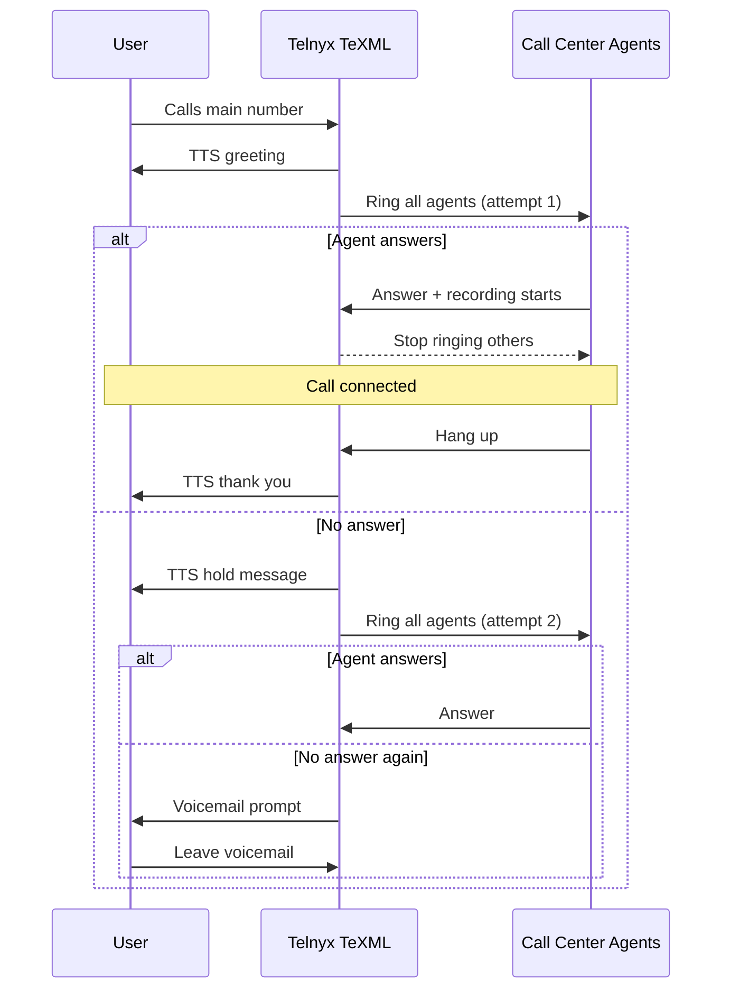

# Call Center Demo

How to build a call center application using Telnyx APIs. Start building on Telnyx today.

**⏱ 30 minutes build time.**

**🧰 Clone the sample application from our <a href="https://github.com/team-telnyx/demo-python-telnyx/tree/master/call-center-texml">GitHub repo</a>.**

**🎬 Check out our <a href="https://telnyx.com/resources/video-call-center-demo-python">video walkthrough</a> of this tutorial.**

## Introduction

In this tutorial, you'll learn how to build a call center application using the **Telnyx Voice API**, **TeXML**, and the **Python AIOHTTP library**, in three main parts:

1. Set up and configure your Mission Control Portal to link a call center number to your call center agents' TeXML-enabled SIP connections.

2. Set up and run the sample call center application in your preferred environment.

3. Optional: Configure your call center app with customized audio playback, hangup messages, and voicemail storage.

The app accepts calls to a Telnyx number and forwards them to one or more SIP Connections associated with your call center agents (desk phones or softphones) using SIP URI calling. The agents must be registered with Telnyx SIP proxies to receive these forwarded calls.

The app's basic call flow is as follows:

> 1. A user calls the main phone number associated with the call center, and the call is answered with a text-to-speech greeting.
> 2. The call is forwarded to multiple agents simultaneously, with call recording enabled.
> 3. If one of the agents answers the call, the other agents stop ringing.
> 4. If no agent answers the call, a second text-to-speech message is played, and the agents are dialed for a second time.
> 5. If no agent answers on the second dialing attempt, the user may leave a voicemail recording.
> 6. If the call is answered and subsequently ended, a text-to-speech message will thank the user for calling.



All of these steps in the call flow can be modified, configured, or built upon by editing TeXML files in the `/call_center/infrastructure/TeXML` directory of the repo.

<hr />

**Jump to section:**

* [Creating a Telnyx Mission Control Portal account](#step-1-create-a-telnyx-mission-control-portal-account)
* [Creating a Telnyx API key](#step-2-create-a-telnyx-api-key)
* [Installing ngrok](#step-3-install-and-run-ngrok)
* [Creating a TeXML Application](#step-4-create-a-texml-application)
* [Buying a phone number](#step-5-buy-a-phone-number)
* [Creating your agents' SIP Connections](#step-6-create-your-agents-credentials-based-sip-connections)
* [Creating an Outbound Voice Profile to associate with agents' SIP Connections](#step-7-create-an-outbound-voice-profile-and-associate-all-the-sip-connections)
* [Setting up your virtual environment](#step-8-set-up-virtual-your-virtual-environment)
* [Running application setup and configuring variables](#step-9-set-up-and-configure-variables)
* [Running the application](#step-10-running-the-application)
* [Optional: Configuring your hangup behavior with TeXML](#configure-your-hangup-behavior)
* [Optional: Configuring custom audio playback](#play-custom-audio-files)
* [Optional: Configuring voicemail recording and storage](#configure-voicemail-recording-and-storage)

***

## Configuring the Mission Control Portal

### Step 1: Create a Telnyx mission control portal account

This tutorial assumes you've already [set up your developer account and environment](/development) and you know how to [send commands](sending-commands-for-programmable-voice.md) and [receive webhooks](receiving-webhooks-for-programmable-voice.md) using Call Control.

### Step 2: Create a Telnyx API key

> API keys allow your application to access the telephony resources associated with your Telnyx account. In this example, your API key allows the locally-running call center app to access **numbers**, **SIP connections**, **outbound voice profiles**, and TeXML applications that you'll create in the Mission Control Portal during this tutorial. Learn more about [using Telnyx API keys for authentication](../reference/api-authentication.md).

Keys can be created in the <a href="https://portal.telnyx.com/#/app/api-keys">API Keys</a> section of the portal.

### Step 3: Install and run ngrok

> In this example, ngrok is used to receive webhooks sent from the TeXML application to your locally running call center application via a tunneling URL to a port on your machine. These webhooks inform the local application about events like incoming and answered calls. Learn more about [using ngrok with Telnyx](../reference/ngrok.md#ngrok).

Download and install ngrok following the developer's instructions from [https://ngrok.com/download](https://ngrok.com/download).

Start up ngrok by running `./ngrok http 8080` and make note of the HTTPS Forwarding URL.

### Step 4: Create a TeXML application

> TeXML is the quickest way to build programmable voice applications in minutes using a simple XML data structure. Learn more about TeXML in our [tutorial](https://developers.telnyx.com/docs/voice/programmable-voice/texml-setup).

<a href="https://portal.telnyx.com/#/app/call-control/texml">Add a new TeXML Application</a> in the Call Control section of the Mission Control Portal, selecting <a href="https://portal.telnyx.com/#/app/call-control/texml">Add a new TeXML Application</a> in the top navigation menu.

Set the **Voice Method** to `GET` and specify your webhook URL as `your_ngrok_forwarding_url/TeXML/inbound` - e.g. `https://b06b087392cd.ngrok.io/TeXML/inbound`

Set the **Status Callback Method** to `POST` and specify your callback URL as `your_ngrok_forwarding_url/TeXML/events` - e.g. `https://b06b087392cd.ngrok.io/TeXML/events`


### Step 5: Buy a phone number

Use the <a href="https://portal.telnyx.com/#/app/numbers/buy-numbers">Search & Buy Numbers tool</a> in the Mission Control Portal to find a voice-enabled phone number and add it to your cart.

At checkout, use the drop-down box labeled **Connection or Application** to select the TeXML application you just created. This associates your new phone number with the application.

This is your call center phone number that users will call to reach your organization.


### Step 6: Create your agents' Credentials-based SIP Connections

Add a new SIP Connection from the <a href="https://portal.telnyx.com/#/app/connections">SIP Connections</a> section of the Mission Control Portal. Select **Credentials** as the SIP Connection Type. It's good practice to set the username to be something unique and representative of the agent who will be assigned to the connection.

Your connections need to send webhooks to inform your TeXML application about the status of calls so that the application will stop trying to dial other connections when one connection answers an incoming call. Under **Events**, specify the **Webhook URL** as `your_ngrok_forwarding_url/outbound/event`. 


Hit **Save & Finish Editing** to save your progress.

When a user calls your call center number, the TeXML application forwards the call to each of the SIP connections associated with the application. Because all of the connections we're creating use <a href="https://support.telnyx.com/en/articles/2925713-sip-uri-calling">SIP URIs</a> instead of phone numbers, these connections need to be able to receive SIP URI calls.

Find the connection you just created in the connections list and open the **Inbound Options** menu. In the Inbound section, set **Recieve SIP URI Calls** to **From anyone**.


Lastly, if your agents will be making outbound calls, you may want to enable a **caller ID override**, which enables Telnyx to send a specified caller ID for each agent. This setting can be found under the **Outbound** section of the SIP Connection Options menu.


Repeat this step to create a new connection for each agent you wish to connect to the call center.

Telnyx is fully compatible with every major free softphone platform, with in-depth [configuration guides](sip-trunking-configuration-guides.md) for each one.

> Don't have a SIP desk phone or softphone to use with this demo? Why not try **WebRTC**? Load up our free <a href="https://webrtc.telnyx.com">WebRTC development demo tool</a> and enter your SIP connection credentials to start making and receiving calls directly from your browser.

### Step 7: Create an Outbound Voice Profile and associate all the SIP Connections

Outbound calls must be enabled for the TeXML Application to forward incoming calls to your agents' SIP Connections. Outbound calls are configured with an **Outbound Voice Profile**, which is in turn associated with each SIP Connection to enable calls to be forwarded to that connection. 

Add a new profile from the <a href="https://portal.telnyx.com/#/app/outbound-profiles">Outbound Voice Profiles</a> section of the portal, then hit **Add connections/apps to profile** and select each of the connections you created in the previous step.

Outbound Voice Profiles allow outbound calls to be placed within the United States and Canada by default. You can enable outbound calling to international destinations in the **International Allowed Destinations** menu when configuring an Outbound Voice Profile.

## Configuring your environment and running the application

### Step 8: Set up virtual your virtual environment

The sample application requires Python version 3.6 or higher and leverages the `aiohttp`, `apscheduler`, and `python-dotenv` packages. You can install these packages manually using `pip`, or use a packaging tool like <a href="https://pypi.org/project/pipenv/">`pipenv`</a> to install them automatically inside a virtual environment.

To install `pipenv`, run:

```bash theme={null}
pip install pipenv
```

<Callout type="info">
  After pasting the above content, Kindly check and remove any new line added

To use `pipenv` to install the required packages, navigate to the `/call-center-texml` directory, and run:

```bash theme={null}
pipenv shell
pipenv update
```

<Callout type="info">
  After pasting the above content, Kindly check and remove any new line added

This will create the environment and install the application requirements as defined in the Pipfile.

### Step 9: Set up and configure variables

The sample application interfaces with the Telnyx resources set up via the Mission Control portal by passing a set of environment variables, including your API key and other unique identifiers, into the app. Setting up the app involves running a setup script that creates a .env file, into which you can populate these environment variables.

In the `/call-center-texml` directory, run:

```bash theme={null}
python setup.py
```

<Callout type="info">
  After pasting the above content, Kindly check and remove any new line added

This will create a `.env` file within the `/call-center-texml/call-center` directory. Open this `.env` file and fill in the required variables:

* `API_KEY`: This is your Telnyx API Key, created in [Step 2](#step-2-create-a-telnyx-api-key).
* `PROD`: Defaults to **True**. You can set this to either True or False. If set to True, scheduled jobs for updating connections and sending account balance notifications will run at automated time intervals.
* `SLACK_URL`: If you wish to integrate your call center with Slack to receive live notifications for incoming calls, this URL will be configured for incoming webhooks in the Slack app. More on setting up Slack API integrations can be found in <a href="https://api.slack.com/messaging/webhooks">Slack's documentation</a>.
  * **Note:** The `SLACK_URL` can be left blank if Slack is not being used.
* `NGROK_URL`: This is the Forwarding URL from [Step 3](#step-3-install-and-run-ngrok).
* `OUTBOUND_PROFILE_ID`: This is the ID of the Outbound Voice Profile from [Step 7](#step-7-create-an-outbound-voice-profile-and-associate-all-the-sip-connections). The ID can be found and copied by opening the configuration settings of the profile.

Save this file. If these are correct, you should now have everything you need to run the application.

### Step 10: Running The Application

From the `/call-center-texml` directory, run the following command to start the application:

```bash theme={null}
PYTHONPATH=`pwd`/ python call_center/main.py
```

<Callout type="info">
  After pasting the above content, Kindly check and remove any new line added

You will now see the application running on localhost port 8080. You can test your call center application by dialing the number you purchased in [Step 5](#step-5-buy-a-phone-number).

The TeXML application will answer the call and inform the caller that they are now attempting to connect them to an available agent. At this point, the clients the agents used to register their SIP Connections credentials will start to ring if they are available.

## Optional: Customizing your call center app

### Configure your hangup behavior

When a call is answered and subsequently ended by an agent, the customer hears a text-to-speech message thanking them for calling. Like any other behavior in the call flow, this behavior can be configured by modifying the relevant TeXML files.

This particular behavior is specified in the answered.xml file, located in the `/call_center/infrastructure/TeXML/ directory`. The default behavior uses a [``](say.md) verb in this file to speak a text string. If you have an IVR, you may instead wish to use a [``](dial.md) or [``](redirect.md) verb, which could send the caller to another line or back to the IVR, should they wish to have a conversation with another department.

### Play custom audio files

The TeXML files are configured to use text-to-speech by default, using `` verbs to communicate information to the user.

However, the application is also capable of delivering audio files for initial greetings and hold messages, using the [``](play.md) verb.

All you need to do is record the audio and place the resultant files in a new subdirectory under `/call_center/infrastructure/audio`, named:

* `support_greeting.mp3`
* `support_busy.mp3`

Then un-comment the `` verbs that are in the `busy_template.xml` and `inbound_template.xml` files, and remove or comment-out the `` verbs to prevent the file from reading text-to-speech directly after playing your audio file:

```xml theme={null}
{ngrok_url}/TeXML/support_greeting
<!-- Say voice="alice">Hello, you have reached the call center. Please hold while you are connected to the next available agent. -->
```

<Callout type="info">
  After pasting the above content, Kindly check and remove any new line added

> There's no need to change the `{ngrok_url}` placeholder in the above example - this is populated at runtime from the environment variables you set up in [Step 9](#step-9-set-up-and-configure-variables).

### Configure voicemail recording and storage

You can also specify a recording status callback URL in the `voicemail.xml` file. When a call ends after being sent to voicemail, the TeXML application sends a `POST` request with the URL of the recording file to the status callback URL you specified.

## Where to Next?

Now that you've set up a fully-functioning, deeply customizable call center application using TeXML, the possibilities are endless: 

* Read the story of how we built a bespoke call center for our 24/7 technical support team using TeXML, in our <a href="https://telnyx.com/resources/custom-support-call-center">two-part blog series</a>.

* Check out the [full TeXML documentation](texml-and-twiml-compatibility.md) for a list of commands that can be used in your XML files.

* Check out a <a href="https://telnyx.com/resources/video-call-center-demo-python">video walkthrough</a> of this tutorial.

* Learn more about <a href="https://telnyx.com/use-cases/contact-center">Telnyx for Contact Centers</a>
  .


## Related Pages

- [Call Tracking Demo](../runbooks/call-tracking-demo.md)
