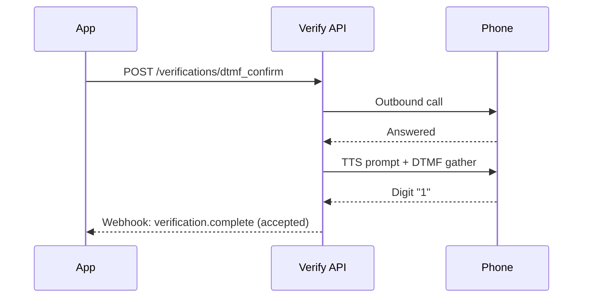

# DTMF Confirmation Verification

Verify phone number ownership with a single keypress. No codes - press 1 to confirm.

DTMF confirmation calls a phone number, plays a TTS prompt, and collects a single keypress (`1`) to confirm ownership. No verification code is generated — the keypress is the confirmation.

The `POST /verifications/{id}/actions/verify` endpoint is **not used**. Verification completes on the call itself.

  DTMF confirmation is unique to Telnyx — Twilio and Vonage Verify APIs only support code-based voice verification (read a code, then type it). Single-keypress confirmation reduces user friction and works on landlines.

## Flow



| Outcome   | Trigger           | Status     |
| --------- | ----------------- | ---------- |
| Confirmed | Digit `1` pressed | `accepted` |
| Rejected  | Wrong digit       | `invalid`  |
| Timed out | No keypress (10s) | `expired`  |
| Failed    | Call not answered | `error`    |

> **Note:** Up to 3 attempts per call. After 3 wrong digits, the call ends with status `invalid`.

***

## Use cases

  - [Caller ID verification](#) — Confirm ownership before allowing a number as outbound Caller ID.

  - [Landline verification](#) — Verify numbers that cannot receive SMS.

  - [Accessibility](#) — Single keypress instead of reading and typing a code.

  - [Account recovery](#) — Confirm phone ownership without code entry.

***

## Create a verify profile

Create a profile with `dtmf_confirm` settings. This can be combined with other verification types (SMS, call) on the same profile.

  ```bash
  curl -X POST https://api.telnyx.com/v2/verify_profiles \
    -H "Content-Type: application/json" \
    -H "Authorization: Bearer $TELNYX_API_KEY" \
    -d '{
      "name": "caller-id-verification",
      "language": "en-US",
      "dtmf_confirm": {
        "default_timeout_secs": 300
      }
    }'
  ```

  ```python
  import os
  import telnyx

  telnyx.api_key = os.environ["TELNYX_API_KEY"]

  profile = telnyx.VerifyProfile.create(
      name="caller-id-verification",
      language="en-US",
      dtmf_confirm={"default_timeout_secs": 300},
  )
  profile_id = profile.id
  ```

  ```javascript
  const telnyx = require('telnyx')(process.env.TELNYX_API_KEY);

  const profile = await telnyx.verifyProfiles.create({
    name: 'caller-id-verification',
    language: 'en-US',
    dtmf_confirm: { default_timeout_secs: 300 },
  });
  const profileId = profile.data.id;
  ```

  ```ruby
  require 'telnyx'

  Telnyx.api_key = ENV['TELNYX_API_KEY']

  profile = Telnyx::VerifyProfile.create(
    name: 'caller-id-verification',
    language: 'en-US',
    dtmf_confirm: { default_timeout_secs: 300 }
  )
  profile_id = profile.id
  ```

  ```go
  package main

  import (
      "os"
      telnyx "github.com/telnyx/telnyx-go"
  )

  func main() {
      client := telnyx.NewClient(os.Getenv("TELNYX_API_KEY"))

      profile, _ := client.VerifyProfiles.Create(&telnyx.VerifyProfileParams{
          Name:     "caller-id-verification",
          Language: "en-US",
          DTMFConfirm: &telnyx.DTMFConfirmSettings{
              DefaultTimeoutSecs: 300,
          },
      })
      profileID := profile.ID
  }
  ```

  ```java
  import com.telnyx.sdk.*;
  import com.telnyx.sdk.api.VerifyApi;
  import com.telnyx.sdk.model.*;

  ApiClient client = Configuration.getDefaultApiClient();
  client.setBearerToken(System.getenv("TELNYX_API_KEY"));

  VerifyApi api = new VerifyApi(client);
  CreateVerifyProfileRequest request = new CreateVerifyProfileRequest()
      .name("caller-id-verification")
      .language("en-US")
      .dtmfConfirm(new DTMFConfirmSettings().defaultTimeoutSecs(300));

  VerifyProfileResponse profile = api.createVerifyProfile(request);
  String profileId = profile.getData().getId();
  ```

  ```csharp .NET theme={null}
  using Telnyx;

  TelnyxConfiguration.SetApiKey(Environment.GetEnvironmentVariable("TELNYX_API_KEY"));

  var service = new VerifyProfileService();
  var profile = service.Create(new VerifyProfileCreateOptions
  {
      Name = "caller-id-verification",
      Language = "en-US",
      DtmfConfirm = new DtmfConfirmSettings
      {
          DefaultTimeoutSecs = 300
      }
  });
  var profileId = profile.Id;
  ```

  ```php
  require 'vendor/autoload.php';

  \Telnyx\Telnyx::setApiKey(getenv('TELNYX_API_KEY'));

  $profile = \Telnyx\VerifyProfile::create([
      'name' => 'caller-id-verification',
      'language' => 'en-US',
      'dtmf_confirm' => ['default_timeout_secs' => 300],
  ]);
  $profileId = $profile->id;
  ```

The returned `id` is required for verification requests.

***

## Trigger verification

  ```bash
  curl -X POST https://api.telnyx.com/v2/verifications/dtmf_confirm \
    -H "Content-Type: application/json" \
    -H "Authorization: Bearer $TELNYX_API_KEY" \
    -d '{
      "phone_number": "+13035551234",
      "verify_profile_id": "YOUR_PROFILE_ID"
    }'
  ```

  ```python
  verification = telnyx.Verification.create(
      phone_number="+13035551234",
      verify_profile_id=profile_id,
      type="dtmf_confirm",
  )
  ```

  ```javascript
  const verification = await telnyx.verifications.create({
    phone_number: '+13035551234',
    verify_profile_id: profileId,
    type: 'dtmf_confirm',
  });
  ```

  ```ruby
  verification = Telnyx::Verification.create(
    phone_number: '+13035551234',
    verify_profile_id: profile_id,
    type: 'dtmf_confirm'
  )
  ```

  ```go
  verification, _ := client.Verifications.Create(&telnyx.VerificationParams{
      PhoneNumber:     "+13035551234",
      VerifyProfileID: profileID,
      Type:            "dtmf_confirm",
  })
  ```

  ```java
  CreateVerificationRequest verReq = new CreateVerificationRequest()
      .phoneNumber("+13035551234")
      .verifyProfileId(profileId)
      .type(CreateVerificationRequest.TypeEnum.DTMF_CONFIRM);

  VerificationResponse ver = api.createVerification(verReq);
  ```

  ```csharp .NET theme={null}
  var verService = new VerificationService();
  var verification = verService.Create(new VerificationCreateOptions
  {
      PhoneNumber = "+13035551234",
      VerifyProfileId = profileId,
      Type = "dtmf_confirm"
  });
  ```

  ```php
  $verification = \Telnyx\Verification::create([
      'phone_number' => '+13035551234',
      'verify_profile_id' => $profileId,
      'type' => 'dtmf_confirm',
  ]);
  ```

### Response

```json theme={null}
{
  "data": {
    "id": "a1b2c3d4-e5f6-7890-abcd-ef1234567890",
    "phone_number": "+13035551234",
    "record_type": "verification",
    "status": "pending",
    "type": "dtmf_confirm",
    "timeout_secs": 300,
    "verify_profile_id": "YOUR_PROFILE_ID",
    "created_at": "2026-02-20T15:30:00.000000",
    "updated_at": "2026-02-20T15:30:00.000000"
  }
}
```

Default TTS prompt:

> *"This is a verification call to confirm that this phone number is going to be used as a Caller ID for outbound calls. If you did not request this verification, or if someone is asking you to accept this call, please ignore this message. If you did request this verification, please press 1."*

The TTS language is determined by the `language` field on the Verify Profile (default: `en-US`).

***

## Handle the result

Verification completes on the call — no verify endpoint call needed. Receive the outcome via [webhooks](receiving-webhooks-for-telnyx-verify.md).

### Accepted (digit `1` pressed)

```json theme={null}
{
  "data": {
    "event_type": "verification.complete",
    "payload": {
      "id": "a1b2c3d4-e5f6-7890-abcd-ef1234567890",
      "phone_number": "+13035551234",
      "status": "accepted",
      "type": "dtmf_confirm",
      "verify_profile_id": "YOUR_PROFILE_ID"
    }
  }
}
```

### Failed (wrong digit, timeout, or call failure)

```json theme={null}
{
  "data": {
    "event_type": "verification.complete",
    "payload": {
      "id": "a1b2c3d4-e5f6-7890-abcd-ef1234567890",
      "phone_number": "+13035551234",
      "status": "invalid",
      "type": "dtmf_confirm",
      "verify_profile_id": "YOUR_PROFILE_ID"
    }
  }
}
```

### Polling alternative

```bash theme={null}
curl https://api.telnyx.com/v2/verifications/{verification_id} \
  -H "Authorization: Bearer $TELNYX_API_KEY"
```

***

## Complete example

Full flow: create profile, trigger verification, handle webhook.

### Python (Flask)

    ```python theme={null}
    import os
    import telnyx
    from flask import Flask, request, jsonify

    telnyx.api_key = os.environ["TELNYX_API_KEY"]
    app = Flask(__name__)

    # Create profile (once)
    profile = telnyx.VerifyProfile.create(
        name="dtmf-verification",
        language="en-US",
        dtmf_confirm={"default_timeout_secs": 300},
    )

    # Trigger verification
    verification = telnyx.Verification.create(
        phone_number="+13035551234",
        verify_profile_id=profile.id,
        type="dtmf_confirm",
    )
    print(f"Verification {verification.id} — {verification.status}")

    @app.route("/webhooks/verify", methods=["POST"])
    def handle_webhook():
        payload = request.json["data"]["payload"]

        if payload["status"] == "accepted":
            print(f"✅ {payload['phone_number']} verified")
        else:
            print(f"❌ {payload['phone_number']} failed: {payload['status']}")

        return jsonify({"status": "ok"}), 200

    app.run(port=5000)
    ```

### Node (Express)

    ```javascript theme={null}
    const express = require('express');
    const telnyx = require('telnyx')(process.env.TELNYX_API_KEY);

    const app = express();
    app.use(express.json());

    (async () => {
      // Create profile (once)
      const profile = await telnyx.verifyProfiles.create({
        name: 'dtmf-verification',
        language: 'en-US',
        dtmf_confirm: { default_timeout_secs: 300 },
      });

      // Trigger verification
      const verification = await telnyx.verifications.create({
        phone_number: '+13035551234',
        verify_profile_id: profile.data.id,
        type: 'dtmf_confirm',
      });
      console.log(`Verification ${verification.data.id} — ${verification.data.status}`);

      // Handle webhook
      app.post('/webhooks/verify', (req, res) => {
        const { phone_number, status } = req.body.data.payload;

        if (status === 'accepted') {
          console.log(`✅ ${phone_number} verified`);
        } else {
          console.log(`❌ ${phone_number} failed: ${status}`);
        }

        res.json({ status: 'ok' });
      });

      app.listen(5000, () => console.log('Webhook server on :5000'));
    })();
    ```

### Ruby (Sinatra)

    ```ruby theme={null}
    require 'telnyx'
    require 'sinatra'
    require 'json'

    Telnyx.api_key = ENV['TELNYX_API_KEY']

    # Create profile (once)
    profile = Telnyx::VerifyProfile.create(
      name: 'dtmf-verification',
      language: 'en-US',
      dtmf_confirm: { default_timeout_secs: 300 }
    )

    # Trigger verification
    verification = Telnyx::Verification.create(
      phone_number: '+13035551234',
      verify_profile_id: profile.id,
      type: 'dtmf_confirm'
    )
    puts "Verification #{verification.id} — #{verification.status}"

    # Handle webhook
    post '/webhooks/verify' do
      payload = JSON.parse(request.body.read)['data']['payload']

      if payload['status'] == 'accepted'
        puts "✅ #{payload['phone_number']} verified"
      else
        puts "❌ #{payload['phone_number']} failed: #{payload['status']}"
      end

      { status: 'ok' }.to_json
    end
    ```

### Go

    ```go theme={null}
    package main

    import (
        "encoding/json"
        "fmt"
        "net/http"
        "os"

        telnyx "github.com/telnyx/telnyx-go"
    )

    func main() {
        client := telnyx.NewClient(os.Getenv("TELNYX_API_KEY"))

        // Create profile (once)
        profile, _ := client.VerifyProfiles.Create(&telnyx.VerifyProfileParams{
            Name:     "dtmf-verification",
            Language: "en-US",
            DTMFConfirm: &telnyx.DTMFConfirmSettings{
                DefaultTimeoutSecs: 300,
            },
        })

        // Trigger verification
        ver, _ := client.Verifications.Create(&telnyx.VerificationParams{
            PhoneNumber:     "+13035551234",
            VerifyProfileID: profile.ID,
            Type:            "dtmf_confirm",
        })
        fmt.Printf("Verification %s — %s\n", ver.ID, ver.Status)

        // Handle webhook
        http.HandleFunc("/webhooks/verify", func(w http.ResponseWriter, r *http.Request) {
            var event struct {
                Data struct {
                    Payload struct {
                        PhoneNumber string `json:"phone_number"`
                        Status      string `json:"status"`
                    } `json:"payload"`
                } `json:"data"`
            }
            json.NewDecoder(r.Body).Decode(&event)

            p := event.Data.Payload
            if p.Status == "accepted" {
                fmt.Printf("✅ %s verified\n", p.PhoneNumber)
            } else {
                fmt.Printf("❌ %s failed: %s\n", p.PhoneNumber, p.Status)
            }
            w.Write([]byte(`{"status":"ok"}`))
        })

        http.ListenAndServe(":5000", nil)
    }
    ```

***

## Verification type comparison

| Feature                | SMS                    | Call               | Flash Call      | DTMF Confirm |
| ---------------------- | ---------------------- | ------------------ | --------------- | ------------ |
| **User action**        | Type code              | Listen + type code | None            | Press 1      |
| **Code generated**     | Yes                    | Yes                | Yes (caller ID) | No           |
| **Verify endpoint**    | Required               | Required           | Required        | Not needed   |
| **Landline support**   | No                     | Yes                | No              | Yes          |
| **Fraud risk**         | SIM swap, interception | Low                | Low             | Low          |
| **Competitor support** | Twilio, Vonage         | Twilio, Vonage     | Twilio          | Telnyx only  |

***

## Troubleshooting

**Call reaches voicemail**

    Verification times out with status `expired`. Implement a retry with delay, or fall back to SMS.

---

**Wrong digit pressed**

    Up to 3 attempts per call. After 3 failures, status is `invalid`. Trigger a new verification to retry.

---

**Stuck in pending**

    Call was not answered and no webhook received. Verify the webhook URL is configured and reachable. Poll the status endpoint as fallback.

---

**Custom TTS prompt**

    The prompt is fixed to the standard verification message. Voice and language are determined by the Verify Profile's `language` setting. Custom prompt text is not yet supported.

---

**Rate limits**

    Standard Verify API rate limits apply. Avoid triggering multiple concurrent verifications for the same phone number — the previous call must complete or time out first.

---

***

## Next steps

  - [Receiving Webhooks](receiving-webhooks-for-telnyx-verify.md) — Real-time verification status updates.

  - [Custom Templates](custom-templates-for-telnyx-verify.md) — Branded verification messages for SMS and call types.

  - [Verify API Reference](https://developers.telnyx.com/api-reference/verify/create-a-verification) — Full API specification.

  - [Verify Quickstart](../tutorial/quickstart-for-telnyx-verify.md) — SMS and call verification guide.
