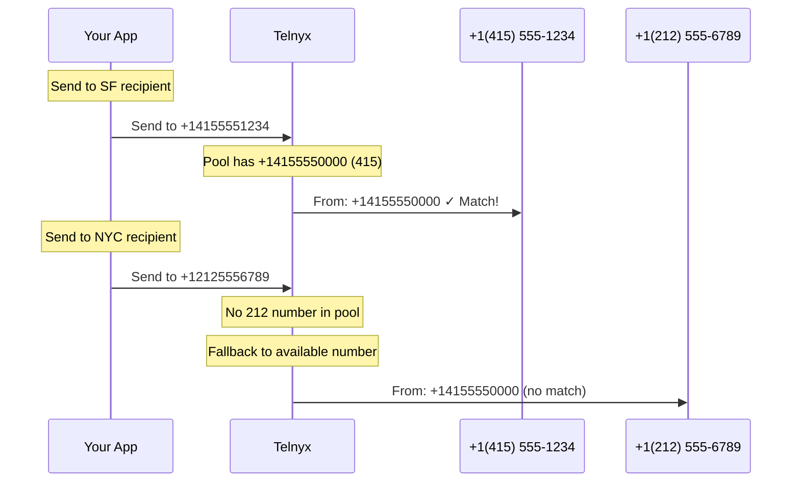

# Geomatch

Automatically select sender numbers that match recipient area codes for higher engagement and trust.

Geomatch automatically selects sender numbers that share the same area code as your recipients. When enabled, Telnyx matches your outbound messages with locally-recognized numbers—boosting trust and engagement with your customers.

<Callout type="info">
  Geomatch is part of **Number Pool** settings. You must have [Number Pool](number-pool.md) enabled to use Geomatch.

## When to Use Geomatch

  - [Local Presence](#) — Appear local to recipients—messages from familiar area codes are more likely to be read and trusted.

  - [Higher Engagement](#) — Local numbers typically see better response rates than out-of-area or toll-free numbers.

  - [Multi-Region Campaigns](#) — Automatically match senders across different geographic areas without manual routing logic.

  - [Customer Support](#) — Build rapport with customers who prefer communicating with local business numbers.

<Callout type="warning">
  **NANP only**: Geomatch currently supports only North American numbers (US, Canada, Caribbean). International numbers don't participate in geomatching.

## How It Works

1. **Message sent**: Your app sends a message without specifying a `from` number (using Number Pool)
2. **Area code lookup**: Telnyx identifies the recipient's area code
3. **Pool search**: Telnyx searches your number pool for a matching area code
4. **Selection**: If found, that number is used; otherwise, a number with a different area code is selected



## Prerequisites

* A [Messaging Profile](send-your-first-message.md) with [Number Pool](number-pool.md) enabled
* Phone numbers from multiple area codes assigned to the profile (for effective geomatching)

***

## Configure Geomatch

Enable Geomatch by updating your Messaging Profile's `number_pool_settings`.

### API

      ```bash
      curl -X PATCH "https://api.telnyx.com/v2/messaging_profiles/YOUR_PROFILE_ID" \
        -H "Content-Type: application/json" \
        -H "Authorization: Bearer YOUR_API_KEY" \
        -d '{
          "number_pool_settings": {
            "long_code_weight": 1,
            "geomatch": true
          }
        }'
      ```

      ```javascript
      import Telnyx from 'telnyx';

      const client = new Telnyx({ apiKey: process.env.TELNYX_API_KEY });

      const response = await client.messagingProfiles.update(
        'YOUR_PROFILE_ID',
        {
          number_pool_settings: {
            long_code_weight: 1,
            geomatch: true
          }
        }
      );

      console.log(response.data);
      ```

      ```python
      import os
      from telnyx import Telnyx

      client = Telnyx(api_key=os.environ.get("TELNYX_API_KEY"))

      response = client.messaging_profiles.update(
          "YOUR_PROFILE_ID",
          number_pool_settings={
              "long_code_weight": 1,
              "geomatch": True
          }
      )

      print(response.data)
      ```

      ```ruby
      require "telnyx"

      client = Telnyx::Client.new(api_key: ENV["TELNYX_API_KEY"])

      response = client.messaging_profiles.update(
        "YOUR_PROFILE_ID",
        number_pool_settings: {
          long_code_weight: 1,
          geomatch: true
        }
      )

      puts response
      ```

      ```go
      package main

      import (
        "context"
        "fmt"
        "os"

        "github.com/team-telnyx/telnyx-go"
        "github.com/team-telnyx/telnyx-go/option"
      )

      func main() {
        client := telnyx.NewClient(
          option.WithAPIKey(os.Getenv("TELNYX_API_KEY")),
        )

        response, err := client.MessagingProfiles.Update(
          context.TODO(),
          "YOUR_PROFILE_ID",
          telnyx.MessagingProfileUpdateParams{
            NumberPoolSettings: &telnyx.NumberPoolSettingsParam{
              LongCodeWeight: telnyx.Int(1),
              Geomatch:       telnyx.Bool(true),
            },
          },
        )
        if err != nil {
          panic(err.Error())
        }
        fmt.Printf("%+v\n", response)
      }
      ```

      ```java
      package com.telnyx.example;

      import com.telnyx.sdk.client.TelnyxClient;
      import com.telnyx.sdk.client.okhttp.TelnyxOkHttpClient;
      import com.telnyx.sdk.models.messagingprofiles.*;

      public final class Main {
          public static void main(String[] args) {
              TelnyxClient client = TelnyxOkHttpClient.fromEnv();

              NumberPoolSettings poolSettings = NumberPoolSettings.builder()
                  .longCodeWeight(1)
                  .geomatch(true)
                  .build();

              MessagingProfileUpdateParams params = MessagingProfileUpdateParams.builder()
                  .numberPoolSettings(poolSettings)
                  .build();

              MessagingProfileUpdateResponse response = client.messagingProfiles()
                  .update("YOUR_PROFILE_ID", params);
              System.out.println(response);
          }
      }
      ```

      ```csharp .NET theme={null}
      using System;
      using Telnyx;

      TelnyxConfiguration.SetApiKey(Environment.GetEnvironmentVariable("TELNYX_API_KEY"));

      var service = new MessagingProfileService();
      var options = new MessagingProfileUpdateOptions
      {
          NumberPoolSettings = new NumberPoolSettings
          {
              LongCodeWeight = 1,
              Geomatch = true
          }
      };

      var profile = service.Update("YOUR_PROFILE_ID", options);
      Console.WriteLine(profile);
      ```

      ```php
      <?php
      require_once 'vendor/autoload.php';

      \Telnyx\Telnyx::setApiKey(getenv('TELNYX_API_KEY'));

      $profile = \Telnyx\MessagingProfile::update("YOUR_PROFILE_ID", [
          "number_pool_settings" => [
              "long_code_weight" => 1,
              "geomatch" => true
          ]
      ]);

      print_r($profile);
      ```

    <Callout type="tip">
      The examples include `long_code_weight` to ensure Number Pool is active. If you already have Number Pool configured, you can omit weight fields—PATCH requests merge with existing settings.

### Portal

    1. Go to [Messaging](https://portal.telnyx.com/#/app/messaging) in the portal
    2. Click the edit icon next to your Messaging Profile
    3. Under **Outbound**, toggle on **Number Pool**
    4. Check the **Geomatch** option
    5. Click **Save**

       

***

## Selection Behavior

Understanding how Geomatch selects senders helps you optimize your number pool coverage.

### Selection Priority

When both Geomatch and [Sticky Sender](sticky-sender.md) are enabled:

| Priority | Condition                                 | Behavior                                        |
| -------- | ----------------------------------------- | ----------------------------------------------- |
| 1        | Sticky mapping exists                     | Use the mapped sender (geomatch ignored)        |
| 2        | No mapping + matching area code available | Use geomatched number, create sticky mapping    |
| 3        | No mapping + no matching area code        | Use any available number, create sticky mapping |

<Callout type="info">
  Sticky Sender takes precedence over Geomatch. Once a recipient is mapped to a sender, that sender is used regardless of area code matching.

### Coverage Planning

For effective geomatching, ensure your number pool covers the area codes where your recipients are located:

| Coverage Level        | Description                             | Example                                                        |
| --------------------- | --------------------------------------- | -------------------------------------------------------------- |
| **Full coverage**     | Numbers in all target area codes        | Pool: 415, 212, 312, 305 for SF, NYC, Chicago, Miami campaigns |
| **Regional coverage** | Numbers per region, not every area code | Pool: 415 for CA, 212 for NY, 312 for IL                       |
| **Minimal coverage**  | Single area code                        | Pool: Only 415 numbers (geomatch rarely activates)             |

<Callout type="tip">
  Use the [Phone Numbers API](https://developers.telnyx.com/api-reference/numbers/list-phone-numbers) to audit your pool's area code coverage. Search for numbers in missing area codes to improve geomatch rates.

***

## Disable Geomatch

To disable Geomatch while keeping Number Pool active:

  ```bash
  curl -X PATCH "https://api.telnyx.com/v2/messaging_profiles/YOUR_PROFILE_ID" \
    -H "Content-Type: application/json" \
    -H "Authorization: Bearer YOUR_API_KEY" \
    -d '{
      "number_pool_settings": {
        "geomatch": false
      }
    }'
  ```

  ```javascript
  import Telnyx from 'telnyx';

  const client = new Telnyx({ apiKey: process.env.TELNYX_API_KEY });

  await client.messagingProfiles.update('YOUR_PROFILE_ID', {
    number_pool_settings: {
      geomatch: false
    }
  });
  ```

  ```python
  import os
  from telnyx import Telnyx

  client = Telnyx(api_key=os.environ.get("TELNYX_API_KEY"))

  client.messaging_profiles.update(
      "YOUR_PROFILE_ID",
      number_pool_settings={
          "geomatch": False
      }
  )
  ```

***

## Related Features

Geomatch works best combined with other Number Pool features:

**Sticky Sender**

  Maintain the same sender for each recipient. When combined with Geomatch:

  * First message uses geomatch selection
  * Subsequent messages use the "stuck" sender (even if area code no longer matches)

  See [Sticky Sender](sticky-sender.md) for details.

---

**Skip Unhealthy Numbers**

  Exclude poorly performing numbers from the pool. A geomatched number will be skipped if:

  * `skip_unhealthy: true` is enabled
  * The number's deliverability rate is below 25% OR spam ratio exceeds 75%

  The next best geomatch candidate is used instead.

---

**Number Pool Weights**

  Control the ratio of long codes to toll-free numbers. Geomatch respects these weights—if you weight toll-free higher, toll-free numbers are preferred even when long codes have matching area codes.

  See [Number Pool](number-pool.md) for configuration details.

---

***

## Troubleshooting

**Messages not coming from matching area codes**

  **Possible causes**:

  * Geomatch not enabled on the profile
  * No numbers with matching area code in your pool
  * Sticky Sender is enabled and recipient already has a mapping to a different number
  * Matching number is unhealthy and `skip_unhealthy` is enabled

  **Solution**: Verify Geomatch is enabled, then check your pool's area code coverage. Use the portal or API to list numbers assigned to your messaging profile.

---

**Geomatch not working for international numbers**

  **Cause**: Geomatch only supports NANP (North American Numbering Plan) numbers—US, Canada, and Caribbean.

  **Solution**: For international messaging, use explicit `from` numbers or rely on weight-based Number Pool selection.

---

**Geomatch not activating**

  **Possible causes**:

  * Number Pool is not enabled (Geomatch requires Number Pool)
  * Only one number in the pool (nothing to match against)
  * Sending with explicit `from` number (bypasses Number Pool entirely)

  **Solution**: Ensure Number Pool is enabled with at least one weight > 0, verify multiple numbers are assigned to the profile, and omit `from` when sending to use the pool.

---

***

## Next Steps

  - [Number Pool](number-pool.md) — Learn about multi-number distribution and weights

  - [Sticky Sender](sticky-sender.md) — Maintain consistent sender numbers per recipient

  - [Send Messages](send-your-first-message.md) — Complete messaging quickstart

  - [API Reference](https://developers.telnyx.com/api-reference/profiles/update-a-messaging-profile) — Full Messaging Profiles API details
