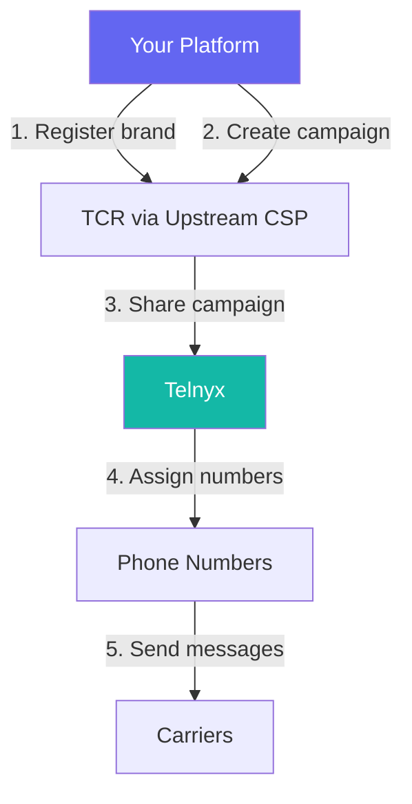

# ISV & Reseller 10DLC Onboarding

Register 10DLC brands and campaigns on behalf of your customers using Telnyx partner campaign APIs. Complete guide for ISVs, resellers, and SaaS platforms.

If you're an ISV, reseller, or SaaS platform sending messages on behalf of your customers, you need a **partner campaign** architecture — not a standard 10DLC registration. This guide covers everything from initial setup through production messaging.

  **Quick links:** [Architecture overview](#architecture-overview) · [Step-by-step setup](#step-by-step-isv-onboarding) · [Managing customers at scale](#managing-customers-at-scale) · [Troubleshooting](#troubleshooting)

***

## Who needs this guide?

| Scenario              | You are...                           | Your architecture                          |
| --------------------- | ------------------------------------ | ------------------------------------------ |
| **SaaS platform**     | Building messaging into your product | Partner campaign (shared across customers) |
| **Reseller / agency** | Managing messaging for clients       | One brand + campaign per client, or shared |
| **ISV**               | Offering white-label messaging       | Partner campaign with downstream CSPs      |
| **Franchise system**  | Central brand, many locations        | One brand, multiple campaigns per location |

> **Warning:** **Direct customer?** If you're sending messages for your own business only, use the standard [10DLC quickstart](../tutorial/getting-started-with-10dlc.md) instead.

***

## Architecture overview

ISV/reseller 10DLC uses a **shared campaign** model where you register campaigns with your upstream CSP (Campaign Service Provider) and share them to Telnyx for number assignment and messaging.



### Key concepts

  - [Upstream CSP](#) — The Campaign Service Provider where you register brands and campaigns with TCR. This could be Telnyx (if you register directly) or another CSP.

  - [Downstream CSP](#) — The messaging provider that sends traffic. Telnyx acts as your downstream CSP — you share campaigns **to** Telnyx for number assignment.

  - [Shared / Partner Campaign](#) — A campaign registered at one CSP and shared to another for traffic delivery. Required for ISV architectures.

  - [Campaign Sharing](#) — The TCR process of granting a downstream CSP access to send traffic for a campaign. Sharing must be accepted by the downstream CSP.

### Native vs. partner campaigns

| Feature             | Native Campaign     | Partner (Shared) Campaign         |
| ------------------- | ------------------- | --------------------------------- |
| Registration        | Directly on Telnyx  | On upstream CSP, shared to Telnyx |
| Brand ownership     | Your Telnyx account | Your upstream CSP account         |
| Campaign management | Telnyx API          | Upstream CSP + Telnyx Partner API |
| Number assignment   | Standard            | Via partner campaign endpoints    |
| Use case            | Direct customer     | ISV, reseller, multi-tenant       |
| Appeal process      | Direct API          | CSP nudge mechanism               |

***

## Prerequisites

Before starting, ensure you have:

1. **Telnyx account with messaging enabled**

    [Sign up](https://telnyx.com/sign-up) and complete account verification. You need a **Level 2 verified** account.

2. **Upstream CSP account**

    An account with a CSP where you'll register brands and campaigns (this can be Telnyx or another provider like Campaign Registry direct access).

3. **Customer business information**

    For each customer: legal business name, EIN/tax ID, business address, website, authorized representative contact, and messaging use case details.

4. **Phone numbers**

    10DLC-eligible long code numbers on your Telnyx account. [Purchase numbers](https://portal.telnyx.com/#/app/numbers/buy-numbers) or use existing inventory.

***

## Step-by-step ISV onboarding

### Step 1: Register brands for each customer

Each of your customers needs their own **brand** registered with TCR. A brand represents a business entity.

### Via Telnyx (Native Brand)

    If using Telnyx as your upstream CSP, register brands directly:

      ```bash
      curl -X POST https://api.telnyx.com/v2/10dlc/brand \
        -H "Authorization: Bearer $TELNYX_API_KEY" \
        -H "Content-Type: application/json" \
        -d '{
          "entityType": "PRIVATE_PROFIT",
          "companyName": "Customer Corp LLC",
          "ein": "12-3456789",
          "einIssuingCountry": "US",
          "phone": "+12025551234",
          "street": "123 Main St",
          "city": "New York",
          "state": "NY",
          "postalCode": "10001",
          "country": "US",
          "email": "compliance@customercorp.com",
          "website": "https://customercorp.com",
          "vertical": "TECHNOLOGY",
          "displayName": "Customer Corp"
        }'
      ```

      ```python
      import telnyx
      import os

      telnyx.api_key = os.environ["TELNYX_API_KEY"]

      brand = telnyx.Brand.create(
          entity_type="PRIVATE_PROFIT",
          company_name="Customer Corp LLC",
          ein="12-3456789",
          ein_issuing_country="US",
          phone="+12025551234",
          street="123 Main St",
          city="New York",
          state="NY",
          postal_code="10001",
          country="US",
          email="compliance@customercorp.com",
          website="https://customercorp.com",
          vertical="TECHNOLOGY",
          display_name="Customer Corp",
      )
      print(f"Brand ID: {brand.id}")
      ```

      ```javascript
      import Telnyx from "telnyx";

      const telnyx = new Telnyx(process.env.TELNYX_API_KEY);

      const { data: brand } = await telnyx.messaging10dlc.brands.create({
        entityType: "PRIVATE_PROFIT",
        companyName: "Customer Corp LLC",
        ein: "12-3456789",
        einIssuingCountry: "US",
        phone: "+12025551234",
        street: "123 Main St",
        city: "New York",
        state: "NY",
        postalCode: "10001",
        country: "US",
        email: "compliance@customercorp.com",
        website: "https://customercorp.com",
        vertical: "TECHNOLOGY",
        displayName: "Customer Corp",
      });
      console.log(`Brand ID: ${brand.id}`);
      ```

      ```ruby
      require "telnyx"

      Telnyx.api_key = ENV["TELNYX_API_KEY"]

      brand = Telnyx::Brand.create(
        entity_type: "PRIVATE_PROFIT",
        company_name: "Customer Corp LLC",
        ein: "12-3456789",
        ein_issuing_country: "US",
        phone: "+12025551234",
        street: "123 Main St",
        city: "New York",
        state: "NY",
        postal_code: "10001",
        country: "US",
        email: "compliance@customercorp.com",
        website: "https://customercorp.com",
        vertical: "TECHNOLOGY",
        display_name: "Customer Corp"
      )
      puts "Brand ID: #{brand.id}"
      ```

      ```java
      import com.telnyx.sdk.client.TelnyxClient;
      import com.telnyx.sdk.client.okhttp.TelnyxOkHttpClient;
      import com.telnyx.sdk.models.messaging10dlc.brands.BrandCreateParams;

      TelnyxClient client = TelnyxOkHttpClient.fromEnv();

      var brand = client.messaging10dlc().brands().create(BrandCreateParams.builder()
          .entityType("PRIVATE_PROFIT")
          .companyName("Customer Corp LLC")
          .ein("12-3456789")
          .einIssuingCountry("US")
          .phone("+12025551234")
          .street("123 Main St")
          .city("New York")
          .state("NY")
          .postalCode("10001")
          .country("US")
          .email("compliance@customercorp.com")
          .website("https://customercorp.com")
          .vertical("TECHNOLOGY")
          .displayName("Customer Corp")
          .build());
      System.out.println("Brand ID: " + brand.id());
      ```

      ```csharp .NET theme={null}
      using Telnyx;

      var client = new TelnyxClient(Environment.GetEnvironmentVariable("TELNYX_API_KEY"));

      var brand = await client.Messaging10dlc.Brands.CreateAsync(new BrandCreateParams
      {
          EntityType = "PRIVATE_PROFIT",
          CompanyName = "Customer Corp LLC",
          Ein = "12-3456789",
          EinIssuingCountry = "US",
          Phone = "+12025551234",
          Street = "123 Main St",
          City = "New York",
          State = "NY",
          PostalCode = "10001",
          Country = "US",
          Email = "compliance@customercorp.com",
          Website = "https://customercorp.com",
          Vertical = "TECHNOLOGY",
          DisplayName = "Customer Corp"
      });
      Console.WriteLine($"Brand ID: {brand.Id}");
      ```

      ```php
      $telnyx = new \Telnyx\TelnyxClient(getenv('TELNYX_API_KEY'));

      $brand = $telnyx->messaging10dlc->brands->create([
          'entity_type' => 'PRIVATE_PROFIT',
          'company_name' => 'Customer Corp LLC',
          'ein' => '12-3456789',
          'ein_issuing_country' => 'US',
          'phone' => '+12025551234',
          'street' => '123 Main St',
          'city' => 'New York',
          'state' => 'NY',
          'postal_code' => '10001',
          'country' => 'US',
          'email' => 'compliance@customercorp.com',
          'website' => 'https://customercorp.com',
          'vertical' => 'TECHNOLOGY',
          'display_name' => 'Customer Corp',
      ]);
      echo "Brand ID: " . $brand->id . "\n";
      ```

      ```go
      package main

      import (
          "context"
          "fmt"
          "github.com/team-telnyx/telnyx-go"
          "github.com/team-telnyx/telnyx-go/option"
      )

      func main() {
          client := telnyx.NewClient(
              option.WithAPIKey("YOUR_API_KEY"),
          )
          brand, err := client.Messaging10dlc.Brands.New(context.TODO(), telnyx.Messaging10dlcBrandNewParams{
              EntityType:       telnyx.String("PRIVATE_PROFIT"),
              CompanyName:      telnyx.String("Customer Corp LLC"),
              Ein:              telnyx.String("12-3456789"),
              EinIssuingCountry: telnyx.String("US"),
              Phone:            telnyx.String("+12025551234"),
              Street:           telnyx.String("123 Main St"),
              City:             telnyx.String("New York"),
              State:            telnyx.String("NY"),
              PostalCode:       telnyx.String("10001"),
              Country:          telnyx.String("US"),
              Email:            telnyx.String("compliance@customercorp.com"),
              Website:          telnyx.String("https://customercorp.com"),
              Vertical:         telnyx.String("TECHNOLOGY"),
              DisplayName:      telnyx.String("Customer Corp"),
          })
          if err != nil {
              panic(err)
          }
          fmt.Printf("Brand ID: %s\n", brand.ID)
      }
      ```

### Via External CSP

    If using an external CSP (e.g., direct TCR access), register brands through their API and note the TCR Brand ID (format: `BXXXXXX`). You'll need this when sharing campaigns to Telnyx.

### Step 2: Submit brand for vetting

Higher vetting scores unlock greater throughput. For ISV use cases, **enhanced vetting is strongly recommended**.

```bash
curl -X POST https://api.telnyx.com/v2/10dlc/brand/{brandId}/vetting \
  -H "Authorization: Bearer $TELNYX_API_KEY" \
  -H "Content-Type: application/json" \
  -d '{"vettingClass": "ENHANCED"}'
```

  Enhanced vetting costs a one-time fee and takes 1–7 business days. Brands with vetting scores above 75 get significantly higher throughput. See [10DLC Rate Limits](10dlc-rate-limits-throughput.md) for details.

### Step 3: Create campaigns with the ISV use case

For ISV architectures, use the `AGENTS_FRANCHISES` use case type when registering campaigns:

  ```bash
  curl -X POST https://api.telnyx.com/v2/10dlc/campaign \
    -H "Authorization: Bearer $TELNYX_API_KEY" \
    -H "Content-Type: application/json" \
    -d '{
      "brandId": "BRAND_ID",
      "usecase": "AGENTS_FRANCHISES",
      "description": "Platform notifications sent on behalf of Customer Corp customers",
      "sample1": "Hi {name}, your appointment is confirmed for {date} at {time}. Reply STOP to opt out.",
      "sample2": "Your order #{order_id} has shipped! Track at {url}. Reply STOP to unsubscribe.",
      "messageFlow": "Users opt in via web form at customercorp.com/sms-signup with clear consent language. STOP/HELP keywords are honored.",
      "helpMessage": "Customer Corp support: help@customercorp.com or call 1-800-555-0123. Reply STOP to opt out.",
      "optinKeywords": "START,YES,SUBSCRIBE",
      "optoutKeywords": "STOP,CANCEL,UNSUBSCRIBE,QUIT,END",
      "helpKeywords": "HELP,INFO",
      "numberPool": false,
      "subscriberOptin": true,
      "subscriberOptout": true,
      "subscriberHelp": true,
      "embeddedLink": true,
      "embeddedPhone": false
    }'
  ```

  ```python
  import telnyx
  import os

  telnyx.api_key = os.environ["TELNYX_API_KEY"]

  campaign = telnyx.Campaign.create(
      brand_id="BRAND_ID",
      usecase="AGENTS_FRANCHISES",
      description="Platform notifications sent on behalf of Customer Corp customers",
      sample1="Hi {name}, your appointment is confirmed for {date} at {time}. Reply STOP to opt out.",
      sample2="Your order #{order_id} has shipped! Track at {url}. Reply STOP to unsubscribe.",
      message_flow="Users opt in via web form at customercorp.com/sms-signup with clear consent language. STOP/HELP keywords are honored.",
      help_message="Customer Corp support: help@customercorp.com or call 1-800-555-0123. Reply STOP to opt out.",
      subscriber_optin=True,
      subscriber_optout=True,
      subscriber_help=True,
      embedded_link=True,
      embedded_phone=False,
  )
  print(f"Campaign ID: {campaign.id}")
  ```

  ```javascript
  import Telnyx from "telnyx";

  const telnyx = new Telnyx(process.env.TELNYX_API_KEY);

  const { data: campaign } = await telnyx.messaging10dlc.campaigns.create({
    brandId: "BRAND_ID",
    usecase: "AGENTS_FRANCHISES",
    description: "Platform notifications on behalf of Customer Corp customers",
    sample1: "Hi {name}, your appointment is confirmed for {date} at {time}. Reply STOP to opt out.",
    sample2: "Your order #{order_id} has shipped! Track at {url}. Reply STOP to unsubscribe.",
    messageFlow: "Users opt in via web form with clear consent language. STOP/HELP honored.",
    helpMessage: "Customer Corp support: help@customercorp.com. Reply STOP to opt out.",
    subscriberOptin: true,
    subscriberOptout: true,
    subscriberHelp: true,
    embeddedLink: true,
    embeddedPhone: false,
  });
  console.log(`Campaign ID: ${campaign.id}`);
  ```

> **Warning:** **ISV-specific requirements:**
> 
>   * Use case must be `AGENTS_FRANCHISES` for sending on behalf of clients
>   * Sample messages must accurately reflect what your platform sends
>   * Message flow must describe how **end users** (not your clients) consent to receive messages
>   * Each campaign undergoes manual review by TCR — allow 5–10 business days

### Step 4: Share campaign to Telnyx

Once your campaign is approved at your upstream CSP, share it to Telnyx. The sharing process depends on your CSP, but the result is a campaign visible in the Telnyx Partner Campaigns API.

After sharing, verify the campaign appears on Telnyx:

  ```bash
  # List all shared campaigns
  curl -s https://api.telnyx.com/v2/10dlc/partner_campaigns \
    -H "Authorization: Bearer $TELNYX_API_KEY" | python3 -m json.tool

  # Get a specific shared campaign
  curl -s https://api.telnyx.com/v2/10dlc/partner_campaigns/{campaignId} \
    -H "Authorization: Bearer $TELNYX_API_KEY" | python3 -m json.tool
  ```

  ```python
  import os
  from telnyx import Telnyx

  client = Telnyx(api_key=os.environ.get("TELNYX_API_KEY"))

  # List all shared campaigns
  page = client.messaging_10dlc.partner_campaigns.list()
  for campaign in page.records:
      print(f"Campaign: {campaign.tcr_campaign_id} — Status: {campaign.campaign_status}")

  # Get a specific campaign
  campaign = client.messaging_10dlc.partner_campaigns.retrieve("CAMPAIGN_ID")
  print(f"Brand: {campaign.brand_display_name}, Status: {campaign.campaign_status}")
  ```

  ```javascript
  import Telnyx from "telnyx";

  const client = new Telnyx(process.env.TELNYX_API_KEY);

  // List all shared campaigns
  for await (const campaign of client.messaging10dlc.partnerCampaigns.list()) {
    console.log(`Campaign: ${campaign.tcrCampaignId} — Status: ${campaign.campaignStatus}`);
  }

  // Get a specific campaign
  const specific = await client.messaging10dlc.partnerCampaigns.retrieve("CAMPAIGN_ID");
  console.log(`Brand: ${specific.brandDisplayName}`);
  ```

  ```go
  package main

  import (
      "context"
      "fmt"
      "github.com/team-telnyx/telnyx-go"
      "github.com/team-telnyx/telnyx-go/option"
  )

  func main() {
      client := telnyx.NewClient(option.WithAPIKey("YOUR_API_KEY"))

      page, err := client.Messaging10dlc.PartnerCampaigns.List(
          context.TODO(),
          telnyx.Messaging10dlcPartnerCampaignListParams{},
      )
      if err != nil {
          panic(err)
      }
      for _, campaign := range page.Records {
          fmt.Printf("Campaign: %s — Status: %s\n", campaign.TcrCampaignID, campaign.CampaignStatus)
      }
  }
  ```

  ```ruby
  require "telnyx"

  telnyx = Telnyx::Client.new(api_key: ENV["TELNYX_API_KEY"])

  # List shared campaigns
  page = telnyx.messaging_10dlc.partner_campaigns.list
  page.records.each do |campaign|
    puts "Campaign: #{campaign.tcr_campaign_id} — Status: #{campaign.campaign_status}"
  end
  ```

  ```java
  import com.telnyx.sdk.client.TelnyxClient;
  import com.telnyx.sdk.client.okhttp.TelnyxOkHttpClient;

  TelnyxClient client = TelnyxOkHttpClient.fromEnv();

  var page = client.messaging10dlc().partnerCampaigns().list();
  page.records().forEach(campaign -> {
      System.out.printf("Campaign: %s — Status: %s%n",
          campaign.tcrCampaignId(), campaign.campaignStatus());
  });
  ```

  ```php
  $telnyx = new \Telnyx\TelnyxClient(getenv('TELNYX_API_KEY'));

  $page = $telnyx->messaging10dlc->partnerCampaigns->list();
  foreach ($page->records as $campaign) {
      echo "Campaign: {$campaign->tcrCampaignId} — Status: {$campaign->campaignStatus}\n";
  }
  ```

### Step 5: Assign phone numbers to the shared campaign

Once the campaign is accepted by Telnyx, assign your 10DLC numbers to it:

  ```bash
  curl -X POST https://api.telnyx.com/v2/10dlc/phone_number_campaigns \
    -H "Authorization: Bearer $TELNYX_API_KEY" \
    -H "Content-Type: application/json" \
    -d '{
      "phoneNumber": "+12025551234",
      "campaignId": "CAMPAIGN_ID"
    }'
  ```

  ```python
  import telnyx
  import os

  telnyx.api_key = os.environ["TELNYX_API_KEY"]

  assignment = telnyx.PhoneNumberCampaign.create(
      phone_number="+12025551234",
      campaign_id="CAMPAIGN_ID",
  )
  print(f"Assignment status: {assignment.status}")
  ```

  ```javascript
  import Telnyx from "telnyx";

  const telnyx = new Telnyx(process.env.TELNYX_API_KEY);

  const { data } = await telnyx.messaging10dlc.phoneNumberCampaigns.create({
    phoneNumber: "+12025551234",
    campaignId: "CAMPAIGN_ID",
  });
  console.log(`Assignment status: ${data.status}`);
  ```

  Number-to-campaign assignment typically completes within minutes. A number can only be assigned to **one campaign at a time**. To reassign, remove the existing assignment first.

### Step 6: Check sharing status

Monitor whether Telnyx has accepted the shared campaign:

```bash
curl -s https://api.telnyx.com/v2/10dlc/partnerCampaign/{campaignId}/sharing \
  -H "Authorization: Bearer $TELNYX_API_KEY" | python3 -m json.tool
```

Possible sharing statuses:

| Status     | Meaning                                                   |
| ---------- | --------------------------------------------------------- |
| `PENDING`  | Campaign shared, awaiting Telnyx acceptance               |
| `ACCEPTED` | Telnyx accepted — you can assign numbers and send traffic |
| `DECLINED` | Telnyx declined the sharing request                       |

### Step 7: Send messages

Once numbers are assigned to the accepted campaign, send messages using the standard [Send Message API](send-your-first-message.md):

```bash
curl -X POST https://api.telnyx.com/v2/messages \
  -H "Authorization: Bearer $TELNYX_API_KEY" \
  -H "Content-Type: application/json" \
  -d '{
    "from": "+12025551234",
    "to": "+13035551234",
    "text": "Hi Jane, your appointment is confirmed for March 15 at 2:00 PM. Reply STOP to opt out.",
    "messaging_profile_id": "YOUR_MESSAGING_PROFILE_ID"
  }'
```

***

## Managing customers at scale

### Multi-tenant architecture patterns

**Pattern 1: One brand + campaign per customer (recommended)**

    **Best for:** Agencies, resellers managing distinct businesses.

    Each customer gets their own brand and campaign. This provides:

    * Isolated throughput per customer
    * Independent compliance status
    * Clear separation for TCR

    **Trade-off:** More registration overhead, but better isolation.

    ```
    Your Platform Account
    ├── Customer A → Brand A → Campaign A → Numbers [+1xxx, +1yyy]
    ├── Customer B → Brand B → Campaign B → Numbers [+1zzz]
    └── Customer C → Brand C → Campaign C → Numbers [+1www, +1vvv]
    ```

---

**Pattern 2: Shared campaign across customers**

    **Best for:** SaaS platforms where all customers send similar message types.

    One brand (yours) with shared campaigns. All customers' traffic flows through the same campaign.

    **Trade-off:** Simpler setup, but throughput is shared and one customer's violations affect all.

    ```
    Your Platform Account
    └── Your Brand → Shared Campaign → Numbers [+1xxx, +1yyy, +1zzz]
        ├── Customer A traffic
        ├── Customer B traffic
        └── Customer C traffic
    ```

---

**Pattern 3: Hybrid (recommended for growth)**

    **Best for:** Platforms with a mix of high-volume and low-volume customers.

    * High-volume customers get dedicated brands + campaigns
    * Low-volume customers share a platform campaign
    * Migrate customers to dedicated as they grow

    ```
    Your Platform Account
    ├── Platform Brand → Shared Campaign → [low-volume customers]
    ├── Big Customer A → Brand A → Campaign A → [dedicated numbers]
    └── Big Customer B → Brand B → Campaign B → [dedicated numbers]
    ```

---

### Bulk brand registration

For platforms onboarding many customers, automate brand registration:

```python
import telnyx
import os
import time

telnyx.api_key = os.environ["TELNYX_API_KEY"]

customers = [
    {
        "company_name": "Acme Corp LLC",
        "ein": "12-3456789",
        "email": "admin@acme.com",
        "website": "https://acme.com",
        "phone": "+12025550001",
    },
    {
        "company_name": "Widget Inc",
        "ein": "98-7654321",
        "email": "admin@widget.com",
        "website": "https://widget.com",
        "phone": "+12025550002",
    },
]

results = []
for customer in customers:
    try:
        brand = telnyx.Brand.create(
            entity_type="PRIVATE_PROFIT",
            company_name=customer["company_name"],
            ein=customer["ein"],
            ein_issuing_country="US",
            phone=customer["phone"],
            street="123 Main St",
            city="New York",
            state="NY",
            postal_code="10001",
            country="US",
            email=customer["email"],
            website=customer["website"],
            vertical="TECHNOLOGY",
            display_name=customer["company_name"].split()[0],
        )
        results.append({"customer": customer["company_name"], "brand_id": brand.id, "status": "created"})
        print(f"✓ {customer['company_name']}: Brand {brand.id}")
        time.sleep(0.5)  # Rate limit courtesy
    except Exception as e:
        results.append({"customer": customer["company_name"], "error": str(e)})
        print(f"✗ {customer['company_name']}: {e}")

print(f"\nRegistered {sum(1 for r in results if 'brand_id' in r)}/{len(customers)} brands")
```

### Webhook monitoring for partner campaigns

Set up webhooks to track campaign status changes across all your customers:

```python
from flask import Flask, request, jsonify

app = Flask(__name__)

@app.route("/webhooks/10dlc", methods=["POST"])
def handle_10dlc_webhook(self):
    event = request.json
    event_type = event.get("data", {}).get("event_type", "")

    if event_type == "campaign.status_update":
        campaign_id = event["data"]["payload"]["campaignId"]
        new_status = event["data"]["payload"]["campaignStatus"]
        print(f"Campaign {campaign_id} → {new_status}")

        if new_status == "ACTIVE":
            # Campaign approved — notify customer, assign numbers
            activate_customer_messaging(campaign_id)
        elif new_status == "REJECTED":
            # Campaign rejected — notify customer with reason
            reason = event["data"]["payload"].get("rejectionReason", "Unknown")
            notify_customer_rejection(campaign_id, reason)

    elif event_type == "brand.status_update":
        brand_id = event["data"]["payload"]["brandId"]
        identity_status = event["data"]["payload"]["identityStatus"]
        print(f"Brand {brand_id} → {identity_status}")

    return jsonify({"status": "ok"}), 200
```

***

## Partner campaign appeals

When a shared campaign is rejected, the appeal process differs from native campaigns. Partner campaigns use a **CSP nudge mechanism**:

5. **Review the rejection reason**

    Check the campaign status and rejection details via your upstream CSP.

6. **Fix the issue**

    Update the campaign details (description, samples, message flow) at your upstream CSP based on the rejection reason.

7. **Trigger a CSP nudge**

    Your upstream CSP sends a `CAMPAIGN_NUDGE` event to TCR, which triggers a re-review.

    > **Warning:** The nudge mechanism is **only available for partner campaigns**. Native campaigns use the direct appeal API. See [10DLC Event Notifications](10dlc-event-notifications.md) for details.

8. **Monitor for approval**

    Set up webhooks to receive campaign status updates automatically.

***

## Troubleshooting

**Campaign sharing shows PENDING for days**

    **Cause:** Telnyx hasn't processed the sharing request yet, or there's a data mismatch.

    **Fix:**

    1. Verify the campaign is fully approved at your upstream CSP
    2. Confirm you shared to the correct downstream CSP (Telnyx's TCR ID)
    3. Contact [Telnyx support](https://support.telnyx.com) with the TCR Campaign ID

---

**Cannot assign numbers to shared campaign**

    **Cause:** Campaign sharing hasn't been accepted, or numbers aren't 10DLC-eligible.

    **Fix:**

    1. Check sharing status — must be `ACCEPTED`
    2. Verify numbers are long codes (not toll-free or short codes)
    3. Ensure numbers aren't already assigned to another campaign
    4. Check that numbers are on the same Telnyx account

---

**Messages failing with 40002 (spam) on shared campaign**

    **Cause:** Message content doesn't match registered campaign samples, or throughput exceeds campaign limits.

    **Fix:**

    1. Compare actual message content against registered samples
    2. Check [10DLC rate limits](10dlc-rate-limits-throughput.md) for your vetting score
    3. Ensure opt-out keywords (STOP, etc.) are properly handled
    4. Review the [error code reference](messaging-error-code-reference.md) for specific guidance

---

**Brand registration rejected for customer**

    **Cause:** Business information doesn't match public records.

    **Fix:**
    See the [10DLC Troubleshooting Guide](10dlc-troubleshooting-guide.md) for detailed brand failure resolution steps.

---

**Customer wants to switch from shared to dedicated campaign**

    **Steps:**

    1. Register a new brand for the customer (if not already done)
    2. Submit brand for vetting
    3. Create a new campaign under their brand
    4. Wait for campaign approval
    5. Reassign their phone numbers from the shared campaign to the new dedicated campaign
    6. Traffic switches immediately — no downtime required

---

***

## Compliance checklist for ISVs

  ISVs have **additional compliance responsibilities** because you're sending on behalf of customers. TCR and carriers hold you accountable for your customers' messaging practices.

* [ ] **Customer vetting** — Verify your customers' business legitimacy before registration
* [ ] **Content monitoring** — Monitor message content for compliance with campaign use case
* [ ] **Opt-in verification** — Ensure customers collect proper consent from end users
* [ ] **Opt-out processing** — STOP/HELP keywords must work across all customer traffic
* [ ] **Volume management** — Don't exceed throughput limits for your campaign's vetting score
* [ ] **Incident response** — Have a process to quickly disable a customer's messaging if they violate policies
* [ ] **Record retention** — Keep opt-in records for at least 4 years per CTIA guidelines
* [ ] **Sample message accuracy** — Registered samples must match actual production messages

***

## Next steps

  - [10DLC Rate Limits](10dlc-rate-limits-throughput.md) — Understand throughput by vetting score and carrier.

  - [Event Notifications](10dlc-event-notifications.md) — Set up webhooks for brand and campaign status changes.

  - [Campaign Registration](10dlc-campaign-registration.md) — Details on campaign use cases and requirements.

  - [Partner Campaigns API](https://developers.telnyx.com/api-reference/10dlc/list-shared-campaigns) — Full API reference for shared campaign management.
