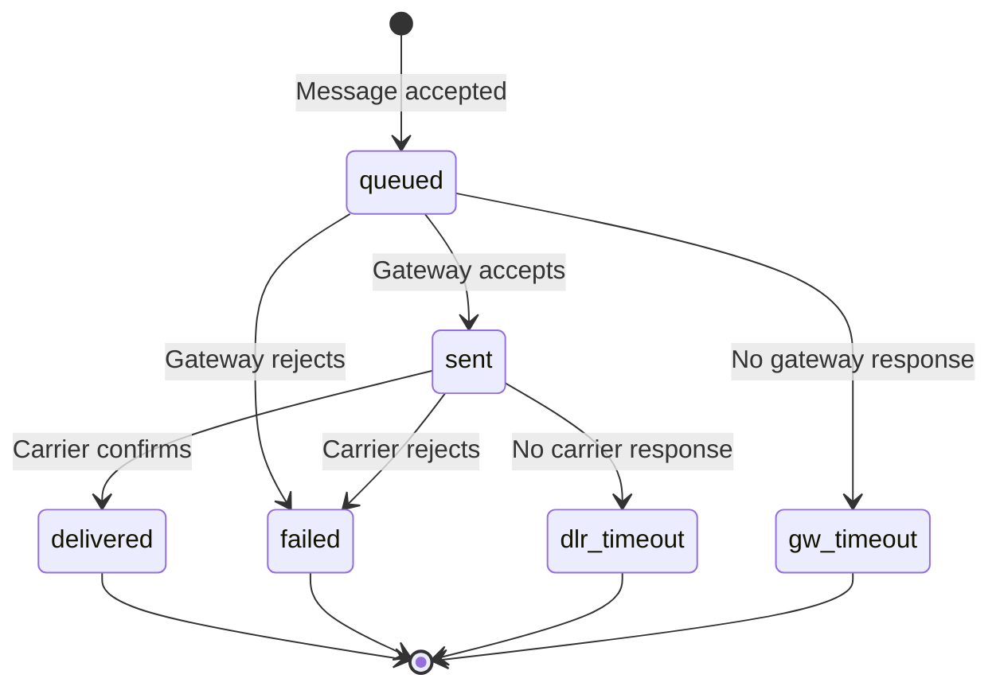

# Message Detail Records

Track message status and delivery with Message Detail Records (MDRs).

A Message Detail Record (MDR) describes a specific message request—including its current status, cost, and metadata. Telnyx creates an MDR when a message is submitted and updates it as the message progresses through delivery.

## When to Use MDRs

  - [Delivery Tracking](#) — Check if a message was delivered, failed, or is still in progress.

  - [Debugging](#) — Investigate delivery issues by examining message status and error codes.

  - [Cost Verification](#) — Confirm message costs after delivery for billing reconciliation.

  - [Audit Trail](#) — Retrieve message history for compliance and record-keeping.

***

## Retrieve an MDR

Fetch a message record using its UUID. The UUID is returned when you [send a message](https://developers.telnyx.com/api-reference/messages/send-a-message) and is also included in [webhook events](receiving-webhooks-for-messaging.md).

  ```bash
  curl -X GET "https://api.telnyx.com/v2/messages/834f3d53-8a3c-4aa0-a733-7f2d682a72df" \
    -H "Authorization: Bearer YOUR_API_KEY"
  ```

  ```javascript
  import Telnyx from 'telnyx';

  const client = new Telnyx({ apiKey: process.env.TELNYX_API_KEY });

  const response = await client.messages.retrieve(
    '834f3d53-8a3c-4aa0-a733-7f2d682a72df'
  );

  console.log(response.data);
  ```

  ```python
  import os
  from telnyx import Telnyx

  client = Telnyx(api_key=os.environ.get("TELNYX_API_KEY"))

  response = client.messages.retrieve(
      "834f3d53-8a3c-4aa0-a733-7f2d682a72df"
  )

  print(response.data)
  ```

  ```ruby
  require "telnyx"

  client = Telnyx::Client.new(api_key: ENV["TELNYX_API_KEY"])

  response = client.messages.retrieve(
    "834f3d53-8a3c-4aa0-a733-7f2d682a72df"
  )

  puts response
  ```

  ```go
  package main

  import (
    "context"
    "fmt"
    "os"

    "github.com/team-telnyx/telnyx-go"
    "github.com/team-telnyx/telnyx-go/option"
  )

  func main() {
    client := telnyx.NewClient(
      option.WithAPIKey(os.Getenv("TELNYX_API_KEY")),
    )

    response, err := client.Messages.Get(
      context.TODO(),
      "834f3d53-8a3c-4aa0-a733-7f2d682a72df",
    )
    if err != nil {
      panic(err.Error())
    }
    fmt.Printf("%+v\n", response)
  }
  ```

  ```java
  package com.telnyx.example;

  import com.telnyx.sdk.client.TelnyxClient;
  import com.telnyx.sdk.client.okhttp.TelnyxOkHttpClient;
  import com.telnyx.sdk.models.messages.*;

  public final class Main {
      public static void main(String[] args) {
          TelnyxClient client = TelnyxOkHttpClient.fromEnv();

          MessageGetResponse response = client.messages()
              .get("834f3d53-8a3c-4aa0-a733-7f2d682a72df");
          System.out.println(response);
      }
  }
  ```

  ```csharp .NET theme={null}
  using System;
  using Telnyx;

  TelnyxConfiguration.SetApiKey(Environment.GetEnvironmentVariable("TELNYX_API_KEY"));

  var service = new MessageService();
  var message = await service.GetAsync("834f3d53-8a3c-4aa0-a733-7f2d682a72df");

  Console.WriteLine(message);
  ```

  ```php
  <?php
  require_once 'vendor/autoload.php';

  \Telnyx\Telnyx::setApiKey(getenv('TELNYX_API_KEY'));

  $message = \Telnyx\Message::Retrieve("834f3d53-8a3c-4aa0-a733-7f2d682a72df");

  print_r($message);
  ```

### Example Response

```json theme={null}
{
  "data": {
    "record_type": "message",
    "id": "834f3d53-8a3c-4aa0-a733-7f2d682a72df",
    "direction": "outbound",
    "type": "SMS",
    "messaging_profile_id": "16fd2706-8baf-433b-82eb-8c7fada847da",
    "from": {
      "phone_number": "+18445550001",
      "carrier": "Telnyx",
      "line_type": "VoIP"
    },
    "to": [
      {
        "phone_number": "+18665550002",
        "status": "delivered",
        "updated_at": "2019-01-23T18:10:02.574Z"
      }
    ],
    "text": "Hello, World!",
    "webhook_url": "https://www.example.com/hooks",
    "webhook_failover_url": "https://www.example.com/hooks-backup",
    "use_profile_webhooks": false,
    "encoding": "GSM-7",
    "parts": 1,
    "cost": {
      "amount": "0.0050",
      "currency": "USD"
    },
    "errors": [],
    "created_at": "2019-01-23T18:10:00.000Z",
    "updated_at": "2019-01-23T18:10:02.574Z",
    "valid_until": "2019-01-23T18:25:00.000Z"
  }
}
```

***

## MDR Schema

| Field                  | Type     | Description                                                     |
| ---------------------- | -------- | --------------------------------------------------------------- |
| `id`                   | UUID     | Unique identifier for the message request                       |
| `direction`            | string   | `inbound` or `outbound`                                         |
| `type`                 | string   | Message type: `SMS`, `MMS`, or `RCS`                            |
| `messaging_profile_id` | UUID     | The messaging profile used to send/receive                      |
| `from`                 | object   | Sender details including `phone_number`, `carrier`, `line_type` |
| `to`                   | array    | Recipients with `phone_number`, `status`, `updated_at`          |
| `text`                 | string   | Message body content                                            |
| `media_urls`           | array    | Media attachment URLs (MMS only)                                |
| `encoding`             | string   | Character encoding: `GSM-7` or `UCS-2`                          |
| `parts`                | integer  | Number of message segments                                      |
| `cost`                 | object   | `amount` and `currency` (may be `null` until finalized)         |
| `errors`               | array    | Error details if delivery failed                                |
| `webhook_url`          | string   | URL for delivery status webhooks                                |
| `webhook_failover_url` | string   | Backup webhook URL                                              |
| `use_profile_webhooks` | boolean  | Whether to use profile-level webhooks                           |
| `created_at`           | ISO 8601 | When the message was submitted                                  |
| `updated_at`           | ISO 8601 | Last status update time                                         |
| `valid_until`          | ISO 8601 | Expiration time for pending messages                            |

<Callout type="info">
  **Cost may be null**: When retrieved immediately after sending, `cost` may be `null` because pricing is calculated asynchronously. The final cost appears in the `message.finalized` webhook event.

***

## Message Status

The `status` field in the `to` array indicates where the message is in its lifecycle.

### Outbound Status Flow



### Outbound Statuses

| Status        | Description                             | Final? |
| ------------- | --------------------------------------- | ------ |
| `queued`      | Message accepted and queued for sending | No     |
| `sent`        | Delivered to carrier gateway            | No     |
| `delivered`   | Carrier confirmed delivery to handset   | ✓ Yes  |
| `failed`      | Delivery failed (see `errors` array)    | ✓ Yes  |
| `gw_timeout`  | No response from gateway                | ✓ Yes  |
| `dlr_timeout` | No delivery receipt from carrier        | ✓ Yes  |

<Callout type="tip">
  **Track delivery with webhooks**: Rather than polling for status, configure a [webhook URL](receiving-webhooks-for-messaging.md) to receive real-time status updates as `message.sent`, `message.delivered`, or `message.finalized` events.

### Inbound Statuses

| Status      | Description                       |
| ----------- | --------------------------------- |
| `received`  | Message received by Telnyx        |
| `delivered` | Message delivered to your webhook |

***

## Common Error Codes

When a message fails, the `errors` array contains details:

```json theme={null}
{
  "errors": [
    {
      "code": "40301",
      "title": "Destination number blocked",
      "detail": "The recipient has opted out of messages from this sender"
    }
  ]
}
```

| Error Code | Description           | Resolution                                      |
| ---------- | --------------------- | ----------------------------------------------- |
| `40300`    | Invalid destination   | Verify the phone number format                  |
| `40301`    | Destination blocked   | Recipient has opted out—remove from list        |
| `40310`    | Carrier rejected      | Message content may have triggered spam filters |
| `40311`    | Undeliverable         | Number is unreachable (landline, disconnected)  |
| `40400`    | Sender not registered | Register for 10DLC or toll-free verification    |
| `40500`    | Rate limit exceeded   | Slow down sending or request higher limits      |

See the [Error Codes Reference](messaging-error-code-reference.md) for the complete list.

***

## Best Practices

**Use webhooks instead of polling**

  Polling the MDR endpoint is inefficient and can hit rate limits. Instead, configure webhooks on your [Messaging Profile](send-your-first-message.md) to receive real-time updates:

  * `message.sent` — Message accepted by carrier
  * `message.delivered` — Confirmed delivery
  * `message.finalized` — Final status with cost

  ```json theme={null}
  {
    "webhook_url": "https://your-app.com/webhooks/messaging",
    "webhook_failover_url": "https://your-app.com/webhooks/messaging-backup"
  }
  ```

---

**Store message IDs for tracking**

  Save the `id` returned when you send a message. This UUID is required to retrieve the MDR later:

  ```javascript theme={null}
  const response = await client.messages.send({
    from: '+15551234567',
    to: '+15559876543',
    text: 'Hello!'
  });

  // Store this for later tracking
  const messageId = response.data.id;
  ```

---

**Handle cost being null**

  The `cost` field is populated asynchronously. For accurate billing:

  1. Wait for the `message.finalized` webhook, OR
  2. Retrieve the MDR after a few seconds

  ```javascript theme={null}
  // Cost may not be available immediately
  if (message.cost === null) {
    // Wait for message.finalized webhook or retry later
  }
  ```

---

***

## Troubleshooting

**MDR not found (404)**

  **Possible causes:**

  * Invalid message ID format
  * Message ID from a different account
  * Message was never created (request was rejected at validation)

  **Solution**: Verify the UUID format and check that the message send request returned a `201` status. Rejected requests don't create MDRs.

---

**Status stuck on 'queued'**

  **Possible causes:**

  * Message is rate-limited and waiting in queue
  * Gateway connection issue

  **Solution**: Wait a few minutes. If still queued after 5 minutes, check [system status](https://status.telnyx.com) for outages. Messages stuck beyond `valid_until` will fail.

---

**Cost shows null**

  **Cause**: Cost is calculated asynchronously after the message is sent.

  **Solution**: Either wait for the `message.finalized` webhook, or retrieve the MDR again after 5-10 seconds.

---

***

## Next Steps

  - [Receiving Webhooks](receiving-webhooks-for-messaging.md) — Get real-time delivery updates

  - [Send Messages](send-your-first-message.md) — Complete sending quickstart

  - [Error Codes](messaging-error-code-reference.md) — Full error code reference

  - [API Reference](https://developers.telnyx.com/api-reference/messages/retrieve-a-message) — Complete Messages API docs


## Related Pages

- [Wireless Detail Records](../runbooks/wireless-detail-records.md)
- [WebRTC Voice SDKs Call Detail Records](../runbooks/webrtc-voice-sdks-call-detail-records.md)
- [Message Encoding](../runbooks/message-encoding.md)
