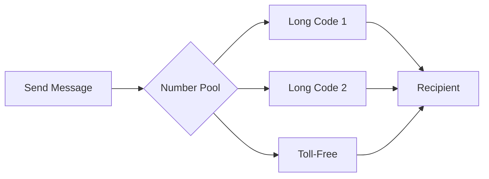

# Number Pool

Distribute outbound messaging across multiple phone numbers to maximize deliverability and throughput.

Number Pool automatically distributes your outbound messages across multiple phone numbers, helping you scale messaging campaigns while maintaining deliverability. Instead of specifying a single "from" number, Telnyx selects the optimal sender from your pool based on availability, health, and configured weights.

## When to Use Number Pool

  - [High Volume Campaigns](#) — Distribute traffic across numbers to avoid per-number rate limits and increase total throughput.

  - [Improved Deliverability](#) — Automatically skip unhealthy numbers and spread reputation across multiple senders.

  - [Mixed Number Types](#) — Balance between long codes and toll-free numbers with configurable weights.

  - [Simplified Sending](#) — No need to track which number to use—Telnyx handles sender selection.

## How It Works

1. **Pool creation**: All long code and toll-free numbers assigned to your Messaging Profile form the pool
2. **Sender selection**: When you send a message, Telnyx picks an available number from the pool
3. **Weight distribution**: Control the ratio of long code vs. toll-free usage with weights
4. **Health monitoring**: Optionally skip numbers with poor delivery rates



## Prerequisites

* A [Messaging Profile](send-your-first-message.md) with at least one phone number assigned
* Multiple numbers recommended for effective load distribution

***

## Configure Number Pool

Enable Number Pool on your Messaging Profile by setting the `number_pool_settings`. The weights control which number types are preferred.

### API

      ```bash
      curl -X PATCH "https://api.telnyx.com/v2/messaging_profiles/YOUR_PROFILE_ID" \
        -H "Content-Type: application/json" \
        -H "Authorization: Bearer YOUR_API_KEY" \
        -d '{
          "number_pool_settings": {
            "long_code_weight": 5,
            "toll_free_weight": 1,
            "skip_unhealthy": true
          }
        }'
      ```

      ```javascript
      import Telnyx from 'telnyx';

      const client = new Telnyx({ apiKey: process.env.TELNYX_API_KEY });

      const response = await client.messagingProfiles.update(
        'YOUR_PROFILE_ID',
        {
          number_pool_settings: {
            long_code_weight: 5,
            toll_free_weight: 1,
            skip_unhealthy: true
          }
        }
      );

      console.log(response.data);
      ```

      ```python
      import os
      from telnyx import Telnyx

      client = Telnyx(api_key=os.environ.get("TELNYX_API_KEY"))

      response = client.messaging_profiles.update(
          "YOUR_PROFILE_ID",
          number_pool_settings={
              "long_code_weight": 5,
              "toll_free_weight": 1,
              "skip_unhealthy": True
          }
      )

      print(response.data)
      ```

      ```ruby
      require "telnyx"

      client = Telnyx::Client.new(api_key: ENV["TELNYX_API_KEY"])

      response = client.messaging_profiles.update(
        "YOUR_PROFILE_ID",
        number_pool_settings: {
          long_code_weight: 5,
          toll_free_weight: 1,
          skip_unhealthy: true
        }
      )

      puts response
      ```

      ```go
      package main

      import (
        "context"
        "fmt"
        "os"

        "github.com/team-telnyx/telnyx-go"
        "github.com/team-telnyx/telnyx-go/option"
      )

      func main() {
        client := telnyx.NewClient(
          option.WithAPIKey(os.Getenv("TELNYX_API_KEY")),
        )

        response, err := client.MessagingProfiles.Update(
          context.TODO(),
          "YOUR_PROFILE_ID",
          telnyx.MessagingProfileUpdateParams{
            NumberPoolSettings: &telnyx.NumberPoolSettingsParam{
              LongCodeWeight:  telnyx.Int(5),
              TollFreeWeight:  telnyx.Int(1),
              SkipUnhealthy:   telnyx.Bool(true),
            },
          },
        )
        if err != nil {
          panic(err.Error())
        }
        fmt.Printf("%+v\n", response)
      }
      ```

      ```java
      package com.telnyx.example;

      import com.telnyx.sdk.client.TelnyxClient;
      import com.telnyx.sdk.client.okhttp.TelnyxOkHttpClient;
      import com.telnyx.sdk.models.messagingprofiles.*;

      public final class Main {
          public static void main(String[] args) {
              TelnyxClient client = TelnyxOkHttpClient.fromEnv();

              NumberPoolSettings poolSettings = NumberPoolSettings.builder()
                  .longCodeWeight(5)
                  .tollFreeWeight(1)
                  .skipUnhealthy(true)
                  .build();

              MessagingProfileUpdateParams params = MessagingProfileUpdateParams.builder()
                  .numberPoolSettings(poolSettings)
                  .build();

              MessagingProfileUpdateResponse response = client.messagingProfiles()
                  .update("YOUR_PROFILE_ID", params);
              System.out.println(response);
          }
      }
      ```

      ```csharp .NET theme={null}
      using System;
      using Telnyx;

      TelnyxConfiguration.SetApiKey(Environment.GetEnvironmentVariable("TELNYX_API_KEY"));

      var service = new MessagingProfileService();
      var options = new MessagingProfileUpdateOptions
      {
          NumberPoolSettings = new NumberPoolSettings
          {
              LongCodeWeight = 5,
              TollFreeWeight = 1,
              SkipUnhealthy = true
          }
      };

      var profile = service.Update("YOUR_PROFILE_ID", options);
      Console.WriteLine(profile);
      ```

      ```php
      <?php
      require_once 'vendor/autoload.php';

      \Telnyx\Telnyx::setApiKey(getenv('TELNYX_API_KEY'));

      $profile = \Telnyx\MessagingProfile::update("YOUR_PROFILE_ID", [
          "number_pool_settings" => [
              "long_code_weight" => 5,
              "toll_free_weight" => 1,
              "skip_unhealthy" => true
          ]
      ]);

      print_r($profile);
      ```

### Portal

    1. Go to [Messaging](https://portal.telnyx.com/#/app/messaging) in the portal
    2. Click the edit icon next to your Messaging Profile
    3. Under **Outbound**, toggle on **Number Pool**
    4. Configure the weights for long codes and toll-free numbers
    5. Optionally enable **Skip Unhealthy Numbers**
    6. Click **Save**

       

### Configuration Options

| Parameter          | Type    | Description                                          |
| ------------------ | ------- | ---------------------------------------------------- |
| `long_code_weight` | integer | Weight for long code selection (0 removes from pool) |
| `toll_free_weight` | integer | Weight for toll-free selection (0 removes from pool) |
| `skip_unhealthy`   | boolean | Skip numbers with poor delivery rates                |
| `sticky_sender`    | boolean | Reuse same number for recipient when possible        |
| `geomatch`         | boolean | Match sender to recipient's geographic area          |

  Weights are ratios, not percentages. With `long_code_weight: 5` and `toll_free_weight: 1`, approximately 5 out of every 6 messages use a long code.

***

## Send Messages with Number Pool

When sending with Number Pool, omit the `from` field and specify your `messaging_profile_id` instead. Telnyx automatically selects the optimal sender.

  ```bash
  curl -X POST "https://api.telnyx.com/v2/messages/number_pool" \
    -H "Content-Type: application/json" \
    -H "Authorization: Bearer YOUR_API_KEY" \
    -d '{
      "messaging_profile_id": "YOUR_PROFILE_ID",
      "to": "+15559876543",
      "text": "Hello from Number Pool!"
    }'
  ```

  ```javascript
  import Telnyx from 'telnyx';

  const client = new Telnyx({ apiKey: process.env.TELNYX_API_KEY });

  const response = await client.messages.sendWithNumberPool({
    messaging_profile_id: 'YOUR_PROFILE_ID',
    to: '+15559876543',
    text: 'Hello from Number Pool!'
  });

  console.log(`Sent from: ${response.data.from.phone_number}`);
  ```

  ```python
  import os
  from telnyx import Telnyx

  client = Telnyx(api_key=os.environ.get("TELNYX_API_KEY"))

  response = client.messages.send_with_number_pool(
      messaging_profile_id="YOUR_PROFILE_ID",
      to="+15559876543",
      text="Hello from Number Pool!"
  )

  print(f"Sent from: {response.data.from_.phone_number}")
  ```

  ```ruby
  require "telnyx"

  client = Telnyx::Client.new(api_key: ENV["TELNYX_API_KEY"])

  response = client.messages.send_with_number_pool(
    messaging_profile_id: "YOUR_PROFILE_ID",
    to: "+15559876543",
    text: "Hello from Number Pool!"
  )

  puts "Sent from: #{response.from.phone_number}"
  ```

  ```go
  package main

  import (
    "context"
    "fmt"
    "os"

    "github.com/team-telnyx/telnyx-go"
    "github.com/team-telnyx/telnyx-go/option"
  )

  func main() {
    client := telnyx.NewClient(
      option.WithAPIKey(os.Getenv("TELNYX_API_KEY")),
    )

    response, err := client.Messages.SendWithNumberPool(
      context.TODO(),
      telnyx.MessageSendWithNumberPoolParams{
        MessagingProfileID: "YOUR_PROFILE_ID",
        To:                 "+15559876543",
        Text:               "Hello from Number Pool!",
      },
    )
    if err != nil {
      panic(err.Error())
    }
    fmt.Printf("Sent from: %s\n", response.Data.From.PhoneNumber)
  }
  ```

  ```java
  package com.telnyx.example;

  import com.telnyx.sdk.client.TelnyxClient;
  import com.telnyx.sdk.client.okhttp.TelnyxOkHttpClient;
  import com.telnyx.sdk.models.messages.*;

  public final class Main {
      public static void main(String[] args) {
          TelnyxClient client = TelnyxOkHttpClient.fromEnv();

          MessageSendWithNumberPoolParams params = MessageSendWithNumberPoolParams.builder()
              .messagingProfileId("YOUR_PROFILE_ID")
              .to("+15559876543")
              .text("Hello from Number Pool!")
              .build();

          MessageSendResponse response = client.messages().sendWithNumberPool(params);
          System.out.println("Sent from: " + response.data().from().phoneNumber());
      }
  }
  ```

  ```csharp .NET theme={null}
  using System;
  using Telnyx;

  TelnyxConfiguration.SetApiKey(Environment.GetEnvironmentVariable("TELNYX_API_KEY"));

  var service = new MessagingService();
  var options = new MessageSendWithNumberPoolOptions
  {
      MessagingProfileId = "YOUR_PROFILE_ID",
      To = "+15559876543",
      Text = "Hello from Number Pool!"
  };

  var message = service.SendWithNumberPool(options);
  Console.WriteLine($"Sent from: {message.From.PhoneNumber}");
  ```

  ```php
  <?php
  require_once 'vendor/autoload.php';

  \Telnyx\Telnyx::setApiKey(getenv('TELNYX_API_KEY'));

  $message = \Telnyx\Message::create([
      "messaging_profile_id" => "YOUR_PROFILE_ID",
      "to" => "+15559876543",
      "text" => "Hello from Number Pool!"
  ], null, "/v2/messages/number_pool");

  echo "Sent from: " . $message->from->phone_number . "\n";
  ```

The response includes the actual `from` number that was selected:

```json theme={null}
{
  "data": {
    "id": "b0c7e8cb-6227-4c74-9f32-c7f80c30934b",
    "type": "SMS",
    "from": {
      "phone_number": "+15551234567",
      "carrier": "Telnyx",
      "line_type": "long_code"
    },
    "to": [
      {
        "phone_number": "+15559876543",
        "status": "queued"
      }
    ],
    "text": "Hello from Number Pool!"
  }
}
```

***

## Disable Number Pool

To disable Number Pool, set `number_pool_settings` to an empty object:

  ```bash
  curl -X PATCH "https://api.telnyx.com/v2/messaging_profiles/YOUR_PROFILE_ID" \
    -H "Content-Type: application/json" \
    -H "Authorization: Bearer YOUR_API_KEY" \
    -d '{"number_pool_settings": {}}'
  ```

  ```javascript
  await client.messagingProfiles.update('YOUR_PROFILE_ID', {
    number_pool_settings: {}
  });
  ```

  ```python
  client.messaging_profiles.update(
      "YOUR_PROFILE_ID",
      number_pool_settings={}
  )
  ```

***

## Related Features

Number Pool works alongside these Messaging Profile features:

**Sticky Sender**

  Maintains consistency by using the same number for a recipient across messages. When enabled, if you've previously messaged a recipient, the same number is reused when available.

  Enable with:

  ```json theme={null}
  {
    "number_pool_settings": {
      "long_code_weight": 1,
      "sticky_sender": true
    }
  }
  ```

  See [Sticky Sender](sticky-sender.md) for details.

---

**Geomatch**

  Selects a sender number matching the recipient's geographic area, improving deliverability and user trust by showing a local number.

  Enable with:

  ```json theme={null}
  {
    "number_pool_settings": {
      "long_code_weight": 1,
      "geomatch": true
    }
  }
  ```

  See [Geomatch](geomatch.md) for details.

---

**Skip Unhealthy Numbers**

  Monitors delivery success rates and automatically excludes numbers performing poorly. This helps maintain overall campaign deliverability.

  > **Warning:** If all numbers in the pool are unhealthy, message sending will fail rather than use an unhealthy number.

---

***

## Troubleshooting

**Message rejected: No healthy numbers in pool**

  **Cause**: All numbers are flagged as unhealthy and `skip_unhealthy` is enabled.

  **Solutions**:

  1. Temporarily disable `skip_unhealthy` to allow sending
  2. Add more numbers to your Messaging Profile
  3. Investigate delivery issues on your existing numbers

---

**Messages always sent from same number type**

  **Cause**: Weight of one type set to 0, or only one number type assigned.

  **Solutions**:

  1. Verify weights are non-zero for both types
  2. Ensure you have both long codes and toll-free numbers assigned to the profile

---

**Receiving 'messaging_profile_id required' error**

  **Cause**: Using the standard `/v2/messages` endpoint instead of `/v2/messages/number_pool`.

  **Solution**: Use the [Number Pool send endpoint](https://developers.telnyx.com/api-reference/messages/send-a-message-using-number-pool) which requires `messaging_profile_id` instead of `from`.

---

***

## Next Steps

  - [Sticky Sender](sticky-sender.md) — Maintain sender consistency for recipients

  - [Geomatch](geomatch.md) — Match sender to recipient geography

  - [Rate Limiting](rate-limiting.md) — Understand messaging throughput limits

  - [API Reference](https://developers.telnyx.com/api-reference/messages/send-a-message-using-number-pool) — View full Number Pool API details


## Related Pages

- [Number Orders](../runbooks/number-orders.md)
- [Number Reputation](../runbooks/number-reputation.md)
