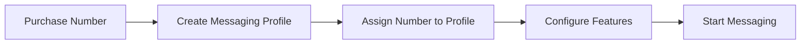

# Phone Number Messaging Configuration

Configure phone numbers for messaging — assign to messaging profiles, enable messaging features, manage number settings, and troubleshoot common issues.

Before a phone number can send or receive messages through Telnyx, it must be **assigned to a messaging profile** and have messaging enabled. This guide covers the complete workflow — from purchasing a number to configuring it for messaging, assigning it to profiles, and troubleshooting common issues.

## Prerequisites

* A [Telnyx account](https://telnyx.com/sign-up) with API access
* Your [API key](https://portal.telnyx.com/#/app/api-keys)
* At least one [messaging profile](../concepts/messaging-profiles-overview.md) created

***

## Overview



Every phone number used for messaging needs:

1. **A messaging profile** — Controls webhook URLs, inbound settings, and features like [number pool](number-pool.md) or [sticky sender](sticky-sender.md)
2. **Messaging enabled** — The number must have messaging capabilities activated
3. **Regulatory compliance** — Depending on the number type, you may need [10DLC registration](../tutorial/getting-started-with-10dlc.md) or [toll-free verification](toll-free-verification-with-business-registration-fields.md)

***

## Step 1: List messaging-capable numbers

Find numbers on your account that support messaging:

  ```bash
  curl -X GET "https://api.telnyx.com/v2/messaging_phone_numbers?page[size]=25" \
    -H "Authorization: Bearer YOUR_API_KEY"
  ```

  ```python
  import os
  import requests

  API_KEY = os.environ.get("TELNYX_API_KEY")
  headers = {
      "Authorization": f"Bearer {API_KEY}",
      "Content-Type": "application/json",
  }

  response = requests.get(
      "https://api.telnyx.com/v2/messaging_phone_numbers",
      headers=headers,
      params={"page[size]": 25},
  )
  numbers = response.json()
  for num in numbers.get("data", []):
      profile = num.get("messaging_profile_id") or "unassigned"
      print(f"{num['phone_number']} — profile: {profile}, features: {num.get('features', {})}")
  ```

  ```javascript
  const axios = require('axios');

  const headers = {
    Authorization: `Bearer ${process.env.TELNYX_API_KEY}`,
    'Content-Type': 'application/json',
  };

  const { data: numbers } = await axios.get(
    'https://api.telnyx.com/v2/messaging_phone_numbers',
    { headers, params: { 'page[size]': 25 } }
  );

  numbers.data.forEach(num => {
    const profile = num.messaging_profile_id || 'unassigned';
    console.log(`${num.phone_number} — profile: ${profile}`);
  });
  ```

  ```ruby
  require "net/http"
  require "json"
  require "uri"

  uri = URI("https://api.telnyx.com/v2/messaging_phone_numbers?page[size]=25")
  http = Net::HTTP.new(uri.host, uri.port)
  http.use_ssl = true

  request = Net::HTTP::Get.new(uri)
  request["Authorization"] = "Bearer #{ENV['TELNYX_API_KEY']}"

  response = http.request(request)
  numbers = JSON.parse(response.body)
  numbers["data"].each do |num|
    profile = num["messaging_profile_id"] || "unassigned"
    puts "#{num['phone_number']} — profile: #{profile}"
  end
  ```

  ```go
  package main

  import (
  	"encoding/json"
  	"fmt"
  	"io"
  	"net/http"
  	"os"
  )

  func main() {
  	req, _ := http.NewRequest("GET",
  		"https://api.telnyx.com/v2/messaging_phone_numbers?page[size]=25", nil)
  	req.Header.Set("Authorization", "Bearer "+os.Getenv("TELNYX_API_KEY"))

  	resp, err := http.DefaultClient.Do(req)
  	if err != nil {
  		fmt.Println("Error:", err)
  		return
  	}
  	defer resp.Body.Close()

  	body, _ := io.ReadAll(resp.Body)
  	var result map[string]interface{}
  	json.Unmarshal(body, &result)

  	for _, num := range result["data"].([]interface{}) {
  		n := num.(map[string]interface{})
  		profile := n["messaging_profile_id"]
  		if profile == nil {
  			profile = "unassigned"
  		}
  		fmt.Printf("%s — profile: %v\n", n["phone_number"], profile)
  	}
  }
  ```

  ```php
  <?php
  $apiKey = getenv('TELNYX_API_KEY');

  $ch = curl_init('https://api.telnyx.com/v2/messaging_phone_numbers?page[size]=25');
  curl_setopt_array($ch, [
      CURLOPT_RETURNTRANSFER => true,
      CURLOPT_HTTPHEADER => [
          "Authorization: Bearer {$apiKey}",
          'Content-Type: application/json',
      ],
  ]);

  $response = curl_exec($ch);
  curl_close($ch);

  $numbers = json_decode($response, true);
  foreach ($numbers['data'] as $num) {
      $profile = $num['messaging_profile_id'] ?? 'unassigned';
      echo "{$num['phone_number']} — profile: {$profile}\n";
  }
  ```

  ```csharp .NET theme={null}
  using System.Net.Http.Headers;
  using System.Text.Json;

  var apiKey = Environment.GetEnvironmentVariable("TELNYX_API_KEY");
  var client = new HttpClient();
  client.DefaultRequestHeaders.Authorization =
      new AuthenticationHeaderValue("Bearer", apiKey);

  var response = await client.GetAsync(
      "https://api.telnyx.com/v2/messaging_phone_numbers?page%5Bsize%5D=25"
  );
  var body = await response.Content.ReadAsStringAsync();
  var doc = JsonDocument.Parse(body);

  foreach (var num in doc.RootElement.GetProperty("data").EnumerateArray())
  {
      var phone = num.GetProperty("phone_number").GetString();
      var profile = num.TryGetProperty("messaging_profile_id", out var p) && p.ValueKind != JsonValueKind.Null
          ? p.GetString() : "unassigned";
      Console.WriteLine($"{phone} — profile: {profile}");
  }
  ```

  ```java
  import java.net.http.*;
  import java.net.URI;

  String apiKey = System.getenv("TELNYX_API_KEY");

  HttpRequest request = HttpRequest.newBuilder()
      .uri(URI.create("https://api.telnyx.com/v2/messaging_phone_numbers?page%5Bsize%5D=25"))
      .header("Authorization", "Bearer " + apiKey)
      .GET()
      .build();

  HttpClient client = HttpClient.newHttpClient();
  HttpResponse response = client.send(request, HttpResponse.BodyHandlers.ofString());
  System.out.println(response.body());
  ```

***

## Step 2: Assign a number to a messaging profile

Link a phone number to a messaging profile to configure its webhook URLs and messaging behavior.

  ```bash
  curl -X PATCH "https://api.telnyx.com/v2/messaging_phone_numbers/+15551234567" \
    -H "Content-Type: application/json" \
    -H "Authorization: Bearer YOUR_API_KEY" \
    -d '{
      "messaging_profile_id": "400174af-0a13-4e28-b4f5-example12345"
    }'
  ```

  ```python
  phone_number = "+15551234567"
  profile_id = "400174af-0a13-4e28-b4f5-example12345"

  response = requests.patch(
      f"https://api.telnyx.com/v2/messaging_phone_numbers/{phone_number}",
      headers=headers,
      json={"messaging_profile_id": profile_id},
  )
  result = response.json()
  print(f"Assigned {phone_number} to profile {result['data']['messaging_profile_id']}")
  ```

  ```javascript
  const phoneNumber = '+15551234567';
  const profileId = '400174af-0a13-4e28-b4f5-example12345';

  const { data: result } = await axios.patch(
    `https://api.telnyx.com/v2/messaging_phone_numbers/${encodeURIComponent(phoneNumber)}`,
    { messaging_profile_id: profileId },
    { headers }
  );
  console.log(`Assigned ${phoneNumber} to profile ${result.data.messaging_profile_id}`);
  ```

  ```ruby
  phone_number = "+15551234567"
  profile_id = "400174af-0a13-4e28-b4f5-example12345"

  uri = URI("https://api.telnyx.com/v2/messaging_phone_numbers/#{CGI.escape(phone_number)}")
  request = Net::HTTP::Patch.new(uri)
  request["Authorization"] = "Bearer #{ENV['TELNYX_API_KEY']}"
  request["Content-Type"] = "application/json"
  request.body = { messaging_profile_id: profile_id }.to_json

  response = http.request(request)
  result = JSON.parse(response.body)
  puts "Assigned #{phone_number} to profile #{result['data']['messaging_profile_id']}"
  ```

  ```go
  package main

  import (
  	"bytes"
  	"encoding/json"
  	"fmt"
  	"io"
  	"net/http"
  	"net/url"
  	"os"
  )

  func main() {
  	phoneNumber := "+15551234567"
  	profileID := "400174af-0a13-4e28-b4f5-example12345"

  	body, _ := json.Marshal(map[string]string{
  		"messaging_profile_id": profileID,
  	})

  	encoded := url.PathEscape(phoneNumber)
  	req, _ := http.NewRequest("PATCH",
  		"https://api.telnyx.com/v2/messaging_phone_numbers/"+encoded,
  		bytes.NewBuffer(body))
  	req.Header.Set("Authorization", "Bearer "+os.Getenv("TELNYX_API_KEY"))
  	req.Header.Set("Content-Type", "application/json")

  	resp, err := http.DefaultClient.Do(req)
  	if err != nil {
  		fmt.Println("Error:", err)
  		return
  	}
  	defer resp.Body.Close()

  	result, _ := io.ReadAll(resp.Body)
  	fmt.Printf("Result: %s\n", result)
  }
  ```

  ```php
  <?php
  $phoneNumber = '+15551234567';
  $profileId = '400174af-0a13-4e28-b4f5-example12345';
  $encoded = urlencode($phoneNumber);

  $ch = curl_init("https://api.telnyx.com/v2/messaging_phone_numbers/{$encoded}");
  curl_setopt_array($ch, [
      CURLOPT_RETURNTRANSFER => true,
      CURLOPT_CUSTOMREQUEST  => 'PATCH',
      CURLOPT_HTTPHEADER     => [
          "Authorization: Bearer " . getenv('TELNYX_API_KEY'),
          'Content-Type: application/json',
      ],
      CURLOPT_POSTFIELDS => json_encode(['messaging_profile_id' => $profileId]),
  ]);

  $response = curl_exec($ch);
  curl_close($ch);
  echo "Result: {$response}\n";
  ```

  ```csharp .NET theme={null}
  var phoneNumber = Uri.EscapeDataString("+15551234567");
  var profileId = "400174af-0a13-4e28-b4f5-example12345";

  var content = new StringContent(
      JsonSerializer.Serialize(new { messaging_profile_id = profileId }),
      Encoding.UTF8,
      "application/json"
  );

  var request = new HttpRequestMessage(new HttpMethod("PATCH"),
      $"https://api.telnyx.com/v2/messaging_phone_numbers/{phoneNumber}")
  {
      Content = content
  };
  request.Headers.Authorization = new AuthenticationHeaderValue("Bearer", apiKey);

  var response = await client.SendAsync(request);
  var result = await response.Content.ReadAsStringAsync();
  Console.WriteLine($"Result: {result}");
  ```

  ```java
  import java.net.http.*;
  import java.net.URI;
  import java.net.URLEncoder;
  import java.nio.charset.StandardCharsets;

  String phoneNumber = URLEncoder.encode("+15551234567", StandardCharsets.UTF_8);
  String profileId = "400174af-0a13-4e28-b4f5-example12345";
  String body = String.format("{\"messaging_profile_id\":\"%s\"}", profileId);

  HttpRequest request = HttpRequest.newBuilder()
      .uri(URI.create("https://api.telnyx.com/v2/messaging_phone_numbers/" + phoneNumber))
      .header("Authorization", "Bearer " + System.getenv("TELNYX_API_KEY"))
      .header("Content-Type", "application/json")
      .method("PATCH", HttpRequest.BodyPublishers.ofString(body))
      .build();

  HttpResponse response = client.send(request, HttpResponse.BodyHandlers.ofString());
  System.out.println("Result: " + response.body());
  ```

***

## Step 3: Retrieve number configuration

Check the current messaging configuration for a specific number:

  ```bash
  curl -X GET "https://api.telnyx.com/v2/messaging_phone_numbers/+15551234567" \
    -H "Authorization: Bearer YOUR_API_KEY"
  ```

  ```python
  response = requests.get(
      f"https://api.telnyx.com/v2/messaging_phone_numbers/{phone_number}",
      headers=headers,
  )
  config = response.json()["data"]
  print(f"Number: {config['phone_number']}")
  print(f"Profile: {config['messaging_profile_id']}")
  print(f"Features: {config.get('features', {})}")
  print(f"Health: {config.get('health', {})}")
  ```

  ```javascript
  const { data: config } = await axios.get(
    `https://api.telnyx.com/v2/messaging_phone_numbers/${encodeURIComponent(phoneNumber)}`,
    { headers }
  );
  console.log('Number:', config.data.phone_number);
  console.log('Profile:', config.data.messaging_profile_id);
  console.log('Features:', config.data.features);
  ```

### Response fields

| Field                         | Description                                           |
| ----------------------------- | ----------------------------------------------------- |
| `phone_number`                | The E.164 formatted phone number                      |
| `messaging_profile_id`        | ID of the assigned messaging profile                  |
| `type`                        | Number type: `long_code`, `toll_free`, `short_code`   |
| `country_code`                | Two-letter country code                               |
| `features`                    | Enabled features (SMS, MMS, etc.)                     |
| `health`                      | Number health indicators (message success rate, etc.) |
| `eligible_messaging_products` | Products the number can be used for                   |

***

## Step 4: Bulk assignment

Assign multiple numbers to a messaging profile at once using the messaging profile's phone number assignment endpoint:

  ```bash
  # Assign multiple numbers to a profile
  for number in "+15551234567" "+15559876543" "+15551112222"; do
    curl -X PATCH "https://api.telnyx.com/v2/messaging_phone_numbers/$number" \
      -H "Content-Type: application/json" \
      -H "Authorization: Bearer YOUR_API_KEY" \
      -d '{"messaging_profile_id": "400174af-0a13-4e28-b4f5-example12345"}'
  done
  ```

  ```python
  numbers_to_assign = ["+15551234567", "+15559876543", "+15551112222"]
  profile_id = "400174af-0a13-4e28-b4f5-example12345"

  for number in numbers_to_assign:
      response = requests.patch(
          f"https://api.telnyx.com/v2/messaging_phone_numbers/{number}",
          headers=headers,
          json={"messaging_profile_id": profile_id},
      )
      if response.status_code == 200:
          print(f"✓ Assigned {number}")
      else:
          print(f"✗ Failed {number}: {response.json().get('errors', [])}")
  ```

  ```javascript
  const numbersToAssign = ['+15551234567', '+15559876543', '+15551112222'];
  const profileId = '400174af-0a13-4e28-b4f5-example12345';

  for (const number of numbersToAssign) {
    try {
      await axios.patch(
        `https://api.telnyx.com/v2/messaging_phone_numbers/${encodeURIComponent(number)}`,
        { messaging_profile_id: profileId },
        { headers }
      );
      console.log(`✓ Assigned ${number}`);
    } catch (error) {
      console.log(`✗ Failed ${number}: ${error.response?.data?.errors}`);
    }
  }
  ```

***

## Messaging enablement by number type

Different number types have different requirements before they can send messages:

| Number Type                | Messaging Ready?         | Additional Steps Required                                                |
| -------------------------- | ------------------------ | ------------------------------------------------------------------------ |
| **Long code (US)**         | After 10DLC registration | [Register brand + campaign](../tutorial/getting-started-with-10dlc.md)            |
| **Toll-free (US/CA)**      | After verification       | [Submit toll-free verification](toll-free-verification-with-business-registration-fields.md)  |
| **Short code**             | After provisioning       | [Short code setup](short-codes.md)                  |
| **Long code (non-US)**     | Typically immediate      | Check country-specific requirements                                      |
| **Alphanumeric sender ID** | After registration       | [Alphanumeric ID setup](alphanumeric-sender-id.md) |

> **Warning:** **US long codes without 10DLC registration** will experience carrier filtering and potential message blocking. Always complete 10DLC registration before sending A2P messages on US long codes.

***

## Unassign a number from a profile

Remove a number's messaging profile assignment:

  ```bash
  curl -X PATCH "https://api.telnyx.com/v2/messaging_phone_numbers/+15551234567" \
    -H "Content-Type: application/json" \
    -H "Authorization: Bearer YOUR_API_KEY" \
    -d '{
      "messaging_profile_id": null
    }'
  ```

  ```python
  response = requests.patch(
      f"https://api.telnyx.com/v2/messaging_phone_numbers/{phone_number}",
      headers=headers,
      json={"messaging_profile_id": None},
  )
  print(f"Unassigned {phone_number} from messaging profile")
  ```

  ```javascript
  await axios.patch(
    `https://api.telnyx.com/v2/messaging_phone_numbers/${encodeURIComponent(phoneNumber)}`,
    { messaging_profile_id: null },
    { headers }
  );
  console.log(`Unassigned ${phoneNumber} from messaging profile`);
  ```

> **Note:** Unassigning a number from a messaging profile means it will no longer receive inbound message webhooks or be available for outbound messaging through that profile.

***

## Troubleshooting

**Number not appearing in messaging_phone_numbers list**

    **Possible causes:**

    * The number doesn't have messaging capabilities. Check your number order — not all numbers support SMS/MMS.
    * The number hasn't finished provisioning yet. Wait a few minutes after purchase.
    * The number is on a different Telnyx account.

    **Fix:** Verify the number's capabilities via `GET /v2/phone_numbers/{id}` and check for `messaging` in the features.

---

**Messages failing with 'number not associated with messaging profile'**

    **Cause:** The `from` number in your send request isn't assigned to a messaging profile.

    **Fix:** Assign the number to a profile using the [assignment API](#step-2-assign-a-number-to-a-messaging-profile), or use the messaging profile's number pool to automatically select a number.

---

**Inbound messages not triggering webhooks**

    **Possible causes:**

    * The number isn't assigned to a messaging profile
    * The messaging profile doesn't have a webhook URL configured
    * Your webhook endpoint is returning errors (check [MDR logs](message-detail-records.md))

    **Fix:** Verify the number → profile → webhook URL chain. Test with [ngrok](../reference/ngrok.md) for local development.

---

**Number shows messaging enabled but messages are filtered**

    **Cause:** For US long codes, messages may be filtered by carriers if 10DLC registration isn't complete.

    **Fix:** Complete [10DLC brand and campaign registration](../tutorial/getting-started-with-10dlc.md). For toll-free, complete [verification](toll-free-verification-with-business-registration-fields.md).

---

**Cannot assign number to a messaging profile**

    **Possible causes:**

    * The number is already assigned to a different product (voice connection, etc.) that conflicts
    * The messaging profile ID is invalid
    * The number belongs to a different organization

    **Fix:** Check the profile ID, verify number ownership, and ensure no conflicting product assignments.

---

***

## Next steps

  - [Messaging Profiles](../concepts/messaging-profiles-overview.md) — Create and configure messaging profiles with webhooks and features.

  - [Send a Message](send-your-first-message.md) — Send your first SMS/MMS using a configured number.

  - [Number Pool](number-pool.md) — Use multiple numbers in a pool for automatic sender selection.

  - [10DLC Registration](../tutorial/getting-started-with-10dlc.md) — Register your brand and campaign for US long code messaging.


## Related Pages

- [Phone Number Reputation](../runbooks/phone-number-reputation.md)
- [WebRTC Flutter Client Configuration](../reference/webrtc-flutter-client-configuration.md)
