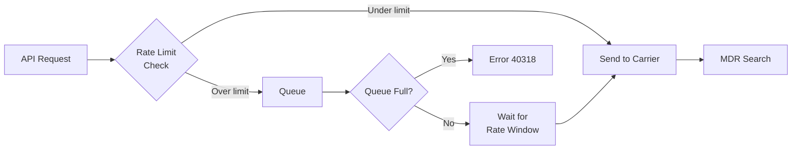

# Rate Limiting

Understand Telnyx SMS rate limits by sender type and how to optimize your message throughput.

> **Note:** This guide covers message delivery throughput. For API request limits, see [API Rate Limiting](../reference/rate-limiting.md).

## Rate Limits

The following are the default rate limits applied by Telnyx for each message type and sender type.

### Account

| Message Type | Default Rate Limit | Max Queue Length |
| ------------ | ------------------ | ---------------- |
| SMS          | 50 messages/second | 720,000          |
| MMS          | 15 messages/second | 216,000          |
| RCS          | 1 message/second   | 14,400           |

### Sender

| Sender Type  | Rate Limit | Per       | Max Queue Length |
| ------------ | ---------- | --------- | ---------------- |
| Long Code    | 0.1 MPS    | Number    | 1,440            |
| Toll-Free    | 20 MPS     | Number    | 288,000          |
| Short Code   | 1,000 MPS  | Number    | 14,400,000       |
| Alphanumeric | 0.1 MPS    | Sender ID | 1,440            |

> **Warning:** The default Long Code rate limit applies to non-US destinations. For US destinations, throughput is determined at the campaign level based on your 10DLC registration. See [10DLC](#10dlc) for carrier-specific limits.

> **Note:** If you need an increased rate limit, contact [Telnyx sales](mailto:sales@telnyx.com) to discuss your options.

### 10DLC

When using US long codes for A2P messaging, throughput is determined by mobile network operators (MNOs) based on your registered 10DLC campaign. Each carrier has different throughput systems.

**AT&T**

    AT\&T assigns throughput per campaign based on "Message Class," determined by use case type and vetting score.

    | Message Class | Use Case Type              | Vetting Score | SMS TPM   | MMS TPM   |
    | ------------- | -------------------------- | ------------- | --------- | --------- |
    | A             | Standard (Dedicated)       | 75-100        | 4,500     | 2,400     |
    | B             | Standard (Mixed/Marketing) | 75-100        | 4,500     | 2,400     |
    | C             | Standard (Dedicated)       | 50-74         | 2,400     | 1,200     |
    | D             | Standard (Mixed/Marketing) | 50-74         | 2,400     | 1,200     |
    | E             | Standard (Dedicated)       | 1-49          | 240       | 150       |
    | F             | Standard (Mixed/Marketing) | 1-49          | 240       | 150       |
    | T             | Low Volume Mixed           | -             | 75        | 50        |
    | K             | Political                  | -             | 4,500     | 2,400     |
    | P             | Charity                    | -             | 2,400     | 1,200     |
    | S             | Social                     | -             | 9,000     | 2,400     |
    | X             | Emergency / Public Safety  | -             | 4,500     | 2,400     |
    | W             | Sole Proprietor            | -             | 15        | 50        |
    | G             | Proxy                      | -             | 60/number | 50/number |
    | N             | Agents and Franchises      | -             | 60/number | 50/number |

    > **Note:** TPM = Throughput Per Minute. For standard use cases, the vetting score from your 10DLC brand registration determines which message class (and throughput) your campaign receives. Special use cases have fixed throughput regardless of vetting score.

---

**T-Mobile**

    T-Mobile assigns daily message caps at the brand level, shared across all campaigns under that brand.

    | Brand Tier | Vetting Score | Daily Cap |
    | ---------- | ------------- | --------- |
    | Top        | 75-100        | 200,000   |
    | High Mid   | 50-74         | 40,000    |
    | Low Mid    | 25-49         | 10,000    |
    | Low        | 1-24          | 2,000     |

    > **Note:** Unvetted brands default to Low tier unless listed on the Russell 3000. Sole Proprietor campaigns have a 1,000 daily cap.

---

**Verizon**

    Verizon has not published specific throughput limits but uses content filtering for 10DLC traffic.

---

***

## Queuing

When you send messages faster than your rate limit allows, excess messages are automatically queued for delivery.

### How Queuing Works



1. **Message submitted** — Request validated against your Messaging Profile
2. **Rate limit check** — Under limit: sent immediately. Over limit: queued
3. **Queue processing** — Messages held up to 4 hours, released in FIFO order
4. **Delivery** — Sent to carrier, webhook fired, visible in MDR search

### Calculating Queue Size

Each sender type and message type combination has its own queue. The maximum queue length is:

```
Max Queue Length = Rate Limit (MPS) × 14,400 seconds (4 hours)
```

The following examples illustrate how sender and account queues interact:

**Hitting sender limit**

    Acme Corp sends SMS from a single Toll-Free number. Their application submits messages at 50 MPS, but the Toll-Free rate limit is 20 MPS.

    | Queue        | Rate Limit | Max Queue Length |
    | ------------ | ---------- | ---------------- |
    | Toll-Free #1 | 20 MPS     | 288,000 segments |

    Messages are delivered at 20 MPS, but 30 MPS (50 - 20) accumulates in the queue. After 4 hours of sustained sending, the queue reaches its 288,000 segment limit. Any additional messages return error `40318` (queue full).

---

**Hitting account limit across multiple senders**

    Acme Corp sends SMS from 5 Toll-Free numbers simultaneously, each at 20 MPS.

    | Queue           | Rate Limit | Max Queue Length     |
    | --------------- | ---------- | -------------------- |
    | Toll-Free #1    | 20 MPS     | 288,000 segments     |
    | Toll-Free #2    | 20 MPS     | 288,000 segments     |
    | Toll-Free #3    | 20 MPS     | 288,000 segments     |
    | Toll-Free #4    | 20 MPS     | 288,000 segments     |
    | Toll-Free #5    | 20 MPS     | 288,000 segments     |
    | **Account SMS** | **50 MPS** | **720,000 segments** |

    Combined sender capacity is 100 MPS (5 × 20), but the account limit is 50 MPS. Messages exceeding the account limit queue at the account level. Once the account queue (720,000) fills, additional messages return error `40318`.

---

**Sender limit reached before account limit**

    Acme Corp sends SMS from 10 Long Code numbers simultaneously, each at 0.1 MPS.

    | Queue                 | Rate Limit     | Max Queue Length     |
    | --------------------- | -------------- | -------------------- |
    | Long Codes (10 total) | 1 MPS combined | 14,400 segments each |
    | **Account SMS**       | **50 MPS**     | **720,000 segments** |

    Here, the sender limit (1 MPS combined) is well below the account limit (50 MPS). The sender queues will fill first. Each Long Code queue holds 1,440 segments — once full, messages to that specific number return error `40318`, even though the account has capacity.

---

> **Warning:** When a queue is full, additional messages return error code `40318`. See [API Errors](../reference/api-error-codes.md) for details.

### Monitoring Queued Messages

Queued messages return a `queued` status and won't appear in MDR search until delivered.

Monitor queue depth via the [Mission Control Portal](https://portal.telnyx.com/#/reports/messaging-deliverability).

> **Note:** To avoid queue buildup, implement client-side rate limiting to match your throughput limits. See [Client-Side Rate Limiting](#client-side-rate-limiting) below.

***

## Client-Side Rate Limiting

Implementing rate limiting in your application prevents queue buildup, avoids `40318` errors, and gives you control over message pacing. The examples below show a token bucket rate limiter that works for any sender type.

  ```python
  import time
  import threading
  import os

  try:
      from telnyx import Telnyx
  except ImportError:
      Telnyx = None

  class RateLimiter:
      """Token bucket rate limiter for SMS sending."""

      def __init__(self, rate: float, burst: int | None = None):
          """
          Args:
              rate: Messages per second (e.g., 0.1 for long code, 20 for toll-free).
              burst: Max burst size. Defaults to rate (no bursting).
          """
          self.rate = rate
          self.burst = burst or max(1, int(rate))
          self.tokens = self.burst
          self.last_refill = time.monotonic()
          self.lock = threading.Lock()

      def acquire(self, timeout: float = 30.0) -> bool:
          """Wait until a token is available. Returns False on timeout."""
          deadline = time.monotonic() + timeout
          while True:
              with self.lock:
                  self._refill()
                  if self.tokens >= 1:
                      self.tokens -= 1
                      return True
              wait_time = min(1.0 / self.rate, deadline - time.monotonic())
              if wait_time <= 0:
                  return False
              time.sleep(wait_time)

      def _refill(self):
          now = time.monotonic()
          elapsed = now - self.last_refill
          self.tokens = min(self.burst, self.tokens + elapsed * self.rate)
          self.last_refill = now

  # Usage: Toll-Free at 20 MPS
  limiter = RateLimiter(rate=20)

  if Telnyx:
      client = Telnyx(api_key=os.environ.get("TELNYX_API_KEY"))

  recipients = ["+15551234567", "+15559876543"]  # your recipient list

  for to_number in recipients:
      if not limiter.acquire(timeout=60):
          print(f"Rate limit timeout sending to {to_number}")
          continue
      if Telnyx:
          response = client.messages.send(
              from_="+15550001111",
              to=to_number,
              text="Hello from Telnyx!",
          )
          print(f"Sent to {to_number}: {response.data.id}")
  ```

  ```javascript
  const Telnyx = require('telnyx');

  class RateLimiter {
    /**
     * Token bucket rate limiter.
     * @param {number} rate - Messages per second
     * @param {number} [burst] - Max burst size
     */
    constructor(rate, burst) {
      this.rate = rate;
      this.burst = burst || Math.max(1, Math.floor(rate));
      this.tokens = this.burst;
      this.lastRefill = Date.now();
    }

    async acquire(timeoutMs = 30000) {
      const deadline = Date.now() + timeoutMs;
      while (Date.now() < deadline) {
        this._refill();
        if (this.tokens >= 1) {
          this.tokens -= 1;
          return true;
        }
        const waitMs = Math.min(1000 / this.rate, deadline - Date.now());
        if (waitMs <= 0) break;
        await new Promise(r => setTimeout(r, waitMs));
      }
      return false;
    }

    _refill() {
      const now = Date.now();
      const elapsed = (now - this.lastRefill) / 1000;
      this.tokens = Math.min(this.burst, this.tokens + elapsed * this.rate);
      this.lastRefill = now;
    }
  }

  // Usage: Toll-Free at 20 MPS
  const limiter = new RateLimiter(20);
  const client = new Telnyx(process.env.TELNYX_API_KEY);

  const recipients = ['+15551234567', '+15559876543'];

  (async () => {
    for (const to of recipients) {
      if (!(await limiter.acquire(60000))) {
        console.log(`Rate limit timeout sending to ${to}`);
        continue;
      }
      try {
        const response = await client.messages.send({
          from: '+15550001111',
          to,
          text: 'Hello from Telnyx!',
        });
        console.log(`Sent to ${to}: ${response.data.id}`);
      } catch (err) {
        console.error(`Error sending to ${to}:`, err.message);
      }
    }
  })();
  ```

  ```ruby
  require "telnyx"

  class RateLimiter
    def initialize(rate, burst: nil)
      @rate = rate.to_f
      @burst = burst || [@rate.ceil, 1].max
      @tokens = @burst.to_f
      @last_refill = Process.clock_gettime(Process::CLOCK_MONOTONIC)
      @mutex = Mutex.new
    end

    def acquire(timeout: 30)
      deadline = Process.clock_gettime(Process::CLOCK_MONOTONIC) + timeout
      loop do
        @mutex.synchronize do
          refill
          if @tokens >= 1
            @tokens -= 1
            return true
          end
        end
        wait = [1.0 / @rate, deadline - Process.clock_gettime(Process::CLOCK_MONOTONIC)].min
        return false if wait <= 0
        sleep(wait)
      end
    end

    private

    def refill
      now = Process.clock_gettime(Process::CLOCK_MONOTONIC)
      elapsed = now - @last_refill
      @tokens = [@burst, @tokens + elapsed * @rate].min
      @last_refill = now
    end
  end

  # Usage: Toll-Free at 20 MPS
  limiter = RateLimiter.new(20)
  Telnyx.api_key = ENV["TELNYX_API_KEY"]

  recipients = ["+15551234567", "+15559876543"]

  recipients.each do |to|
    unless limiter.acquire(timeout: 60)
      puts "Rate limit timeout sending to #{to}"
      next
    end

    begin
      response = Telnyx::Message.create(
        from: "+15550001111",
        to: to,
        text: "Hello from Telnyx!"
      )
      puts "Sent to #{to}: #{response.id}"
    rescue => e
      puts "Error sending to #{to}: #{e.message}"
    end
  end
  ```

  ```go
  package main

  import (
  	"context"
  	"fmt"
  	"os"
  	"sync"
  	"time"

  	"github.com/team-telnyx/telnyx-go"
  	"github.com/team-telnyx/telnyx-go/option"
  )

  // RateLimiter implements a token bucket algorithm.
  type RateLimiter struct {
  	rate       float64
  	burst      float64
  	tokens     float64
  	lastRefill time.Time
  	mu         sync.Mutex
  }

  // NewRateLimiter creates a rate limiter.
  // rate is messages per second (e.g., 20 for toll-free).
  func NewRateLimiter(rate float64) *RateLimiter {
  	burst := rate
  	if burst < 1 {
  		burst = 1
  	}
  	return &RateLimiter{
  		rate:       rate,
  		burst:      burst,
  		tokens:     burst,
  		lastRefill: time.Now(),
  	}
  }

  // Acquire blocks until a token is available or the timeout expires.
  func (r *RateLimiter) Acquire(timeout time.Duration) bool {
  	deadline := time.Now().Add(timeout)
  	for time.Now().Before(deadline) {
  		r.mu.Lock()
  		r.refill()
  		if r.tokens >= 1 {
  			r.tokens--
  			r.mu.Unlock()
  			return true
  		}
  		r.mu.Unlock()
  		wait := time.Duration(float64(time.Second) / r.rate)
  		remaining := time.Until(deadline)
  		if remaining < wait {
  			wait = remaining
  		}
  		if wait <= 0 {
  			return false
  		}
  		time.Sleep(wait)
  	}
  	return false
  }

  func (r *RateLimiter) refill() {
  	now := time.Now()
  	elapsed := now.Sub(r.lastRefill).Seconds()
  	r.tokens = min(r.burst, r.tokens+elapsed*r.rate)
  	r.lastRefill = now
  }

  func min(a, b float64) float64 {
  	if a < b {
  		return a
  	}
  	return b
  }

  func main() {
  	limiter := NewRateLimiter(20) // Toll-Free at 20 MPS

  	client := telnyx.NewClient(
  		option.WithAPIKey(os.Getenv("TELNYX_API_KEY")),
  	)

  	recipients := []string{"+15551234567", "+15559876543"}

  	for _, to := range recipients {
  		if !limiter.Acquire(60 * time.Second) {
  			fmt.Printf("Rate limit timeout sending to %s\n", to)
  			continue
  		}
  		resp, err := client.Messages.Send(context.TODO(), telnyx.MessageSendParams{
  			From: "+15550001111",
  			To:   to,
  			Text: "Hello from Telnyx!",
  		})
  		if err != nil {
  			fmt.Printf("Error sending to %s: %v\n", to, err)
  			continue
  		}
  		fmt.Printf("Sent to %s: %s\n", to, resp.Data.ID)
  	}
  }
  ```

  ```java
  import java.util.List;
  import java.util.concurrent.locks.ReentrantLock;

  public class RateLimitedSender {

      static class RateLimiter {
          private final double rate;
          private final double burst;
          private double tokens;
          private long lastRefillNanos;
          private final ReentrantLock lock = new ReentrantLock();

          public RateLimiter(double rate) {
              this.rate = rate;
              this.burst = Math.max(1, rate);
              this.tokens = this.burst;
              this.lastRefillNanos = System.nanoTime();
          }

          public boolean acquire(long timeoutMs) throws InterruptedException {
              long deadlineNanos = System.nanoTime() + timeoutMs * 1_000_000L;
              while (System.nanoTime() < deadlineNanos) {
                  lock.lock();
                  try {
                      refill();
                      if (tokens >= 1) {
                          tokens--;
                          return true;
                      }
                  } finally {
                      lock.unlock();
                  }
                  long waitMs = Math.min(
                      (long) (1000.0 / rate),
                      (deadlineNanos - System.nanoTime()) / 1_000_000L
                  );
                  if (waitMs <= 0) return false;
                  Thread.sleep(waitMs);
              }
              return false;
          }

          private void refill() {
              long now = System.nanoTime();
              double elapsed = (now - lastRefillNanos) / 1e9;
              tokens = Math.min(burst, tokens + elapsed * rate);
              lastRefillNanos = now;
          }
      }

      public static void main(String[] args) throws Exception {
          RateLimiter limiter = new RateLimiter(20); // Toll-Free at 20 MPS

          // Use with Telnyx Java SDK:
          // TelnyxClient client = TelnyxOkHttpClient.fromEnv();

          List recipients = List.of("+15551234567", "+15559876543");

          for (String to : recipients) {
              if (!limiter.acquire(60_000)) {
                  System.out.println("Rate limit timeout: " + to);
                  continue;
              }
              // MessageSendParams params = MessageSendParams.builder()
              //     .from("+15550001111")
              //     .to(to)
              //     .text("Hello from Telnyx!")
              //     .build();
              // var response = client.messages().send(params);
              System.out.println("Sent to " + to);
          }
      }
  }
  ```

  ```csharp .NET theme={null}
  using System;
  using System.Collections.Generic;
  using System.Threading;
  using System.Threading.Tasks;

  public class RateLimiter
  {
      private readonly double _rate;
      private readonly double _burst;
      private double _tokens;
      private DateTime _lastRefill;
      private readonly object _lock = new();

      public RateLimiter(double rate, double? burst = null)
      {
          _rate = rate;
          _burst = burst ?? Math.Max(1, rate);
          _tokens = _burst;
          _lastRefill = DateTime.UtcNow;
      }

      public async Task<bool> AcquireAsync(TimeSpan timeout)
      {
          var deadline = DateTime.UtcNow + timeout;
          while (DateTime.UtcNow < deadline)
          {
              lock (_lock)
              {
                  Refill();
                  if (_tokens >= 1)
                  {
                      _tokens--;
                      return true;
                  }
              }
              var waitMs = Math.Min(1000.0 / _rate, (deadline - DateTime.UtcNow).TotalMilliseconds);
              if (waitMs <= 0) return false;
              await Task.Delay(TimeSpan.FromMilliseconds(waitMs));
          }
          return false;
      }

      private void Refill()
      {
          var now = DateTime.UtcNow;
          var elapsed = (now - _lastRefill).TotalSeconds;
          _tokens = Math.Min(_burst, _tokens + elapsed * _rate);
          _lastRefill = now;
      }
  }

  // Usage: Toll-Free at 20 MPS
  // var limiter = new RateLimiter(20);
  // TelnyxConfiguration.SetApiKey(Environment.GetEnvironmentVariable("TELNYX_API_KEY"));
  // var service = new MessageService();
  //
  // foreach (var to in recipients)
  // {
  //     if (!await limiter.AcquireAsync(TimeSpan.FromSeconds(60)))
  //     {
  //         Console.WriteLine($"Timeout: {to}");
  //         continue;
  //     }
  //     var response = await service.SendAsync(new MessageSendOptions
  //     {
  //         From = "+15550001111", To = to, Text = "Hello from Telnyx!"
  //     });
  //     Console.WriteLine($"Sent to {to}: {response.Data.Id}");
  // }
  ```

  ```php
  <?php
  require_once 'vendor/autoload.php';

  class RateLimiter
  {
      private float $rate;
      private float $burst;
      private float $tokens;
      private float $lastRefill;

      public function __construct(float $rate, ?float $burst = null)
      {
          $this->rate = $rate;
          $this->burst = $burst ?? max(1, $rate);
          $this->tokens = $this->burst;
          $this->lastRefill = hrtime(true) / 1e9;
      }

      public function acquire(float $timeout = 30.0): bool
      {
          $deadline = hrtime(true) / 1e9 + $timeout;
          while (hrtime(true) / 1e9 < $deadline) {
              $this->refill();
              if ($this->tokens >= 1) {
                  $this->tokens--;
                  return true;
              }
              $wait = min(1.0 / $this->rate, $deadline - hrtime(true) / 1e9);
              if ($wait <= 0) {
                  return false;
              }
              usleep((int) ($wait * 1e6));
          }
          return false;
      }

      private function refill(): void
      {
          $now = hrtime(true) / 1e9;
          $elapsed = $now - $this->lastRefill;
          $this->tokens = min($this->burst, $this->tokens + $elapsed * $this->rate);
          $this->lastRefill = $now;
      }
  }

  // Usage: Toll-Free at 20 MPS
  $limiter = new RateLimiter(20);
  \Telnyx\Telnyx::setApiKey(getenv('TELNYX_API_KEY'));

  $recipients = ['+15551234567', '+15559876543'];

  foreach ($recipients as $to) {
      if (!$limiter->acquire(60)) {
          echo "Rate limit timeout: {$to}\n";
          continue;
      }

      try {
          $response = \Telnyx\Message::Create([
              'from' => '+15550001111',
              'to' => $to,
              'text' => 'Hello from Telnyx!',
          ]);
          echo "Sent to {$to}: {$response->id}\n";
      } catch (\Exception $e) {
          echo "Error: {$e->getMessage()}\n";
      }
  }
  ```

### Adapting for your sender type

Change the `rate` parameter to match your sender type:

| Sender Type  | Rate Parameter | Example             |
| ------------ | -------------- | ------------------- |
| Long Code    | `0.1`          | `RateLimiter(0.1)`  |
| Toll-Free    | `20`           | `RateLimiter(20)`   |
| Short Code   | `1000`         | `RateLimiter(1000)` |
| Alphanumeric | `0.1`          | `RateLimiter(0.1)`  |

> **Note:** For [Number Pool](number-pool.md) configurations, the effective rate is the per-number limit multiplied by the number of numbers in the pool. For example, 10 Long Codes at 0.1 MPS each gives an effective 1 MPS pool rate.

***

## Handling Rate Limit Errors

When your sending rate exceeds limits, the API returns specific error codes. Handle them gracefully with retry logic:

  ```python
  import time
  import os

  from telnyx import Telnyx

  client = Telnyx(api_key=os.environ.get("TELNYX_API_KEY"))

  def send_with_retry(to: str, from_: str, text: str, max_retries: int = 3):
      """Send a message with exponential backoff on rate limit errors."""
      for attempt in range(max_retries + 1):
          try:
              response = client.messages.send(from_=from_, to=to, text=text)
              return response
          except Exception as e:
              error_code = getattr(e, "code", None)
              if error_code == "40318":  # Queue full
                  wait = min(2**attempt, 30)
                  print(f"Queue full, retrying in {wait}s (attempt {attempt + 1})")
                  time.sleep(wait)
              else:
                  raise
      raise Exception(f"Failed to send to {to} after {max_retries} retries")
  ```

  ```javascript
  const Telnyx = require('telnyx');
  const client = new Telnyx(process.env.TELNYX_API_KEY);

  async function sendWithRetry(to, from, text, maxRetries = 3) {
    for (let attempt = 0; attempt <= maxRetries; attempt++) {
      try {
        return await client.messages.send({ from, to, text });
      } catch (err) {
        if (err.rawType === '40318') {
          const wait = Math.min(2 ** attempt * 1000, 30000);
          console.log(`Queue full, retrying in ${wait}ms (attempt ${attempt + 1})`);
          await new Promise(r => setTimeout(r, wait));
        } else {
          throw err;
        }
      }
    }
    throw new Error(`Failed to send to ${to} after ${maxRetries} retries`);
  }
  ```

***

## Related Resources

  - [API Rate Limiting](../reference/rate-limiting.md) — HTTP API request rate limits (separate from message throughput).

  - [10DLC Rate Limits](10dlc-rate-limits-throughput.md) — Carrier-specific throughput for 10DLC campaigns.

  - [Number Pool](number-pool.md) — Distribute messages across multiple numbers for higher throughput.

  - [Message Detail Records](message-detail-records.md) — Monitor delivery status and diagnose throughput issues.


## Related Pages

- [Rate Limiting](../reference/rate-limiting.md)
