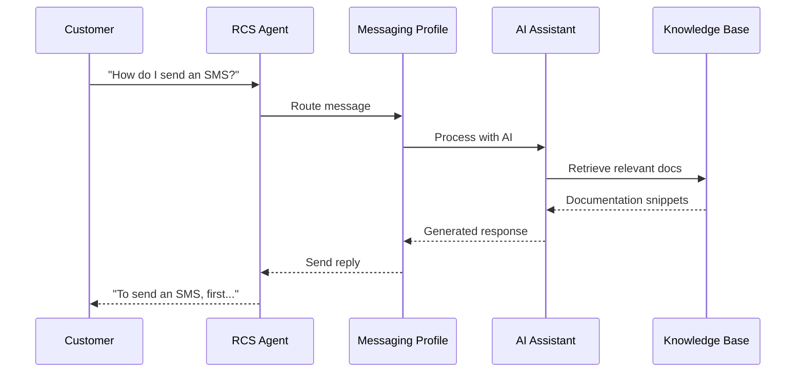

# RCS with AI Assistant

Build an intelligent RCS agent powered by Telnyx AI Assistant—no custom backend required.

Build an AI-powered RCS agent that answers customer questions automatically. By connecting your RCS agent to Telnyx AI Assistant, you get intelligent responses powered by your knowledge base—no custom backend code required.

## Why RCS + AI Assistant?

Combining RCS with AI Assistant solves two problems:

1. **RCS carrier onboarding is complex** — Carriers require functional agents before approval. AI Assistant gives your agent real functionality instantly.

2. **Building conversational AI is hard** — Instead of coding your own NLP/LLM integration, AI Assistant handles it with your knowledge sources.

| Traditional approach         | With Telnyx AI Assistant       |
| ---------------------------- | ------------------------------ |
| Build custom webhook handler | Configure in portal            |
| Integrate LLM (OpenAI, etc.) | Built-in LLM                   |
| Manage conversation state    | Handled automatically          |
| Build knowledge retrieval    | Upload docs or connect sources |
| Weeks of development         | Minutes to configure           |

## How it works



The key integration point is the **Messaging Profile**, which links your RCS Agent to an AI Assistant via the `ai_assistant_id` field.

## Prerequisites

* A [Telnyx account](https://telnyx.com/sign-up)
* An approved RCS Agent (or one in the approval process)
* Content for your AI Assistant (FAQs, docs, or knowledge base)

## 1. Create an AI Assistant

1. **Go to AI Assistants**

    Navigate to [AI Assistants](https://portal.telnyx.com/#/app/ai/assistants) in the portal.

2. **Create a new assistant**

    Click **Create Assistant** and give it a name (e.g., "Support Bot").

3. **Configure the persona**

    Write instructions that define your assistant's behavior:

    ```text theme={null}
    You are a helpful customer support agent for [Your Company].

    Guidelines:
    - Be friendly and professional
    - Keep responses concise (under 160 characters when possible)
    - If you don't know something, offer to connect them with a human
    - Always greet new customers warmly
    ```

4. **Add knowledge sources**

    Upload documents or connect to your knowledge base:

    * **Documents**: Upload PDFs, text files, or markdown
    * **Websites**: Crawl your help center or documentation
    * **Custom**: Connect via API for dynamic content

5. **Save and note the Assistant ID**

    Save your assistant and copy the Assistant ID (e.g., `assistant-11deda65-f3f0-457a-9946-ec021622b061`).

## 2. Create a Messaging Profile with AI

6. **Go to Messaging**

    Navigate to [Messaging](https://portal.telnyx.com/#/app/messaging) in the portal.

7. **Create a new profile**

    Click **Add new profile** and name it (e.g., "RCS AI Profile").

8. **Link the AI Assistant**

    In the profile settings, find **AI Assistant** and select your assistant from the dropdown (or enter the Assistant ID).

9. **Save and note the Profile ID**

    Save the profile and copy the Messaging Profile ID.

## 3. Link your RCS Agent to the AI-enabled profile

Once your RCS Agent is approved by carriers, link it to your AI-enabled messaging profile.

### Option A: Link after approval

    If you already have an approved RCS Agent, update it to use your AI-enabled messaging profile:

      ```bash
      curl -X PATCH https://api.telnyx.com/v2/rcs_agents/YOUR_RCS_AGENT_ID \
        -H "Content-Type: application/json" \
        -H "Authorization: Bearer YOUR_API_KEY" \
        -d '{
          "profile_id": "your_ai_messaging_profile_id"
        }'
      ```

      ```javascript
      import Telnyx from 'telnyx';

      const client = new Telnyx({
        apiKey: process.env['TELNYX_API_KEY'],
      });

      const response = await client.rcsAgents.update('YOUR_RCS_AGENT_ID', {
        profile_id: 'your_ai_messaging_profile_id'
      });

      console.log(response.data);
      ```

      ```python
      import os
      from telnyx import Telnyx

      client = Telnyx(
          api_key=os.environ.get("TELNYX_API_KEY"),
      )

      response = client.rcs_agents.update(
          "YOUR_RCS_AGENT_ID",
          profile_id="your_ai_messaging_profile_id"
      )

      print(response.data)
      ```

### Option B: Request during approval

    When submitting your RCS Agent for carrier approval, request that Telnyx provisions it on your existing AI Assistant messaging profile. [Contact sales](https://telnyx.com/contact-us) with:

    * Your AI Assistant ID
    * Your Messaging Profile ID
    * Your RCS Agent details

    This way, your agent is ready to use AI responses as soon as it's approved.

<Callout type="tip">
  With a functional AI Assistant attached, your RCS agent has real capabilities to demonstrate during carrier review—making approval easier.

## 4. Test your AI-powered RCS agent

Once your RCS Agent is approved (or using test numbers), send a message to trigger the AI:

### Send test message

      ```bash
      curl -X POST https://api.telnyx.com/v2/messages/rcs \
        -H "Content-Type: application/json" \
        -H "Authorization: Bearer YOUR_API_KEY" \
        -d '{
          "agent_id": "your_rcs_agent_id",
          "to": "+15559876543",
          "messaging_profile_id": "your_ai_messaging_profile_id",
          "agent_message": {
            "content_message": {
              "text": "Hello! How can I help you today?"
            }
          }
        }'
      ```

      ```javascript
      import Telnyx from 'telnyx';

      const client = new Telnyx({
        apiKey: process.env['TELNYX_API_KEY'],
      });

      const response = await client.messages.rcs.send({
        agent_id: 'your_rcs_agent_id',
        to: '+15559876543',
        messaging_profile_id: 'your_ai_messaging_profile_id',
        agent_message: {
          content_message: {
            text: 'Hello! How can I help you today?'
          }
        }
      });

      console.log(response.data);
      ```

      ```python
      import os
      from telnyx import Telnyx

      client = Telnyx(
          api_key=os.environ.get("TELNYX_API_KEY"),
      )

      response = client.messages.rcs.send(
          agent_id="your_rcs_agent_id",
          to="+15559876543",
          messaging_profile_id="your_ai_messaging_profile_id",
          agent_message={
              "content_message": {
                  "text": "Hello! How can I help you today?"
              }
          }
      )

      print(response.data)
      ```

### Customer replies

    When the customer replies, the AI Assistant automatically:

    1. Receives the inbound message via the messaging profile
    2. Processes it with your configured LLM and knowledge base
    3. Sends an intelligent response back via RCS

    **No webhook code required**—the AI handles the conversation.

## Best practices

**Keep responses mobile-friendly**

    RCS messages display on mobile devices. Configure your AI to:

    * Keep responses concise (under 160 characters when possible)
    * Use bullet points for lists
    * Avoid long paragraphs

---

**Set a greeting message**

    Configure a greeting in your AI Assistant to welcome new customers:

    ```text theme={null}
    Welcome to [Company] Support! I'm here to help with questions about 
    our products and services. What can I assist you with today?
    ```

---

**Handle escalation gracefully**

    Include instructions for when the AI should hand off to a human:

    ```text theme={null}
    If the customer:
    - Asks to speak to a human
    - Has a billing dispute
    - Is frustrated after 3 exchanges

    Respond: "I'd be happy to connect you with our support team. 
    Please call 1-800-XXX-XXXX or visit support.example.com"
    ```

---

**Test with real questions**

    Before going live, test with questions your customers actually ask:

    * Check your support ticket history
    * Review FAQ page analytics
    * Test edge cases and ambiguous questions

---

## Monitoring and analytics

Track your AI Assistant's performance in the portal:

* **Conversation logs**: Review AI responses and customer satisfaction
* **Knowledge gaps**: Identify questions the AI couldn't answer
* **Response times**: Monitor latency and throughput

Navigate to [AI Assistants > Insights](https://portal.telnyx.com/#/app/ai/assistants) to access analytics.

## Pricing

| Component    | Pricing                                                 |
| ------------ | ------------------------------------------------------- |
| RCS messages | [See RCS pricing](https://telnyx.com/pricing/messaging) |
| AI Assistant | [See AI pricing](https://telnyx.com/pricing/ai)         |

AI Assistant charges are based on tokens processed. Simple Q\&A conversations typically cost fractions of a cent per exchange.

## Try it yourself

Experience RCS + AI Assistant firsthand by chatting with our demo bot.

> **Note:** **Requirements:** US phone number and RCS-enabled device (Android with Google Messages, or iOS 18+)

  - [💬 Chat with Telnyx Support](sms:telnyx_support_v9d1aaax_agent%40rbm.goog?body=Hi%2C%20I%27d%20like%20to%20learn%20about%20Telnyx) — Tap to open a conversation with our AI-powered support agent

  - [📱 Scan QR Code](#) — 
      

**How it works**

  This demo uses an [RCS deeplink](rcs-deeplinks.md) to start the conversation. The deeplink URL is generated by the Telnyx API and uses the standard Google RCS `sms:` scheme with an `@rbm.goog` address:

  ```bash theme={null}
  curl -L 'https://api.telnyx.com/v2/messages/rcs/deeplinks/telnyx_support_v9d1aaax_agent' \
    -H 'Authorization: Bearer '
  ```

  The deeplink opens your messaging app and connects you to our AI-powered support agent, which uses:

  * **Telnyx AI Assistant** for natural language understanding
  * **Knowledge retrieval** from our documentation
  * **RCS rich messaging** for a native chat experience

---

## Next steps

  - [AI Assistant Docs](https://developers.telnyx.com/docs/inference/ai-assistants) — Deep dive into AI Assistant configuration

  - [RCS Getting Started](../tutorial/rcs-getting-started.md) — Learn RCS fundamentals

  - [RCS Rich Cards](send-rcs-messages.md) — Send interactive rich cards

  - [RCS Deeplinks](rcs-deeplinks.md) — Create deeplinks for your own agents
