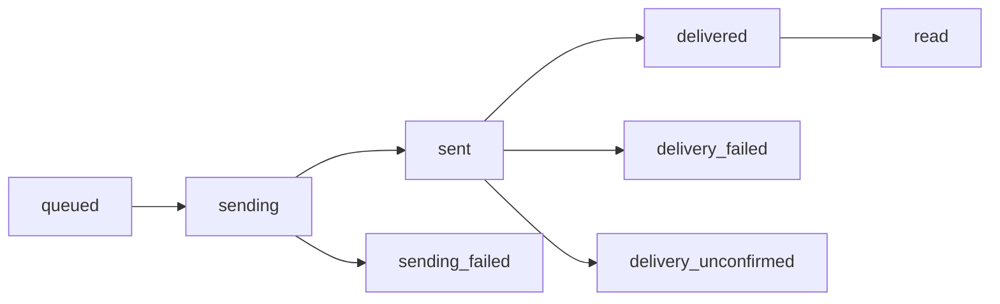

# Receiving RCS Webhooks

Handle RCS webhooks from Telnyx — delivery receipts, inbound messages, read receipts, and suggestion responses. Includes comparison with SMS/MMS webhooks and SDK examples.

Telnyx sends webhooks to notify your application about RCS messaging events — delivery status updates, inbound messages, read receipts, and suggestion responses. This guide covers RCS-specific webhook payloads, how they differ from SMS/MMS, and how to handle them in your application.

## Prerequisites

* A [Telnyx account](https://telnyx.com/sign-up) with an [RCS Agent](../tutorial/rcs-getting-started.md)
* A publicly accessible HTTPS endpoint (or [ngrok](../reference/ngrok.md) for local development)
* Your [API key](https://portal.telnyx.com/#/app/api-keys) and [public key](https://portal.telnyx.com/#/app/api-keys) (for signature verification)

***

## RCS vs SMS/MMS webhooks

RCS webhooks have significant structural differences from SMS/MMS. Understanding these is critical when building a multi-channel messaging application.

| Feature                  | SMS/MMS                            | RCS                                                                                                                                                     |
| ------------------------ | ---------------------------------- | ------------------------------------------------------------------------------------------------------------------------------------------------------- |
| **Message body**         | `payload.text` (string)            | `payload.body.text` (nested object)                                                                                                                     |
| **Media format**         | `payload.media[]` with Telnyx URLs | `payload.body.user_file` with GCS URLs                                                                                                                  |
| **Sender identifier**    | `from.phone_number`                | `from.phone_number` (inbound) or `from.agent_id` + `from.agent_name` (outbound)                                                                         |
| **Recipient identifier** | `to[].phone_number`                | `to[].phone_number` (outbound) or `to[].agent_id` + `to[].agent_name` (inbound)                                                                         |
| **Read receipts**        | Not supported                      | ✅ `message.read` event                                                                                                                                  |
| **Suggestion responses** | Not applicable                     | ✅ `body.suggestion_response`                                                                                                                            |
| **Location sharing**     | Not supported                      | ✅ `body.location`                                                                                                                                       |
| **JSON schema**          | Telnyx messaging schema            | Snake-case schema based on [Google RCS API](https://developers.google.com/business-communications/rcs-business-messaging/guides/build/messages/receive) |
| **Webhook URL source**   | Messaging profile or per-request   | RCS Agent config (inbound) + messaging profile (outbound status)                                                                                        |

> **Note:** For SMS/MMS webhook handling, see [Receiving Webhooks for Messaging](receiving-webhooks-for-messaging.md).

***

## Webhook URL configuration

RCS webhook routing differs from SMS/MMS:

| Event Type                                                                | Webhook Source                                 |
| ------------------------------------------------------------------------- | ---------------------------------------------- |
| **Inbound messages** (`message.received`)                                 | Configured on the **RCS Agent**                |
| **Outbound status** (`message.sent`, `message.finalized`, `message.read`) | Per-request URL → messaging profile URL → none |

### URL priority for outbound status

1. **Per-request URLs**

    If `webhook_url` and `webhook_failover_url` are provided in the send request body, those are used.

2. **Messaging profile URLs**

    If the messaging profile has webhook URLs configured, those are used.

3. **No webhook**

    If neither is configured, no webhook is delivered. Events are still logged in [Message Detail Records](message-detail-records.md).

***

## Webhook event types

| Event               | Description                                | Direction |
| ------------------- | ------------------------------------------ | --------- |
| `message.sent`      | Message sent to the upstream RCS provider  | Outbound  |
| `message.finalized` | Delivery confirmed or failed by carrier    | Outbound  |
| `message.read`      | Recipient read the message on their device | Outbound  |
| `message.received`  | Inbound message received by your RCS Agent | Inbound   |

***

## Delivery status webhooks

When you send an RCS message, Telnyx notifies you as the message progresses through each status.

### Delivery status flow



### Status reference

| Status                 | Description                                |
| ---------------------- | ------------------------------------------ |
| `queued`               | Message queued on Telnyx's side            |
| `sending`              | Being sent to the upstream RCS provider    |
| `sent`                 | Sent to the upstream provider              |
| `delivered`            | Carrier confirmed delivery to the device   |
| `read`                 | Message read on the recipient's device     |
| `sending_failed`       | Failed to send to the upstream provider    |
| `delivery_failed`      | Carrier could not deliver to the recipient |
| `delivery_unconfirmed` | No delivery confirmation received          |

### Example: Delivery receipt payload

```json theme={null}
{
  "data": {
    "event_type": "message.finalized",
    "id": "4ee8c3a6-4995-4309-a3c6-38e3db9ea4be",
    "occurred_at": "2024-12-09T21:32:14.148+00:00",
    "payload": {
      "body": {
        "text": "Hello there!"
      },
      "completed_at": "2024-12-09T21:32:14.148+00:00",
      "cost": null,
      "direction": "outbound",
      "errors": [],
      "from": {
        "agent_id": "e4448a5c0670c2a9",
        "agent_name": "My RCS Agent"
      },
      "id": "ac012cbf-5e09-46af-a69a-7c0e2d90993c",
      "messaging_profile_id": "83d2343b-553f-4c5f-b8c8-fd27004f94bf",
      "organization_id": "9d76d591-1b7d-405d-8c64-1320ee070245",
      "received_at": "2024-12-09T21:32:13.552+00:00",
      "record_type": "message",
      "sent_at": "2024-12-09T21:32:13.596+00:00",
      "tags": [],
      "to": [
        {
          "carrier": "T-MOBILE USA, INC.",
          "line_type": "Wireless",
          "phone_number": "+13125000000",
          "status": "delivered"
        }
      ],
      "type": "RCS",
      "valid_until": "2024-12-09T22:32:13.552+00:00",
      "webhook_failover_url": "",
      "webhook_url": "http://webhook.site/af3a92e7-e150-442c-9fe6-61658ce26b1a"
    },
    "record_type": "event"
  },
  "meta": {
    "attempt": 1,
    "delivered_to": "http://webhook.site/af3a92e7-e150-442c-9fe6-61658ce26b1a"
  }
}
```

***

## Read receipts

RCS uniquely supports **read receipts** — a `message.read` event is sent when the recipient opens and views your message. This is not available with SMS/MMS.

### Example: Read receipt payload

```json theme={null}
{
  "data": {
    "event_type": "message.read",
    "id": "7bc4d2e1-3f89-4a12-b5c7-9e8d1a2f3b4c",
    "occurred_at": "2024-12-09T21:35:22.000+00:00",
    "payload": {
      "body": {
        "text": "Hello there!"
      },
      "direction": "outbound",
      "from": {
        "agent_id": "e4448a5c0670c2a9",
        "agent_name": "My RCS Agent"
      },
      "id": "ac012cbf-5e09-46af-a69a-7c0e2d90993c",
      "messaging_profile_id": "83d2343b-553f-4c5f-b8c8-fd27004f94bf",
      "to": [
        {
          "phone_number": "+13125000000",
          "status": "read"
        }
      ],
      "type": "RCS"
    },
    "record_type": "event"
  }
}
```

### Handling read receipts

Use read receipts to:

* **Track engagement** — Know which messages were actually read vs. just delivered
* **Trigger follow-ups** — Send a follow-up if a message was delivered but not read after a threshold
* **Analytics** — Calculate read rates for different message types or campaigns
* **UI updates** — Show "read" indicators in your chat interface (like blue checkmarks)

> **Warning:** Not all devices or carriers support read receipts. A missing `message.read` event doesn't necessarily mean the message wasn't read — the user may have disabled read receipts on their device.

***

## Inbound message webhooks

When someone sends an RCS message to your agent, Telnyx delivers a `message.received` webhook to the URL configured on your RCS Agent.

### Inbound message types

RCS supports richer inbound message types than SMS/MMS:

### Text

    ```json theme={null}
    {
      "data": {
        "event_type": "message.received",
        "id": "b301ed3f-1490-491f-995f-6e64e69674d4",
        "occurred_at": "2024-12-09T20:16:07.588+00:00",
        "payload": {
          "body": {
            "text": "Hello from Telnyx!"
          },
          "direction": "inbound",
          "from": {
            "carrier": "T-Mobile USA",
            "line_type": "long_code",
            "phone_number": "+13125000000",
            "status": "webhook_delivered"
          },
          "id": "84cca175-9755-4859-b67f-4730d7f58aa3",
          "messaging_profile_id": "740572b6-099c-44a1-89b9-6c92163bc68d",
          "to": [
            {
              "agent_id": "e4448a5c0670c2a9",
              "agent_name": "My RCS Agent"
            }
          ],
          "type": "RCS"
        },
        "record_type": "event"
      }
    }
    ```

### File/Image

    ```json theme={null}
    {
      "data": {
        "event_type": "message.received",
        "payload": {
          "body": {
            "user_file": {
              "payload": {
                "file_name": "photo.jpg",
                "file_size_bytes": 179099,
                "file_uri": "https://rcs-inbound.us-central-1.telnyxcloudstorage.com/rcs/.../photo.jpg",
                "mime_type": "image/jpeg"
              },
              "thumbnail": {
                "file_name": "photo_thumb.jpg",
                "file_size_bytes": 12074,
                "file_uri": "https://rcs-inbound.us-central-1.telnyxcloudstorage.com/rcs/.../photo_thumb.jpg",
                "mime_type": "image/jpeg"
              }
            }
          },
          "direction": "inbound",
          "type": "RCS"
        }
      }
    }
    ```

    > **Note:** Unlike MMS where media URLs are in `payload.media[]`, RCS file attachments are nested under `payload.body.user_file` with both a full-resolution `payload` and a `thumbnail`.

### Location

    ```json theme={null}
    {
      "data": {
        "event_type": "message.received",
        "payload": {
          "body": {
            "location": {
              "latitude": 38.24961321640261,
              "longitude": -85.78378468751907
            }
          },
          "direction": "inbound",
          "type": "RCS"
        }
      }
    }
    ```

### Suggestion Response

    When a user taps a [suggested action or reply](rcs-capabilities-deeplinks.md) that you included in a previous message:

    ```json theme={null}
    {
      "data": {
        "event_type": "message.received",
        "payload": {
          "body": {
            "suggestion_response": {
              "postback_data": "action_visit_store",
              "text": "Explore the online store"
            }
          },
          "direction": "inbound",
          "type": "RCS"
        }
      }
    }
    ```

    Use `postback_data` for programmatic routing and `text` for the user-visible label.

***

## SDK webhook handling examples

Handle RCS webhooks in your application with proper event routing, signature verification, and message type detection.

  ```python
  from flask import Flask, request, jsonify

  app = Flask(__name__)

  @app.route("/webhooks/rcs", methods=["POST"])
  def handle_rcs_webhook():
      event = request.json
      event_type = event["data"]["event_type"]
      payload = event["data"]["payload"]

      if event_type == "message.received":
          handle_inbound(payload)
      elif event_type == "message.sent":
          print(f"Message {payload['id']} sent")
      elif event_type == "message.finalized":
          handle_delivery(payload)
      elif event_type == "message.read":
          handle_read_receipt(payload)

      return jsonify({"status": "ok"}), 200

  def handle_inbound(payload):
      body = payload["body"]
      sender = payload["from"]["phone_number"]

      if "text" in body:
          print(f"Text from {sender}: {body['text']}")
      elif "user_file" in body:
          file_info = body["user_file"]["payload"]
          print(f"File from {sender}: {file_info['file_name']} ({file_info['mime_type']})")
      elif "location" in body:
          loc = body["location"]
          print(f"Location from {sender}: {loc['latitude']}, {loc['longitude']}")
      elif "suggestion_response" in body:
          resp = body["suggestion_response"]
          print(f"Suggestion from {sender}: {resp['text']} (postback: {resp['postback_data']})")

  def handle_delivery(payload):
      message_id = payload["id"]
      for recipient in payload.get("to", []):
          status = recipient.get("status")
          phone = recipient.get("phone_number")
          print(f"Message {message_id} to {phone}: {status}")

          if status == "delivery_failed":
              # Implement fallback — e.g., send via SMS
              print(f"Delivery failed for {phone}, triggering SMS fallback")

  def handle_read_receipt(payload):
      message_id = payload["id"]
      for recipient in payload.get("to", []):
          phone = recipient.get("phone_number")
          print(f"Message {message_id} read by {phone}")
          # Update message status in your database
          # db.messages.update(message_id, read=True, read_at=datetime.utcnow())

  if __name__ == "__main__":
      app.run(port=5000)
  ```

  ```javascript
  const express = require('express');
  const app = express();
  app.use(express.json());

  app.post('/webhooks/rcs', (req, res) => {
    const event = req.body;
    const eventType = event.data.event_type;
    const payload = event.data.payload;

    switch (eventType) {
      case 'message.received':
        handleInbound(payload);
        break;
      case 'message.sent':
        console.log(`Message ${payload.id} sent`);
        break;
      case 'message.finalized':
        handleDelivery(payload);
        break;
      case 'message.read':
        handleReadReceipt(payload);
        break;
    }

    res.status(200).json({ status: 'ok' });
  });

  function handleInbound(payload) {
    const body = payload.body;
    const sender = payload.from.phone_number;

    if (body.text) {
      console.log(`Text from ${sender}: ${body.text}`);
    } else if (body.user_file) {
      const file = body.user_file.payload;
      console.log(`File from ${sender}: ${file.file_name} (${file.mime_type})`);
    } else if (body.location) {
      console.log(`Location from ${sender}: ${body.location.latitude}, ${body.location.longitude}`);
    } else if (body.suggestion_response) {
      const resp = body.suggestion_response;
      console.log(`Suggestion from ${sender}: ${resp.text} (postback: ${resp.postback_data})`);
    }
  }

  function handleDelivery(payload) {
    const messageId = payload.id;
    for (const recipient of payload.to || []) {
      console.log(`Message ${messageId} to ${recipient.phone_number}: ${recipient.status}`);

      if (recipient.status === 'delivery_failed') {
        console.log(`Delivery failed for ${recipient.phone_number}, triggering SMS fallback`);
      }
    }
  }

  function handleReadReceipt(payload) {
    const messageId = payload.id;
    for (const recipient of payload.to || []) {
      console.log(`Message ${messageId} read by ${recipient.phone_number}`);
      // Update message status in your database
    }
  }

  app.listen(5000, () => console.log('RCS webhook server running on port 5000'));
  ```

  ```ruby
  require "sinatra"
  require "json"

  set :port, 5000

  post "/webhooks/rcs" do
    event = JSON.parse(request.body.read)
    event_type = event.dig("data", "event_type")
    payload = event.dig("data", "payload")

    case event_type
    when "message.received"
      handle_inbound(payload)
    when "message.sent"
      puts "Message #{payload['id']} sent"
    when "message.finalized"
      handle_delivery(payload)
    when "message.read"
      handle_read_receipt(payload)
    end

    { status: "ok" }.to_json
  end

  def handle_inbound(payload)
    body = payload["body"]
    sender = payload.dig("from", "phone_number")

    if body["text"]
      puts "Text from #{sender}: #{body['text']}"
    elsif body["user_file"]
      file = body.dig("user_file", "payload")
      puts "File from #{sender}: #{file['file_name']} (#{file['mime_type']})"
    elsif body["location"]
      loc = body["location"]
      puts "Location from #{sender}: #{loc['latitude']}, #{loc['longitude']}"
    elsif body["suggestion_response"]
      resp = body["suggestion_response"]
      puts "Suggestion from #{sender}: #{resp['text']} (postback: #{resp['postback_data']})"
    end
  end

  def handle_delivery(payload)
    payload.fetch("to", []).each do |recipient|
      puts "Message #{payload['id']} to #{recipient['phone_number']}: #{recipient['status']}"
    end
  end

  def handle_read_receipt(payload)
    payload.fetch("to", []).each do |recipient|
      puts "Message #{payload['id']} read by #{recipient['phone_number']}"
    end
  end
  ```

  ```java
  import com.sun.net.httpserver.*;
  import java.io.*;
  import java.net.InetSocketAddress;
  import org.json.*;

  public class RcsWebhookServer {
      public static void main(String[] args) throws Exception {
          HttpServer server = HttpServer.create(new InetSocketAddress(5000), 0);
          server.createContext("/webhooks/rcs", exchange -> {
              if (!"POST".equals(exchange.getRequestMethod())) {
                  exchange.sendResponseHeaders(405, -1);
                  return;
              }

              String body = new String(exchange.getRequestBody().readAllBytes());
              JSONObject event = new JSONObject(body);
              String eventType = event.getJSONObject("data").getString("event_type");
              JSONObject payload = event.getJSONObject("data").getJSONObject("payload");

              switch (eventType) {
                  case "message.received" -> handleInbound(payload);
                  case "message.finalized" -> handleDelivery(payload);
                  case "message.read" -> handleReadReceipt(payload);
                  default -> System.out.println("Event: " + eventType);
              }

              String response = "{\"status\":\"ok\"}";
              exchange.sendResponseHeaders(200, response.length());
              exchange.getResponseBody().write(response.getBytes());
              exchange.close();
          });
          server.start();
          System.out.println("RCS webhook server running on port 5000");
      }

      static void handleInbound(JSONObject payload) {
          JSONObject body = payload.getJSONObject("body");
          String sender = payload.getJSONObject("from").getString("phone_number");

          if (body.has("text")) {
              System.out.printf("Text from %s: %s%n", sender, body.getString("text"));
          } else if (body.has("suggestion_response")) {
              JSONObject resp = body.getJSONObject("suggestion_response");
              System.out.printf("Suggestion from %s: %s%n", sender, resp.getString("text"));
          }
      }

      static void handleDelivery(JSONObject payload) {
          String msgId = payload.getString("id");
          JSONArray to = payload.getJSONArray("to");
          for (int i = 0; i < to.length(); i++) {
              JSONObject r = to.getJSONObject(i);
              System.out.printf("Message %s to %s: %s%n",
                  msgId, r.getString("phone_number"), r.getString("status"));
          }
      }

      static void handleReadReceipt(JSONObject payload) {
          String msgId = payload.getString("id");
          JSONArray to = payload.getJSONArray("to");
          for (int i = 0; i < to.length(); i++) {
              System.out.printf("Message %s read by %s%n",
                  msgId, to.getJSONObject(i).getString("phone_number"));
          }
      }
  }
  ```

  ```csharp .NET theme={null}
  using Microsoft.AspNetCore.Builder;
  using Microsoft.AspNetCore.Http;
  using System.Text.Json;

  var builder = WebApplication.CreateBuilder(args);
  var app = builder.Build();

  app.MapPost("/webhooks/rcs", async (HttpContext context) =>
  {
      var body = await new StreamReader(context.Request.Body).ReadToEndAsync();
      var doc = JsonDocument.Parse(body);
      var data = doc.RootElement.GetProperty("data");
      var eventType = data.GetProperty("event_type").GetString();
      var payload = data.GetProperty("payload");

      switch (eventType)
      {
          case "message.received":
              HandleInbound(payload);
              break;
          case "message.finalized":
              HandleDelivery(payload);
              break;
          case "message.read":
              HandleReadReceipt(payload);
              break;
      }

      return Results.Json(new { status = "ok" });
  });

  void HandleInbound(JsonElement payload)
  {
      var body = payload.GetProperty("body");
      var sender = payload.GetProperty("from").GetProperty("phone_number").GetString();

      if (body.TryGetProperty("text", out var text))
          Console.WriteLine($"Text from {sender}: {text}");
      else if (body.TryGetProperty("suggestion_response", out var suggestion))
          Console.WriteLine($"Suggestion from {sender}: {suggestion.GetProperty("text")}");
      else if (body.TryGetProperty("location", out var location))
          Console.WriteLine($"Location from {sender}: {location.GetProperty("latitude")}, {location.GetProperty("longitude")}");
  }

  void HandleDelivery(JsonElement payload)
  {
      var msgId = payload.GetProperty("id").GetString();
      foreach (var r in payload.GetProperty("to").EnumerateArray())
          Console.WriteLine($"Message {msgId} to {r.GetProperty("phone_number")}: {r.GetProperty("status")}");
  }

  void HandleReadReceipt(JsonElement payload)
  {
      var msgId = payload.GetProperty("id").GetString();
      foreach (var r in payload.GetProperty("to").EnumerateArray())
          Console.WriteLine($"Message {msgId} read by {r.GetProperty("phone_number")}");
  }

  app.Run("http://0.0.0.0:5000");
  ```

  ```php
  <?php
  $payload = file_get_contents('php://input');
  $event = json_decode($payload, true);

  $eventType = $event['data']['event_type'];
  $data = $event['data']['payload'];

  switch ($eventType) {
      case 'message.received':
          handleInbound($data);
          break;
      case 'message.finalized':
          handleDelivery($data);
          break;
      case 'message.read':
          handleReadReceipt($data);
          break;
  }

  http_response_code(200);
  echo json_encode(['status' => 'ok']);

  function handleInbound(array $payload): void
  {
      $body = $payload['body'];
      $sender = $payload['from']['phone_number'];

      if (isset($body['text'])) {
          echo "Text from {$sender}: {$body['text']}\n";
      } elseif (isset($body['user_file'])) {
          $file = $body['user_file']['payload'];
          echo "File from {$sender}: {$file['file_name']} ({$file['mime_type']})\n";
      } elseif (isset($body['location'])) {
          $loc = $body['location'];
          echo "Location from {$sender}: {$loc['latitude']}, {$loc['longitude']}\n";
      } elseif (isset($body['suggestion_response'])) {
          $resp = $body['suggestion_response'];
          echo "Suggestion from {$sender}: {$resp['text']} (postback: {$resp['postback_data']})\n";
      }
  }

  function handleDelivery(array $payload): void
  {
      foreach ($payload['to'] ?? [] as $recipient) {
          echo "Message {$payload['id']} to {$recipient['phone_number']}: {$recipient['status']}\n";
      }
  }

  function handleReadReceipt(array $payload): void
  {
      foreach ($payload['to'] ?? [] as $recipient) {
          echo "Message {$payload['id']} read by {$recipient['phone_number']}\n";
      }
  }
  ```

  ```go
  package main

  import (
  	"encoding/json"
  	"fmt"
  	"io"
  	"net/http"
  )

  type WebhookEvent struct {
  	Data struct {
  		EventType string `json:"event_type"`
  		Payload   struct {
  			ID   string `json:"id"`
  			Body struct {
  				Text               string                 `json:"text,omitempty"`
  				Location           map[string]float64     `json:"location,omitempty"`
  				SuggestionResponse map[string]string      `json:"suggestion_response,omitempty"`
  				UserFile           map[string]interface{} `json:"user_file,omitempty"`
  			} `json:"body"`
  			From struct {
  				PhoneNumber string `json:"phone_number"`
  				AgentID     string `json:"agent_id"`
  			} `json:"from"`
  			To []struct {
  				PhoneNumber string `json:"phone_number"`
  				Status      string `json:"status"`
  			} `json:"to"`
  		} `json:"payload"`
  	} `json:"data"`
  }

  func main() {
  	http.HandleFunc("/webhooks/rcs", func(w http.ResponseWriter, r *http.Request) {
  		body, _ := io.ReadAll(r.Body)
  		var event WebhookEvent
  		json.Unmarshal(body, &event)

  		switch event.Data.EventType {
  		case "message.received":
  			handleInbound(event)
  		case "message.finalized":
  			handleDelivery(event)
  		case "message.read":
  			handleReadReceipt(event)
  		}

  		w.Header().Set("Content-Type", "application/json")
  		w.WriteHeader(200)
  		fmt.Fprint(w, `{"status":"ok"}`)
  	})

  	fmt.Println("RCS webhook server running on port 5000")
  	http.ListenAndServe(":5000", nil)
  }

  func handleInbound(event WebhookEvent) {
  	p := event.Data.Payload
  	sender := p.From.PhoneNumber

  	if p.Body.Text != "" {
  		fmt.Printf("Text from %s: %s\n", sender, p.Body.Text)
  	} else if p.Body.SuggestionResponse != nil {
  		fmt.Printf("Suggestion from %s: %s (postback: %s)\n",
  			sender, p.Body.SuggestionResponse["text"], p.Body.SuggestionResponse["postback_data"])
  	} else if p.Body.Location != nil {
  		fmt.Printf("Location from %s: %f, %f\n",
  			sender, p.Body.Location["latitude"], p.Body.Location["longitude"])
  	}
  }

  func handleDelivery(event WebhookEvent) {
  	for _, r := range event.Data.Payload.To {
  		fmt.Printf("Message %s to %s: %s\n", event.Data.Payload.ID, r.PhoneNumber, r.Status)
  	}
  }

  func handleReadReceipt(event WebhookEvent) {
  	for _, r := range event.Data.Payload.To {
  		fmt.Printf("Message %s read by %s\n", event.Data.Payload.ID, r.PhoneNumber)
  	}
  }
  ```

***

## Building a unified SMS + RCS webhook handler

If your application handles both SMS/MMS and RCS, you need to normalize the different payload structures:

  ```python
  def normalize_message(event):
      """Normalize SMS/MMS and RCS webhook payloads into a common format."""
      payload = event["data"]["payload"]
      msg_type = payload.get("type", "SMS")

      if msg_type == "RCS":
          # RCS: body is nested object
          body = payload.get("body", {})
          text = body.get("text", "")
          media = []
          if "user_file" in body:
              file_info = body["user_file"]["payload"]
              media.append({
                  "url": file_info["file_uri"],
                  "content_type": file_info["mime_type"],
                  "size": file_info.get("file_size_bytes"),
              })
          sender = payload.get("from", {}).get("phone_number", "")
      else:
          # SMS/MMS: body is flat
          text = payload.get("text", "")
          media = [
              {"url": m["url"], "content_type": m["content_type"]}
              for m in payload.get("media", [])
          ]
          sender = payload.get("from", {}).get("phone_number", "")

      return {
          "id": payload["id"],
          "type": msg_type,
          "sender": sender,
          "text": text,
          "media": media,
          "direction": payload.get("direction"),
      }
  ```

  ```javascript
  function normalizeMessage(event) {
    const payload = event.data.payload;
    const msgType = payload.type || 'SMS';

    if (msgType === 'RCS') {
      const body = payload.body || {};
      const media = [];
      if (body.user_file) {
        const file = body.user_file.payload;
        media.push({
          url: file.file_uri,
          contentType: file.mime_type,
          size: file.file_size_bytes,
        });
      }
      return {
        id: payload.id,
        type: msgType,
        sender: payload.from?.phone_number || '',
        text: body.text || '',
        media,
        direction: payload.direction,
      };
    }

    // SMS/MMS
    return {
      id: payload.id,
      type: msgType,
      sender: payload.from?.phone_number || '',
      text: payload.text || '',
      media: (payload.media || []).map(m => ({
        url: m.url,
        contentType: m.content_type,
      })),
      direction: payload.direction,
    };
  }
  ```

***

## Webhook IP allowlist

If your server uses a firewall or ACL, allowlist the Telnyx webhook source subnet:

| CIDR                | Description                 |
| ------------------- | --------------------------- |
| `192.76.120.192/27` | Telnyx webhook delivery IPs |

***

## Best practices

**Respond quickly — return 2xx within 2 seconds**

    Process webhooks asynchronously. Acknowledge receipt immediately and handle the event in a background job. If your server doesn't respond within 2 seconds, Telnyx retries the webhook.

---

**Handle retries idempotently**

    The same webhook may be delivered multiple times (up to 3 attempts). Use the `event.data.id` as a deduplication key to avoid processing the same event twice.

---

**Verify webhook signatures**

    Validate the `telnyx-signature-ed25519` and `telnyx-timestamp` headers using your account's public key. See [webhook security](receiving-webhooks-for-messaging.md#webhook-signature-verification) for implementation details.

---

**Implement SMS fallback for delivery failures**

    When an RCS message fails (`delivery_failed` status), automatically fall back to SMS to ensure message delivery. Check the `to[].status` field in `message.finalized` events.

---

**Use read receipts strategically**

    Read receipts provide valuable engagement data but aren't guaranteed. Don't make critical business logic dependent on receiving a `message.read` event — some users disable read receipts.

---

***

## Next steps

  - [Send RCS Messages](send-rcs-messages.md) — Send rich cards, carousels, and suggested actions via RCS.

  - [RCS Capabilities](rcs-capabilities-deeplinks.md) — Check device support and RCS feature availability.

  - [SMS/MMS Webhooks](receiving-webhooks-for-messaging.md) — Compare with the SMS/MMS webhook handling guide.

  - [RCS Getting Started](../tutorial/rcs-getting-started.md) — Set up your RCS Agent and start messaging.


## Related Pages

- [Receiving Webhooks for Messaging](../runbooks/receiving-webhooks-for-messaging.md)
- [Receiving Webhooks for Telnyx Verify](../runbooks/receiving-webhooks-for-telnyx-verify.md)
- [Voice API Webhooks](../runbooks/voice-api-webhooks.md)
