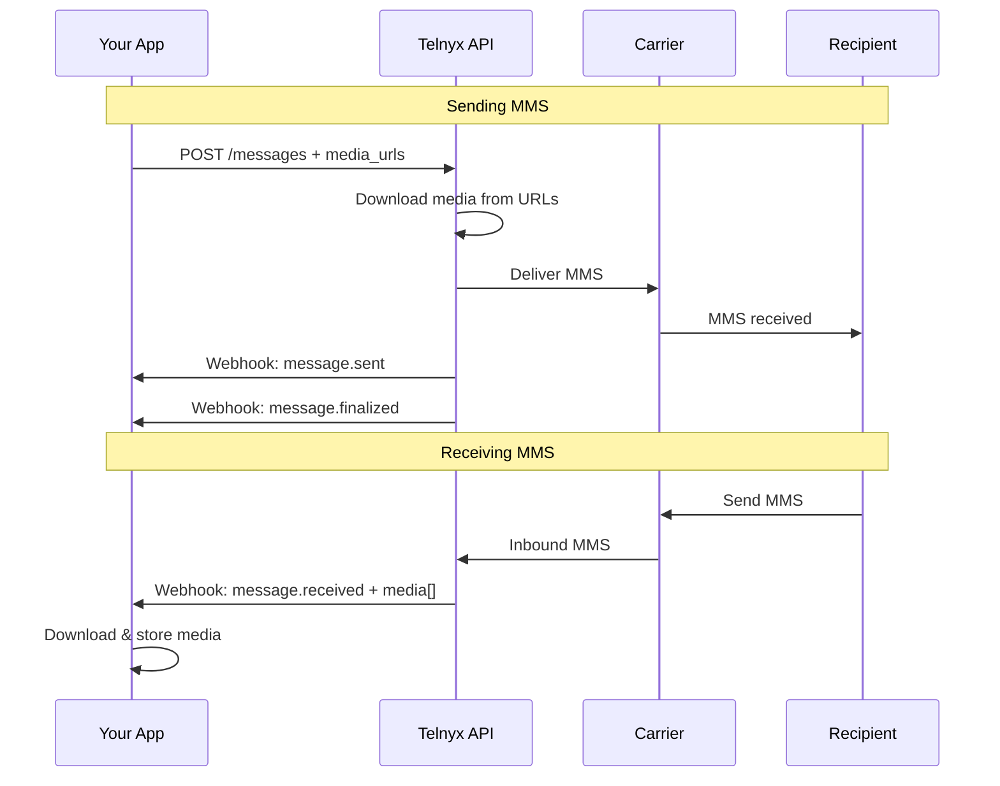

# Send & Receive MMS

Send MMS messages with media attachments and handle inbound MMS webhooks with code examples in 7 languages.

Send multimedia messages (images, video, audio, vCards) via the Telnyx API and process inbound MMS attachments from webhooks.



## Prerequisites

* A [Telnyx account](https://telnyx.com/sign-up) with [API key](https://portal.telnyx.com/#/app/api-keys)
* A [messaging profile](https://portal.telnyx.com/#/app/messaging) with a phone number enabled for MMS
* A webhook endpoint to receive inbound messages (see [ngrok setup](../reference/ngrok.md))

> **Note:** MMS is supported on US/Canada long codes, toll-free, and short codes. For media format details and carrier limits, see [MMS Media & Transcoding](mms-media-transcoding.md).

***

## Send an MMS

Include `media_urls` in your message request. You can send up to 10 media files per message.

  ```python
  import telnyx

  telnyx.api_key = "YOUR_API_KEY"

  message = telnyx.Message.create(
      from_="+18005550100",
      to="+18005550101",
      text="Here's the photo you requested!",
      media_urls=["https://example.com/image.jpg"],
      messaging_profile_id="YOUR_MESSAGING_PROFILE_ID"
  )

  print(f"Message ID: {message.id}")
  print(f"Status: {message.to[0]['status']}")
  ```

  ```javascript
  const telnyx = require("telnyx")("YOUR_API_KEY");

  const message = await telnyx.messages.create({
    from: "+18005550100",
    to: "+18005550101",
    text: "Here's the photo you requested!",
    media_urls: ["https://example.com/image.jpg"],
    messaging_profile_id: "YOUR_MESSAGING_PROFILE_ID",
  });

  console.log(`Message ID: ${message.data.id}`);
  console.log(`Status: ${message.data.to[0].status}`);
  ```

  ```ruby
  require "telnyx"

  Telnyx.api_key = "YOUR_API_KEY"

  message = Telnyx::Message.create(
    from: "+18005550100",
    to: "+18005550101",
    text: "Here's the photo you requested!",
    media_urls: ["https://example.com/image.jpg"],
    messaging_profile_id: "YOUR_MESSAGING_PROFILE_ID"
  )

  puts "Message ID: #{message.id}"
  puts "Status: #{message.to[0]['status']}"
  ```

  ```java
  import com.telnyx.sdk.*;
  import com.telnyx.sdk.api.MessagesApi;
  import com.telnyx.sdk.model.*;
  import java.util.Arrays;

  ApiClient client = Configuration.getDefaultApiClient();
  client.setBearerToken("YOUR_API_KEY");

  MessagesApi api = new MessagesApi(client);
  CreateMessageRequest req = new CreateMessageRequest()
      .from("+18005550100")
      .to("+18005550101")
      .text("Here's the photo you requested!")
      .mediaUrls(Arrays.asList("https://example.com/image.jpg"))
      .messagingProfileId("YOUR_MESSAGING_PROFILE_ID");

  MessageResponse resp = api.createMessage(req);
  System.out.println("Message ID: " + resp.getData().getId());
  ```

  ```csharp .NET theme={null}
  using Telnyx;

  TelnyxConfiguration.SetApiKey("YOUR_API_KEY");

  var service = new MessagingSenderIdService();
  var options = new NewMessage
  {
      From = "+18005550100",
      To = "+18005550101",
      Text = "Here's the photo you requested!",
      MediaUrls = new List<string> { "https://example.com/image.jpg" },
      MessagingProfileId = "YOUR_MESSAGING_PROFILE_ID"
  };

  var message = service.Create(options);
  Console.WriteLine($"Message ID: {message.Id}");
  ```

  ```php
  $telnyx = new \Telnyx\Telnyx("YOUR_API_KEY");

  $message = \Telnyx\Message::create([
      "from" => "+18005550100",
      "to" => "+18005550101",
      "text" => "Here's the photo you requested!",
      "media_urls" => ["https://example.com/image.jpg"],
      "messaging_profile_id" => "YOUR_MESSAGING_PROFILE_ID"
  ]);

  echo "Message ID: " . $message->id . "\n";
  ```

  ```go
  package main

  import (
      "context"
      "fmt"
      telnyx "github.com/telnyx/telnyx-go"
  )

  func main() {
      client := telnyx.NewClient("YOUR_API_KEY")

      message, err := client.Messages.Create(context.Background(), &telnyx.MessageParams{
          From:                "+18005550100",
          To:                  "+18005550101",
          Text:                "Here's the photo you requested!",
          MediaURLs:           []string{"https://example.com/image.jpg"},
          MessagingProfileID:  "YOUR_MESSAGING_PROFILE_ID",
      })
      if err != nil {
          panic(err)
      }
      fmt.Printf("Message ID: %s\n", message.ID)
  }
  ```

  ```bash
  curl -X POST https://api.telnyx.com/v2/messages \
    -H "Authorization: Bearer $TELNYX_API_KEY" \
    -H "Content-Type: application/json" \
    -d '{
      "from": "+18005550100",
      "to": "+18005550101",
      "text": "Here'\''s the photo you requested!",
      "media_urls": ["https://example.com/image.jpg"],
      "messaging_profile_id": "YOUR_MESSAGING_PROFILE_ID"
    }'
  ```

### Send multiple media files

Include multiple URLs in `media_urls`. Total payload must stay under carrier limits.

```bash
curl -X POST https://api.telnyx.com/v2/messages \
  -H "Authorization: Bearer $TELNYX_API_KEY" \
  -H "Content-Type: application/json" \
  -d '{
    "from": "+18005550100",
    "to": "+18005550101",
    "text": "Product photos attached",
    "media_urls": [
      "https://example.com/photo1.jpg",
      "https://example.com/photo2.jpg",
      "https://example.com/photo3.jpg"
    ],
    "messaging_profile_id": "YOUR_MESSAGING_PROFILE_ID"
  }'
```

> **Warning:** Media URLs must be publicly accessible. Telnyx downloads the media at send time — if the URL requires authentication or returns an error, the message will fail.

***

## Receive an MMS

Inbound MMS messages arrive as webhooks to your messaging profile's webhook URL. The `media` array contains attachment details.

### Webhook payload

```json theme={null}
{
  "data": {
    "event_type": "message.received",
    "payload": {
      "from": { "phone_number": "+18005550101" },
      "to": [{ "phone_number": "+18005550100" }],
      "text": "Check out this photo!",
      "media": [
        {
          "url": "https://media.telnyx.com/abc123/image.jpg",
          "content_type": "image/jpeg",
          "size": 245760
        }
      ]
    }
  }
}
```

> **Warning:** **Media URLs are ephemeral.** Telnyx-hosted media links expire. Download and store attachments in your own storage immediately upon receipt.

### Process inbound MMS

  ```python
  from flask import Flask, request, jsonify
  import requests
  import os

  app = Flask(__name__)

  TELNYX_API_KEY = os.getenv("TELNYX_API_KEY")
  MEDIA_DIR = "./received_media"
  os.makedirs(MEDIA_DIR, exist_ok=True)

  @app.route("/webhooks", methods=["POST"])
  def webhooks():
      body = request.json
      event_type = body["data"]["event_type"]

      if event_type != "message.received":
          return jsonify({"status": "ignored"}), 200

      payload = body["data"]["payload"]
      from_number = payload["from"]["phone_number"]
      text = payload.get("text", "")
      media = payload.get("media", [])

      print(f"From: {from_number} | Text: {text} | Attachments: {len(media)}")

      # Download each attachment
      saved_files = []
      for item in media:
          resp = requests.get(item["url"])
          ext = item["content_type"].split("/")[-1]
          filename = f"{MEDIA_DIR}/{from_number}_{len(saved_files)}.{ext}"
          with open(filename, "wb") as f:
              f.write(resp.content)
          saved_files.append(filename)
          print(f"  Saved: {filename} ({item['size']} bytes)")

      return jsonify({"status": "ok", "files": len(saved_files)}), 200

  if __name__ == "__main__":
      app.run(port=8000)
  ```

  ```javascript
  const express = require("express");
  const axios = require("axios");
  const fs = require("fs");
  const path = require("path");

  const app = express();
  app.use(express.json());

  const MEDIA_DIR = "./received_media";
  fs.mkdirSync(MEDIA_DIR, { recursive: true });

  app.post("/webhooks", async (req, res) => {
    const { event_type, payload } = req.body.data;

    if (event_type !== "message.received") {
      return res.json({ status: "ignored" });
    }

    const from = payload.from.phone_number;
    const text = payload.text || "";
    const media = payload.media || [];

    console.log(`From: ${from} | Text: ${text} | Attachments: ${media.length}`);

    for (let i = 0; i < media.length; i++) {
      const resp = await axios.get(media[i].url, { responseType: "arraybuffer" });
      const ext = media[i].content_type.split("/").pop();
      const filename = path.join(MEDIA_DIR, `${from}_${i}.${ext}`);
      fs.writeFileSync(filename, resp.data);
      console.log(`  Saved: ${filename} (${media[i].size} bytes)`);
    }

    res.json({ status: "ok", files: media.length });
  });

  app.listen(8000, () => console.log("Listening on port 8000"));
  ```

  ```ruby
  require "sinatra"
  require "net/http"
  require "json"
  require "fileutils"

  MEDIA_DIR = "./received_media"
  FileUtils.mkdir_p(MEDIA_DIR)

  post "/webhooks" do
    body = JSON.parse(request.body.read)
    event_type = body.dig("data", "event_type")

    return { status: "ignored" }.to_json unless event_type == "message.received"

    payload = body.dig("data", "payload")
    from = payload.dig("from", "phone_number")
    media = payload.fetch("media", [])

    puts "From: #{from} | Attachments: #{media.length}"

    media.each_with_index do |item, i|
      uri = URI(item["url"])
      resp = Net::HTTP.get(uri)
      ext = item["content_type"].split("/").last
      filename = "#{MEDIA_DIR}/#{from}_#{i}.#{ext}"
      File.binwrite(filename, resp)
      puts "  Saved: #{filename}"
    end

    { status: "ok" }.to_json
  end
  ```

  ```go
  package main

  import (
      "encoding/json"
      "fmt"
      "io"
      "net/http"
      "os"
      "path/filepath"
      "strings"
  )

  const mediaDir = "./received_media"

  type Webhook struct {
      Data struct {
          EventType string `json:"event_type"`
          Payload   struct {
              From  struct{ PhoneNumber string `json:"phone_number"` } `json:"from"`
              Text  string `json:"text"`
              Media []struct {
                  URL         string `json:"url"`
                  ContentType string `json:"content_type"`
                  Size        int    `json:"size"`
              } `json:"media"`
          } `json:"payload"`
      } `json:"data"`
  }

  func handler(w http.ResponseWriter, r *http.Request) {
      var wh Webhook
      json.NewDecoder(r.Body).Decode(&wh)

      if wh.Data.EventType != "message.received" {
          json.NewEncoder(w).Encode(map[string]string{"status": "ignored"})
          return
      }

      from := wh.Data.Payload.From.PhoneNumber
      fmt.Printf("From: %s | Attachments: %d\n", from, len(wh.Data.Payload.Media))

      for i, item := range wh.Data.Payload.Media {
          resp, _ := http.Get(item.URL)
          defer resp.Body.Close()
          ext := strings.Split(item.ContentType, "/")[1]
          filename := filepath.Join(mediaDir, fmt.Sprintf("%s_%d.%s", from, i, ext))
          f, _ := os.Create(filename)
          io.Copy(f, resp.Body)
          f.Close()
          fmt.Printf("  Saved: %s\n", filename)
      }

      json.NewEncoder(w).Encode(map[string]string{"status": "ok"})
  }

  func main() {
      os.MkdirAll(mediaDir, 0755)
      http.HandleFunc("/webhooks", handler)
      fmt.Println("Listening on port 8000")
      http.ListenAndServe(":8000", nil)
  }
  ```

  ```bash
  # Simulate receiving — inspect your webhook logs
  # The webhook POST body contains media URLs you can download:

  curl -o attachment.jpg "https://media.telnyx.com/abc123/image.jpg"
  ```

***

## Reply with media

Echo received media back to the sender, or reply with different media:

  ```python
  import telnyx
  import os

  telnyx.api_key = os.getenv("TELNYX_API_KEY")

  def handle_mms_webhook(payload):
      """Reply to inbound MMS with the same media + a text response."""
      from_number = payload["from"]["phone_number"]
      to_number = payload["to"][0]["phone_number"]
      media = payload.get("media", [])

      # Reply with the same media echoed back
      media_urls = [item["url"] for item in media]

      reply = telnyx.Message.create(
          from_=to_number,
          to=from_number,
          text=f"Thanks! Received {len(media)} attachment(s).",
          media_urls=media_urls if media_urls else None,
          messaging_profile_id="YOUR_MESSAGING_PROFILE_ID"
      )

      print(f"Reply sent: {reply.id}")
  ```

  ```javascript
  const telnyx = require("telnyx")(process.env.TELNYX_API_KEY);

  async function handleMmsWebhook(payload) {
    const from = payload.from.phone_number;
    const to = payload.to[0].phone_number;
    const media = payload.media || [];
    const mediaUrls = media.map((m) => m.url);

    const reply = await telnyx.messages.create({
      from: to,
      to: from,
      text: `Thanks! Received ${media.length} attachment(s).`,
      media_urls: mediaUrls.length ? mediaUrls : undefined,
      messaging_profile_id: "YOUR_MESSAGING_PROFILE_ID",
    });

    console.log(`Reply sent: ${reply.data.id}`);
  }
  ```

***

## Supported media types

| Type       | Formats                   | Max Size                   |
| ---------- | ------------------------- | -------------------------- |
| **Images** | JPEG, PNG, GIF, BMP, WebP | 1 MB (carrier-dependent)   |
| **Video**  | MP4, 3GP                  | 600 KB (carrier-dependent) |
| **Audio**  | MP3, AMR, WAV, OGG        | 600 KB (carrier-dependent) |
| **Files**  | vCard (.vcf), PDF         | 600 KB                     |

  Telnyx automatically transcodes oversized media when possible. For details on carrier-specific limits and transcoding behavior, see [MMS Media & Transcoding](mms-media-transcoding.md).

***

## Store media externally (optional)

For production use, store received media in your own cloud storage rather than relying on ephemeral Telnyx URLs.

**Upload to AWS S3**

    ```python
    import boto3
    import requests
    from urllib.parse import urlparse

    s3 = boto3.client("s3")
    BUCKET = "your-mms-bucket"

    def save_to_s3(media_url, from_number, index):
        resp = requests.get(media_url)
        content_type = resp.headers.get("content-type", "application/octet-stream")
        ext = content_type.split("/")[-1]
        key = f"mms/{from_number}/{index}.{ext}"

        s3.put_object(
            Bucket=BUCKET,
            Key=key,
            Body=resp.content,
            ContentType=content_type
        )
        return f"s3://{BUCKET}/{key}"
    ```

---

**Upload to Google Cloud Storage**

    ```python
    from google.cloud import storage
    import requests

    gcs = storage.Client()
    bucket = gcs.bucket("your-mms-bucket")

    def save_to_gcs(media_url, from_number, index):
        resp = requests.get(media_url)
        content_type = resp.headers.get("content-type", "application/octet-stream")
        ext = content_type.split("/")[-1]

        blob = bucket.blob(f"mms/{from_number}/{index}.{ext}")
        blob.upload_from_string(resp.content, content_type=content_type)
        return blob.public_url
    ```

---

***

## Troubleshooting

**MMS sent but recipient receives SMS only**

    **Cause:** The media URL was unreachable, or the recipient's carrier doesn't support MMS.

    **Fix:**

    * Verify the media URL is publicly accessible (no auth required)
    * Check [message detail records](message-detail-records.md) for error details
    * Confirm the recipient's number supports MMS

---

**Media too large — message rejected**

    **Cause:** Total media payload exceeds carrier limits.

    **Fix:**

    * Compress images before sending (aim for \< 600 KB each)
    * Enable automatic transcoding (on by default)
    * See [carrier size limits](mms-media-transcoding.md#carrier-size-limits)

---

**Inbound media URL returns 404**

    **Cause:** Telnyx media URLs are temporary. You waited too long to download.

    **Fix:** Download media immediately in your webhook handler. Store in your own S3/GCS bucket.

---

**MMS not supported on my number**

    **Cause:** Some number types (e.g., alphanumeric sender IDs) don't support MMS.

    **Fix:** Use a US/Canada long code, toll-free, or short code with MMS enabled in your [messaging profile](https://portal.telnyx.com/#/app/messaging).

---

***

## Next steps

  - [MMS Media & Transcoding](mms-media-transcoding.md) — Carrier limits, supported formats, and automatic transcoding.

  - [Receiving Webhooks](receiving-webhooks-for-messaging.md) — Set up and secure your webhook endpoint.

  - [Send Message](send-your-first-message.md) — SMS sending guide with all SDK examples.

  - [Group Messaging](group-messaging.md) — Send MMS to multiple recipients.
