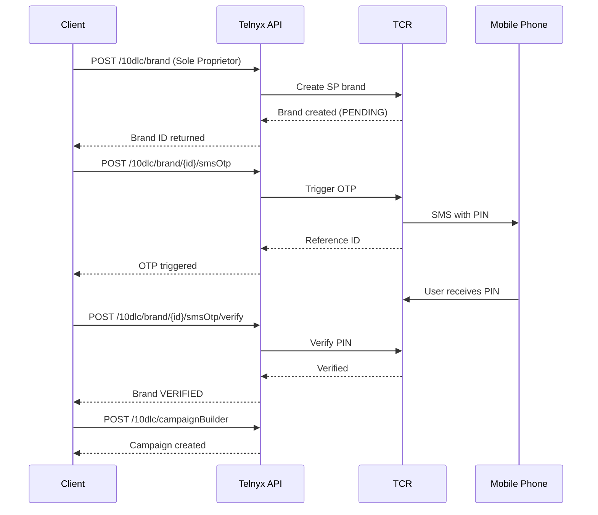

# Sole Proprietor 10DLC Registration

Complete guide to registering Sole Proprietor brands and campaigns via the Telnyx API, including OTP verification flow.

Sole Proprietor registration enables individuals and small businesses without a federal Tax ID (EIN) to register for 10DLC messaging. This guide covers the API workflow for creating Sole Proprietor brands, completing OTP verification, and managing campaigns programmatically.

## Overview

Sole Proprietor brands have specific constraints compared to standard business brands:

| Constraint                 | Limit                             |
| -------------------------- | --------------------------------- |
| Campaigns per brand        | 1                                 |
| Phone numbers per campaign | 1                                 |
| Mobile phone reuse         | Max 3 SP brands per mobile number |
| Throughput                 | Low-volume (varies by carrier)    |

> **Note:** Sole Proprietor registration requires identity verification via SMS OTP before campaigns can be created.

## Prerequisites

* Telnyx account with API access
* At least one US 10DLC phone number
* Valid US/CA mobile phone number for OTP verification
* Personal information: name, address, date of birth

## Registration Flow



## Step 1: Create a Sole Proprietor Brand

Create a brand with `entityType` set to `SOLE_PROPRIETOR`:

  Valid `vertical` values include: `PROFESSIONAL`, `REAL_ESTATE`, `HEALTHCARE`, `RETAIL`, `ENTERTAINMENT`, `EDUCATION`, `NONPROFIT`, `GOVERNMENT`, and others. See the [Brand API Reference](https://developers.telnyx.com/api-reference/brands/create-brand) for the full list.

  ```bash
  curl -X POST https://api.telnyx.com/v2/10dlc/brand \
    -H "Content-Type: application/json" \
    -H "Authorization: Bearer YOUR_API_KEY" \
    -d '{
      "entityType": "SOLE_PROPRIETOR",
      "firstName": "Jane",
      "lastName": "Smith",
      "displayName": "Jane Smith Consulting",
      "email": "jane@example.com",
      "phone": "+12025551234",
      "mobilePhone": "+12025559876",
      "street": "123 Main St",
      "city": "Austin",
      "state": "TX",
      "postalCode": "78701",
      "country": "US",
      "vertical": "PROFESSIONAL"
    }'
  ```

  ```javascript
  import Telnyx from 'telnyx';

  const client = new Telnyx({
    apiKey: process.env['TELNYX_API_KEY'],
  });

  const brand = await client.messaging10dlc.brand.create({
    entityType: 'SOLE_PROPRIETOR',
    firstName: 'Jane',
    lastName: 'Smith',
    displayName: 'Jane Smith Consulting',
    email: 'jane@example.com',
    phone: '+12025551234',
    mobilePhone: '+12025559876',
    street: '123 Main St',
    city: 'Austin',
    state: 'TX',
    postalCode: '78701',
    country: 'US',
    vertical: 'PROFESSIONAL',
  });

  console.log(brand.brandId);
  console.log(brand.identityStatus);
  ```

  ```python
  import os
  from telnyx import Telnyx

  client = Telnyx(
      api_key=os.environ.get("TELNYX_API_KEY"),
  )

  brand = client.messaging_10dlc.brand.create(
      entity_type="SOLE_PROPRIETOR",
      first_name="Jane",
      last_name="Smith",
      display_name="Jane Smith Consulting",
      email="jane@example.com",
      phone="+12025551234",
      mobile_phone="+12025559876",
      street="123 Main St",
      city="Austin",
      state="TX",
      postal_code="78701",
      country="US",
      vertical="PROFESSIONAL",
  )

  print(brand.brand_id)
  print(brand.identity_status)
  ```

  ```ruby
  require "telnyx"

  client = Telnyx::Client.new(api_key: ENV["TELNYX_API_KEY"])

  brand = client.messaging_10dlc.brand.create(
    entity_type: :SOLE_PROPRIETOR,
    first_name: "Jane",
    last_name: "Smith",
    display_name: "Jane Smith Consulting",
    email: "jane@example.com",
    phone: "+12025551234",
    mobile_phone: "+12025559876",
    street: "123 Main St",
    city: "Austin",
    state: "TX",
    postal_code: "78701",
    country: "US",
    vertical: :PROFESSIONAL
  )

  puts(brand)
  ```

  ```go
  package main

  import (
    "context"
    "fmt"
    "os"

    "github.com/team-telnyx/telnyx-go"
    "github.com/team-telnyx/telnyx-go/option"
  )

  func main() {
    client := telnyx.NewClient(
      option.WithAPIKey(os.Getenv("TELNYX_API_KEY")),
    )
    brand, err := client.Messaging10dlc.Brand.New(context.TODO(), telnyx.Messaging10dlcBrandNewParams{
      EntityType:  telnyx.EntityTypeSoleProprietor,
      FirstName:   "Jane",
      LastName:    "Smith",
      DisplayName: "Jane Smith Consulting",
      Email:       "jane@example.com",
      Phone:       "+12025551234",
      MobilePhone: "+12025559876",
      Street:      "123 Main St",
      City:        "Austin",
      State:       "TX",
      PostalCode:  "78701",
      Country:     "US",
      Vertical:    telnyx.VerticalProfessional,
    })
    if err != nil {
      panic(err.Error())
    }
    fmt.Printf("Brand ID: %s\n", brand.BrandID)
    fmt.Printf("Identity Status: %s\n", brand.IdentityStatus)
  }
  ```

  ```java
  package com.telnyx.example;

  import com.telnyx.sdk.client.TelnyxClient;
  import com.telnyx.sdk.client.okhttp.TelnyxOkHttpClient;
  import com.telnyx.sdk.models.messaging10dlc.brand.BrandCreateParams;
  import com.telnyx.sdk.models.messaging10dlc.brand.EntityType;
  import com.telnyx.sdk.models.messaging10dlc.brand.TelnyxBrand;
  import com.telnyx.sdk.models.messaging10dlc.brand.Vertical;

  public final class Main {
      public static void main(String[] args) {
          TelnyxClient client = TelnyxOkHttpClient.fromEnv();

          BrandCreateParams params = BrandCreateParams.builder()
              .entityType(EntityType.SOLE_PROPRIETOR)
              .firstName("Jane")
              .lastName("Smith")
              .displayName("Jane Smith Consulting")
              .email("jane@example.com")
              .phone("+12025551234")
              .mobilePhone("+12025559876")
              .street("123 Main St")
              .city("Austin")
              .state("TX")
              .postalCode("78701")
              .country("US")
              .vertical(Vertical.PROFESSIONAL)
              .build();

          TelnyxBrand brand = client.messaging10dlc().brand().create(params);
          System.out.println("Brand ID: " + brand.brandId());
          System.out.println("Identity Status: " + brand.identityStatus());
      }
  }
  ```

### Response

```json theme={null}
{
  "brandId": "f5586561-8ff0-4291-a0ac-84fe544797bd",
  "entityType": "SOLE_PROPRIETOR",
  "displayName": "Jane Smith Consulting",
  "firstName": "Jane",
  "lastName": "Smith",
  "identityStatus": "PENDING",
  "mobilePhone": "+12025559876",
  "createdAt": "2026-02-03T12:00:00Z"
}
```

> **Warning:** The brand will remain in `PENDING` identity status until OTP verification is completed. You cannot create campaigns until the brand is `VERIFIED`.

## Step 2: Trigger OTP Verification

Send an OTP PIN to the mobile phone associated with the brand:

  ```bash
  curl -X POST https://api.telnyx.com/v2/10dlc/brand/{brand_id}/smsOtp \
    -H "Content-Type: application/json" \
    -H "Authorization: Bearer YOUR_API_KEY" \
    -d '{
      "pinSms": "Your Telnyx verification code is @OTP_PIN@. This code expires in 24 hours.",
      "successSms": "Your Telnyx 10DLC brand has been verified successfully."
    }'
  ```

  ```javascript
  import Telnyx from 'telnyx';

  const client = new Telnyx({
    apiKey: process.env['TELNYX_API_KEY'],
  });

  const response = await client.messaging10dlc.brand.triggerSMSOtp(
    'f5586561-8ff0-4291-a0ac-84fe544797bd',
    {
      pinSms: 'Your Telnyx verification code is @OTP_PIN@. This code expires in 24 hours.',
      successSms: 'Your Telnyx 10DLC brand has been verified successfully.',
    }
  );

  console.log(response.referenceId);
  ```

  ```python
  import os
  from telnyx import Telnyx

  client = Telnyx(
      api_key=os.environ.get("TELNYX_API_KEY"),
  )

  response = client.messaging_10dlc.brand.trigger_sms_otp(
      brand_id="f5586561-8ff0-4291-a0ac-84fe544797bd",
      pin_sms="Your Telnyx verification code is @OTP_PIN@. This code expires in 24 hours.",
      success_sms="Your Telnyx 10DLC brand has been verified successfully.",
  )

  print(response.reference_id)
  ```

  ```ruby
  require "telnyx"

  client = Telnyx::Client.new(api_key: ENV["TELNYX_API_KEY"])

  response = client.messaging_10dlc.brand.trigger_sms_otp(
    "f5586561-8ff0-4291-a0ac-84fe544797bd",
    pin_sms: "Your Telnyx verification code is @OTP_PIN@. This code expires in 24 hours.",
    success_sms: "Your Telnyx 10DLC brand has been verified successfully."
  )

  puts(response)
  ```

  ```go
  package main

  import (
    "context"
    "fmt"
    "os"

    "github.com/team-telnyx/telnyx-go"
    "github.com/team-telnyx/telnyx-go/option"
  )

  func main() {
    client := telnyx.NewClient(
      option.WithAPIKey(os.Getenv("TELNYX_API_KEY")),
    )
    response, err := client.Messaging10dlc.Brand.TriggerSMSOtp(
      context.TODO(),
      "f5586561-8ff0-4291-a0ac-84fe544797bd",
      telnyx.Messaging10dlcBrandTriggerSMSOtpParams{
        PinSMS:     "Your Telnyx verification code is @OTP_PIN@. This code expires in 24 hours.",
        SuccessSMS: "Your Telnyx 10DLC brand has been verified successfully.",
      },
    )
    if err != nil {
      panic(err.Error())
    }
    fmt.Printf("Reference ID: %s\n", response.ReferenceID)
  }
  ```

  ```java
  package com.telnyx.example;

  import com.telnyx.sdk.client.TelnyxClient;
  import com.telnyx.sdk.client.okhttp.TelnyxOkHttpClient;
  import com.telnyx.sdk.models.messaging10dlc.brand.BrandTriggerSmsOtpParams;
  import com.telnyx.sdk.models.messaging10dlc.brand.BrandTriggerSmsOtpResponse;

  public final class Main {
      public static void main(String[] args) {
          TelnyxClient client = TelnyxOkHttpClient.fromEnv();

          BrandTriggerSmsOtpParams params = BrandTriggerSmsOtpParams.builder()
              .brandId("f5586561-8ff0-4291-a0ac-84fe544797bd")
              .pinSms("Your Telnyx verification code is @OTP_PIN@. This code expires in 24 hours.")
              .successSms("Your Telnyx 10DLC brand has been verified successfully.")
              .build();

          BrandTriggerSmsOtpResponse response = client.messaging10dlc().brand().triggerSmsOtp(params);
          System.out.println("Reference ID: " + response.referenceId());
      }
  }
  ```

### Request Parameters

| Parameter    | Type   | Required | Description                                                         |
| ------------ | ------ | -------- | ------------------------------------------------------------------- |
| `pinSms`     | string | Yes      | SMS message containing `@OTP_PIN@` placeholder (max 500 chars)      |
| `successSms` | string | Yes      | Confirmation SMS sent after successful verification (max 500 chars) |

### Response

```json theme={null}
{
  "brandId": "f5586561-8ff0-4291-a0ac-84fe544797bd",
  "referenceId": "OTP8A3B2C"
}
```

> **Note:** The `@OTP_PIN@` placeholder in `pinSms` will be replaced with the actual 6-digit PIN when the SMS is sent.

## Step 3: Check OTP Status

Poll the OTP status to confirm delivery:

  ```bash
  curl -X GET https://api.telnyx.com/v2/10dlc/brand/{brand_id}/smsOtp \
    -H "Authorization: Bearer YOUR_API_KEY"
  ```

  ```javascript
  import Telnyx from 'telnyx';

  const client = new Telnyx({
    apiKey: process.env['TELNYX_API_KEY'],
  });

  const status = await client.messaging10dlc.brand.retrieveSMSOtpStatus(
    'f5586561-8ff0-4291-a0ac-84fe544797bd'
  );

  console.log(status.deliveryStatus);
  console.log(status.verifyDate);
  ```

  ```python
  import os
  from telnyx import Telnyx

  client = Telnyx(
      api_key=os.environ.get("TELNYX_API_KEY"),
  )

  status = client.messaging_10dlc.brand.retrieve_sms_otp_status(
      "f5586561-8ff0-4291-a0ac-84fe544797bd",
  )

  print(status.delivery_status)
  print(status.verify_date)
  ```

  ```ruby
  require "telnyx"

  client = Telnyx::Client.new(api_key: ENV["TELNYX_API_KEY"])

  status = client.messaging_10dlc.brand.retrieve_sms_otp_status(
    "f5586561-8ff0-4291-a0ac-84fe544797bd"
  )

  puts(status)
  ```

  ```go
  package main

  import (
    "context"
    "fmt"
    "os"

    "github.com/team-telnyx/telnyx-go"
    "github.com/team-telnyx/telnyx-go/option"
  )

  func main() {
    client := telnyx.NewClient(
      option.WithAPIKey(os.Getenv("TELNYX_API_KEY")),
    )
    status, err := client.Messaging10dlc.Brand.RetrieveSMSOtpStatus(
      context.TODO(),
      "f5586561-8ff0-4291-a0ac-84fe544797bd",
    )
    if err != nil {
      panic(err.Error())
    }
    fmt.Printf("Delivery Status: %s\n", status.DeliveryStatus)
  }
  ```

  ```java
  package com.telnyx.example;

  import com.telnyx.sdk.client.TelnyxClient;
  import com.telnyx.sdk.client.okhttp.TelnyxOkHttpClient;
  import com.telnyx.sdk.models.messaging10dlc.brand.BrandSmsOtpStatus;

  public final class Main {
      public static void main(String[] args) {
          TelnyxClient client = TelnyxOkHttpClient.fromEnv();

          BrandSmsOtpStatus status = client.messaging10dlc()
              .brand()
              .retrieveSmsOtpStatus("f5586561-8ff0-4291-a0ac-84fe544797bd");

          System.out.println("Delivery Status: " + status.deliveryStatus());
      }
  }
  ```

### Response

```json theme={null}
{
  "brandId": "f5586561-8ff0-4291-a0ac-84fe544797bd",
  "referenceId": "OTP8A3B2C",
  "mobilePhone": "+12025559876",
  "requestDate": "2026-02-03T12:05:00Z",
  "verifyDate": null,
  "deliveryStatus": "DELIVERED_HANDSET",
  "deliveryStatusDate": "2026-02-03T12:05:02Z",
  "deliveryStatusDetails": "Delivered to handset"
}
```

### Delivery Status Values

| Status              | Description                              |
| ------------------- | ---------------------------------------- |
| `PENDING`           | OTP request submitted, awaiting delivery |
| `DELIVERED_HANDSET` | SMS delivered to the mobile device       |
| `DELIVERY_FAILED`   | SMS delivery failed                      |
| `VERIFIED`          | OTP PIN successfully verified            |
| `EXPIRED`           | OTP PIN expired (24-hour window)         |

## Step 4: Verify OTP PIN

After the user receives and provides the PIN, verify it:

  ```bash
  curl -X POST https://api.telnyx.com/v2/10dlc/brand/{brand_id}/smsOtp/verify \
    -H "Content-Type: application/json" \
    -H "Authorization: Bearer YOUR_API_KEY" \
    -d '{
      "otpPin": "123456"
    }'
  ```

  ```javascript
  import Telnyx from 'telnyx';

  const client = new Telnyx({
    apiKey: process.env['TELNYX_API_KEY'],
  });

  await client.messaging10dlc.brand.verifySMSOtp(
    'f5586561-8ff0-4291-a0ac-84fe544797bd',
    { otpPin: '123456' }
  );

  console.log('Brand verified successfully');
  ```

  ```python
  import os
  from telnyx import Telnyx

  client = Telnyx(
      api_key=os.environ.get("TELNYX_API_KEY"),
  )

  client.messaging_10dlc.brand.verify_sms_otp(
      brand_id="f5586561-8ff0-4291-a0ac-84fe544797bd",
      otp_pin="123456",
  )

  print("Brand verified successfully")
  ```

  ```ruby
  require "telnyx"

  client = Telnyx::Client.new(api_key: ENV["TELNYX_API_KEY"])

  client.messaging_10dlc.brand.verify_sms_otp(
    "f5586561-8ff0-4291-a0ac-84fe544797bd",
    otp_pin: "123456"
  )

  puts("Brand verified successfully")
  ```

  ```go
  package main

  import (
    "context"
    "fmt"
    "os"

    "github.com/team-telnyx/telnyx-go"
    "github.com/team-telnyx/telnyx-go/option"
  )

  func main() {
    client := telnyx.NewClient(
      option.WithAPIKey(os.Getenv("TELNYX_API_KEY")),
    )
    err := client.Messaging10dlc.Brand.VerifySMSOtp(
      context.TODO(),
      "f5586561-8ff0-4291-a0ac-84fe544797bd",
      telnyx.Messaging10dlcBrandVerifySMSOtpParams{
        OtpPin: "123456",
      },
    )
    if err != nil {
      panic(err.Error())
    }
    fmt.Println("Brand verified successfully")
  }
  ```

  ```java
  package com.telnyx.example;

  import com.telnyx.sdk.client.TelnyxClient;
  import com.telnyx.sdk.client.okhttp.TelnyxOkHttpClient;
  import com.telnyx.sdk.models.messaging10dlc.brand.BrandVerifySmsOtpParams;

  public final class Main {
      public static void main(String[] args) {
          TelnyxClient client = TelnyxOkHttpClient.fromEnv();

          BrandVerifySmsOtpParams params = BrandVerifySmsOtpParams.builder()
              .brandId("f5586561-8ff0-4291-a0ac-84fe544797bd")
              .otpPin("123456")
              .build();

          client.messaging10dlc().brand().verifySmsOtp(params);
          System.out.println("Brand verified successfully");
      }
  }
  ```

Upon successful verification:

* The brand `identityStatus` changes to `VERIFIED`
* The `successSms` message is sent to the mobile phone
* The brand registration fee is charged
* You can now create campaigns

## Step 5: Create a Sole Proprietor Campaign

With a verified brand, create a campaign using the `SOLE_PROPRIETOR` usecase:

> **Note:** Sample messages (`sample1`, `sample2`) are required for campaign approval. Include realistic examples of messages you'll send.

  ```bash
  curl -X POST https://api.telnyx.com/v2/10dlc/campaignBuilder \
    -H "Content-Type: application/json" \
    -H "Authorization: Bearer YOUR_API_KEY" \
    -d '{
      "brandId": "f5586561-8ff0-4291-a0ac-84fe544797bd",
      "usecase": "SOLE_PROPRIETOR",
      "description": "Customer appointment reminders and booking confirmations for consulting services.",
      "messageFlow": "Customers opt-in via web form when booking appointments. They receive confirmation and reminder messages.",
      "helpMessage": "Reply HELP for assistance. Contact support@example.com",
      "optoutMessage": "Reply STOP to unsubscribe from messages.",
      "sample1": "Hi Jane, this is a reminder of your appointment tomorrow at 2pm.",
      "sample2": "Your booking for March 15th has been confirmed. Reply STOP to opt out.",
      "termsAndConditions": true
    }'
  ```

  ```javascript
  import Telnyx from 'telnyx';

  const client = new Telnyx({
    apiKey: process.env['TELNYX_API_KEY'],
  });

  const campaign = await client.messaging10dlc.campaignBuilder.submit({
    brandId: 'f5586561-8ff0-4291-a0ac-84fe544797bd',
    usecase: 'SOLE_PROPRIETOR',
    description: 'Customer appointment reminders and booking confirmations for consulting services.',
    messageFlow: 'Customers opt-in via web form when booking appointments. They receive confirmation and reminder messages.',
    helpMessage: 'Reply HELP for assistance. Contact support@example.com',
    optoutMessage: 'Reply STOP to unsubscribe from messages.',
    sample1: 'Hi Jane, this is a reminder of your appointment tomorrow at 2pm.',
    sample2: 'Your booking for March 15th has been confirmed. Reply STOP to opt out.',
    termsAndConditions: true,
  });

  console.log(campaign.campaignId);
  console.log(campaign.status);
  ```

  ```python
  import os
  from telnyx import Telnyx

  client = Telnyx(
      api_key=os.environ.get("TELNYX_API_KEY"),
  )

  campaign = client.messaging_10dlc.campaign_builder.submit(
      brand_id="f5586561-8ff0-4291-a0ac-84fe544797bd",
      usecase="SOLE_PROPRIETOR",
      description="Customer appointment reminders and booking confirmations for consulting services.",
      message_flow="Customers opt-in via web form when booking appointments. They receive confirmation and reminder messages.",
      help_message="Reply HELP for assistance. Contact support@example.com",
      optout_message="Reply STOP to unsubscribe from messages.",
      sample1="Hi Jane, this is a reminder of your appointment tomorrow at 2pm.",
      sample2="Your booking for March 15th has been confirmed. Reply STOP to opt out.",
      terms_and_conditions=True,
  )

  print(campaign.campaign_id)
  ```

  ```ruby
  require "telnyx"

  client = Telnyx::Client.new(api_key: ENV["TELNYX_API_KEY"])

  campaign = client.messaging_10dlc.campaign_builder.submit(
    brand_id: "f5586561-8ff0-4291-a0ac-84fe544797bd",
    usecase: "SOLE_PROPRIETOR",
    description: "Customer appointment reminders and booking confirmations for consulting services.",
    message_flow: "Customers opt-in via web form when booking appointments. They receive confirmation and reminder messages.",
    help_message: "Reply HELP for assistance. Contact support@example.com",
    optout_message: "Reply STOP to unsubscribe from messages.",
    sample1: "Hi Jane, this is a reminder of your appointment tomorrow at 2pm.",
    sample2: "Your booking for March 15th has been confirmed. Reply STOP to opt out.",
    terms_and_conditions: true
  )

  puts(campaign)
  ```

  ```go
  package main

  import (
    "context"
    "fmt"
    "os"

    "github.com/team-telnyx/telnyx-go"
    "github.com/team-telnyx/telnyx-go/option"
  )

  func main() {
    client := telnyx.NewClient(
      option.WithAPIKey(os.Getenv("TELNYX_API_KEY")),
    )
    campaign, err := client.Messaging10dlc.CampaignBuilder.Submit(context.TODO(), telnyx.Messaging10dlcCampaignBuilderSubmitParams{
      BrandID:            "f5586561-8ff0-4291-a0ac-84fe544797bd",
      Usecase:            "SOLE_PROPRIETOR",
      Description:        "Customer appointment reminders and booking confirmations for consulting services.",
      MessageFlow:        "Customers opt-in via web form when booking appointments. They receive confirmation and reminder messages.",
      HelpMessage:        "Reply HELP for assistance. Contact support@example.com",
      OptoutMessage:      "Reply STOP to unsubscribe from messages.",
      Sample1:            "Hi Jane, this is a reminder of your appointment tomorrow at 2pm.",
      Sample2:            "Your booking for March 15th has been confirmed. Reply STOP to opt out.",
      TermsAndConditions: true,
    })
    if err != nil {
      panic(err.Error())
    }
    fmt.Printf("Campaign ID: %s\n", campaign.CampaignID)
  }
  ```

  ```java
  package com.telnyx.example;

  import com.telnyx.sdk.client.TelnyxClient;
  import com.telnyx.sdk.client.okhttp.TelnyxOkHttpClient;
  import com.telnyx.sdk.models.messaging10dlc.campaign.TelnyxCampaignCsp;
  import com.telnyx.sdk.models.messaging10dlc.campaignbuilder.CampaignBuilderSubmitParams;

  public final class Main {
      public static void main(String[] args) {
          TelnyxClient client = TelnyxOkHttpClient.fromEnv();

          CampaignBuilderSubmitParams params = CampaignBuilderSubmitParams.builder()
              .brandId("f5586561-8ff0-4291-a0ac-84fe544797bd")
              .usecase("SOLE_PROPRIETOR")
              .description("Customer appointment reminders and booking confirmations for consulting services.")
              .messageFlow("Customers opt-in via web form when booking appointments. They receive confirmation and reminder messages.")
              .helpMessage("Reply HELP for assistance. Contact support@example.com")
              .optoutMessage("Reply STOP to unsubscribe from messages.")
              .sample1("Hi Jane, this is a reminder of your appointment tomorrow at 2pm.")
              .sample2("Your booking for March 15th has been confirmed. Reply STOP to opt out.")
              .termsAndConditions(true)
              .build();

          TelnyxCampaignCsp campaign = client.messaging10dlc().campaignBuilder().submit(params);
          System.out.println("Campaign ID: " + campaign.campaignId());
      }
  }
  ```

### Response

```json theme={null}
{
  "campaignId": "c5e5e598-95b3-4076-bfe2-c7d2c58ec57f",
  "brandId": "f5586561-8ff0-4291-a0ac-84fe544797bd",
  "usecase": "SOLE_PROPRIETOR",
  "status": "ACTIVE",
  "description": "Customer appointment reminders and booking confirmations for consulting services.",
  "createdAt": "2026-02-03T12:30:00Z"
}
```

> **Note:** Sole Proprietor campaigns are typically auto-approved and become `ACTIVE` immediately. Standard campaigns may require carrier review.

## Step 6: Assign a Phone Number

Assign your 10DLC number to the campaign:

  ```bash
  curl -X POST https://api.telnyx.com/v2/10dlc/phone_number_campaigns \
    -H "Content-Type: application/json" \
    -H "Authorization: Bearer YOUR_API_KEY" \
    -d '{
      "phoneNumber": "+12025551234",
      "campaignId": "campaign_id_here"
    }'
  ```

  ```javascript
  import Telnyx from 'telnyx';

  const client = new Telnyx({
    apiKey: process.env['TELNYX_API_KEY'],
  });

  const assignment = await client.messaging10dlc.phoneNumberCampaigns.create({
    phoneNumber: '+12025551234',
    campaignId: 'campaign_id_here',
  });

  console.log(assignment.campaignId);
  ```

  ```python
  import os
  from telnyx import Telnyx

  client = Telnyx(
      api_key=os.environ.get("TELNYX_API_KEY"),
  )

  assignment = client.messaging_10dlc.phone_number_campaigns.create(
      phone_number="+12025551234",
      campaign_id="campaign_id_here",
  )

  print(assignment.campaign_id)
  ```

  ```ruby
  require "telnyx"

  client = Telnyx::Client.new(api_key: ENV["TELNYX_API_KEY"])

  assignment = client.messaging_10dlc.phone_number_campaigns.create(
    phone_number: "+12025551234",
    campaign_id: "campaign_id_here"
  )

  puts(assignment)
  ```

  ```go
  package main

  import (
    "context"
    "fmt"
    "os"

    "github.com/team-telnyx/telnyx-go"
    "github.com/team-telnyx/telnyx-go/option"
  )

  func main() {
    client := telnyx.NewClient(
      option.WithAPIKey(os.Getenv("TELNYX_API_KEY")),
    )
    assignment, err := client.Messaging10dlc.PhoneNumberCampaigns.New(context.TODO(), telnyx.Messaging10dlcPhoneNumberCampaignNewParams{
      PhoneNumberCampaignCreate: telnyx.PhoneNumberCampaignCreateParam{
        PhoneNumber: "+12025551234",
        CampaignID:  "campaign_id_here",
      },
    })
    if err != nil {
      panic(err.Error())
    }
    fmt.Printf("Assignment: %+v\n", assignment)
  }
  ```

  ```java
  package com.telnyx.example;

  import com.telnyx.sdk.client.TelnyxClient;
  import com.telnyx.sdk.client.okhttp.TelnyxOkHttpClient;
  import com.telnyx.sdk.models.messaging10dlc.phonenumbercampaigns.PhoneNumberCampaign;
  import com.telnyx.sdk.models.messaging10dlc.phonenumbercampaigns.PhoneNumberCampaignCreate;

  public final class Main {
      public static void main(String[] args) {
          TelnyxClient client = TelnyxOkHttpClient.fromEnv();

          PhoneNumberCampaignCreate params = PhoneNumberCampaignCreate.builder()
              .phoneNumber("+12025551234")
              .campaignId("campaign_id_here")
              .build();

          PhoneNumberCampaign assignment = client.messaging10dlc().phoneNumberCampaigns().create(params);
          System.out.println("Campaign ID: " + assignment.campaignId());
      }
  }
  ```

> **Warning:** Sole Proprietor campaigns can only have **one phone number** assigned. Attempting to assign additional numbers will return an error.

## Error Handling

### Common Errors

| Error                                                               | Cause                                  | Solution                                               |
| ------------------------------------------------------------------- | -------------------------------------- | ------------------------------------------------------ |
| `Sole Proprietor brands can only have one active campaign`          | Attempting to create a second campaign | Delete or deactivate existing campaign first           |
| `Sole Proprietor campaigns can only have one phone number assigned` | Attempting to assign multiple numbers  | Use only one number per SP campaign                    |
| `Cannot associate campaign with brand in pending or failed status`  | Brand not verified                     | Complete OTP verification first                        |
| `OTP PIN expired`                                                   | 24-hour verification window exceeded   | Trigger a new OTP with `POST /10dlc/brand/{id}/smsOtp` |

### Retrying OTP

If the OTP expires or the user needs a new PIN, simply call the trigger endpoint again:

```bash theme={null}
curl -X POST https://api.telnyx.com/v2/10dlc/brand/{brand_id}/smsOtp \
  -H "Content-Type: application/json" \
  -H "Authorization: Bearer YOUR_API_KEY" \
  -d '{
    "pinSms": "Your new Telnyx verification code is @OTP_PIN@. This code expires in 24 hours.",
    "successSms": "Your Telnyx 10DLC brand has been verified successfully."
  }'
```

## Fees

| Item                | Amount  | Frequency                             |
| ------------------- | ------- | ------------------------------------- |
| Brand Registration  | \$4.00  | One-time (charged after verification) |
| Campaign Vetting    | \$15.00 | Per submission                        |
| Monthly Maintenance | \$2.00  | Monthly                               |

## Webhooks

Subscribe to brand and campaign status updates via webhooks. See [10DLC Event Notifications](10dlc-event-notifications.md) for details on:

* `10dlc.brand.update` — Brand status and identity verification changes
* `10dlc.campaign.update` — Campaign approval/rejection
* `10dlc.phone_number.update` — Phone number assignment status

## Next Steps

  - [10DLC Rate Limits](10dlc-rate-limits-throughput.md) — Understand throughput limits for Sole Proprietor campaigns

  - [Event Notifications](10dlc-event-notifications.md) — Set up webhooks for status updates

  - [Brand API Reference](https://developers.telnyx.com/api-reference/brands/create-brand) — Full API documentation for brand management

  - [Support Guide](https://support.telnyx.com/en/articles/13545282-guide-to-sole-proprietor-10dlc-brand-and-campaign-registration) — Portal walkthrough for non-API users


## Related Pages

- [10DLC Brand Registration](../runbooks/10dlc-brand-registration.md)
