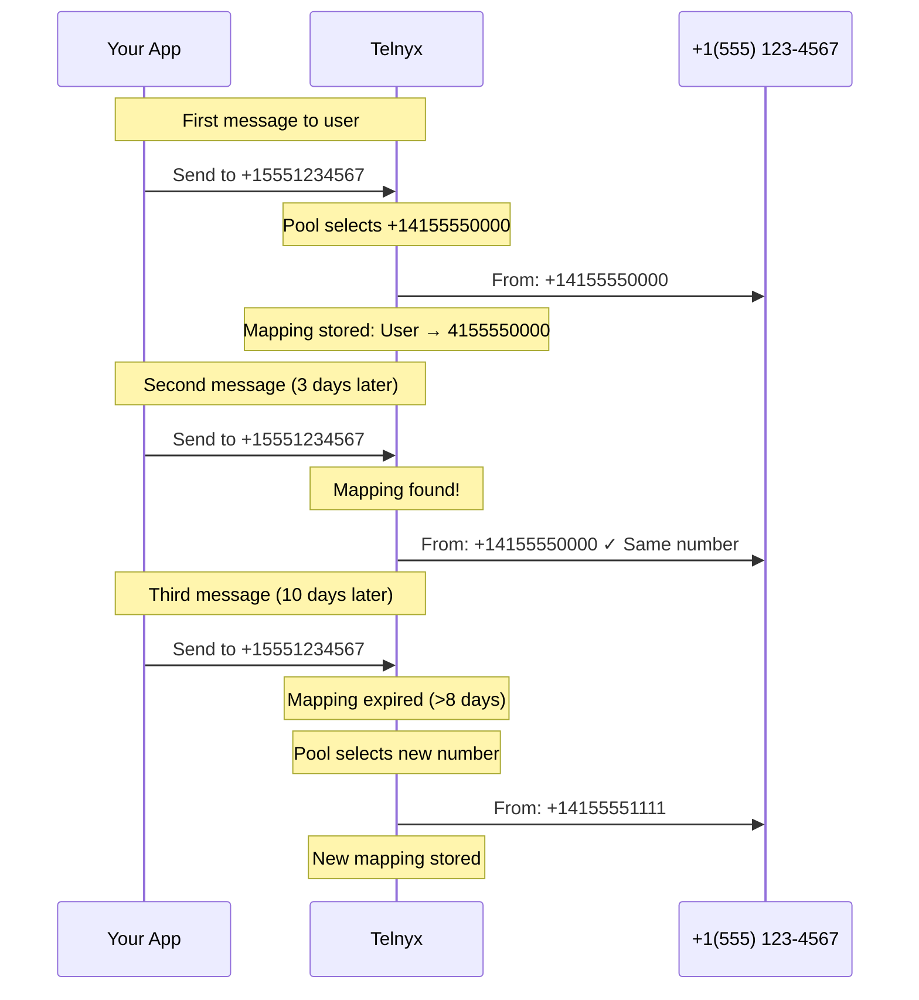

# Sticky Sender

Maintain consistent sender numbers for recipients across messages to build familiarity and trust.

Sticky Sender ensures the same phone number is used every time your application messages a particular recipient. This consistency builds familiarity—your customers see the same number each time, making your messages more recognizable and trustworthy.

<Callout type="info">
  Sticky Sender is part of **Number Pool** settings. You must have [Number Pool](number-pool.md) enabled to use Sticky Sender.

## When to Use Sticky Sender

  - [Customer Conversations](#) — Maintain consistent sender identity throughout multi-message conversations.

  - [Recurring Notifications](#) — Appointment reminders, delivery updates, and alerts from a familiar number.

  - [Support Interactions](#) — Customers can save your number knowing future messages will come from the same sender.

  - [Brand Recognition](#) — Build trust by ensuring customers recognize your number over time.

## How It Works

1. **First message**: Telnyx selects a number from your pool (using weights, geomatch, or availability)
2. **Mapping created**: The recipient-to-sender pairing is stored
3. **Future messages**: The same sender is automatically used for that recipient
4. **Mapping expires**: After 8 days of no messages, the mapping resets



### Mapping Behavior

| Scenario                    | Behavior                                 |
| --------------------------- | ---------------------------------------- |
| Message sent within 8 days  | Same sender reused, timer resets         |
| No messages for 8+ days     | Mapping expires, new sender assigned     |
| Sticky Sender disabled      | All mappings cleared immediately         |
| Number removed from profile | Mappings to that number cleared          |
| Sticky number unavailable   | New number selected, new mapping created |

<Callout type="tip">
  **Compare with Twilio**: Sticky Sender works similarly to Twilio's Messaging Services sticky sender feature. If you're migrating, the concept is the same—just configure it on your Messaging Profile instead.

## Prerequisites

* A [Messaging Profile](send-your-first-message.md) with [Number Pool](number-pool.md) enabled
* At least one phone number assigned to the profile

***

## Configure Sticky Sender

Enable Sticky Sender by updating your Messaging Profile's `number_pool_settings`.

<Callout type="info">
  The `PATCH` endpoint merges with your existing configuration—only the fields you include are updated. Your current weights and other Number Pool settings are preserved.

### API

      ```bash
      curl -X PATCH "https://api.telnyx.com/v2/messaging_profiles/YOUR_PROFILE_ID" \
        -H "Content-Type: application/json" \
        -H "Authorization: Bearer YOUR_API_KEY" \
        -d '{
          "number_pool_settings": {
            "sticky_sender": true
          }
        }'
      ```

      ```javascript
      import Telnyx from 'telnyx';

      const client = new Telnyx({ apiKey: process.env.TELNYX_API_KEY });

      const response = await client.messagingProfiles.update(
        'YOUR_PROFILE_ID',
        {
          number_pool_settings: {
            sticky_sender: true
          }
        }
      );

      console.log(response.data);
      ```

      ```python
      import os
      from telnyx import Telnyx

      client = Telnyx(api_key=os.environ.get("TELNYX_API_KEY"))

      response = client.messaging_profiles.update(
          "YOUR_PROFILE_ID",
          number_pool_settings={
              "sticky_sender": True
          }
      )

      print(response.data)
      ```

      ```ruby
      require "telnyx"

      client = Telnyx::Client.new(api_key: ENV["TELNYX_API_KEY"])

      response = client.messaging_profiles.update(
        "YOUR_PROFILE_ID",
        number_pool_settings: {
          sticky_sender: true
        }
      )

      puts response
      ```

      ```go
      package main

      import (
        "context"
        "fmt"
        "os"

        "github.com/team-telnyx/telnyx-go"
        "github.com/team-telnyx/telnyx-go/option"
      )

      func main() {
        client := telnyx.NewClient(
          option.WithAPIKey(os.Getenv("TELNYX_API_KEY")),
        )

        response, err := client.MessagingProfiles.Update(
          context.TODO(),
          "YOUR_PROFILE_ID",
          telnyx.MessagingProfileUpdateParams{
            NumberPoolSettings: &telnyx.NumberPoolSettingsParam{
              StickySender: telnyx.Bool(true),
            },
          },
        )
        if err != nil {
          panic(err.Error())
        }
        fmt.Printf("%+v\n", response)
      }
      ```

      ```java
      package com.telnyx.example;

      import com.telnyx.sdk.client.TelnyxClient;
      import com.telnyx.sdk.client.okhttp.TelnyxOkHttpClient;
      import com.telnyx.sdk.models.messagingprofiles.*;

      public final class Main {
          public static void main(String[] args) {
              TelnyxClient client = TelnyxOkHttpClient.fromEnv();

              NumberPoolSettings poolSettings = NumberPoolSettings.builder()
                  .stickySender(true)
                  .build();

              MessagingProfileUpdateParams params = MessagingProfileUpdateParams.builder()
                  .numberPoolSettings(poolSettings)
                  .build();

              MessagingProfileUpdateResponse response = client.messagingProfiles()
                  .update("YOUR_PROFILE_ID", params);
              System.out.println(response);
          }
      }
      ```

      ```csharp .NET theme={null}
      using System;
      using Telnyx;

      TelnyxConfiguration.SetApiKey(Environment.GetEnvironmentVariable("TELNYX_API_KEY"));

      var service = new MessagingProfileService();
      var options = new MessagingProfileUpdateOptions
      {
          NumberPoolSettings = new NumberPoolSettings
          {
              StickySender = true
          }
      };

      var profile = service.Update("YOUR_PROFILE_ID", options);
      Console.WriteLine(profile);
      ```

      ```php
      <?php
      require_once 'vendor/autoload.php';

      \Telnyx\Telnyx::setApiKey(getenv('TELNYX_API_KEY'));

      $profile = \Telnyx\MessagingProfile::update("YOUR_PROFILE_ID", [
          "number_pool_settings" => [
              "sticky_sender" => true
          ]
      ]);

      print_r($profile);
      ```

    The response confirms your settings:

    ```json theme={null}
    {
      "data": {
        "id": "YOUR_PROFILE_ID",
        "record_type": "messaging_profile",
        "name": "My Profile",
        "number_pool_settings": {
          "sticky_sender": true,
          "geomatch": false,
          "long_code_weight": 1,
          "toll_free_weight": 0,
          "skip_unhealthy": false
        }
      }
    }
    ```

### Portal

    1. Go to [Messaging](https://portal.telnyx.com/#/app/messaging) in the portal
    2. Click the edit icon next to your Messaging Profile
    3. Under **Outbound**, toggle on **Number Pool**
    4. Check the **Sticky Sender** checkbox
    5. Click **Save**

       

***

## Disable Sticky Sender

To disable Sticky Sender, set the `sticky_sender` field to `false`. This immediately clears all existing mappings.

  ```bash
  curl -X PATCH "https://api.telnyx.com/v2/messaging_profiles/YOUR_PROFILE_ID" \
    -H "Content-Type: application/json" \
    -H "Authorization: Bearer YOUR_API_KEY" \
    -d '{
      "number_pool_settings": {
        "sticky_sender": false
      }
    }'
  ```

  ```javascript
  import Telnyx from 'telnyx';

  const client = new Telnyx({ apiKey: process.env.TELNYX_API_KEY });

  await client.messagingProfiles.update('YOUR_PROFILE_ID', {
    number_pool_settings: {
      sticky_sender: false
    }
  });
  ```

  ```python
  import os
  from telnyx import Telnyx

  client = Telnyx(api_key=os.environ.get("TELNYX_API_KEY"))

  client.messaging_profiles.update(
      "YOUR_PROFILE_ID",
      number_pool_settings={
          "sticky_sender": False
      }
  )
  ```

<Callout type="warning">
  Disabling Sticky Sender clears all recipient-to-sender mappings. Re-enabling it starts fresh—previous mappings are not restored.

***

## Combining with Other Features

Sticky Sender works alongside other Number Pool settings. The priority order for number selection is:

1. **Sticky Sender** (if enabled and mapping exists)
2. **Geomatch** (if enabled and matching area code available)
3. **Weight distribution** (long code vs. toll-free preference)
4. **Skip unhealthy** (exclude poor-performing numbers)

**Sticky Sender + Geomatch**

  When both are enabled:

  * **First message**: Geomatch selects a number matching the recipient's area code
  * **Future messages**: Sticky Sender reuses that same geomatched number

  This combination provides both local presence and consistency.

  ```json theme={null}
  {
    "number_pool_settings": {
      "sticky_sender": true,
      "geomatch": true
    }
  }
  ```

---

**Sticky Sender + Skip Unhealthy**

  If a sticky sender mapping points to a number that becomes unhealthy:

  * The mapping is preserved
  * Messages still route through that number (skip\_unhealthy doesn't override sticky mappings)

  To force re-selection, temporarily disable and re-enable Sticky Sender to clear mappings.

---

***

## Troubleshooting

**Recipient receiving messages from different numbers**

  **Possible causes:**

  * Sticky Sender not enabled on the Messaging Profile
  * Previous mapping expired (8+ days since last message)
  * A phone number was removed from the profile

  **Solutions:**

  1. Verify Sticky Sender is enabled in your profile settings
  2. Send messages more frequently to prevent mapping expiration
  3. Check that all expected numbers are still assigned to the profile

---

**Mapping not updating after adding new numbers**

  **Cause**: Sticky Sender preserves existing mappings—adding new numbers doesn't affect recipients who already have mappings.

  **Solution**: If you want recipients to potentially use new numbers, temporarily disable Sticky Sender to clear mappings, then re-enable it. New messages will be distributed across all available numbers.

---

**Checking current Sticky Sender status**

  Retrieve your Messaging Profile to see current settings:

  ```bash theme={null}
  curl "https://api.telnyx.com/v2/messaging_profiles/YOUR_PROFILE_ID" \
    -H "Authorization: Bearer YOUR_API_KEY" | jq '.data.number_pool_settings'
  ```

  Response:

  ```json theme={null}
  {
    "sticky_sender": true,
    "geomatch": false,
    "long_code_weight": 1,
    "toll_free_weight": 0,
    "skip_unhealthy": false
  }
  ```

---

***

## Next Steps

  - [Number Pool](number-pool.md) — Learn about number pool configuration and weights

  - [Geomatch](geomatch.md) — Match sender to recipient geography

  - [Send Messages](send-your-first-message.md) — Send your first message with Number Pool

  - [API Reference](https://developers.telnyx.com/api-reference/messaging-profiles/update-messaging-profile) — View full Messaging Profile API details
