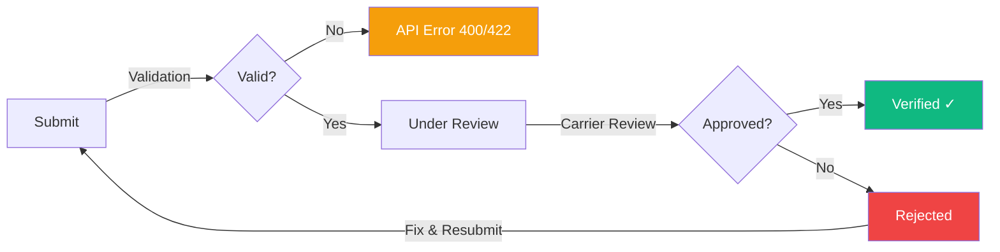

# Toll-Free Verification Troubleshooting

Diagnose and resolve toll-free verification rejections, resubmission issues, delivery problems, and throughput limitations for SMS/MMS on toll-free numbers.

This guide covers common toll-free verification failures, rejection reasons, resubmission best practices, and messaging issues with toll-free numbers. Use it to diagnose problems and get your verification approved faster.

  **Quick links:** [Rejection reasons](#verification-rejection-reasons) · [Resubmission guide](#resubmission-process) · [Delivery issues](#delivery-issues-after-verification) · [Status tracking](#checking-verification-status) · [Diagnostic checklist](#diagnostic-checklist)

***

## Verification lifecycle

Understanding where your verification can fail helps target the right fix:



| Stage            | Timeline  | What happens                                             |
| ---------------- | --------- | -------------------------------------------------------- |
| **Submission**   | Instant   | API validates fields, returns 201 or error               |
| **Under review** | 1–2 weeks | Carriers review business identity and messaging use case |
| **Decision**     | —         | Approved (full throughput) or rejected (with reason)     |
| **Resubmission** | Instant   | Fix issues and resubmit — no limit on attempts           |

***

## Verification rejection reasons

Rejections come from carrier review. Each has specific causes and fixes.

### Business information issues

**Business name mismatch**

    **Rejection reason:** Business name does not match public records.

    **Root cause:** The `businessName` you submitted doesn't match what's on file with the Secretary of State, IRS, or similar authority for your registration number.

    **Fix:**

    1. Look up your exact legal name on your state's Secretary of State website
    2. Cross-reference with your EIN confirmation letter from the IRS
    3. Include suffixes exactly: "Inc.", "LLC", "Corp." — these matter
    4. Resubmit with the corrected name

    ```bash
    curl -X PATCH https://api.telnyx.com/v2/tollFreeVerification/requests/{requestId} \
      -H "Authorization: Bearer $TELNYX_API_KEY" \
      -H "Content-Type: application/json" \
      -d '{
        "businessName": "Acme Corporation Inc."
      }'
    ```

    > **Warning:** **Common mistakes:**
> 
>       * Using a DBA/trade name instead of the legal entity name
>       * Missing "LLC", "Inc.", etc.
>       * Using an old company name after a legal name change

---

**Business registration number (BRN) cannot be verified**

    **Rejection reason:** Unable to verify business registration information.

    **Root cause:** The EIN, ABN, VAT number, or other registration number doesn't match the business name or doesn't exist in public records.

    **Fix:**

    1. Verify your EIN at [IRS.gov](https://www.irs.gov/) or on your SS-4 confirmation letter
    2. Ensure the `businessRegistrationType` matches the number format (e.g., "EIN" for US tax IDs)
    3. Confirm `businessRegistrationCountry` is correct (ISO alpha-2)
    4. For sole proprietors using SSN, ensure the name matches exactly

    ```bash
    curl -X PATCH https://api.telnyx.com/v2/tollFreeVerification/requests/{requestId} \
      -H "Authorization: Bearer $TELNYX_API_KEY" \
      -H "Content-Type: application/json" \
      -d '{
        "businessRegistrationNumber": "12-3456789",
        "businessRegistrationType": "EIN",
        "businessRegistrationCountry": "US"
      }'
    ```

---

**Website unreachable or doesn't match**

    **Rejection reason:** Corporate website could not be verified or does not match the business.

    **Root cause:** Carriers check that the website is live, matches the business name, and has content relevant to the declared use case.

    **Fix:**

    1. Ensure the URL is accessible (no authentication required, no redirects to a different domain)
    2. The website must show the company name prominently
    3. Website content should relate to the messaging use case
    4. HTTPS is strongly preferred
    5. Under construction / parking pages will cause rejection

    **Before resubmitting, verify:**

    ```bash theme={null}
    # Check website is accessible
    curl -sI https://yourbusiness.com | head -5

    # Check it resolves to expected domain
    curl -sL -o /dev/null -w '%{url_effective}' https://yourbusiness.com
    ```

---

**Contact information invalid**

    **Rejection reason:** Contact information could not be verified.

    **Root cause:** The phone number or email provided doesn't match public records for the business, or isn't reachable.

    **Fix:**

    1. Use a phone number that's publicly associated with the business (Google listing, website, etc.)
    2. Use a business email domain (not gmail.com, yahoo.com for corporations)
    3. Ensure the contact person is authorized to represent the business

---

**Entity type mismatch**

    **Rejection reason:** Entity type does not match business records.

    **Root cause:** You selected `PRIVATE_PROFIT` but the business is registered as a nonprofit, or vice versa.

    **Fix:**
    Choose the correct entity type based on your actual business registration:

    | Entity Type       | Use for                              |
    | ----------------- | ------------------------------------ |
    | `SOLE_PROPRIETOR` | Individual / sole proprietorship     |
    | `PRIVATE_PROFIT`  | Private corporation (most common)    |
    | `PUBLIC_PROFIT`   | Publicly traded company              |
    | `NON_PROFIT`      | 501(c)(3) or charitable organization |
    | `GOVERNMENT`      | Government entity at any level       |

---

### Messaging use case issues

**Sample messages don't match declared use case**

    **Rejection reason:** Message samples are inconsistent with the stated use case.

    **Root cause:** Your `useCaseSummary` says one thing (e.g., "appointment reminders") but your sample messages show something different (e.g., marketing promotions).

    **Fix:**

    1. Ensure every sample message directly relates to your declared use case
    2. Include realistic content — not placeholder text
    3. Show the full message including opt-out language
    4. If you have multiple use cases, describe all of them in `useCaseSummary`

    **Good sample:**

    ```
    Hi Sarah, this is Dr. Smith's office. Your appointment is confirmed
    for March 15 at 2:00 PM. Reply STOP to opt out of reminders.
    ```

    **Bad sample:**

    ```
    Test message for verification purposes.
    ```

---

**Missing or inadequate opt-out language**

    **Rejection reason:** Sample messages must include opt-out instructions.

    **Root cause:** At least one sample message is missing STOP/opt-out language, or the opt-out mechanism isn't clear.

    **Fix:**

    1. Include "Reply STOP to unsubscribe" (or similar) in every sample
    2. The opt-out instruction should be natural, not buried
    3. STOP, CANCEL, UNSUBSCRIBE, QUIT, END should all work

    **Required format examples:**

    * "Reply STOP to opt out."
    * "Text STOP to unsubscribe."
    * "Reply STOP to end messages. Msg & data rates may apply."

---

**Message volume inconsistent with use case**

    **Rejection reason:** Declared message volume does not align with the use case.

    **Root cause:** Claiming a very high volume for a use case that typically doesn't generate it, or vice versa.

    **Fix:**

    1. Be honest about expected volumes — carriers cross-reference similar businesses
    2. If volume is high, explain why (large customer base, time-sensitive notifications)
    3. Start conservative and increase as your messaging matures

---

**Opt-in mechanism not described**

    **Rejection reason:** Opt-in process is unclear or not documented.

    **Root cause:** You didn't adequately describe how recipients consent to receive messages.

    **Fix:**
    Describe the full opt-in flow in your `messageFlow` field:

    * Where users sign up (website form, checkout flow, in-app)
    * What consent language they see
    * Whether it's single or double opt-in
    * How consent records are maintained

    **Good example:**

    ```
    Customers opt in during checkout at acme.com/checkout by checking
    "I agree to receive order updates and shipping notifications via SMS."
    Consent is recorded with timestamp and IP address. Customers can
    opt out at any time by replying STOP.
    ```

    **Bad example:**

    ```
    Users sign up on our website.
    ```

---

**Prohibited or restricted content detected**

    **Rejection reason:** Message content contains prohibited or restricted material.

    **Root cause:** Sample messages or use case involves content types that carriers restrict:

    * Cannabis/CBD
    * Adult content
    * Gambling (without proper licensing documentation)
    * High-risk financial services (payday loans, crypto trading signals)
    * Third-party lead generation

    **Fix:**

    1. If your content is genuinely prohibited, toll-free may not be the right channel
    2. For regulated industries (gambling, financial services), include licensing documentation
    3. Remove any references to restricted content from samples
    4. Contact [Telnyx support](https://support.telnyx.com) for guidance on restricted use cases

---

***

## Resubmission process

After a rejection, you can fix the issues and resubmit. There's no limit on resubmission attempts.

1. **Read the rejection reason carefully**

    Check your verification status via API or the [Telnyx portal](https://portal.telnyx.com/#/app/messaging/toll-free-verification). The rejection reason tells you exactly what to fix.

      ```bash
      curl -s https://api.telnyx.com/v2/tollFreeVerification/requests/{requestId} \
        -H "Authorization: Bearer $TELNYX_API_KEY" | python3 -m json.tool
      ```

      ```python
      import telnyx
      import os

      telnyx.api_key = os.environ["TELNYX_API_KEY"]

      request = telnyx.TollFreeVerificationRequest.retrieve("REQUEST_ID")
      print(f"Status: {request.status}")
      print(f"Rejection reason: {request.rejection_reason}")
      ```

      ```javascript
      import Telnyx from "telnyx";

      const telnyx = new Telnyx(process.env.TELNYX_API_KEY);

      const { data: request } = await telnyx.tollFreeVerification.requests.retrieve("REQUEST_ID");
      console.log(`Status: ${request.status}`);
      console.log(`Rejection reason: ${request.rejectionReason}`);
      ```

2. **Fix the identified issues**

    Update only the fields that caused the rejection. Use PATCH to update specific fields:

      ```bash
      curl -X PATCH https://api.telnyx.com/v2/tollFreeVerification/requests/{requestId} \
        -H "Authorization: Bearer $TELNYX_API_KEY" \
        -H "Content-Type: application/json" \
        -d '{
          "businessName": "Corrected Legal Name LLC",
          "messageVolume": "10000",
          "useCaseSummary": "Updated description of our messaging use case...",
          "sampleMessage1": "Updated sample with opt-out. Reply STOP to unsubscribe.",
          "sampleMessage2": "Another realistic sample. Reply STOP to opt out."
        }'
      ```

      ```python
      import telnyx
      import os

      telnyx.api_key = os.environ["TELNYX_API_KEY"]

      request = telnyx.TollFreeVerificationRequest.update(
          "REQUEST_ID",
          business_name="Corrected Legal Name LLC",
          message_volume="10000",
          use_case_summary="Updated description of our messaging use case...",
          sample_message1="Updated sample with opt-out. Reply STOP to unsubscribe.",
          sample_message2="Another realistic sample. Reply STOP to opt out.",
      )
      print(f"Updated status: {request.status}")
      ```

      ```javascript
      import Telnyx from "telnyx";

      const telnyx = new Telnyx(process.env.TELNYX_API_KEY);

      const { data: request } = await telnyx.tollFreeVerification.requests.update("REQUEST_ID", {
        businessName: "Corrected Legal Name LLC",
        messageVolume: "10000",
        useCaseSummary: "Updated description of our messaging use case...",
        sampleMessage1: "Updated sample with opt-out. Reply STOP to unsubscribe.",
        sampleMessage2: "Another realistic sample. Reply STOP to opt out.",
      });
      console.log(`Updated status: ${request.status}`);
      ```

      ```ruby
      require "telnyx"

      Telnyx.api_key = ENV["TELNYX_API_KEY"]

      request = Telnyx::TollFreeVerificationRequest.update(
        "REQUEST_ID",
        business_name: "Corrected Legal Name LLC",
        message_volume: "10000",
        use_case_summary: "Updated description...",
        sample_message1: "Updated sample with opt-out. Reply STOP to unsubscribe."
      )
      puts "Updated status: #{request.status}"
      ```

      ```go
      package main

      import (
          "context"
          "fmt"
          "github.com/team-telnyx/telnyx-go"
          "github.com/team-telnyx/telnyx-go/option"
      )

      func main() {
          client := telnyx.NewClient(option.WithAPIKey("YOUR_API_KEY"))

          request, err := client.TollFreeVerification.Requests.Update(
              context.TODO(),
              "REQUEST_ID",
              telnyx.TollFreeVerificationRequestUpdateParams{
                  BusinessName:   telnyx.String("Corrected Legal Name LLC"),
                  MessageVolume:  telnyx.String("10000"),
                  UseCaseSummary: telnyx.String("Updated description..."),
              },
          )
          if err != nil {
              panic(err)
          }
          fmt.Printf("Updated status: %s\n", request.Status)
      }
      ```

      ```java
      import com.telnyx.sdk.client.TelnyxClient;
      import com.telnyx.sdk.client.okhttp.TelnyxOkHttpClient;

      TelnyxClient client = TelnyxOkHttpClient.fromEnv();

      var request = client.tollFreeVerification().requests().update(
          "REQUEST_ID",
          TollFreeVerificationRequestUpdateParams.builder()
              .businessName("Corrected Legal Name LLC")
              .messageVolume("10000")
              .useCaseSummary("Updated description...")
              .build()
      );
      System.out.println("Updated status: " + request.status());
      ```

      ```csharp .NET theme={null}
      using Telnyx;

      var client = new TelnyxClient(Environment.GetEnvironmentVariable("TELNYX_API_KEY"));

      var request = await client.TollFreeVerification.Requests.UpdateAsync(
          "REQUEST_ID",
          new TollFreeVerificationRequestUpdateParams
          {
              BusinessName = "Corrected Legal Name LLC",
              MessageVolume = "10000",
              UseCaseSummary = "Updated description...",
          }
      );
      Console.WriteLine($"Updated status: {request.Status}");
      ```

      ```php
      $telnyx = new \Telnyx\TelnyxClient(getenv('TELNYX_API_KEY'));

      $request = $telnyx->tollFreeVerification->requests->update('REQUEST_ID', [
          'business_name' => 'Corrected Legal Name LLC',
          'message_volume' => '10000',
          'use_case_summary' => 'Updated description...',
      ]);
      echo "Updated status: " . $request->status . "\n";
      ```

3. **Resubmit for review**

    After updating, the verification automatically enters the review queue again. No separate "submit" action is needed — the PATCH triggers re-review.

4. **Monitor status via webhooks**

    Set up webhooks to get notified when the review completes:

    ```python
    from flask import Flask, request, jsonify

    app = Flask(__name__)

    @app.route("/webhooks/toll-free", methods=["POST"])
    def handle_toll_free_webhook():
        event = request.json
        event_type = event.get("data", {}).get("event_type", "")

        if event_type == "toll_free_verification.status_update":
            payload = event["data"]["payload"]
            status = payload["status"]
            request_id = payload["id"]

            if status == "verified":
                print(f"✅ Verification {request_id} approved!")
                # Enable full messaging for this number
            elif status == "rejected":
                reason = payload.get("rejectionReason", "No reason provided")
                print(f"❌ Verification {request_id} rejected: {reason}")
                # Alert team, prepare resubmission

        return jsonify({"status": "ok"}), 200
    ```

### Resubmission tips

| Do                                      | Don't                                     |
| --------------------------------------- | ----------------------------------------- |
| Fix **only** the cited rejection reason | Change everything at once                 |
| Use exact legal business name           | Use informal names or abbreviations       |
| Provide realistic sample messages       | Use generic placeholder text              |
| Include opt-out in every sample         | Assume opt-out is implied                 |
| Wait for the full review cycle          | Submit multiple times in rapid succession |

***

## Delivery issues after verification

Even after successful verification, you may experience delivery problems.

### Throughput limitations

| Verification status | Throughput   | Notes                                    |
| ------------------- | ------------ | ---------------------------------------- |
| **Unverified**      | \~0.25 MPS   | Heavy carrier filtering, low reliability |
| **Pending review**  | \~1 MPS      | Some filtering may apply                 |
| **Verified**        | Up to 20 MPS | Full throughput, minimal filtering       |

> **Warning:** Sending above your throughput tier results in message queuing and eventual `40014` (Expired in queue) errors. If you need more than 20 MPS from toll-free numbers, consider using [short codes](short-codes.md) or [10DLC with number pools](number-pool.md).

### Common delivery errors

**40002 — Blocked as spam (even after verification)**

    **Cause:** Message content triggered carrier-level content filters, independent of verification status.

    **Fix:**

    1. Review message content for spam trigger words (FREE, WINNER, ACT NOW)
    2. Avoid URL shorteners (bit.ly, tinyurl) — use full URLs or [Telnyx URL shortening](https://developers.telnyx.com/docs/messaging/messages/url-shortening/index)
    3. Don't send identical messages to many recipients in rapid succession
    4. Check if recipient has previously opted out
    5. Review the [error code reference](messaging-error-code-reference.md) for specific guidance

---

**40005 — Destination number unreachable**

    **Cause:** The recipient number is invalid, deactivated, or not SMS-capable.

    **Fix:**

    1. Validate numbers before sending (use [Number Lookup API](https://developers.telnyx.com/api-reference/number-lookup/look-up-phone-number))
    2. Remove landlines and VoIP numbers that don't support SMS
    3. Check for typos in the recipient number

---

**40011 — Rate limit exceeded**

    **Cause:** Sending faster than your verified throughput allows.

    **Fix:**

    1. Implement client-side rate limiting (see [Rate Limiting guide](rate-limiting.md))
    2. Spread traffic across multiple toll-free numbers if needed
    3. Use a messaging profile with number pooling for high-volume use cases

---

**40014 — Message expired in queue**

    **Cause:** Message sat in the queue too long, usually due to throughput congestion.

    **Fix:**

    1. Reduce sending rate to stay within throughput limits
    2. Check if a carrier outage is causing delivery backlog
    3. For time-sensitive messages, set a shorter validity period

---

**Messages delivering but not received by all carriers**

    **Cause:** Some carriers may still filter your toll-free traffic even after verification, especially for:

    * New verifications (carrier trust builds over time)
    * Content that resembles spam patterns
    * High complaint rates from recipients

    **Fix:**

    1. Start with lower volumes and ramp up gradually over 1–2 weeks
    2. Monitor delivery rates per carrier using [MDRs](message-detail-records.md)
    3. Ensure opt-out is working properly (high complaint rates trigger filtering)
    4. Contact Telnyx support if specific carriers consistently filter your traffic

---

***

## Checking verification status

### Via API

  ```bash
  # Get status of a specific verification
  curl -s https://api.telnyx.com/v2/tollFreeVerification/requests/{requestId} \
    -H "Authorization: Bearer $TELNYX_API_KEY" \
    | python3 -c "
  import sys, json
  data = json.load(sys.stdin)['data']
  print(f\"Status: {data['status']}\")
  print(f\"Phone numbers: {', '.join(data.get('phoneNumbers', []))}\")
  if data.get('rejectionReason'):
      print(f\"Rejection reason: {data['rejectionReason']}\")
  "

  # List all verifications
  curl -s "https://api.telnyx.com/v2/tollFreeVerification/requests?page[size]=25" \
    -H "Authorization: Bearer $TELNYX_API_KEY" \
    | python3 -c "
  import sys, json
  data = json.load(sys.stdin)['data']
  for req in data:
      numbers = ', '.join(req.get('phoneNumbers', []))
      print(f\"{req['id']} | {req['status']:12} | {numbers}\")
  "
  ```

  ```python
  import telnyx
  import os

  telnyx.api_key = os.environ["TELNYX_API_KEY"]

  # List all verifications
  verifications = telnyx.TollFreeVerificationRequest.list(page={"size": 25})
  for v in verifications.data:
      numbers = ", ".join(v.phone_numbers or [])
      print(f"{v.id} | {v.status:12} | {numbers}")
      if v.status == "rejected":
          print(f"  Reason: {v.rejection_reason}")
  ```

  ```javascript
  import Telnyx from "telnyx";

  const telnyx = new Telnyx(process.env.TELNYX_API_KEY);

  // List all verifications
  const { data: verifications } = await telnyx.tollFreeVerification.requests.list({
    page: { size: 25 },
  });
  for (const v of verifications) {
    const numbers = (v.phoneNumbers || []).join(", ");
    console.log(`${v.id} | ${v.status.padEnd(12)} | ${numbers}`);
    if (v.status === "rejected") {
      console.log(`  Reason: ${v.rejectionReason}`);
    }
  }
  ```

### Via Portal

1. Log in to the [Telnyx Portal](https://portal.telnyx.com)
2. Navigate to **Messaging** → **Toll-Free Verification**
3. View status, rejection reasons, and submission details for each verification

### Status reference

| Status     | Meaning                       | Action needed                       |
| ---------- | ----------------------------- | ----------------------------------- |
| `draft`    | Created but not yet submitted | Complete required fields and submit |
| `pending`  | Under carrier review          | Wait (1–2 weeks typical)            |
| `verified` | Approved ✅                    | None — full throughput unlocked     |
| `rejected` | Carrier rejected ❌            | Fix issues and resubmit             |

***

## Diagnostic checklist

Use this checklist when troubleshooting verification issues:

### Before submitting

* [ ] Business name matches exact legal name (including Inc./LLC/etc.)
* [ ] EIN/BRN is correct and matches the business name
* [ ] Website is live, accessible, and shows the business name
* [ ] Contact phone and email are valid and publicly associated with the business
* [ ] Entity type matches business registration
* [ ] Use case summary clearly describes messaging purpose
* [ ] Sample messages are realistic (not placeholder text)
* [ ] Every sample includes opt-out language ("Reply STOP to unsubscribe")
* [ ] Message flow describes how users consent to receive messages
* [ ] Volume estimate is reasonable for the use case

### After rejection

* [ ] Read the rejection reason completely
* [ ] Cross-reference with the [rejection reasons](#verification-rejection-reasons) above
* [ ] Fix only the specific issue cited
* [ ] Double-check all information against official business records
* [ ] Resubmit via PATCH (don't create a new request)
* [ ] Set up webhooks to track the new review

### After verification (delivery issues)

* [ ] Verify toll-free number is on an active messaging profile
* [ ] Check sending rate isn't exceeding throughput tier
* [ ] Review message content for spam trigger words
* [ ] Confirm opt-out keywords are being processed
* [ ] Check [MDRs](message-detail-records.md) for carrier-specific delivery rates
* [ ] Monitor [error codes](messaging-error-code-reference.md) for patterns

***

## Timeline expectations

| Stage                              | Typical duration   |
| ---------------------------------- | ------------------ |
| Initial submission to review start | 1–3 business days  |
| Carrier review                     | 5–10 business days |
| Total (first submission)           | 1–2 weeks          |
| Resubmission review                | 5–10 business days |
| Multiple resubmissions             | Each adds \~1 week |

  **Expedited review** is not available for toll-free verification. The review timeline is set by carriers, not Telnyx. Ensure your first submission is complete and accurate to avoid resubmission delays.

***

## Toll-free vs. 10DLC: when to use which

| Factor                | Toll-Free                        | 10DLC                                                 |
| --------------------- | -------------------------------- | ----------------------------------------------------- |
| **Setup time**        | 1–2 weeks                        | Days (brand + campaign registration)                  |
| **Throughput**        | Up to 20 MPS                     | Varies by vetting score (up to 240 MPS with enhanced) |
| **Cost**              | Per-message only                 | Per-message + campaign fees (\$10/mo)                 |
| **Number appearance** | 800/888/877/etc.                 | Local area code                                       |
| **Registration**      | Toll-free verification           | TCR brand + campaign                                  |
| **MMS**               | ✅ Supported                      | ✅ Supported                                           |
| **Best for**          | Customer service, national reach | Local presence, high volume A2P                       |

  Many businesses use **both**: toll-free for customer service and support lines, 10DLC for marketing and transactional messages with local presence.

***

## Next steps

  - [Toll-Free Verification](toll-free-verification-with-business-registration-fields.md) — Main verification guide with BRN fields and API reference.

  - [Error Code Reference](messaging-error-code-reference.md) — Understand delivery error codes and resolution steps.

  - [10DLC Troubleshooting](10dlc-troubleshooting-guide.md) — Similar troubleshooting guide for 10DLC registration issues.

  - [Rate Limiting](rate-limiting.md) — Implement client-side rate limiting to avoid throughput errors.


## Related Pages

- [SIM Connectivity Troubleshooting](../runbooks/sim-connectivity-troubleshooting.md)
