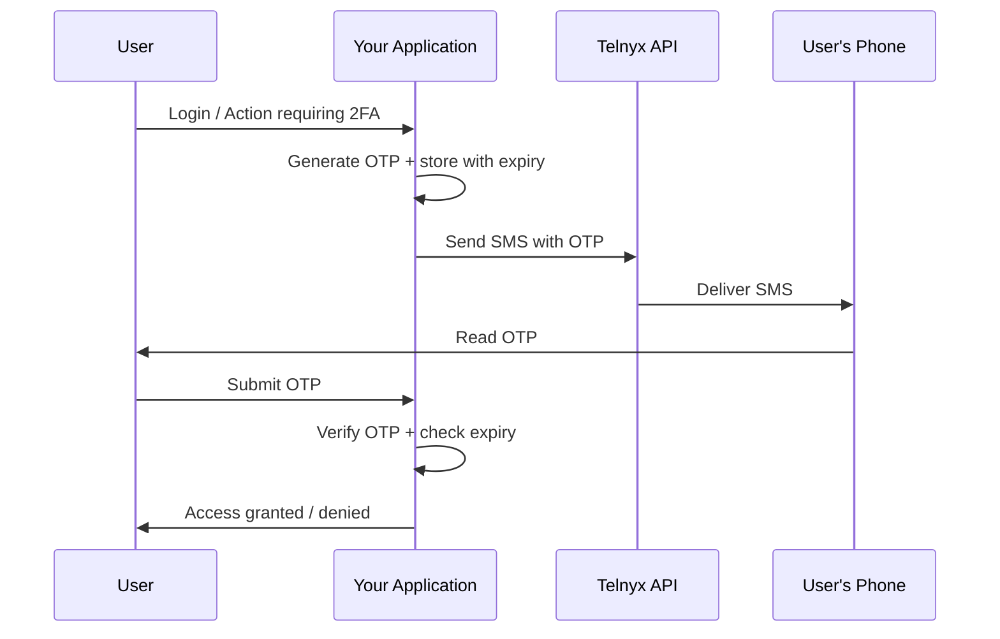

# Two-Factor Authentication (2FA) via SMS

Implement SMS-based two-factor authentication with the Telnyx Messaging API. Includes OTP generation, delivery, verification, and security best practices.

Implement SMS-based two-factor authentication (2FA) using the Telnyx Messaging API. This guide covers generating, sending, and verifying one-time passwords (OTPs) with security best practices.

> **Note:** **Consider the Verify API first.** Telnyx offers a dedicated [Verify API](https://developers.telnyx.com/docs/identity/verify/index) that handles OTP generation, delivery, and verification for you — including retry logic, rate limiting, and multi-channel support (SMS, voice, WhatsApp). Use this guide only if you need full control over the 2FA flow.

## How SMS 2FA works



***

## Generate and send an OTP

Generate a cryptographically secure OTP and send it via SMS:

  ```python
  import os
  import secrets
  import time

  from telnyx import Telnyx

  client = Telnyx(api_key=os.environ.get("TELNYX_API_KEY"))

  # In production, use a database (Redis, PostgreSQL, etc.)
  otp_store = {}

  OTP_LENGTH = 6
  OTP_EXPIRY_SECONDS = 300  # 5 minutes

  def generate_otp() -> str:
      """Generate a cryptographically secure numeric OTP."""
      # Use secrets module for secure random generation
      return "".join(secrets.choice("0123456789") for _ in range(OTP_LENGTH))

  def send_otp(phone_number: str) -> dict:
      """Generate and send an OTP to the given phone number."""
      otp = generate_otp()

      # Store OTP with expiry and attempt counter
      otp_store[phone_number] = {
          "otp": otp,
          "expires_at": time.time() + OTP_EXPIRY_SECONDS,
          "attempts": 0,
          "max_attempts": 3,
      }

      # Send via Telnyx
      response = client.messages.send(
          from_=os.environ.get("TELNYX_FROM_NUMBER"),
          to=phone_number,
          text=f"Your verification code is: {otp}. It expires in 5 minutes.",
      )

      return {"message_id": response.data.id, "expires_in": OTP_EXPIRY_SECONDS}

  def verify_otp(phone_number: str, submitted_otp: str) -> bool:
      """Verify the submitted OTP. Returns True if valid."""
      record = otp_store.get(phone_number)
      if not record:
          return False

      # Check expiry
      if time.time() > record["expires_at"]:
          del otp_store[phone_number]
          return False

      # Check attempts
      record["attempts"] += 1
      if record["attempts"] > record["max_attempts"]:
          del otp_store[phone_number]
          return False

      # Constant-time comparison to prevent timing attacks
      if secrets.compare_digest(record["otp"], submitted_otp):
          del otp_store[phone_number]  # One-time use
          return True

      return False

  # Example usage
  result = send_otp("+15559876543")
  print(f"OTP sent, message ID: {result['message_id']}")

  # Later, when user submits the code:
  # is_valid = verify_otp("+15559876543", "123456")
  ```

  ```javascript
  import Telnyx from 'telnyx';
  import crypto from 'crypto';

  const client = new Telnyx({ apiKey: process.env.TELNYX_API_KEY });

  // In production, use Redis or a database
  const otpStore = new Map();

  const OTP_LENGTH = 6;
  const OTP_EXPIRY_MS = 5 * 60 * 1000; // 5 minutes

  function generateOtp() {
    // Cryptographically secure numeric OTP
    const bytes = crypto.randomBytes(OTP_LENGTH);
    return Array.from(bytes).map(b => b % 10).join('');
  }

  async function sendOtp(phoneNumber) {
    const otp = generateOtp();

    otpStore.set(phoneNumber, {
      otp,
      expiresAt: Date.now() + OTP_EXPIRY_MS,
      attempts: 0,
      maxAttempts: 3,
    });

    const response = await client.messages.send({
      from: process.env.TELNYX_FROM_NUMBER,
      to: phoneNumber,
      text: `Your verification code is: ${otp}. It expires in 5 minutes.`,
    });

    return { messageId: response.data.id, expiresIn: OTP_EXPIRY_MS / 1000 };
  }

  function verifyOtp(phoneNumber, submittedOtp) {
    const record = otpStore.get(phoneNumber);
    if (!record) return false;

    if (Date.now() > record.expiresAt) {
      otpStore.delete(phoneNumber);
      return false;
    }

    record.attempts++;
    if (record.attempts > record.maxAttempts) {
      otpStore.delete(phoneNumber);
      return false;
    }

    // Constant-time comparison
    if (crypto.timingSafeEqual(
      Buffer.from(record.otp),
      Buffer.from(submittedOtp)
    )) {
      otpStore.delete(phoneNumber);
      return true;
    }

    return false;
  }

  // Usage
  const result = await sendOtp('+15559876543');
  console.log(`OTP sent, message ID: ${result.messageId}`);
  ```

  ```ruby
  require "telnyx"
  require "securerandom"

  Telnyx.api_key = ENV["TELNYX_API_KEY"]

  # In production, use Redis or a database
  $otp_store = {}

  OTP_LENGTH = 6
  OTP_EXPIRY_SECONDS = 300 # 5 minutes

  def generate_otp
    SecureRandom.random_number(10**OTP_LENGTH).to_s.rjust(OTP_LENGTH, "0")
  end

  def send_otp(phone_number)
    otp = generate_otp

    $otp_store[phone_number] = {
      otp: otp,
      expires_at: Time.now + OTP_EXPIRY_SECONDS,
      attempts: 0,
      max_attempts: 3
    }

    response = Telnyx::Message.create(
      from: ENV["TELNYX_FROM_NUMBER"],
      to: phone_number,
      text: "Your verification code is: #{otp}. It expires in 5 minutes."
    )

    { message_id: response.id, expires_in: OTP_EXPIRY_SECONDS }
  end

  def verify_otp(phone_number, submitted_otp)
    record = $otp_store[phone_number]
    return false unless record
    return ($otp_store.delete(phone_number); false) if Time.now > record[:expires_at]

    record[:attempts] += 1
    return ($otp_store.delete(phone_number); false) if record[:attempts] > record[:max_attempts]

    if ActiveSupport::SecurityUtils.secure_compare(record[:otp], submitted_otp)
      $otp_store.delete(phone_number)
      true
    else
      false
    end
  end

  result = send_otp("+15559876543")
  puts "OTP sent, message ID: #{result[:message_id]}"
  ```

  ```go
  package main

  import (
  	"context"
  	"crypto/rand"
  	"crypto/subtle"
  	"fmt"
  	"math/big"
  	"os"
  	"sync"
  	"time"

  	"github.com/team-telnyx/telnyx-go"
  	"github.com/team-telnyx/telnyx-go/option"
  )

  const (
  	otpLength        = 6
  	otpExpirySeconds = 300
  	maxAttempts      = 3
  )

  type OTPRecord struct {
  	OTP       string
  	ExpiresAt time.Time
  	Attempts  int
  }

  var (
  	otpStore = make(map[string]*OTPRecord)
  	mu       sync.Mutex
  )

  func generateOTP() string {
  	otp := make([]byte, otpLength)
  	for i := range otp {
  		n, _ := rand.Int(rand.Reader, big.NewInt(10))
  		otp[i] = byte('0') + byte(n.Int64())
  	}
  	return string(otp)
  }

  func sendOTP(client *telnyx.Client, phone string) (string, error) {
  	otp := generateOTP()

  	mu.Lock()
  	otpStore[phone] = &OTPRecord{
  		OTP:       otp,
  		ExpiresAt: time.Now().Add(otpExpirySeconds * time.Second),
  	}
  	mu.Unlock()

  	resp, err := client.Messages.Send(context.TODO(), telnyx.MessageSendParams{
  		From: os.Getenv("TELNYX_FROM_NUMBER"),
  		To:   phone,
  		Text: fmt.Sprintf("Your verification code is: %s. It expires in 5 minutes.", otp),
  	})
  	if err != nil {
  		return "", err
  	}
  	return resp.Data.ID, nil
  }

  func verifyOTP(phone, submitted string) bool {
  	mu.Lock()
  	defer mu.Unlock()

  	record, ok := otpStore[phone]
  	if !ok || time.Now().After(record.ExpiresAt) {
  		delete(otpStore, phone)
  		return false
  	}

  	record.Attempts++
  	if record.Attempts > maxAttempts {
  		delete(otpStore, phone)
  		return false
  	}

  	if subtle.ConstantTimeCompare([]byte(record.OTP), []byte(submitted)) == 1 {
  		delete(otpStore, phone)
  		return true
  	}
  	return false
  }

  func main() {
  	client := telnyx.NewClient(option.WithAPIKey(os.Getenv("TELNYX_API_KEY")))
  	msgID, err := sendOTP(client, "+15559876543")
  	if err != nil {
  		panic(err)
  	}
  	fmt.Printf("OTP sent, message ID: %s\n", msgID)
  }
  ```

  ```java
  package com.telnyx.example;

  import com.telnyx.sdk.client.TelnyxClient;
  import com.telnyx.sdk.client.okhttp.TelnyxOkHttpClient;
  import com.telnyx.sdk.models.messages.MessageSendParams;

  import java.security.MessageDigest;
  import java.security.SecureRandom;
  import java.time.Instant;
  import java.util.concurrent.ConcurrentHashMap;

  public final class OtpService {

      private static final int OTP_LENGTH = 6;
      private static final int OTP_EXPIRY_SECONDS = 300;
      private static final int MAX_ATTEMPTS = 3;
      private static final SecureRandom RANDOM = new SecureRandom();

      record OtpRecord(String otp, Instant expiresAt, int attempts) {
          OtpRecord withAttempt() {
              return new OtpRecord(otp, expiresAt, attempts + 1);
          }
      }

      private final ConcurrentHashMap<String, OtpRecord> store = new ConcurrentHashMap<>();
      private final TelnyxClient client;

      public OtpService() {
          this.client = TelnyxOkHttpClient.fromEnv();
      }

      public String generateOtp() {
          StringBuilder sb = new StringBuilder(OTP_LENGTH);
          for (int i = 0; i < OTP_LENGTH; i++) {
              sb.append(RANDOM.nextInt(10));
          }
          return sb.toString();
      }

      public String sendOtp(String phoneNumber) {
          String otp = generateOtp();
          store.put(phoneNumber, new OtpRecord(
              otp, Instant.now().plusSeconds(OTP_EXPIRY_SECONDS), 0
          ));

          var params = MessageSendParams.builder()
              .from(System.getenv("TELNYX_FROM_NUMBER"))
              .to(phoneNumber)
              .text("Your verification code is: " + otp + ". It expires in 5 minutes.")
              .build();

          var response = client.messages().send(params);
          return response.data().id();
      }

      public boolean verifyOtp(String phoneNumber, String submitted) {
          OtpRecord record = store.get(phoneNumber);
          if (record == null || Instant.now().isAfter(record.expiresAt())) {
              store.remove(phoneNumber);
              return false;
          }
          OtpRecord updated = record.withAttempt();
          store.put(phoneNumber, updated);
          if (updated.attempts() > MAX_ATTEMPTS) {
              store.remove(phoneNumber);
              return false;
          }
          if (MessageDigest.isEqual(
                  record.otp().getBytes(), submitted.getBytes())) {
              store.remove(phoneNumber);
              return true;
          }
          return false;
      }

      public static void main(String[] args) {
          OtpService service = new OtpService();
          String msgId = service.sendOtp("+15559876543");
          System.out.println("OTP sent, message ID: " + msgId);
      }
  }
  ```

  ```csharp .NET theme={null}
  using System;
  using System.Collections.Concurrent;
  using System.Security.Cryptography;
  using Telnyx;

  public class OtpService
  {
      private const int OtpLength = 6;
      private static readonly TimeSpan OtpExpiry = TimeSpan.FromMinutes(5);
      private const int MaxAttempts = 3;

      private record OtpRecord(string Otp, DateTime ExpiresAt, int Attempts);

      private readonly ConcurrentDictionary<string, OtpRecord> _store = new();

      public async Task<string> SendOtpAsync(string phoneNumber)
      {
          var otp = GenerateOtp();
          _store[phoneNumber] = new OtpRecord(otp, DateTime.UtcNow + OtpExpiry, 0);

          TelnyxConfiguration.SetApiKey(Environment.GetEnvironmentVariable("TELNYX_API_KEY"));
          var service = new MessageService();
          var response = await service.SendAsync(new MessageSendOptions
          {
              From = Environment.GetEnvironmentVariable("TELNYX_FROM_NUMBER"),
              To = phoneNumber,
              Text = $"Your verification code is: {otp}. It expires in 5 minutes."
          });

          return response.Data.Id;
      }

      public bool VerifyOtp(string phoneNumber, string submitted)
      {
          if (!_store.TryGetValue(phoneNumber, out var record))
              return false;

          if (DateTime.UtcNow > record.ExpiresAt)
          {
              _store.TryRemove(phoneNumber, out _);
              return false;
          }

          var updated = record with { Attempts = record.Attempts + 1 };
          _store[phoneNumber] = updated;

          if (updated.Attempts > MaxAttempts)
          {
              _store.TryRemove(phoneNumber, out _);
              return false;
          }

          if (CryptographicOperations.FixedTimeEquals(
              System.Text.Encoding.UTF8.GetBytes(record.Otp),
              System.Text.Encoding.UTF8.GetBytes(submitted)))
          {
              _store.TryRemove(phoneNumber, out _);
              return true;
          }

          return false;
      }

      private static string GenerateOtp()
      {
          var bytes = RandomNumberGenerator.GetBytes(OtpLength);
          return string.Concat(Array.ConvertAll(bytes, b => (b % 10).ToString()));
      }
  }
  ```

  ```php
  <?php
  require_once 'vendor/autoload.php';

  \Telnyx\Telnyx::setApiKey(getenv('TELNYX_API_KEY'));

  // In production, use Redis or a database
  $otpStore = [];

  define('OTP_LENGTH', 6);
  define('OTP_EXPIRY_SECONDS', 300);
  define('MAX_ATTEMPTS', 3);

  function generateOtp(): string
  {
      $otp = '';
      for ($i = 0; $i < OTP_LENGTH; $i++) {
          $otp .= random_int(0, 9);
      }
      return $otp;
  }

  function sendOtp(string $phoneNumber): array
  {
      global $otpStore;
      $otp = generateOtp();

      $otpStore[$phoneNumber] = [
          'otp' => $otp,
          'expires_at' => time() + OTP_EXPIRY_SECONDS,
          'attempts' => 0,
      ];

      $response = \Telnyx\Message::Create([
          'from' => getenv('TELNYX_FROM_NUMBER'),
          'to' => $phoneNumber,
          'text' => "Your verification code is: {$otp}. It expires in 5 minutes.",
      ]);

      return ['message_id' => $response->id, 'expires_in' => OTP_EXPIRY_SECONDS];
  }

  function verifyOtp(string $phoneNumber, string $submitted): bool
  {
      global $otpStore;

      if (!isset($otpStore[$phoneNumber])) {
          return false;
      }

      $record = &$otpStore[$phoneNumber];

      if (time() > $record['expires_at']) {
          unset($otpStore[$phoneNumber]);
          return false;
      }

      $record['attempts']++;
      if ($record['attempts'] > MAX_ATTEMPTS) {
          unset($otpStore[$phoneNumber]);
          return false;
      }

      if (hash_equals($record['otp'], $submitted)) {
          unset($otpStore[$phoneNumber]);
          return true;
      }

      return false;
  }

  // Usage
  $result = sendOtp('+15559876543');
  echo "OTP sent, message ID: {$result['message_id']}\n";
  ```

***

## Security best practices

**Use cryptographically secure random generation**

    Never use `Math.random()`, `rand()`, or similar non-cryptographic functions for OTP generation. Use:

    | Language | Secure Function                             |
    | -------- | ------------------------------------------- |
    | Python   | `secrets.choice()` or `secrets.token_hex()` |
    | Node     | `crypto.randomBytes()`                      |
    | Ruby     | `SecureRandom.random_number()`              |
    | Go       | `crypto/rand.Int()`                         |
    | Java     | `SecureRandom.nextInt()`                    |
    | .NET     | `RandomNumberGenerator.GetBytes()`          |
    | PHP      | `random_int()`                              |

---

**Set expiry times**

    OTPs should expire after a short window (3-5 minutes is typical). Never allow OTPs to be valid indefinitely.

    * Store the expiry timestamp alongside the OTP
    * Check expiry before validating
    * Delete expired OTPs proactively

---

**Limit verification attempts**

    Allow a maximum of 3 verification attempts per OTP. After exceeding the limit, invalidate the OTP and require the user to request a new one. This prevents brute-force attacks on short numeric codes.

---

**Use constant-time comparison**

    Always use constant-time string comparison when verifying OTPs to prevent timing attacks:

    | Language | Function                                    |
    | -------- | ------------------------------------------- |
    | Python   | `secrets.compare_digest()`                  |
    | Node     | `crypto.timingSafeEqual()`                  |
    | Go       | `subtle.ConstantTimeCompare()`              |
    | Java     | `MessageDigest.isEqual()`                   |
    | .NET     | `CryptographicOperations.FixedTimeEquals()` |
    | PHP      | `hash_equals()`                             |

---

**Rate limit OTP requests**

    Prevent abuse by limiting how frequently a user can request new OTPs:

    * **Per phone number:** Maximum 1 OTP request per 60 seconds
    * **Per IP address:** Maximum 10 OTP requests per hour
    * **Per account:** Maximum 5 OTP requests per hour

    Return the same "OTP sent" response regardless of whether the number exists in your system to prevent enumeration attacks.

---

**Use numeric-only codes**

    Use numeric-only OTPs (e.g., `847291`) rather than alphanumeric codes. They are:

    * Easier for users to type on mobile
    * Compatible with SMS autofill on iOS and Android
    * Sufficient security when combined with attempt limits and expiry

    A 6-digit code has 1,000,000 possible values — with a 3-attempt limit, the probability of guessing correctly is 0.0003%.

---

**Support SMS autofill**

    iOS and Android can automatically detect and fill OTP codes from SMS. To enable this:

    **Android (SMS Retriever API):**
    Include your app's hash at the end of the message:

    ```
    Your verification code is: 847291

    FA+9qCX9VSu
    ```

    **iOS:**
    iOS automatically detects codes from messages containing "code" or "passcode." No special formatting needed, but keeping the OTP on its own line helps.

---

***

## When to use the Verify API instead

The [Telnyx Verify API](https://developers.telnyx.com/docs/identity/verify/index) is a better choice when:

| Requirement                            | DIY (this guide)        | Verify API      |
| -------------------------------------- | ----------------------- | --------------- |
| OTP generation & storage               | You build it            | Handled for you |
| Retry logic                            | You build it            | Built-in        |
| Rate limiting                          | You build it            | Built-in        |
| Multi-channel (SMS + Voice + WhatsApp) | Separate implementation | Single API      |
| Delivery status tracking               | Manual webhook handling | Built-in        |
| Compliance & audit logging             | You build it            | Built-in        |

Use this guide's DIY approach only when you need full control over the OTP flow, custom message templates, or integration with existing verification systems.

***

## Related resources

  - [Verify API](https://developers.telnyx.com/docs/identity/verify/index) — Managed OTP verification with built-in rate limiting and multi-channel support.

  - [Verify API Quickstart](../tutorial/quickstart-for-telnyx-verify.md) — Get started with the Verify API in minutes.

  - [Rate Limiting](rate-limiting.md) — Understand message throughput limits for OTP delivery.

  - [Send Your First Message](send-your-first-message.md) — Get started with the Telnyx Messaging API.


## Related Pages

- [Voice SDK Authentication via JWTs](../runbooks/voice-sdk-authentication-via-jwts.md)
