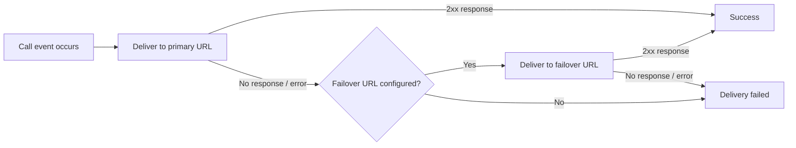

# Voice API Webhooks

Reference for Voice API webhook events, payloads, configuration, and delivery behavior.

## Overview

Voice API webhooks are HTTP callbacks that notify your application in real time when events occur during a call — a call is initiated, audio playback finishes, a recording is saved, and so on. Your application receives a JSON payload for each event and can respond with call control commands to drive the call flow.

## Webhook delivery

When an event occurs on a call, Telnyx delivers the webhook to your configured URL. If the primary URL fails, the webhook is sent to the failover URL (if configured).



For details on retry logic, signature verification, and general webhook behavior, see [Webhook Fundamentals](../reference/webhook-fundamentals-complete-guide-to-telnyx-webhooks.md).

## Configuration

Webhooks can be configured at three levels:

1. **Connection webhook config** — default webhook URL and settings tied to a [Voice API connection](https://portal.telnyx.com/#/app/connections) in Mission Control.
2. **Custom webhook config** — per-command overrides. Pass `webhook_url` and `webhook_url_method` in any call control command to route that command's webhooks to a different endpoint.
3. **Events webhook config** — advanced configuration that routes specific event types to different URLs.

You can also manage webhook settings programmatically via the [Call Control Applications API](https://developers.telnyx.com/api-reference/call-control-applications/list-call-control-applications). Use [Create](https://developers.telnyx.com/api-reference/call-control-applications/create-a-call-control-application) or [Update](https://developers.telnyx.com/api-reference/call-control-applications/update-a-call-control-application) to set webhook URLs, failover URLs, API version, and timeout values on a connection.

### Configuration parameters

| Parameter                    | Type    | Description                                             |
| ---------------------------- | ------- | ------------------------------------------------------- |
| `webhook_event_url`          | String  | Primary destination for webhook delivery                |
| `webhook_event_failover_url` | String  | Secondary URL used when the primary fails               |
| `webhook_api_version`        | String  | Webhook format version (`"1"` or `"2"`)                 |
| `webhook_timeout_secs`       | Integer | Seconds to wait before timing out (0–30, default: null) |

## HTTP methods and headers

### Methods

* Webhooks use the `POST` method by default. Pass `webhook_url_method` as `GET` in a call control command to receive that command's webhook payloads as URL query parameters instead of a JSON body.

### Headers

Every webhook request includes:

| Header                     | Description                                                                                                     |
| -------------------------- | --------------------------------------------------------------------------------------------------------------- |
| `Content-Type`             | `application/json` (POST requests)                                                                              |
| `User-Agent`               | `telnyx-webhooks`                                                                                               |
| `Telnyx-Signature-Ed25519` | ED25519 signature for [verification](../reference/webhook-fundamentals-complete-guide-to-telnyx-webhooks.md#webhook-signing) |
| `Telnyx-Timestamp`         | Unix timestamp when the webhook was generated                                                                   |

## Webhook payload structure

All Voice API webhooks share a common envelope. Below is an example `call.initiated` payload:

```json theme={null}
{
  "data": {
    "record_type": "event",
    "event_type": "call.initiated",
    "id": "0ccc7b54-4df3-4bca-a65a-3da1ecc777f0",
    "occurred_at": "2018-02-02T22:25:27.521992Z",
    "payload": {
      "call_control_id": "d14dbcee-880b-11eb-8204-02420a0f7568",
      "connection_id": "7267xxxxxxxxxxxxxx",
      "call_leg_id": "d14dbcee-880b-11eb-8204-02420a0f7568",
      "call_session_id": "428c31b6-abf3-3bc1-b7f4-5013ef9657c1",
      "client_state": "aGF2ZSBhIG5pY2UgZGF5ID1d",
      "from": "+12025550133",
      "to": "+12025550131",
      "direction": "incoming",
      "state": "parked"
    }
  },
  "meta": {
    "attempt": 1,
    "delivered_to": "https://example.com/webhooks"
  }
}
```

### Common fields

| Field             | Location       | Description                                                         |
| ----------------- | -------------- | ------------------------------------------------------------------- |
| `record_type`     | `data`         | Always `"event"`                                                    |
| `event_type`      | `data`         | Event name (see [Event types](#event-types) below)                  |
| `id`              | `data`         | Unique identifier for this webhook event                            |
| `occurred_at`     | `data`         | ISO 8601 timestamp of when the event occurred                       |
| `call_control_id` | `data.payload` | ID used to issue call control commands for this call leg            |
| `call_leg_id`     | `data.payload` | Unique ID for this call leg — use to correlate webhooks             |
| `call_session_id` | `data.payload` | Shared ID across related call legs (e.g., both sides of a transfer) |
| `connection_id`   | `data.payload` | Voice API connection used for the call                              |
| `client_state`    | `data.payload` | Base64-encoded state passed through from a previous command         |
| `from`            | `data.payload` | Calling party number or SIP URI                                     |
| `to`              | `data.payload` | Called party number or SIP URI                                      |
| `attempt`         | `meta`         | Delivery attempt number (increments on retries)                     |
| `delivered_to`    | `meta`         | URL the webhook was sent to                                         |

## Event types

The following event types are fired by the Voice API. Each event type appears in the `event_type` field of the webhook payload.

### Call state

| Event            | Description                       | Triggered by                                                                                                          |
| ---------------- | --------------------------------- | --------------------------------------------------------------------------------------------------------------------- |
| `call.initiated` | A new call leg has been created   | [Dial](https://developers.telnyx.com/api-reference/call-commands/dial), [Transfer](https://developers.telnyx.com/api-reference/call-commands/transfer-call), or an inbound call |
| `call.answered`  | The call has been answered        | [Answer](https://developers.telnyx.com/api-reference/call-commands/answer-call), or remote party picks up                                          |
| `call.hangup`    | The call has ended                | [Hangup](https://developers.telnyx.com/api-reference/call-commands/hangup-call), Reject, or remote hangup                                          |
| `call.bridged`   | Two call legs have been connected | [Bridge](https://developers.telnyx.com/api-reference/call-commands/bridge-calls), [Transfer](https://developers.telnyx.com/api-reference/call-commands/transfer-call)           |

### Audio playback

| Event                   | Description                          | Triggered by                                                                                                                     |
| ----------------------- | ------------------------------------ | -------------------------------------------------------------------------------------------------------------------------------- |
| `call.playback.started` | Audio file playback has started      | [Play audio](https://developers.telnyx.com/api-reference/call-commands/play-audio-url), [Gather using audio](https://developers.telnyx.com/api-reference/call-commands/gather-using-audio) |
| `call.playback.ended`   | Audio file playback has finished     | Playback completes or [Stop playback](https://developers.telnyx.com/api-reference/call-commands/stop-audio-playback)                                          |
| `call.speak.started`    | Text-to-speech playback has started  | [Speak text](https://developers.telnyx.com/api-reference/call-commands/speak-text)                                                                            |
| `call.speak.ended`      | Text-to-speech playback has finished | Speak completes or [Stop playback](https://developers.telnyx.com/api-reference/call-commands/stop-audio-playback)                                             |

### DTMF and gather

| Event                | Description                      | Triggered by                                                                                                                                                                |
| -------------------- | -------------------------------- | --------------------------------------------------------------------------------------------------------------------------------------------------------------------------- |
| `call.dtmf.received` | A DTMF digit was received        | Caller presses keypad during [Gather using audio](https://developers.telnyx.com/api-reference/call-commands/gather-using-audio) or [Gather using speak](https://developers.telnyx.com/api-reference/call-commands/gather-using-speak) |
| `call.gather.ended`  | A gather operation has completed | Gather finishes (timeout, max digits, or terminating key)                                                                                                                   |

### Recording

| Event                  | Description                     | Triggered by                                                                                |
| ---------------------- | ------------------------------- | ------------------------------------------------------------------------------------------- |
| `call.recording.saved` | A call recording has been saved | [Recording stop](https://developers.telnyx.com/api-reference/call-commands/recording-stop), or call ends while recording |

### Answering machine detection (AMD)

| Event                                  | Description                                   | Triggered by                                                                                            |
| -------------------------------------- | --------------------------------------------- | ------------------------------------------------------------------------------------------------------- |
| `call.machine.detection.ended`         | Standard AMD has determined human vs. machine | [Dial](https://developers.telnyx.com/api-reference/call-commands/dial) with `answering_machine_detection` enabled                    |
| `call.machine.greeting.ended`          | Machine greeting has finished (beep detected) | [Dial](https://developers.telnyx.com/api-reference/call-commands/dial) with `answering_machine_detection` set to detect greeting end |
| `call.machine.premium.detection.ended` | Premium AMD has determined human vs. machine  | [Dial](https://developers.telnyx.com/api-reference/call-commands/dial) with premium AMD enabled                                      |
| `call.machine.premium.greeting.ended`  | Premium AMD greeting/beep detection completed | [Dial](https://developers.telnyx.com/api-reference/call-commands/dial) with premium AMD greeting detection                           |

### Media forking

| Event               | Description               | Triggered by                                                            |
| ------------------- | ------------------------- | ----------------------------------------------------------------------- |
| `call.fork.started` | Media forking has started | [Forking start](https://developers.telnyx.com/api-reference/call-commands/forking-start)             |
| `call.fork.stopped` | Media forking has stopped | [Forking stop](https://developers.telnyx.com/api-reference/call-commands/forking-stop), or call ends |

### Queue

| Event           | Description                   | Triggered by                                         |
| --------------- | ----------------------------- | ---------------------------------------------------- |
| `call.enqueued` | Call was placed in a queue    | [Enqueue](https://developers.telnyx.com/api-reference/call-commands/enqueue-call) |
| `call.dequeued` | Call was removed from a queue | Dequeue command or call ends                         |

### Transcription

| Event                | Description                           | Triggered by                                                            |
| -------------------- | ------------------------------------- | ----------------------------------------------------------------------- |
| `call.transcription` | Real-time transcription data received | [Transcription start](https://developers.telnyx.com/api-reference/call-commands/transcription-start) |

### Streaming

| Event               | Description                 | Triggered by                                                                |
| ------------------- | --------------------------- | --------------------------------------------------------------------------- |
| `streaming.started` | Media streaming has started | [Streaming start](https://developers.telnyx.com/api-reference/call-commands/streaming-start)             |
| `streaming.stopped` | Media streaming has stopped | [Streaming stop](https://developers.telnyx.com/api-reference/call-commands/streaming-stop), or call ends |

## Response codes

Your webhook endpoint's HTTP response determines whether delivery is considered successful:

| Code          | Meaning                | Behavior                     |
| ------------- | ---------------------- | ---------------------------- |
| **2xx**       | Success                | Webhook acknowledged         |
| **3xx**       | Redirect               | Followed (up to 3 redirects) |
| **408, 429**  | Timeout / Rate limited | Retried                      |
| **Other 4xx** | Client error           | Not retried                  |
| **5xx**       | Server error           | Retried                      |

## Debugging deliveries

Use the [Webhook Deliveries API](https://developers.telnyx.com/api-reference/webhooks/list-webhook-deliveries) to inspect delivery history for your account. You can filter by status, event type, and time range — useful for diagnosing missed or failed webhooks.

```bash theme={null}


## Related Pages

- [Receiving RCS Webhooks](../runbooks/receiving-rcs-webhooks.md)
