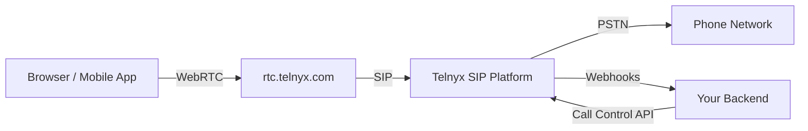

# WebRTC Voice SDKs Architecture

To properly architect solutions and/or troubleshoot issues, one must understand how WebRTC Voice SDK fits among Telnyx's product portfolio.

This is explained in the following set of statements —

## WebRTC Voice SDKs CANNOT be used on its own for calling

They merely lower the barriers for users to incorporate voice functionalities in their applications, i.e. instantiate a call leg. `rtc.telnyx.com` acts as the translation layer where on the SDK facing side, it adheres to the WebRTC standard and on the SIP facing side, speaks SIP protocol.

To the core SIP platform, `rtc.telnyx.com` is merely another SIP UA. This is clearly illustrated by the fact that all methods of authenticating an SDK client are based on [SIP connection](https://developers.telnyx.com/docs/voice/webrtc/sdk-commonalities#authentication).

This setup …

* avails WebRTC Voice SDKs the worldwide PSTN calling coverage and, more importantly,
* puts those calls under the umbrella of Programmable Voice API.

## WebRTC Voice SDKs CANNOT be used on its own to orchestrate call flow

They merely allow some form of local control, e.g. un/hold, un/mute, sending DTMF digits. To orchestrate call flow or manipulate audio, TeXML or Call Control API must be used.

Consider this example – a simple prepaid calling app where the user is told the remaining number of minutes before the call is placed. In the case of inadequate balance, they are told to top up before the call is hung up gracefully.

The Voice SDKs are insufficient to achieve this simple call flow on their own. Instead, it is necessary to incorporate call control API —

* The call leg instantiated by the SDK must be parked via a setting on the SIP connection.
* The user’s backend must
  * respond to Telnyx webhooks,
  * inject the necessary custom Text-To-Speach audio,
  * place another outbound leg to the intended PSTN destination (or hangup due to insufficient balance), and finally,
  * bridge the WebRTC call leg with the PSTN leg

## WebRTC SDKs’ role in the Telnyx Voice Product Suite

To conclude, WebRTC SDKs’ role in the Telnyx voice product suite is one where

* They bring the Telnyx voice infrastructure closer to the ultimate end users. Developers do not need to maintain their own voice infrastructure. Instead, they can focus on building user facing applications and business logic.
* They lower the barrier to access Telnyx’s worldwide PSTN coverage. Developers do not need to know SIP. Instead, they can work with the widely adopted WebRTC standardization and API.
* They unify all the crucial building blocks of a CPaaS platform under the Telnyx umbrella. Developers do not need to manage multiple integrations and vendors in their stack.

## Related Pages

- [WebRTC Voice SDKs Commonalities](../runbooks/webrtc-voice-sdks-commonalities.md)
- [WebRTC Voice SDKs Debug Data](../runbooks/webrtc-voice-sdks-debug-data.md)
- [WebRTC Voice SDKs Call Detail Records](../runbooks/webrtc-voice-sdks-call-detail-records.md)
- [WebRTC Voice SDKs Fundamentals](../runbooks/webrtc-voice-sdks-fundamentals.md)
