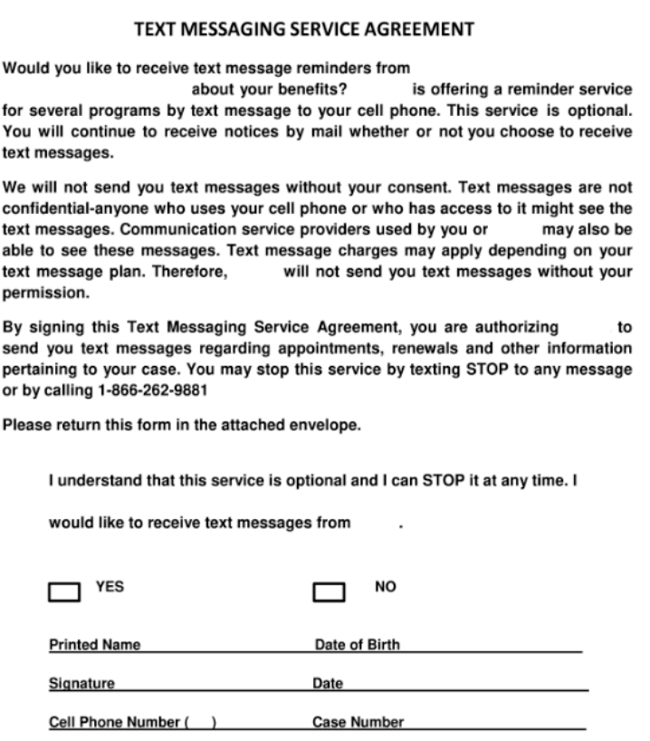
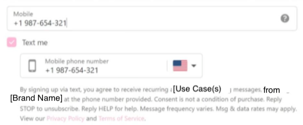

# 10DLC Campaign Registration and Compliance Guide

*Part 4 of 5 — see also: [Part 1](10dlc-campaign-registration-and-compliance-guide--part-1.md), [Part 2](10dlc-campaign-registration-and-compliance-guide--part-2.md), [Part 3](10dlc-campaign-registration-and-compliance-guide--part-3.md), [Part 5](10dlc-campaign-registration-and-compliance-guide--part-5.md)*

A consolidated reference for registering and maintaining 10DLC (10-Digit Long Code) A2P messaging campaigns on Telnyx, covering message flow, opt-in forms, keywords, privacy policy, sample messages, vetting, shared campaigns, and common carrier errors.

## Call-to-Action (CTA) Requirements

The CTA must ensure the consumer consents to receive text messages and understands the nature of the program. It must clearly and unambiguously display the following disclosures:

- Program (Brand) Name / Product Description.
- Message Frequency Disclosure (for example, "Message frequency may vary.").
- "Standard Message and Data Rates may apply" (if non-FTEU).
- "Reply STOP to opt out" (opt-out information may appear in the terms and conditions).
- "Reply HELP for help."
- Terms and Conditions OR a link to Terms and Conditions (not a popup).
- Privacy Policy OR a link to a Privacy Policy.
- Opt-in language must be specific to text messages only; it cannot include email or phone calls, which must be handled separately.
- The phone number field in the website form should be optional, not mandatory, for opt-ins.

For TCR compliance, all campaigns must include the URL for the Terms and Conditions and Privacy Policy under the CTA. Even though this information is available on the website, it must be displayed within TCR. TCR provides a specific section for the Privacy Policy and Terms and Conditions links, and these can either be added in those designated fields or within the CTA section.

### Implied Consent

If the consumer initiates the text message exchange and the business only responds with relevant information, no verbal or written permission is expected. The first message is always sent by the customer, and the workflow must clearly and unmistakably explain how the customer is contacting the business to provide implied consent.

### Express Consent

The consumer should give express permission before a business sends them a text message. Express consent may be given over text, on a form, on a website, verbally, or in writing.

- **Text:** The customer opts in by texting a specific keyword to a designated phone number. The workflow must include both the exact keyword and the designated phone number, with no details omitted. Example: "Customer opt-in by sending 'WELCOME' to phone number 123456789."
- **Form:** The customer provides consent by completing a form (electronic or paper). The form must be attached to TCR for verification. Example: "The customer completes a form at the doctor's office that includes opt-in language agreeing to receive text message communications."

- **Website:** The customer opts in through a webform that meets specific compliance requirements. The phone number field should not be mandatory. Opt-in language should appear at the bottom of the form, clearly stating frequency, msg & data rates, and that text messages will be sent. The opt-in must be exclusively for text messages and should not include email or calls, which must be handled separately.

Marketing use case example:

> "By submitting this form and signing up for texts, you consent to receive marketing text messages (e.g. promos, cart reminders) from [company name] at the number provided, including messages sent by autodialer. Consent is not a condition of purchase. Msg & data rates may apply. Msg frequency varies. Carriers are not liable for delayed or undelivered messages. Unsubscribe at any time by replying STOP or clicking the unsubscribe link (where available). Text HELP for support. Privacy Policy [link] & Terms [link]."

Best practices for website opt-in:

- If the opt-in takes place on the website but not on the main page, provide the specific URL where the opt-in occurs.
- Clearly specify the exact location on the site where it happens and include the appropriate opt-in language. Example: "Customers will opt-in through the main website form, which is located at the bottom of the page."
- If a popup form is used, specify that a popup form will appear for customers to opt in for text message communication.

- **Verbal:** Customers may provide verbal consent during a phone call or in person. The process must clearly outline the scenarios in which the customer is giving consent. Example: "The customer will verbally opt-in during a phone conversation with one of our customer service representatives, who will ask if they would like to receive text messages from our company."

### Express Written Consent

The consumer should give express written permission before a business sends them a text message, for example by signing a form. When a use case is verbal or over email/written, provide the script or sample of the CTA sent in writing to verify all aspects of the CTA are fulfilled. CTA requirements are based on T-Mobile Code of Conduct section 2.5 Calls-to-Action and CTIA Messaging Principles and Best Practices section 5.1.1.

## SHAFT and Robust Age Gates

Messaging content for controlled substances or for distribution of adult content may be subject to additional carrier review and should include robust age verification (for example, electronic confirmation of age and identity).

Examples of robust age gates include:

1. Document upload (government ID).
2. Third-party identity verification services.
3. Credit card verification.
4. Reply with your birthdate xx/xx/xxxx.
5. A web opt-in form field that requires the user to include their birthday.

Asking a user to "reply YES/AGREE" to confirm they are over a certain age is not considered robust age verification.

## Political Campaigns

For political campaigns, the following must be considered:

- Political / organization name.
- Politician / organization website.
- If donations are part of the program, the statement "Donations will be secured through ____ and Accreditation listing is ____." must be present in the program summary. A valid call-to-action and clear product description within the SMS terms of service which clearly discloses that donations will be solicited must be included.
- For messaging involving donations (political/charity), both the TCR CTA and the website CTA (opt-in) language must include a disclaimer that "Donations will be solicited."

## Best Practices for Approval

To maximize the chance of approval during the manual vetting process:

- Do not include forbidden use cases (cannabis, hate speech, etc.) to avoid rejection.
- Keep the brand, website, and sample messages consistent.
- Keep sample messages consistent with the selected use cases. A political campaign with 2FA sample messages will be rejected.
- Keep the email domain consistent with the company name. A brand registered as Telnyx with a gmail email address will be rejected (applies to large corporations that should have dedicated email domains).
- Submit only real, working websites.
- Send messages according to the brand that you registered.
- Ensure consumer opt-in is collected appropriately per the [CTIA guidelines](https://api.ctia.org/wp-content/uploads/2019/07/190719-CTIA-Messaging-Principles-and-Best-Practices-FINAL.pdf).
- Make the opt-in language available on your website if the message flow indicates a website opt-in.
- Include opt-out language in at least one sample message (for example, "Please reply STOP to opt out").
- Use express opt-in: every place that requires a phone number must have opt-in language and a checkbox. This applies to contact pages, donation pages, and similar. Opt-in language must include consent and opt-out instructions and links to the Privacy Policy and Terms and Conditions.
- The privacy policy cannot allow for the sharing or selling of end-user information to third parties.
- If the campaign was created with the Embedded Phone Number or Embedded Link attributes, the samples must contain the phone number or link.

If a campaign is rejected, a member of the Telnyx team will reach out to help fix the registration or resubmit.
