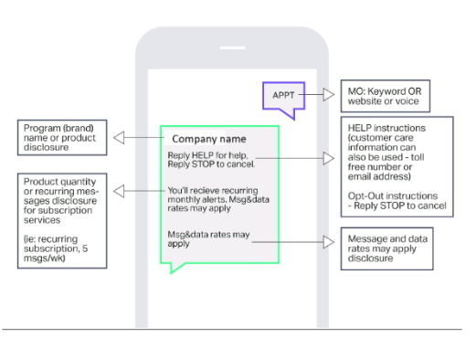
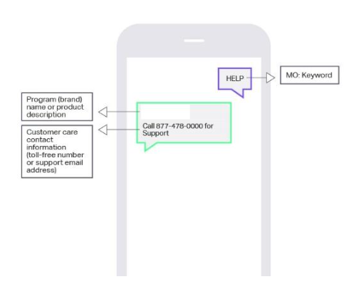
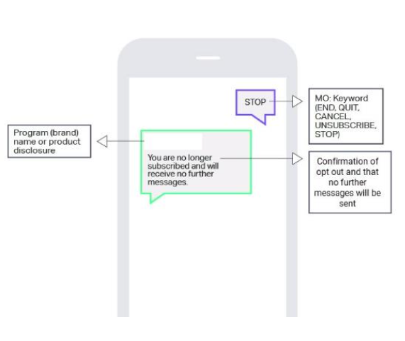
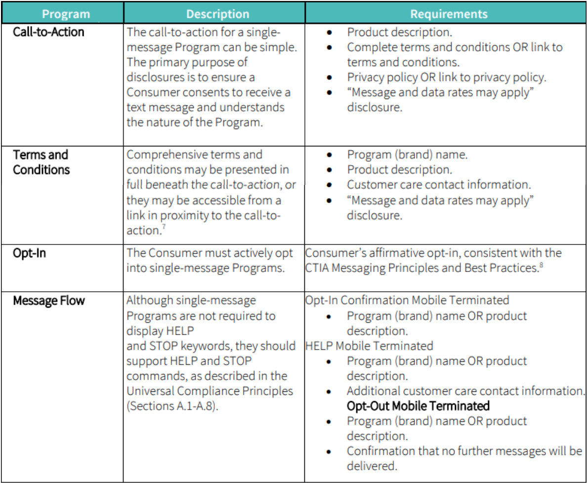
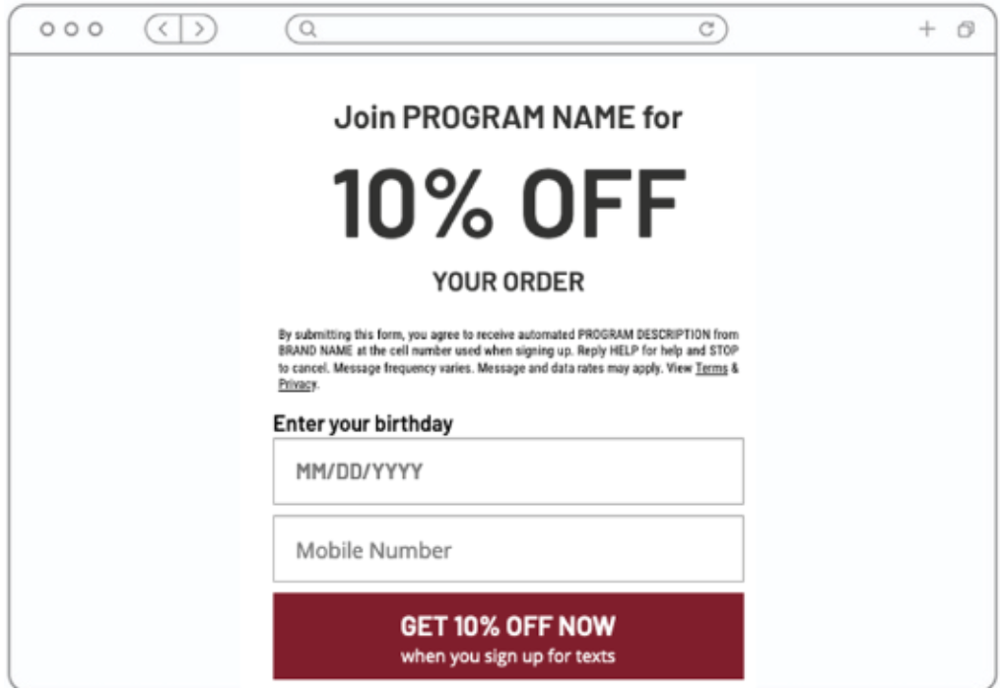

# 10DLC Registration and Compliance

*Part 4 of 5 — see also: [Part 1](10dlc-registration-and-compliance--part-1.md), [Part 2](10dlc-registration-and-compliance--part-2.md), [Part 3](10dlc-registration-and-compliance--part-3.md), [Part 5](10dlc-registration-and-compliance--part-5.md)*

A consolidated reference for registering and operating 10DLC messaging on Telnyx, covering the end-to-end brand and campaign workflow, mock testing, CTA and message flow requirements, opt-in form design, privacy policy language, sample messages, age gates, political campaigns, common errors, and associated fees.

## Subscriber Opt-in, Opt-out, and HELP

Each campaign must include keywords and sample messages for subscriber opt-in, opt-out, and HELP requests. There is a specific template that should be followed for these messages.

- **Opt-in confirmation message** — should include instructions on how to request help, the frequency of messages, and the program name or product description.

  

- **Help message** — should include program name or product description and customer care contact information.

  

- **Opt-out message** — should include program name or product description and confirmation of opt-out, and that no further messages will be sent.

  

  

## Terms and Conditions

Comprehensive terms and conditions may be presented in full beneath the CTA or accessed from a link in proximity to the CTA. Pop-ups are not a method for displaying terms and conditions. Where feasible, message senders may combine multiple program components (e.g., CTA and terms and conditions).

The following SMS program disclosures must be included within the terms and conditions:

- Program (brand) name
- Message frequency disclosure (not required for single-message programs)
- Product description
- Customer care contact information
- Opt-out information (not required for single-message programs)
- "Message and data rates may apply" disclosure (not required for FTEU-rated programs)

The terms must include the types of messages consumers can expect to receive, texting cadence, message and data rate notices, any associated costs, privacy policy, opt-out instructions, and other terms of use.

## Privacy Policy Requirements

The privacy policy must be for the brand being registered. Resellers cannot substitute their own privacy policy in lieu of the brand's, and the Google Privacy Policy will not be accepted in lieu of the brand privacy policy. Carriers look for the verbiage either in the privacy policy (linked on the opt-in form) or directly on the opt-in form.

The bare minimum accepted by carriers is something like:

> Your mobile information will not be sold or shared with third parties for promotional or marketing purposes.

A more robust sharing disclosure that carriers prefer:

> All the above categories exclude text messaging originator optin data and consent; this information will not be shared with any third parties.

> We will not share your opt-in to an SMS campaign with any third party for purposes unrelated to providing you with the services of that campaign. We may share your Personal Data, including your SMS opt-in or consent status, with third parties that help us provide our messaging services, including but not limited to platform providers, phone companies, and any other vendors who assist us in the delivery of text messages.

The verbiage must cover any method of transfer — saying mobile data will not be sold is insufficient, because sharing (including transfers between affiliates or friendly businesses without a sale) is also prohibited under 10DLC.

Message senders are responsible for protecting consumer privacy and must comply with applicable privacy laws. A privacy policy must be maintained for all programs and accessible from the initial CTA. When a privacy policy link is displayed, it should be labeled clearly. In all cases, terms and conditions and privacy policy disclosures must provide up-to-date, accurate information about program details and functionality.

Any mention of third-party data sharing, renting, or selling is disallowed unless the following disclosure is included: *"All the above categories exclude text messaging originator opt-in data and consent; this information will not be shared with any third parties."* If the privacy policy already provides for data sharing or selling to nonaffiliated third parties, it must clarify that such sharing or selling will not include a customer's SMS opt-in data or consent status (because explicit, one-to-one consent is required for SMS). If the privacy policy does not currently mention data sharing, insert a similar clarification that SMS opt-in or consent status will not be shared for non-service-related purposes.

Example:

> "We will not share your opt-in to an SMS campaign with any third party for purposes unrelated to providing you with the services of that campaign. We may share your Personal Data, including your SMS opt-in or consent status, with third parties that help us provide our messaging services, including but not limited to platform providers, phone companies, and any other vendors who assist us in the delivery of text messages."

## Website Opt-in Form Requirements

Opt-in forms on the website should contain:

- A field for phone number
- A checkbox
- A CTA connected to the checkbox containing:
  - Express Consent: *"By clicking here you consent to receive messages from XXXX"*
  - Explanation of terms: *"Terms and Rates may apply."*
  - Links to Privacy Policy / T&C — these must explicitly state how end-user data is used and, more importantly, that it is not shared with third parties/affiliates for any marketing purposes
  - Opt-out language: *"Text STOP to opt out"*

## Sample Messages

Sample messages must correspond to the registered use case. If a campaign is registered under multiple use cases (mixed), a sample message for each use case should be provided. If the campaign was created with the Embedded Phone Number or Embedded Link attributes, the samples must contain the phone number or link.

Example:

> Upcoming Appointment: March 5, 2024 2pm w/ Dr. Crentist at 1725 Slough Avenue in Scranton, PA. Call 18005551234 to reschedule if needed.

## SHAFT — Robust Age Gates

Messaging content for controlled substances or for distribution of adult content might be subject to additional carrier review. This type of messaging should include robust age verification (for example, electronic confirmation of age and identity).

Examples of robust age gates include:

1. Document Upload (Government ID)
2. Third-Party Identity Verification Services
3. Credit Card Verification
4. Reply with your birthdate xx/xx/xxxx
5. A web opt-in form field that requires the user to include their birthday

Asking a user to "reply YES/AGREE" to confirm they are over a certain age is not considered robust age verification.

## Political Campaigns

For political campaigns:

- Include the political / organization name and the politician / organization website.
- If donations are part of the program, the statement *"Donations will be secured through ____ and Accreditation listing is ____."* should be present in the program summary. A valid call-to-action and clear product description within the SMS terms of service which clearly discloses that donations will be solicited should be included.
- For messaging involving donations (political/charity), both the TCR CTA and the website CTA (opt-in) language should include a disclaimer that "Donations will be solicited."

## Customers Without Websites

For customers lacking websites:

- Provide a Google Business Profile
- Provide a social media link (LinkedIn or Instagram)
