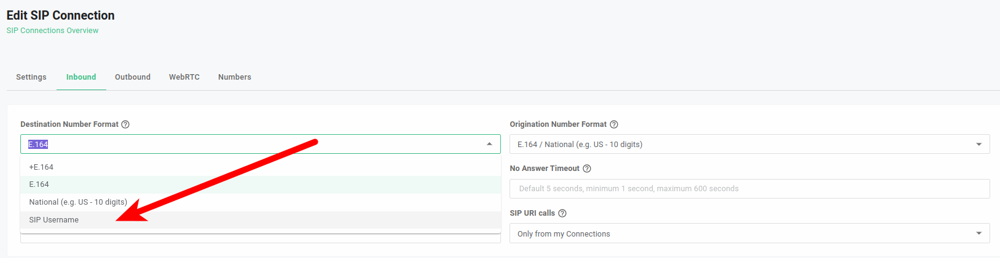
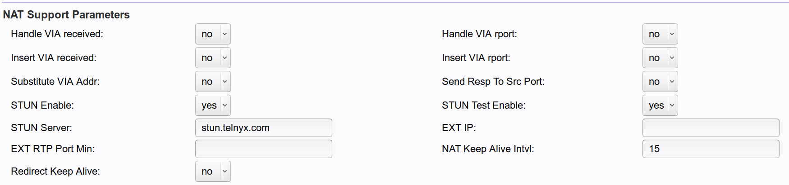
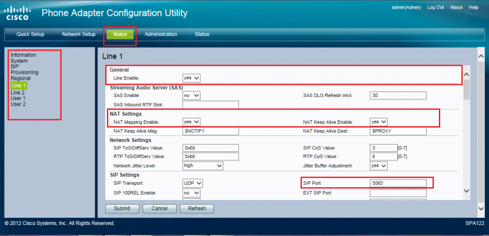
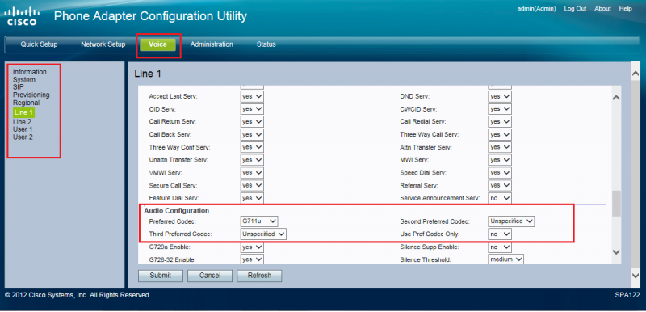
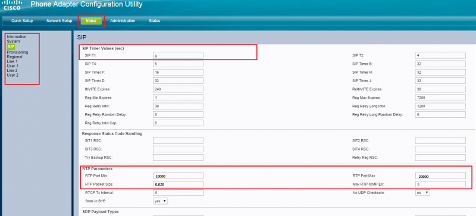
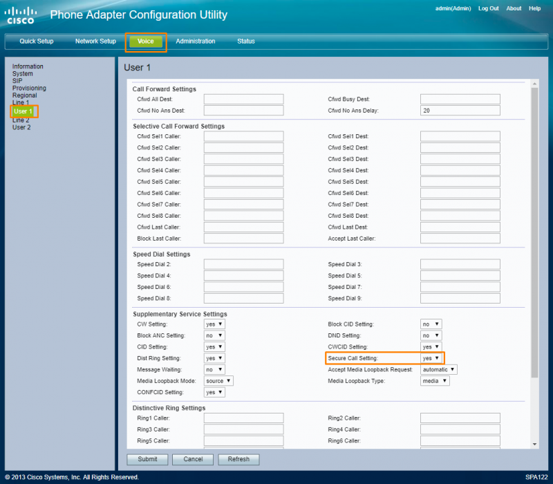
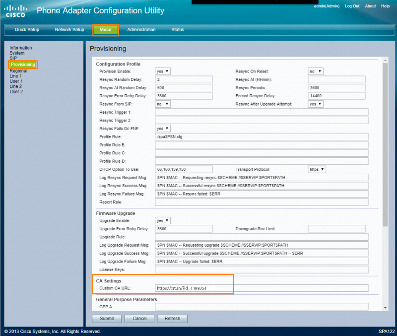

# Cisco and Third-Party Voice Device Configuration

*Part 3 of 4 — see also: [Part 1](cisco-and-third-party-voice-device-configuration--part-1.md), [Part 2](cisco-and-third-party-voice-device-configuration--part-2.md), [Part 4](cisco-and-third-party-voice-device-configuration--part-4.md)*

This page consolidates Telnyx configuration guides for Cisco CUBE/CUCM IP and SIP trunks, Cisco CME IP and credentials trunks, the Cisco SPA112/122 ATA, and the BuddyTalk BT110/BT120 speakerphone. It also documents the deprecation of the Telnyx Access Control List feature and the Accessible Canada Act (ACA) feedback process.

## Cisco SPA112/122 ATA

> Important: This product has reached its end-of-sale date, with end-of-life announcements shared by Cisco in 2019. Cisco will continue to provide basic customer support until 2025, with the last service contract renewal scheduled for 2024. See [Cisco's SPA end-of-life documentation](https://www.cisco.com/c/en/us/products/collateral/unified-communications/small-business-voice-gateways-ata/eos-eol-notice-c51-743206.html) for more details.

> Note: Issues have been reported with using Firefox to configure this device. Consider using Chrome or IE for configuration.

The Cisco SPA112/122 is a compact broadband device compatible with international voice and data standards. It has been a popular choice for small-business VoIP solutions throughout its life.

### Pre-requisites

- It is strongly recommended that your device has the latest firmware updates: [SPA112](https://software.cisco.com/download/home/283998771/type) | [SPA122](https://software.cisco.com/download/home/283998793/type).
- You have a [number](https://support.telnyx.com/en/articles/4380325-search-and-buy-numbers) in your account.
- You have [configured a connection](https://support.telnyx.com/en/articles/1177115-how-to-setup-a-did-to-sip-connection).
- You have [assigned that number to the connection](https://support.telnyx.com/en/articles/1177115-how-to-setup-a-did-to-sip-connection).
- You have [configured an outbound profile](https://support.telnyx.com/en/articles/4320411-more-about-outbound-voice-profiles).
- You have assigned your connection to the outbound profile.

### Access the Configuration Page

1. Physically connect the device to your network through your router.
2. Open a web browser (Chrome or IE, not Firefox) and enter 192.168.0.1 (or possibly 192.168.1.1).
3. Your router will likely ask for a username/password combination. If you have not set this, your router is probably still set up with its default credentials. It is highly recommended you change this.
4. In your router's menu, find the page showing a list of connected devices and their internal IP addresses.
5. Find the Cisco SPA112 or SPA122 device in the list.
6. Click on the IP address corresponding to this device, or copy and paste it into your browser. This will take you to the device's Configuration Utility.

> Note: For SPA122, one address may not take you to the Configuration Utility, or may take you to the utility with some functions disabled. If this happens, try the other address.

### Access the Phone Adapter Configuration Utility

1. When you open the Cisco Phone Adapter Configuration Utility, you'll be asked to log in. For your first login, use the default credentials:
   - **Username:** admin
   - **Password:** admin

   It is strongly recommended that you change these as soon as possible.

2. Keep the Configuration Utility window open while you configure your Telnyx Mission Control Portal.

### Configure the Telnyx Mission Control Portal

1. Log into your [Telnyx Mission Control Portal](https://portal.telnyx.com/#/app/connections).
2. Change the inbound settings of the connection on the **Inbound** tab on the **Connection Options** screen:
   - **Number Format (DNIS):** SIP Username

   

   The Cisco SPA112 ATA, as well as other ATAs, require you to have inbound calls sent to the username configured on the device in the SIP settings. Telnyx doesn't support phone numbers as connection usernames, so we suggest you have inbound calls sent to the alphanumeric username of the connection instead of the number.

3. Click **Save**.

### Configure Cisco SPA Settings

1. Click on the **Voice** tab, then the **SIP** sub-tab. Modify the settings as follows:
   - **STUN enable:** Yes
   - **STUN server:** stun.telnyx.com
   - **STUN test enable:** Yes

   

2. Click **Submit**.
3. Return to the Cisco Phone Adapter Configuration Utility.
4. Click on the **Quick Setup** tab. Modify the settings as follows:
   - **Proxy:** sip.telnyx.com
   - **Display Name:** your_DID (e.g., 12245181471). Note that some versions of the Cisco ATA software would send the Display Name in the registration, which is incorrect as our systems would think this is actually the username. If you are having issues registering with these settings, remove the Display Name and leave it blank. You then need to configure a caller ID override on the outbound settings of your connection in the portal to make sure you send a valid Caller ID.
   - **User ID:** your_user_name (e.g., usernam12345), the same username from the connection on your portal.
   - **Password:** your_password (e.g., nameabcpass), the same password from the connection on your portal.
   - **Dial Plan:** See [Dial Plan for Linksys ATAs](https://support.telnyx.com/en/articles/5721953-linksys-dialplan-for-linksys-atas).

   

5. Click **Submit**.
6. To configure the Caller ID override, [see this guide](https://support.telnyx.com/en/articles/1130720-caller-id-outbound-vs-cnam#h_60493e0dd1).
7. Click on the **Quick Setup** tab.

### Configure the Voice Line

1. From the Cisco Phone Adapter Configuration Utility, click on the **Voice** tab.
2. In the left menu, click **Line 1** (or the line you want to configure).
3. Find the **General** section and set:
   - **Line Enable:** yes
4. If your environment uses NAT, find the **NAT Settings** section and set:
   - **NAT Mapping Enable:** yes
   - **NAT Keep Alive Enable:** yes

   If your environment doesn't use NAT, keep these settings disabled.

5. Find the **SIP Settings** section and set:
   - **SIP Port:** 5060

   

6. If you are looking to configure T.38 on your device, stay on the **Voice** tab and find the **Audio Configuration** section. Set:
   - **Fax Enable T38:** yes
7. Find the **Proxy and Registration** section and set:
   - **Proxy:** sip.telnyx.com
   - **Register Expires:** 300
   - **Proxy Fallback Intvl:** 300
   - **Register:** yes
   - **Use DNS SRV:** no
   - **DNS SRV Auto Prefix:** no

   

8. Click **Submit**.

### Verify Subscriber Information and Codecs

1. From the **Voice** tab, find the **Subscriber Information** section and ensure that your display name looks as expected and:
   - **User ID:** Your SIP username
   - **Password:** Your SIP password

   

2. Find the Audio Configuration section. From here, you can verify or change the [audio codec](https://telnyx.com/resources/codecs-affect-voip-sound-quality) that you will use for your calls. The preferred codec is g711u or g729.

   

### Dialplan

Find the Dial Plan section and ensure the dial plan showing here matches the one you set in step 3.6.

### Optional: Audio Optimization

Cisco's default settings (SIP T1 = 0.5 sec, RTP packet size 0.030 on most Sipura adapters) could possibly cause retransmission over high-latency connections, which can cause issues with audio becoming choppy or breaking up. To mitigate this:

1. From the **Voice** tab, find the **SIP Timer Values (sec)** section and set:
   - **SIP T1:** 1
2. Find the **RTP Parameters** section and set:
   - **RTP Packet Size:** 0.02
   - **RTP Port Min:** 10000
   - **RTP Port Max:** 20000

   

### Optional: Encrypt SIP Traffic by Enabling TLS

1. From the Cisco Phone Adapter Configuration Utility, click on the **Status** tab.
2. In the **System Information** section, ensure your device is on the [latest firmware](https://www.cisco.com/c/en/us/support/docs/smb/unified-communications/cisco-small-business-voice-gateways-and-atas/smb2676-firmware-upgrade-on-spa112-and-spa122.html).
3. To enable TLS for your line, return to the **Voice** tab and go to the **Supplementary Service Settings** section. Set:
   - **Secure Call Setting:** yes

   

4. To configure the transport and port, scroll to the **SIP Settings** section and set:
   - **SIP Transport:** TLS
   - **SIP Port:** 5061

   

5. In order to use secure calling, Cisco requires you to have a CA certificate. You will need to import this. On the left-hand menu, click on the **Provisions** link.
6. Scroll to the **CA Settings** section and set:
   - **Custom CA URL:** <https://crt.sh/?id=1199354>

   

7. Click **Submit**. The device will reboot in order to enable TLS.

> Note: During secure calls, you will hear a couple of beeps now and then. If you want to disable this notification, you can do so from **Voice > Regional** and find the **Call Progress Tones** section. From here, you can clear the **Secure Call Indication Tone** field. To re-enable it, repopulate this field with `397@-19,507@-19;15(0/2/0,.2/.1/1,.1/2.1/2)`.
