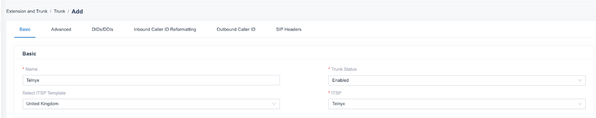
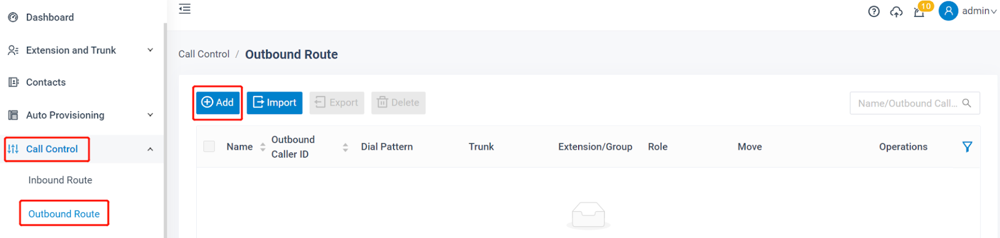
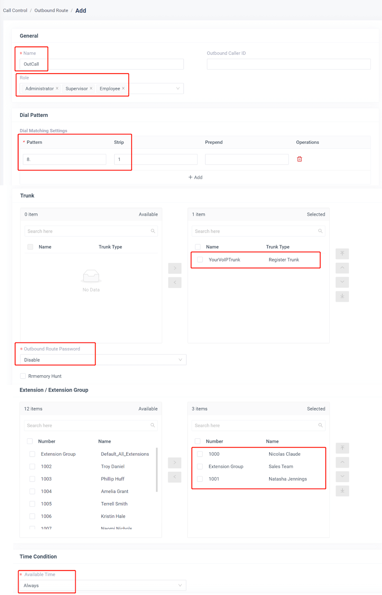
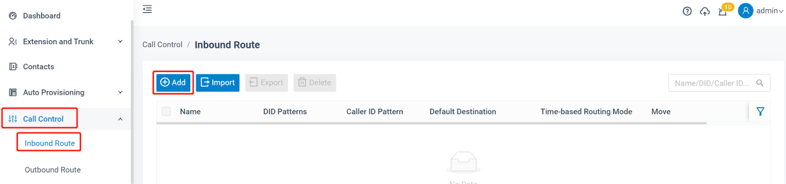
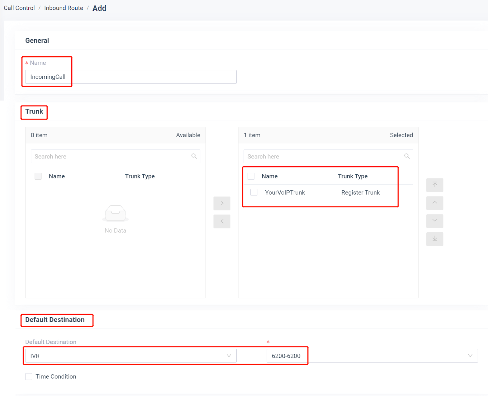

# Cisco and Yeastar SIP Trunk Configuration with Telnyx

*Part 3 of 4 — see also: [Part 1](cisco-and-yeastar-sip-trunk-configuration-with-telnyx--part-1.md), [Part 2](cisco-and-yeastar-sip-trunk-configuration-with-telnyx--part-2.md), [Part 4](cisco-and-yeastar-sip-trunk-configuration-with-telnyx--part-4.md)*

This page consolidates Telnyx guidance for configuring SIP trunks on Cisco CUBE/CUCM, Cisco CME, and Yeastar P-Series and S-Series PBX platforms. It covers both IP-authentication and credentials-based authentication, including dial-peer setup, codec preferences, NAT traversal, inbound DID translation, and outbound/inbound routing.

## Yeastar P-Series PBX

Yeastar P-Series supports both a VoIP Register Trunk (credentials-based authentication) and a VoIP Peer Trunk (IP address and PBX port based authentication). See the [Yeastar Cloud PBX admin guide](https://help.yeastar.com/en/p-series-cloud-edition/administrator-guide/about-this-guide.html), [Linkus server admin guide](https://help.yeastar.com/en/p-series-linkus-cloud-edition/linkus-server-admin-guide/linkus-overview.html), [P-Series installation guide](https://help.yeastar.com/en/p-series-software-edition/software-installation-guide/about-this-guide.html), and [P-Series admin guide](https://help.yeastar.com/en/p-series-software-edition/administrator-guide/about-this-guide.html).

### Pre-requisites

- Have an active, properly configured Telnyx Mission Control Portal. Review the [getting started guide](https://support.telnyx.com/en/articles/1176636-get-started-with-a-mission-control-account).
- Have DIDs in your Mission Control Portal ready to use.
- Install Yeastar PBX and work through the first 3 sub-sections of the Yeastar Getting Started Guide. When you reach the **Set up VoIP trunks** section, return here for a Telnyx-specific configuration.

### Set up a SIP registration based trunk

A register trunk uses a username/password combination (credentials) to authenticate.

1. **Add a SIP Trunk in P-Series PBX System.** Go to **Extension and Trunk > Trunk**, click **Add**.

   

2. **Configure the trunk.**

   Basic Configuration:
   - **Name:** Enter a name for the SIP trunk to help you identify it.
   - Telnyx is a Yeastar certified SIP trunk provider, so you can select **Select ITSP Template** from the drop-down list first and choose the country of the ITSP. Then select the Telnyx "ITSP" name in the right box. All of the parameters are embedded except the account registration information.
   - Make sure the trunk status is **Enabled**.

   

   Detailed Configuration:
   - The parameters of the certified ITSP template are embedded. You do not have to figure out Trunk Type, Transport, Hostname, Port, or Domain. If you need to change them, refer to <https://sip.telnyx.com/> for information on Telnyx proxies, transport, or port.
   - **Username:** your Telnyx username.
   - **Password:** your Telnyx password.
   - **Authentication Name:** the same as the username.
   - **Enable Outbound Proxy:** the same as hostname.

   

3. **Check the trunk status.** Click **Save** and **Apply**. Check if the trunk is connected in **Status**, indicated by the checkmark.

### Set up a Peer/IP authentication trunk

A peer trunk uses IP authentication.

1. Log in to the PBX web portal, go to **Extension and Trunk > Trunk**, click **Add**.
2. In the **Basic** section, configure:
   - **Name:** Enter a name to help you identify the trunk.
   - **Trunk Status:** Select **Enabled**.
   - **Select ITSP Template:** Select **General**.
3. In the **Detailed Configuration** section, select the trunk type and enter the SIP information provided by the ITSP:
   - **Trunk Type:** Peer Trunk (Port Based). The Static IP Address and Port of the PBX will be displayed on the web page. This needs to be added in the Telnyx Mission Control portal under **SIP Trunking > Edit the IP type connection > Authentication and routing > IP addresses**.
   - **Transport:** UDP / TCP / TLS.
   - **Hostname/IP:** Enter the Telnyx domain name or IP address.
   - **Port:** Enter the Telnyx SIP port.
   - **Domain:** Enter the domain in SIP URI of a specific header like From, To header same as Hostname/IP field.

   

### Set up outgoing calls

To make outbound calls via the newly created SIP trunk, configure an outbound route for the trunk.

1. **Create an Outbound Route.** Go to **Call Control > Outbound Route**, click **Add**.

   

2. **Configure the Outbound Route.** The system compares the number with the pattern defined in route 1. If it matches, it initiates the call using the selected trunks. If not, it compares with route 2, and so on. The outbound route in a higher position is matched first.

   You can adjust the outbound route sequence by clicking the sequence buttons.

   

   - **Name:** give this outbound route a name to help you identify it.
   - **Role:** select the role that can use this outbound route to make outbound calls.
   - **Dial Patterns:** set the dial patterns. As shown below, to make calls via the SIP trunk, you need to precede the number to be dialed with the prefix 8.
   - **Dial Pattern:** 8.
   - **Strip:** 1.
   - **Trunk:** select the Telnyx SIP trunk.
   - **Outbound Route Password:** you can prompt users for a password before allowing calls to progress.
   - **Extension/Extension Group:** select the extensions or extension groups that are allowed to make calls through the outbound route.
   - **Time condition:** select time condition to allow this outbound route.

   

3. Click **Save** and **Apply**. You can now make outbound calls through the SIP trunk. As configured above, you need to dial "8" before the destination number. For example, to call "01234567", dial "801234567" on your phone.

### Set up incoming calls

1. **Create an Inbound Route.** Go to **Call Control > Inbound Route**, click **Add**.

   

2. **Configure the Inbound Route.**

   

   - **Name:** give this inbound route a name to help you identify it.
   - **DID Pattern:** specify the DID pattern to match and pass the incoming call through this inbound route.
   - **Caller ID Pattern:** define the caller ID number that is allowed to call through this inbound route.
   - **Trunk:** choose the Telnyx SIP trunk.
   - **Default Destination:** select the default destination or set with Time Condition.

3. Click **Save** and **Apply**. When you call in the SIP trunk, the call will be routed to the destination configured on the inbound route.
