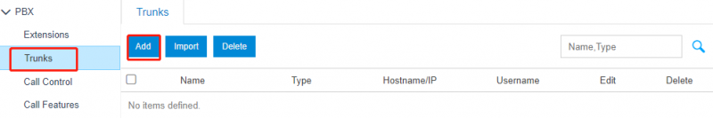
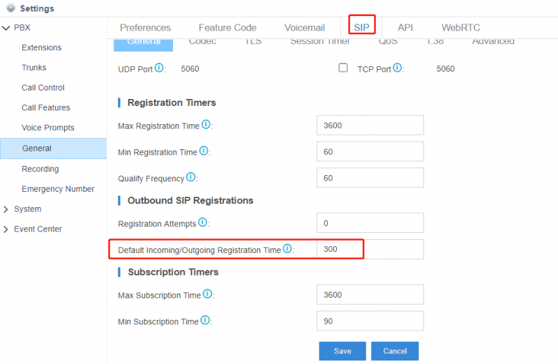
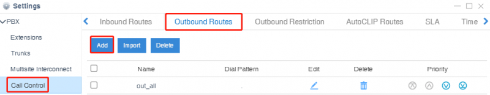
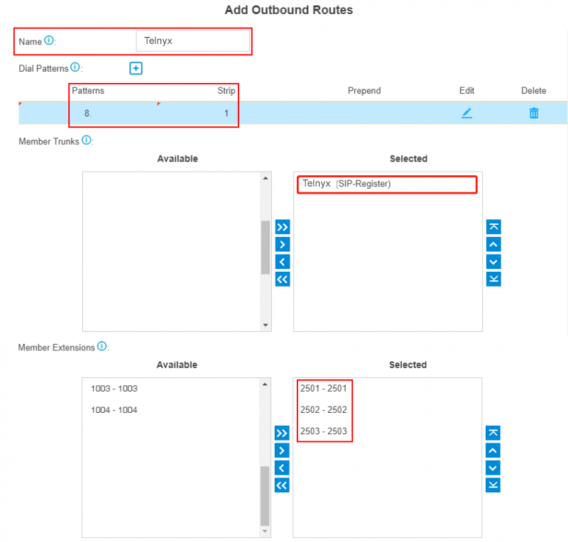
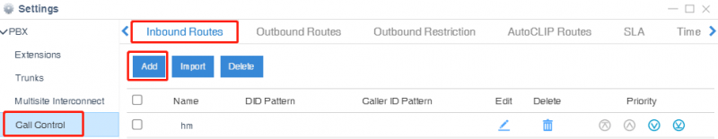
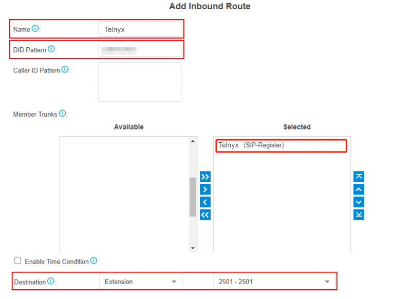

# Cisco and Yeastar SIP Trunk Configuration with Telnyx

*Part 4 of 4 — see also: [Part 1](cisco-and-yeastar-sip-trunk-configuration-with-telnyx--part-1.md), [Part 2](cisco-and-yeastar-sip-trunk-configuration-with-telnyx--part-2.md), [Part 3](cisco-and-yeastar-sip-trunk-configuration-with-telnyx--part-3.md)*

This page consolidates Telnyx guidance for configuring SIP trunks on Cisco CUBE/CUCM, Cisco CME, and Yeastar P-Series and S-Series PBX platforms. It covers both IP-authentication and credentials-based authentication, including dial-peer setup, codec preferences, NAT traversal, inbound DID translation, and outbound/inbound routing.

## Yeastar S-Series PBX

Designed for small- to mid-sized businesses, Yeastar S-Series VoIP PBX and Yeastar Cloud PBX deliver enterprise-grade communication features along with advanced UC capabilities. See the [Yeastar Cloud PBX admin guide](https://help.yeastar.com/en/cloudpbx/topic/admin_guide.html) and [Yeastar S-Series admin guide](https://help.yeastar.com/en/s-series/topic/admin_guide.html).

### Pre-requisites

- Have an active, properly configured Telnyx Mission Control Portal.
- Have chosen your DIDs in your Mission Control Portal.
- Install Yeastar PBX and work through the first 3 sub-sections of the [Yeastar Getting Started Guide](https://help.yeastar.com/en/cloudpbx/topic/getting-started-guide.html). When you reach the **Set up VoIP trunks** section, return here for a Telnyx-specific configuration.

### Set up a VoIP register trunk

A register trunk uses a username/password combination (credentials) to authenticate.

1. In your Yeastar PBX (Cloud or VoIP), go to **Settings > PBX > Trunks**.
2. Click **Add Trunk**.

   

3. Set the following configurations:
   1. Go to **Settings** and expand **PBX**, then go to the **Trunks** tab, click **Add**.
   2. **Name:** Enter a trunk name.
   3. **Select Country:** select *General* from the drop-down list.
   4. **Trunk Type:** select *Register Trunk* from the drop-down list.
   5. **Hostname/IP:** Enter the IP address or the domain of the VoIP provider (e.g., *peer.sip.com*).
   6. **Domain:** Enter the IP address or the domain of the VoIP provider (e.g., *peer.sip.com*).
   7. **Username:** Your Telnyx username.
   8. **Password:** Your Telnyx password.
   9. **Authentication Name:** The authentication name used to register to Telnyx. Reach out to Telnyx support if you need to have this provided.
   10. **From User:** Your Telnyx username.

   

4. If the trunk [DID number](https://telnyx.com/resources/sip-did) is different from the trunk authentication name, set the DID number:
   1. Click **Advanced** and enter the DID numbers provided by Telnyx.
   2. Select the checkbox of DNIS names and enter a DNIS name for the DID number. This will be the display name users will see on their phones.
   3. Click **+** to add another DID number.
5. Configure other [VoIP trunk settings](https://help.yeastar.com/en/s-series/topic/voip-trunk-settings.html#topic_pyd_f3t_2fb) as needed.
6. Click **Save** and **Apply**.
7. Check the trunk status in **PBX Monitor**. If the trunk status shows a checkmark, the trunk is ready for use.

   

8. Set the registration time to 300. In your Yeastar PBX (Cloud or VoIP), go to **Settings** and expand **PBX**, go to the **General** tab, then select **SIP** above **General**, and set **Default Registration Time:** *300*.

   

### Add Peer SIP trunks in your Yeastar PBX

A peer trunk uses IP authentication.

1. In your Yeastar PBX (Cloud or VoIP), go to **Settings > PBX > Trunks**.
2. Click **Add Trunk**.

   

3. Set the following configurations:
   1. Go to **Settings** and expand **PBX**, then go to the **Trunks** tab, click **Add**.
   2. **Name:** Enter a trunk name.
   3. **Select Country:** select *General* from the drop-down list.
   4. **Trunk Type:** select *Peer Trunk* from the drop-down list.
   5. Enter the trunk information provided by the VoIP provider:
      - **Hostname/IP:** Enter the IP address or the domain of the VoIP provider (e.g., *peer.sip.com*).
      - **Domain:** Enter the IP address or the domain of the VoIP provider (e.g., *peer.sip.com*).
   6. Configure other [VoIP trunk settings](https://help.yeastar.com/en/s-series/topic/voip-trunk-settings.html#topic_pyd_f3t_2fb) as needed.
   7. Click **Save** and **Apply**.

   

4. Check the trunk status in **PBX Monitor**. If the trunk status shows a checkmark, the trunk is ready for use.

   

### Set up outgoing calls

Yeastar compares the number with the pattern defined in route 1. If it matches, it initiates the call using the selected trunks. If not, it compares with route 2, and so on. The outbound route in a higher position is matched first.

1. To make outbound calls via the newly created SIP trunk, configure an outbound route for the trunk. Go to **Settings** and expand **PBX**. Click on **Call Control**.
2. In the top-nav, click **Outbound Routes**.

   

3. Click **Add** and configure:
   1. **Route Name:** Give this outbound route a name of your choice.
   2. **Dial Patterns:** Set the dial patterns. To make calls via the SIP trunk, you need to precede the number to be dialed with the prefix 8.
   3. **Dial Pattern:** The number one would need to dial to place an outgoing call. In this example, the number is 8.
   4. **Strip:** 1 (this removes the number you specified in the Dial pattern from the call before placing it).
   5. **Member Extensions:** Select the extensions that are allowed to make calls through the outbound route.
   6. **Member Trunks:** Select the *Telnyx* trunk.

   

### Set up incoming calls

1. Go to **Settings** and expand **PBX**. Click on **Call Control**.
2. In the top-nav, click **Inbound Routes**.

   

3. Click **Add** and configure:
   1. **Name:** Give this inbound route a name of your choice.
   2. **Member Trunks:** Choose the Telnyx trunk.
   3. **Destination:** Select the destination where you want incoming calls routed.
4. Click **Save**, then **Apply**.

   

## Additional Resources

- Review the [getting started with Mission Control guide](https://support.telnyx.com/en/articles/1176636-get-started-with-a-mission-control-account) to make sure your Telnyx Mission Control Portal account is set up correctly.
- See the [caller ID number policy](https://support.telnyx.com/en/articles/3546251-caller-id-number-policy) for information on enabling a caller ID override from within the Telnyx portal.
- See [What kind of equipment do you use?](what-kind-of-equipment-do-you-use.md) for details on Telnyx's underlying network equipment.
- Related Telnyx support articles: [Configuring a Cisco CUBE/CUCM IP Trunk](configuring-a-cisco-cube-cucm-ip-trunk.md), [Cisco: Configure a Cisco CME IP Trunk](cisco-configure-a-cisco-cme-ip-trunk.md), [Configuring a Cisco CME Credentials Trunk](configuring-a-cisco-cme-credentials-trunk.md), [Configuring a Cisco CUBE/CUCM SIP Trunk](configuring-a-cisco-cube-cucm-sip-trunk.md), [Configuring an AVAYA IP trunk with Telnyx](configuring-an-avaya-ip-trunk-with-telnyx.md), [FreeSWITCH: IP Trunk Setup](freeswitch-ip-trunk-setup.md), [FreeSWITCH: Credentials Trunk](freeswitch-credentials-trunk.md), [Configuring a GoAutoDial PBX SIP Trunk](configuring-a-goautodial-pbx-sip-trunk.md), [Configuring an Elastix 4 PBX IP Trunk](configuring-an-elastix-4-pbx-ip-trunk.md), [Configuring an Elastix 4 PBX Trunk](configuring-an-elastix-4-pbx-trunk.md), [How to configure a Thirdlane PBX](how-to-configure-a-thirdlane-pbx.md), [Yeastar S-Series: Telnyx SIP](yeastar-s-series-telnyx-sip.md), [Xorcom PBX: SIP Trunk](xorcom-pbx-sip-trunk.md), [Grandstream UCM6xxx: SIP Trunks](grandstream-ucm6xxx-sip-trunks.md), [Wildix: SIP Trunk Setup](wildix-sip-trunk-setup.md), [How to configure Yeastar P-series](how-to-configure-yeastar-p-series.md), [Elastix 5: FQDN Trunk Setup](elastix-5-fqdn-trunk-setup.md).
