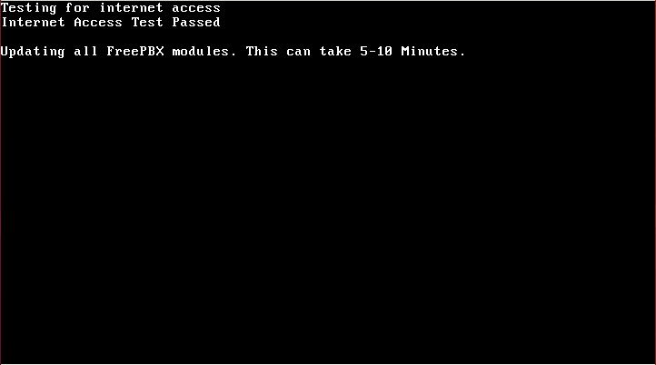
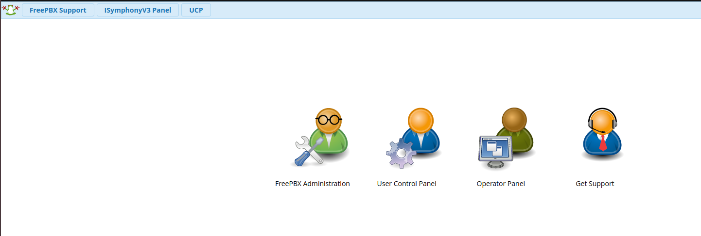

# Configuring a FreePBX Credentials Trunk with Telnyx

*Part 1 of 3 — see also: [Part 2](configuring-a-freepbx-credentials-trunk-with-telnyx--part-2.md), [Part 3](configuring-a-freepbx-credentials-trunk-with-telnyx--part-3.md)*

Step-by-step guide for configuring a Telnyx credentials-based SIP trunk on FreePBX V13, V14, and V15 using both ChanSIP and PJSIP channel drivers, covering installation, SIP settings, extensions, trunk setup, and inbound/outbound routing.

## Overview

FreePBX is a web-based open source GUI that controls and manages Asterisk (PBX), an open source communication server. FreePBX is licensed under the GNU General Public License (GPL) and can be installed manually or as part of the pre-configured FreePBX Distro that includes the system OS, Asterisk, FreePBX GUI, and assorted dependencies.

This page covers how to configure a credentials-based Telnyx SIP trunk on FreePBX V13, V14, and V15 using both ChanSIP and PJSIP channel drivers. PJSIP is recommended as an upgrade from ChanSIP, which is outdated; the majority of users are moving to PJSIP because it provides more future-proof options and is still actively being improved by the community. You can find out more about PJSIP at [pjsip.org](https://www.pjsip.org/about.htm).

Before you begin, you will need to have created a [credentials-based connection](https://portal.telnyx.com/#/app/connections) on your Telnyx Mission Control Portal account and assigned this connection to a DID and outbound profile in order to make and receive calls. It is also recommended that you [enable TLS to encrypt your traffic](https://support.telnyx.com/en/articles/1130711-does-telnyx-encrypt-communication).

Additional FreePBX resources:

- [FreePBX documentation](https://wiki.freepbx.org/#all-updates)
- [FreePBX community](https://community.freepbx.org/)
- [FreePBX support](https://www.freepbx.org/support/)
- [FreePBX videos](https://www.freepbx.org/videos/)

## Install FreePBX

### FreePBX V13 (Asterisk 13)

Once you've loaded the FreePBX ISO onto your server or virtual machine, you'll have a few options to select for installation. We'll be doing a full install via Asterisk 13.

1. Select **Full Install**.

   
2. Confirm your network settings.

   
3. Confirm your **root** password.

   
4. Wait for all the necessary packages to be installed.

   
5. More modules will be updated after successful internet tests.

   
6. Enter **root** and the password you created from step 2.

   
7. You'll now be provided with the URL to access the FreePBX web interface.

   
8. You'll be brought to the initial setup and must enter the username, password, and admin email address to create your account.

   
9. Once you've created your account, you'll be brought to the dashboard. Select **FreePBX Administration** and enter your username and password.

   
10. Follow the process to activate your FreePBX V13.

    
11. Select your default locales.

    
12. You'll be presented with some firewall details and other suggestions. You are welcome to set this up based on your requirements.

### FreePBX V14 and V15 (Asterisk 16)

1. Once you load the ISO onto your server or virtual machine, you'll have a few options to select for installation. We'll be doing a full install via Asterisk 16.

   
2. You'll be prompted for your preferred video method you want to install.

   
3. The installer will now start.
4. The installer will start but you will see it shows the root password is not set. You will need to click on the root password box to set your root password. The installation process cannot complete until this is done.
5. Type in your root password and confirm it a second time and click on the **Done** option in the top left screen.

   
6. At this time the FreePBX package itself can take 15 or more minutes to install and requires access to the internet, so depending on your internet speeds it can take a while to install. Be patient.
7. Once the install has 100% completed it will give you a reboot option. Click on reboot and your system is now installed.
8. Once the process is complete, you'll reach the Linux console/command prompt login. You can log in here using the username `root` and the root password you selected earlier.
9. After you log in, you should see the IP address of your PBX. Take note of this IP address as you will need it in the next step.
10. Enter the IP address of the new PBX into your web browser. The first time you do so, you'll be asked to create the admin username and the admin password. That username and password will be used in the future to access the FreePBX configuration screen. These passwords do not change the root password; they are only used for access to the FreePBX web interface.

    
11. Once submitted you can log in to the admin panel with the username and password set up in the step above.

## Configure Basic Settings

After installation, the main FreePBX screen will offer you four options:

- **FreePBX Administration** allows you to configure your PBX. Use the admin username and admin password you configured above to log in. This section is what most people refer to as "FreePBX."
- **User Control Panel** is where a user can log in to make web calls, set up their phone buttons, view voicemails, send and receive faxes, use SMS & XMPP messaging, view conferences, and more, depending on what you have enabled for the user. See [User Control Panel (UCP) 14+](https://wiki.freepbx.org/pages/viewpage.action?pageId=74318855) for more information.
- **Operator Panel** is a screen that allows an operator to control calls (needs additional licensing).
- **Get Support** takes you to a web page about various official support options for FreePBX.

1. Once you've created your account, you'll be brought to the dashboard. Select **FreePBX Administration** and enter your username and password.
2. Follow the process to activate your FreePBX.

   
3. Select your default locales.

   
4. You'll be presented with some firewall details and other suggestions. You are welcome to set this up based on your requirements.
5. Once you're back at the dashboard, you'll see more detail.

   

## Configure SIP Settings

1. Make your way to **Settings → Asterisk SIP Settings** in order to confirm your network settings.
2. Populate the **external** and **local** network addresses under **General SIP Settings** and either **Chan SIP Settings** (V13/V14) or **PJSIP Settings** (V15).
3. Click **Submit** and then **Apply Config**.

   

For FreePBX V13 PJSIP, also navigate to **Settings → Advanced Settings → Dialplan → Operational → SIP Channel Driver** to confirm the channel driver.

