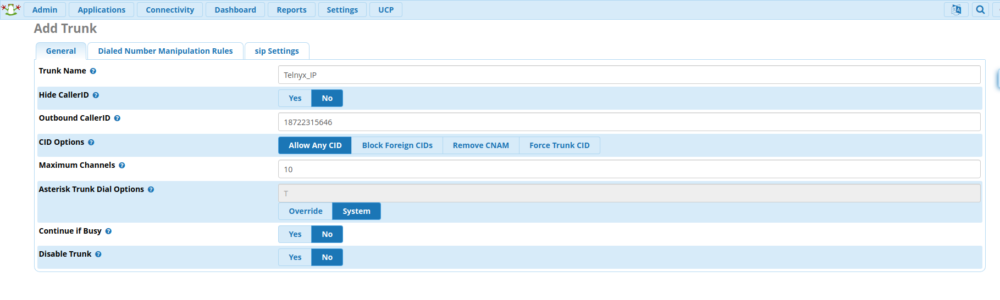
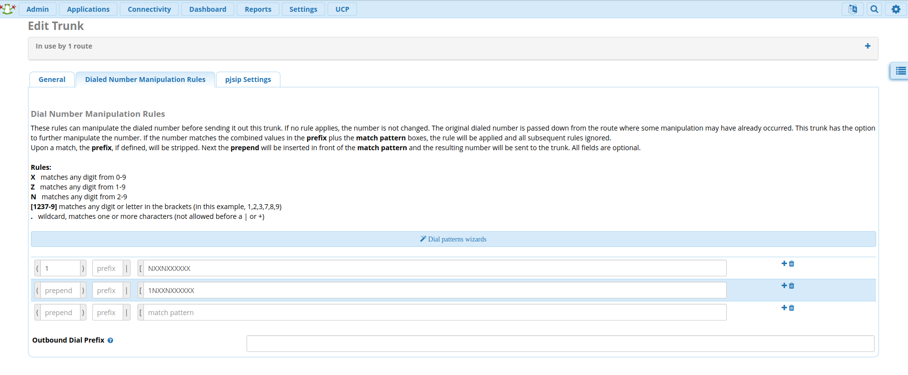
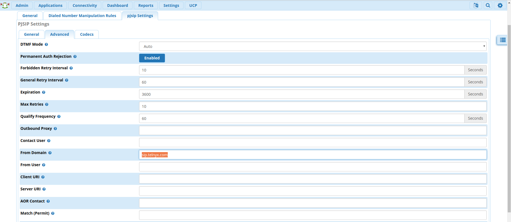
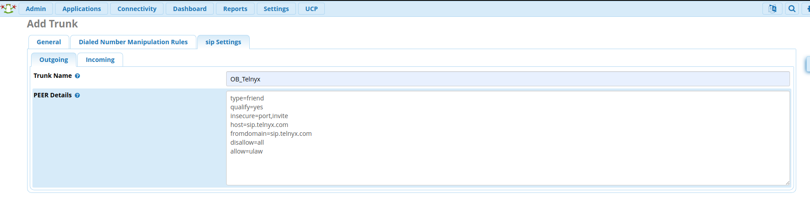
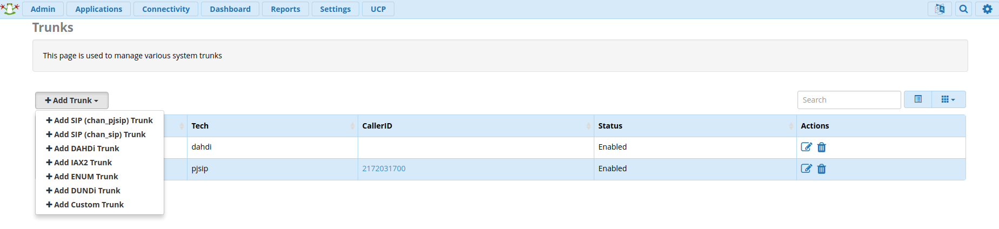
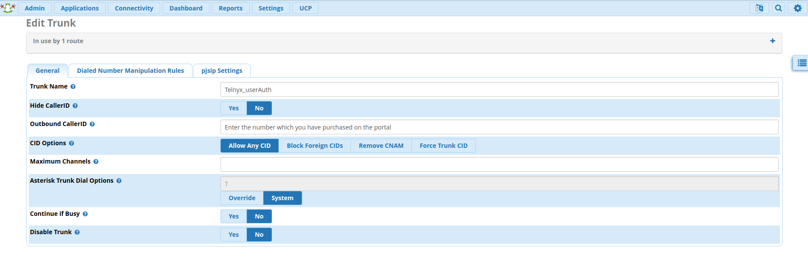
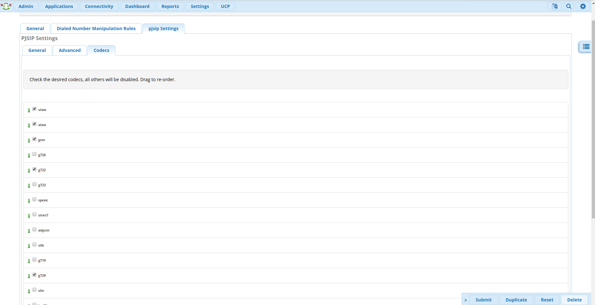
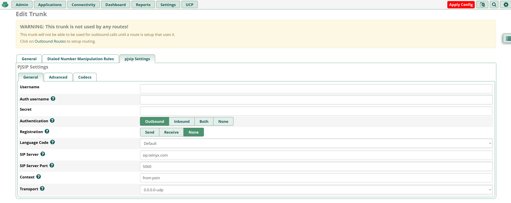
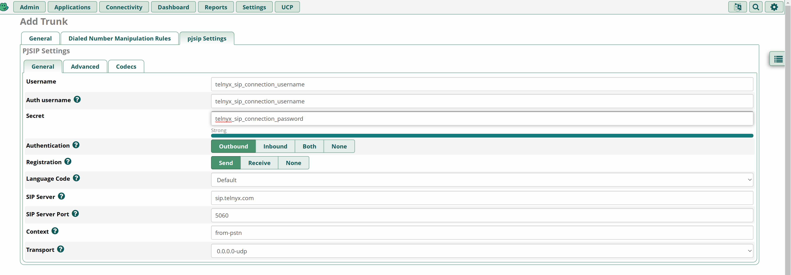

# Configuring a FreePBX Credentials Trunk with Telnyx

*Part 2 of 3 — see also: [Part 1](configuring-a-freepbx-credentials-trunk-with-telnyx--part-1.md), [Part 3](configuring-a-freepbx-credentials-trunk-with-telnyx--part-3.md)*

Step-by-step guide for configuring a Telnyx credentials-based SIP trunk on FreePBX V13, V14, and V15 using both ChanSIP and PJSIP channel drivers, covering installation, SIP settings, extensions, trunk setup, and inbound/outbound routing.

## Configure Extensions

1. Make your way to **Applications → Extensions → Add Extension**.
   - For ChanSIP trunks (V13/V14), select **Add New Chan SIP Extension**.
   - For PJSIP trunks (V13/V15), select **Add New Chan PJSIP Extension**.
2. The **Outbound CID** is the [number you purchased](https://portal.telnyx.com/#/app/numbers/my-numbers) from your Telnyx Mission Control Portal. The extension's secret may need to be populated under the **Other** tab.

   If you do not set an Outbound CID for your extension, you must enable this on your trunk. If you do not set a caller ID on either the trunk or each extension, then your calls will reach the SIP proxy without a valid caller ID. You may instead choose to enable a Caller ID Override in your SIP Connection's Outbound Options from within the Telnyx Portal. Please review the [caller ID number policy](https://support.telnyx.com/en/articles/3546251-caller-id-number-policy) for accepted formats.

   Note that ChanSIP devices listen on Port 5160 (UDP — this is a non-standard port), while PJSIP devices listen on Port 5060 (UDP).

   
3. Click **Submit** and **Apply Config**.

For testing purposes, you can now use your SIP client to register with FreePBX using the username, password/secret, and local IP address of your FreePBX.

## Configure the Trunk

### ChanSIP Trunk (V13/V14)

1. Make your way to **Connectivity → Trunks → Add Trunk → Add New Chan SIP Trunk**. You'll now be located in the **General** tab.
2. Enter a Trunk name, your Outbound CID, and the maximum channels you'd like for this trunk.

   
3. Proceed to the **Dialed Number Manipulation Rules** tab. You can leave this entire section in its default state, but you can also enter dial patterns here:

   **For US numbers:**
   - prepend: `1`; match pattern: `NXXNXXXXXX`
   - prepend: blank; match pattern: `1NXXNXXXXXX`

   **For international numbers:**
   - prepend: Country Dialing prefix; match pattern: `NXXNXXXXXX`
   - prepend: blank; match pattern: (Country Dialing prefix)`NXXNXXXXXX`

   

4. Click on the **SIP Settings** tab and on the **General** sub-tab, provide the following:
   - **Username:** Your Telnyx account username
   - **Secret:** The password for your Telnyx trunk found under the connection → "show password" link in your Telnyx portal
   - **Authentication:** *Outbound*
   - **Registration:** *Send*
   - **Language Code:** *English* (or the language you wish to conduct calls in)
   - **SIP Server:** *sip.telnyx.com*
   - **SIP Server Port:** *5060* if you have not enabled TLS encryption. If you have, choose *5061*.
   - **Context:** *from-pstn*
   - **Transport:** *UDP* or *TCP* if you have not enabled TLS encryption. If you have, choose *TLS/TCP*.

   
5. Open the **Settings → Advanced** sub-tab and adjust the following:
   - **From Domain:** *sip.telnyx.com*

   
6. Open the **SIP Settings → Codecs** sub-tab and adjust the following:
   - Select *ulaw, alaw, gsm, g722, g729, Opus*. All other boxes should be unchecked, as these are the Telnyx-supported codecs.
   - If you plan to do any video communication, Telnyx supports the H264 video codec.
7. Proceed to the **SIP Settings** tab. In the sub tabs **outgoing and incoming**:

   **Outgoing settings:**
   - **username:** Your Telnyx SIP credentials username
   - **secret:** Your Telnyx SIP credentials password
   - **type:** *friend*
   - **qualify:** *Yes*
   - **insecure:** *port,invite*
   - **host:** *sip.telnyx.com*
   - **fromdomain:** *sip.telnyx.com*
   - **disallow:** *all*
   - **allow:** *ulaw&alaw*

   

   **Inbound settings:**
   - **username:** Your Telnyx SIP credentials username
   - **secret:** Your Telnyx SIP credentials password
   - **fromdomain:** *sip.telnyx.com*
   - **host:** *sip.telnyx.com*
   - **type:** *friend*
   - **insecure:** *port,invite*
   - **qualify:** *yes*
   - **disallow:** *all*
   - **allow:** *ulaw&alaw*
   - **dtmfmode:** *rfc2833*
   - **Register String:** `Your Telnyx SIP credentials username:Your Telnyx SIP credentials password@sip.telnyx.com/Your Telnyx SIP credentials username`

   Example: `dillin1234:mypassword123@sip.telnyx.com/dillin1234`

   

### PJSIP Trunk (V13/V15)

1. Make your way to **Connectivity → Trunks** and click on **+ Add Trunk** to expand its dropdown.
2. Select **Add SIP (chan_pjsip)** from this menu.

   
3. Click on **General Settings** and provide the following details:
   - **Trunk Name:** *Telnyx_userAuth*
   - **Outbound CallerID:** your_Telnyx_number
   - **CID Options:** *Allow Any CID*

   
4. Click on the **Dialed Number Manipulation Rules** tab. You can leave this entire section in its default state, but you can also enter dial patterns here:

   **For US numbers:**
   - prepend: `1`; match pattern: `NXXNXXXXXX`
   - prepend: blank; match pattern: `1NXXNXXXXXX`

   **For international numbers:**
   - prepend: Country Dialing prefix; match pattern: `NXXNXXXXXX`
   - prepend: blank; match pattern: (Country Dialing prefix)`NXXNXXXXXX`

   

5. Click on the **PJSIP Settings** tab and on the **General** sub-tab. Provide the following properties:
   - **Username:** Your Telnyx account username
   - **Secret:** The password for your Telnyx trunk found under the connection → "show password" link in your Telnyx portal
   - **Authentication:** *Outbound*
   - **Registration:** *Send*
   - **Language Code:** *English* (or the language you wish to conduct calls in)
   - **SIP Server:** *sip.telnyx.com*
   - **SIP Server Port:** *5060* if you have not enabled TLS encryption. If you have, choose *5061*.
   - **Context:** *from-pstn*
   - **Transport:** *UDP* or *TCP* if you have not enabled TLS encryption. If you have, choose *TLS/TCP*.

   
6. Open the **PJSIP Settings → Advanced** sub-tab and adjust the following:
   - **From Domain:** *sip.telnyx.com*

   
7. Open the **PJSIP Settings → Codecs** sub-tab and adjust the following:
   - Select *ulaw, alaw, gsm, g722, g729, Opus*. All other boxes should be unchecked, as these are the Telnyx-supported codecs.
   - If you plan to do any video communication, Telnyx supports the H264 video codec.

   
8. Click **Submit**, then **Apply Config**.

For FreePBX V15 PJSIP, the trunk configuration is consolidated into the PJSIP Settings tab:

1. Make sure to specify:
   - **Username:** the credential-based SIP Connections username from your Telnyx account.
   - **Auth Username:** the credential-based SIP Connections username from your Telnyx account.
   - **Secret:** the credential-based SIP Connections password from your Telnyx account.
   - **SIP Server:** your preferred Telnyx SIP Proxy (*sip.telnyx.com* in this instance for USA).
   - **SIP Server Port:** *5060* if you are using UDP or TCP transport. *5061* if you are using TLS transport.

   
2. Click **Submit** and **Apply Config**.
3. You might see a warning: "This trunk is not used by any routes! This trunk will not be able to be used for outbound calls until a route is setup that uses it."
