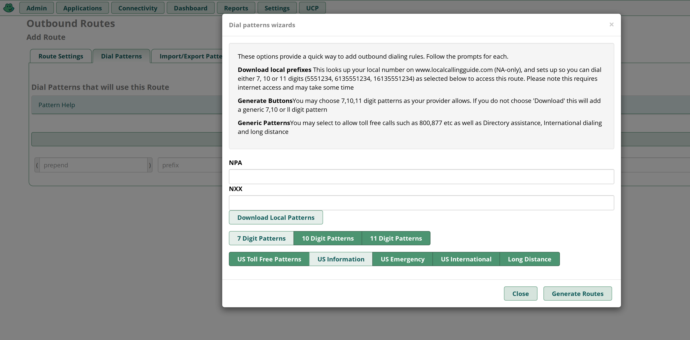

# Configuring a FreePBX Credentials Trunk with Telnyx

*Part 3 of 3 — see also: [Part 1](configuring-a-freepbx-credentials-trunk-with-telnyx--part-1.md), [Part 2](configuring-a-freepbx-credentials-trunk-with-telnyx--part-2.md)*

Step-by-step guide for configuring a Telnyx credentials-based SIP trunk on FreePBX V13, V14, and V15 using both ChanSIP and PJSIP channel drivers, covering installation, SIP settings, extensions, trunk setup, and inbound/outbound routing.

## Configure Outbound Routes

Outbound routing is a set of rules that tells FreePBX which Telnyx trunk to use for any given outbound call. Having multiple trunks allows you to control cost by routing calls over the least costly trunk for a particular call. Outbound routes are used to specify what numbers are allowed to go out a particular route. You will want to make sure you define routes for all types of calls. Not defining a route can leave your users frustrated when they need to make an important call.

1. Navigate to **Connectivity → Outbound Routes**.
2. Create a new outbound route and provide the following on the **Route Settings** tab:
   - **Route Name:** Something distinct that makes sense for your route purpose (e.g., *Outbound_Telnyx*).
   - **Route CID:** Number you purchased on the Telnyx portal.
   - **Trunk Sequence for Matched Routes:** Select the trunk you just created.

   
3. Now select the **Dial Patterns** tab to the right of the **Route Settings** tab and enter dial patterns exactly as you see in the following image. This pattern allows you to dial 10 Digits (U.S. Calling) and 11 Digits (North American Calling).

   If you need dial patterns for a region outside North America, please contact Telnyx support.

   

   Note that the documentation portal shrinks screenshots, making some detail difficult to see. Right-click on the image above and select "Open image in new tab" from the context menu. This will open the image in a new tab and display it at its full size and resolution.
4. Click **Submit**, then **Apply Config**.

For FreePBX V15, you can use the dial pattern wizards to make all the dial patterns that apply to you, then click **Generate Routes, Submit** and **Apply Config**.

## Configure Inbound Routes

When a call comes in from the outside, it'll need to be directed from sip.telnyx.com to the phone extension you ultimately want it to go, such as a user extension or an IVR extension.

1. Make your way to **Connectivity → Inbound Routes** and open the **General** tab.
2. The following image demonstrates an inbound route that will send *ANY* call to a certain extension. To direct a specific number to a specific extension you would create a route and set the "DID Number" field to your 11 digit DID with sip.telnyx.com (for instance: 12172031700).

   
3. Enter the route name description, DID associated with this route, and specify the extension that should be associated when calls are received to the DID.
4. Click **Submit** and **Apply Config**.

By default, when creating a SIP Connection in the Telnyx Mission Control Portal, the number formats for the ANI and DNIS will be set to E.164. This means Telnyx will send the dialled number in the SIP INVITE to your FreePBX system with 11 digits. As the DID number above is in 11 digit format, the call will be accepted and routed to the extension. However, you can control the number formats as you desire and can read more about it in the [SIP Connection Number Formats](https://support.telnyx.com/en/articles/1130706-sip-connection-number-formats) article.

## Additional Resources

Review the [getting started with Mission Control guide](https://support.telnyx.com/en/articles/1176636-get-started-with-a-mission-control-account) to make sure your Telnyx Mission Control Portal account is set up correctly.

Additionally, you can check out:

- [FreePBX documentation](https://wiki.freepbx.org/#all-updates)
- [FreePBX community](https://community.freepbx.org/)
- [FreePBX support](https://www.freepbx.org/support/)
- [FreePBX videos](https://www.freepbx.org/videos/)
