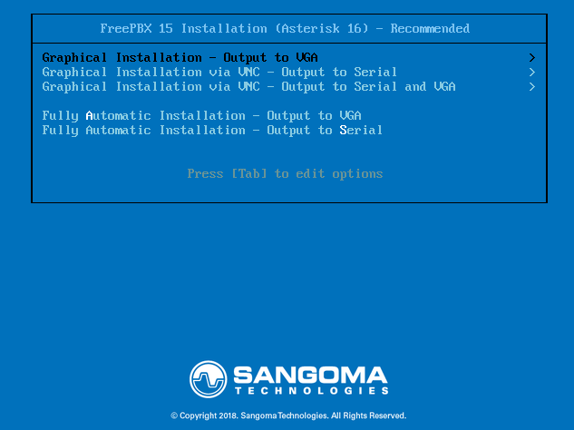
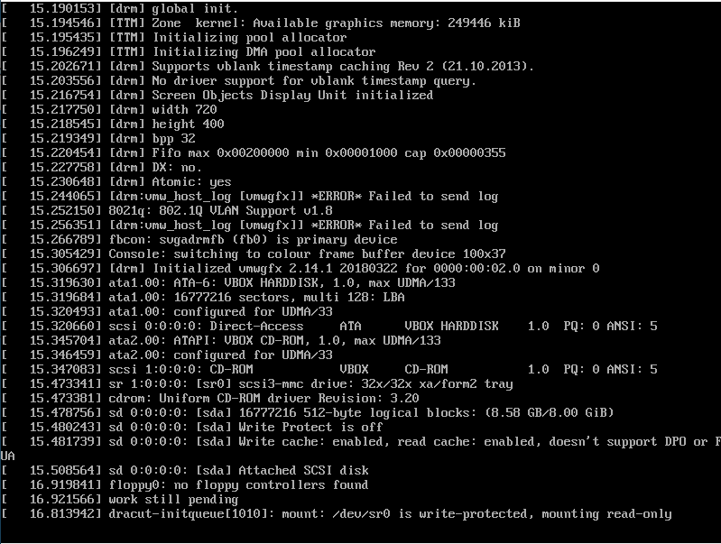
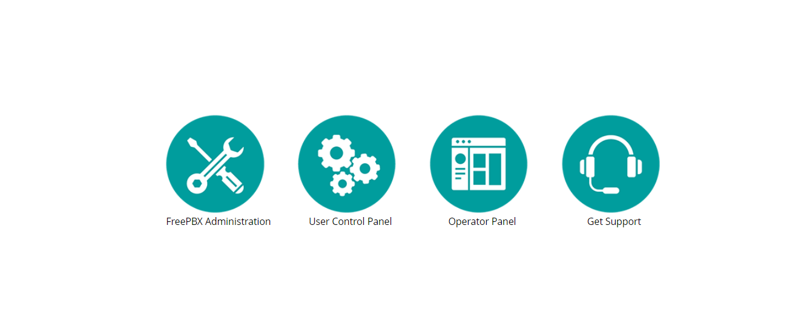
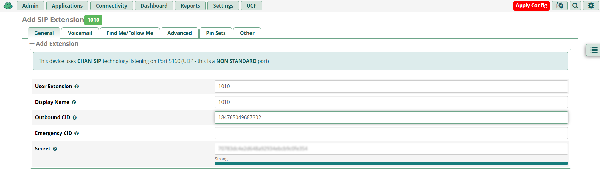
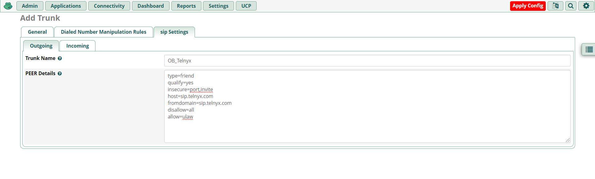
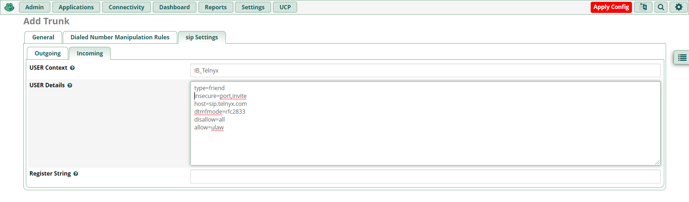

# Configuring Asterisk-Based PBX Systems with Telnyx SIP Trunking

*Part 2 of 5 — see also: [Part 1](configuring-asterisk-based-pbx-systems-with-telnyx-sip-trunking--part-1.md), [Part 3](configuring-asterisk-based-pbx-systems-with-telnyx-sip-trunking--part-3.md), [Part 4](configuring-asterisk-based-pbx-systems-with-telnyx-sip-trunking--part-4.md), [Part 5](configuring-asterisk-based-pbx-systems-with-telnyx-sip-trunking--part-5.md)*

This page consolidates Telnyx guidance for connecting Asterisk-based PBX platforms — including bare Asterisk, FreePBX, and VitalPBX — to Telnyx SIP Trunking using either IP authentication or credentials-based authentication. It covers Mission Control Portal prerequisites, trunk configuration, PJSIP transport settings, dialplan/routing setup, and notes on FIPS-aligned cryptography for SIP Trunking.

## Asterisk: Dialplan

Asterisk uses dialplans saved in `/etc/asterisk/extensions.conf` to route calls between endpoints. To allow extension `1001` to call the world through Telnyx and to send it any calls that arrive to the Telnyx DID assigned to the respective trunk, add the following to `extensions.conf`:

```
[from-pstn]
exten => _+1NXXXXXXXXX,1,Dial(PJSIP/1001)
exten => _NXXXXXXXXX,1,Dial(PJSIP/1001)

[from-internal]
exten = _NXXNXXXXXX,1,Dial(PJSIP/+1${EXTEN}@telnyx)
same = n,Hangup()

exten = _X.,1,Dial(PJSIP/+${EXTEN}@telnyx)
same = n,Hangup()
```

- `[from-pstn]` is the context that captures inbound calls to the PBX coming from Telnyx and sends them to extension `1001`. It captures every call towards CLDs in US national (10 digit) or +E164 format and sends it to extension `1001`.
- `[from-internal]` routes calls towards the world through Telnyx. It captures calls towards US national numbers, converts to +E164, or towards any other number, prepends "+", and sends the call to Telnyx.

> **IMPORTANT:** If your IP-based connection uses a tech prefix to authenticate, this must be reflected in the dialplan. For example, if you have set the tech prefix `9999` in Telnyx, your `[from-internal]` block should look like this:
>
> ```
> [from-internal]
> exten = _NXXNXXXXXX,1,Dial(PJSIP/9999+1${EXTEN}@telnyx)
> same = n,Hangup()
>
> exten = _X.,1,Dial(PJSIP/9999+${EXTEN}@telnyx)
> same = n,Hangup()
> ```

## FreePBX V15: Installation

1. Load the FreePBX V15 ISO onto your server or virtual machine and perform a full install via Asterisk 16.

   
2. Select your preferred video installation method.

   
3. The installer will start.

   
4. The installer will indicate that the root password is not set. Click the root password box to set it; the installation cannot complete until this is done.
5. Type in your root password, confirm it, and click **Done**.

   
6. The FreePBX package itself can take 15 or more minutes to install and requires internet access.
7. Once the install has 100% completed, click **Reboot**.
8. After reboot, log in at the Linux console using the username `root` and the root password you selected.
9. Note the IP address of your PBX — you will need it in the next step.
10. Enter the IP address into your web browser. The first time, you'll be asked to create the admin username and password for the FreePBX web interface. These do not change the root password.

    
11. Once submitted, log in to the admin panel with the username and password set up above.

## FreePBX V15: Basic Settings

The main FreePBX screen offers four options:



- **FreePBX Administration** — configure your PBX. Use the admin username and password from the previous step.
- **User Control Panel** — for users to make web calls, set up phone buttons, view voicemails, send and receive faxes, use SMS & XMPP messaging, view conferences, and more. See [User Control Panel (UCP) 14+](https://wiki.freepbx.org/pages/viewpage.action?pageId=74318855).
- **Operator Panel** — allows an operator to control calls (needs additional licensing).
- **Get Support** — links to official FreePBX support options.

1. Enter the username, password, and admin email address to create your account.

   
2. After creating your account, select **FreePBX Administration** and enter your credentials.
3. Follow the process to activate your FreePBX V15.

   
4. Select your default locales.

   
5. Configure firewall details and other suggestions as needed.
6. Return to the dashboard for more detail.

   

## FreePBX V15: SIP Settings

1. Go to **Settings → Asterisk SIP Settings** to confirm your network settings.
2. Populate the **external** and **local** network addresses under **General SIP Settings** and **Chan SIP Settings**.
3. Click **Submit** and then **Apply Config**.

   

## FreePBX V15: Extensions

1. Go to **Applications → Extensions → Add Extension → Add New Chan SIP Extension**. The **Outbound CID** is the [number you purchased](https://portal.telnyx.com/#/app/numbers/my-numbers) from your Telnyx Mission Control Portal. The extension's secret may need to be populated under the **Other** tab.

   

   > **Note:** If you do not set an Outbound CID for your extension, you will need to enable this on your trunk.
   >
   > **Note:** This device uses CHAN_SIP technology listening on Port 5160 (UDP — this is a non-standard port).
2. Click **Submit** and **Apply Config**.

For testing, you can now use your SIP client to register with FreePBX using the username, password/secret, and local IP address of your FreePBX.

## FreePBX V15: Trunk Configuration

1. Go to **Connectivity → Trunks → Add Trunk → Add New Chan SIP Trunk**. You'll be in the **General** tab.
2. Enter a Trunk name, your Outbound CID, and the maximum channels you'd like for this trunk.

   

   > **Note:** If you choose not to set an Outbound CID on your trunk, then you must set an Outbound CID on each relevant extension. If you do not set a caller ID on either the trunk or each extension, your calls will reach the SIP proxy without a valid caller ID. You may instead enable a Caller ID Override in your SIP Connection's Outbound Options from within the Telnyx Portal. Review the [caller ID number policy](https://support.telnyx.com/en/articles/3546251-caller-id-number-policy) for accepted formats.
3. Proceed to the **Dialed Number Manipulation Rules** tab. A simple dial pattern for US numbers:

   

   **For US numbers:**
   1. prepend: `1`; match pattern: `NXXNXXXXXX`
   2. prepend: blank; match pattern: `1NXXNXXXXXX`

   **International:**
   1. prepend: Country Dialing prefix; match pattern: `NXXNXXXXXX`
   2. prepend: blank; match pattern: (Country Dialing prefix)`NXXNXXXXXX`

## FreePBX V15: Outbound and Inbound Trunk Settings

1. In the **Add Trunk** configuration tool, click the **SIP Settings** tab and then the **Outgoing** sub-tab. Specify:
   1. **username:** your_sip_connection_credentials_based_telnyx_username
   2. **secret:** your_sip_connection_credentials_based_telnyx_password
   3. **type:** `friend`
   4. **qualify:** yes
   5. **insecure:** `port,invite`
   6. **host:** `sip.telnyx.com`
   7. **fromdomain:** `sip.telnyx.com`
   8. **disallow:** `all`
   9. **allow:** `ulaw`

   
2. Click the **Incoming** sub-tab. Specify:
   1. **username:** your_sip_connection_credentials_based_telnyx_username
   2. **secret:** your_sip_connection_credentials_based_telnyx_password
   3. **type:** `friend`
   4. **insecure:** `port,invite`
   5. **host:** `sip.telnyx.com`
   6. **dtmfmode:** `rfc2833`
   7. **disallow:** `all`
   8. **allow:** `ulaw`
   9. **Register String:** `your_sip_connection_credentials_based_telnyx_username:your_sip_connection_credentials_based_telnyx_password@sip.telnyx.com/your_sip_connection_credentials_based_telnyx_username`

      Example: `Eliza1234:mypassword123@sip.telnyx.com/Eliza1234`

   
