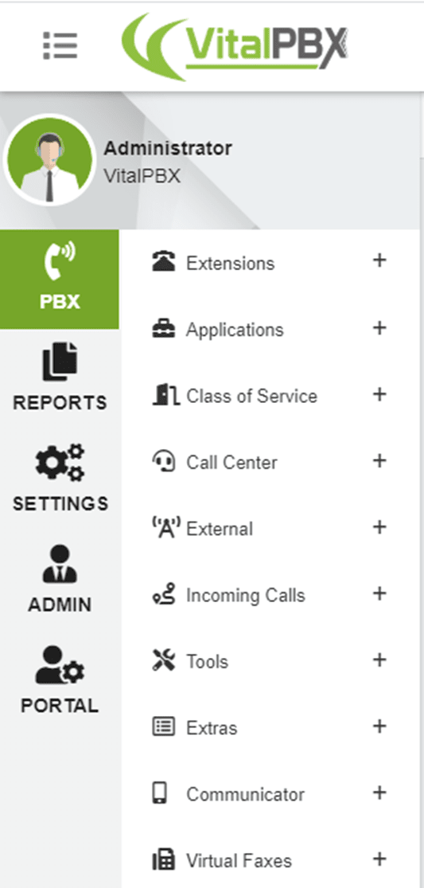
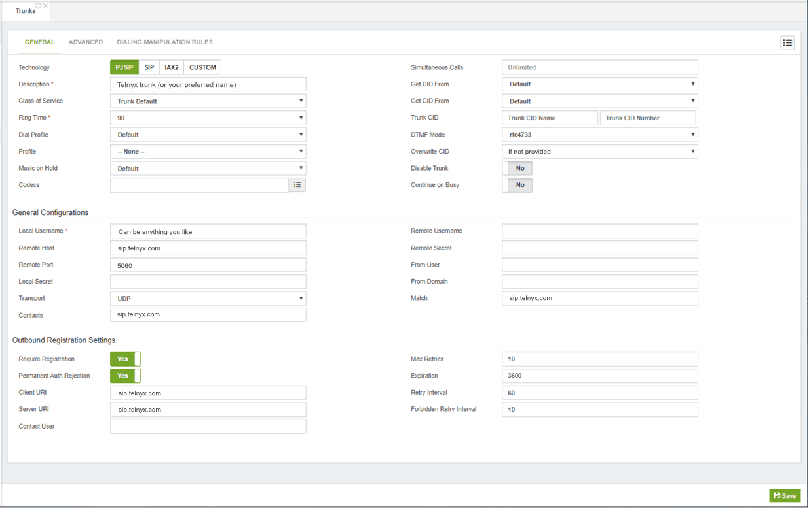
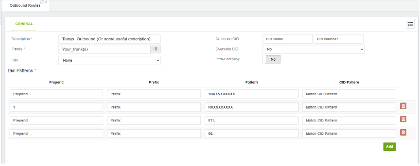

# Configuring Asterisk-Based PBX Systems with Telnyx SIP Trunking

*Part 3 of 5 — see also: [Part 1](configuring-asterisk-based-pbx-systems-with-telnyx-sip-trunking--part-1.md), [Part 2](configuring-asterisk-based-pbx-systems-with-telnyx-sip-trunking--part-2.md), [Part 4](configuring-asterisk-based-pbx-systems-with-telnyx-sip-trunking--part-4.md), [Part 5](configuring-asterisk-based-pbx-systems-with-telnyx-sip-trunking--part-5.md)*

This page consolidates Telnyx guidance for connecting Asterisk-based PBX platforms — including bare Asterisk, FreePBX, and VitalPBX — to Telnyx SIP Trunking using either IP authentication or credentials-based authentication. It covers Mission Control Portal prerequisites, trunk configuration, PJSIP transport settings, dialplan/routing setup, and notes on FIPS-aligned cryptography for SIP Trunking.

## FreePBX V15: Outbound Routing

1. Go to **Connectivity → Outbound Routes → Add Outbound Route**.
2. Enter the route name, route CID, and specify the Telnyx IP trunk for this outbound route.

   
3. Click **Submit** and **Apply Config**.

## FreePBX V15: Inbound Routing

1. Go to **Connectivity → Inbound Routes → Add Inbound Route**.
2. Enter the route name description, the DID associated with this route, and specify the extension that should be associated when calls are received to the DID.
3. Click **Submit** and **Apply Config**.

> **Note:** By default, when creating a SIP Connection in the Telnyx Mission Control Portal, the number formats for the ANI and DNIS will be set to E.164. This means Telnyx will send the dialled number in the SIP INVITE to your FreePBX system with 11 digits. As the [DID number](https://telnyx.com/resources/sip-did) above is in 11 digit format, the call will be accepted and routed to the extension. You can control the number formats as desired — see [SIP connection number formats](https://support.telnyx.com/en/articles/1130706-sip-connection-number-formats).

## VitalPBX: Credentials-Based Trunk

VitalPBX supports two trunk types: a credentials-based (user/pass) trunk and an IP-based trunk.

1. From the VitalPBX console, expand **External** in the left-hand menu.

   
2. Click the **Trunks** tab.
3. Create a trunk with the following parameters:
   1. **Technology:** Choose `PJSIP` or `SIP`. (Telnyx does NOT support IAX.)
   2. **Profile:** Optional. Can be set to the *Default PJSIP Profile* for adding NAT configurations and other settings.
   3. **Codecs:** VitalPBX supports g729, g719, g722, g723, lpc10, slin, and ulaw. Of these, Telnyx supports g722, g729, and ulaw.
   4. **Trunk CID:** A CID number of one of your Telnyx DIDs.
   5. **Overwrite CID:** Set to *If not provided* to allow external incoming caller ID during call forwards.
   6. **Local User:** The name of your trunk. Can be anything of your liking.
   7. **Contacts:** `sip.telnyx.com`
   8. **Match:** `sip.telnyx.com`
   9. **Remote Username:** Main SIP username
   10. **Remote Secret:** Same password that you use for login into the portal.
   11. **Require Registration:** `Yes`
   12. **Permanent Auth Rejection:** `Yes`

   

## VitalPBX: IP Authentication Trunk

1. From the VitalPBX console, expand **External** in the left-hand menu.

   
2. Click the **Trunks** tab.
3. Create a trunk with the following parameters:
   1. **Technology:** Choose `PJSIP` or `SIP`. (Telnyx does NOT support IAX.)
   2. **Profile:** Optional. Can be set to the *Default PJSIP Profile* for adding NAT configurations and other settings.
   3. **Codecs:** VitalPBX supports g729, g719, g722, g723, lpc10, slin, and ulaw. Of these, Telnyx supports g722, g729, and ulaw.
   4. **Trunk CID:** A CID number of one of your Telnyx DIDs.
   5. **Overwrite CID:** Set to *If not provided* to allow external incoming caller ID during call forwards.
   6. **Local User:** The name of your trunk. Can be anything of your liking.
   7. **Contacts:** `sip.telnyx.com`
   8. **Match:** `sip.telnyx.com`
   9. **Remote Username:** Main SIP username
   10. **Remote Secret:** Same password that you use for login into the portal.
   11. **Require Registration:** `No`
   12. **Permanent Auth Rejection:** `No`

   

## VitalPBX: Outbound Routes

To place calls, create an outbound route pointing to the trunk created above. This configuration allows national and international phone calls.

1. In the left-hand menu, expand **Extensions** and select **Outbound Routes**, then provide:
   1. **Description:** Short description for your outbound route (for example, "local" or "international").
   2. **Trunks:** The list of trunks to use with this route. Order matters — the trunk at the top has higher priority.
   3. **PIN:** PINs found in **PIN Lists**, configured in the VitalPBX PIN dialog.
   4. **Outbound CID:** The Caller ID Number/Name used on this outbound route, if you configured **Overwrite CID** when setting up the trunk.
   5. **Overwrite CID:** Options are:
      - **No:** No overwrite; the CID number is preserved.
      - **Yes:** Overwrites any CID number sent through this route.
      - **If not Provided:** Overwrites the CID information if no External CID is provided.
   6. **Intra-Company:** If checked, the internal caller ID is sent through this outbound route instead of the external caller ID of the calling extension.
   7. **Dial Patterns:**
      - **Prepend:** Digits to add to a successful match.
      - **Prefix:** Prefix to remove from a successful match.
      - **Pattern:** Pattern-matching syntax — `X` or `x` represents a single digit 0–9; `Z` or `z` represents any digit 1–9; `N` or `n` represents a single digit 2–9; `.` is a wildcard matching one or more characters; `!` is a wildcard matching zero or more characters immediately; `[1237-9]` matches any digit or letter in the brackets; `[a-z]` matches any lower-case letter; `[A-Z]` matches any upper-case letter.
      - **CID Pattern:** If defined, calls matching the Dial Pattern must also have a matching CID number. The same pattern syntax applies.

   Ensure your outbound routes allow you to dial:
   - **Emergency:** Dedicate a route just for this purpose. Calls for emergency services should never be mangled by another dial pattern.
   - **Local:** Calls to local numbers (usually `NXXXXXXXXX`).
   - **Toll-free:** Calls to toll-free numbers (such as 1-888 or 1-800).
   - **Mobiles:** Configured to handle calls to all mobile phone providers.
   - **International:** Calls outside of the country, if permitted (usually 011).
   - **Special:** Calls that do not fit any other category, such as calls to the operator (0) and directory assistance (411).
   - **Long distance:** Calls outside of the local calling area, if permitted (usually `1NXXXXXXXXX`).

   

> **Note:** You can also configure the pattern `4443` to perform a sound quality test, and the pattern `4747` to perform a DTMF test.
