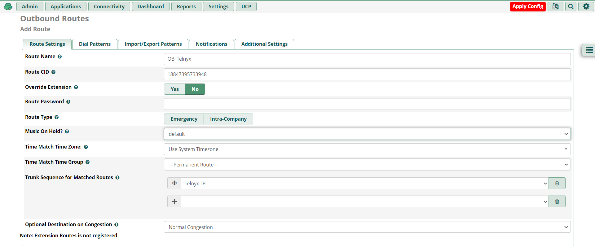

# Configuring Asterisk-Based PBXs and Algo Endpoints with Telnyx

*Part 3 of 5 — see also: [Part 1](configuring-asterisk-based-pbxs-and-algo-endpoints-with-telnyx--part-1.md), [Part 2](configuring-asterisk-based-pbxs-and-algo-endpoints-with-telnyx--part-2.md), [Part 4](configuring-asterisk-based-pbxs-and-algo-endpoints-with-telnyx--part-4.md), [Part 5](configuring-asterisk-based-pbxs-and-algo-endpoints-with-telnyx--part-5.md)*

This page describes how to connect Asterisk-based PBX platforms and SIP endpoints to Telnyx as a SIP provider. It covers raw Asterisk (both IP-authentication and credentials-based trunks), FreePBX V15, VitalPBX (credentials and IP authentication), and Algo 8xxx series SIP endpoints, including installation, trunk configuration, dialplan setup, codec selection, optional TLS/SRTP encryption, and basic troubleshooting.

## FreePBX V15 with Telnyx

[FreePBX](https://www.freepbx.org/) is a web-based open source GUI that controls and manages Asterisk. FreePBX is licensed under the GNU General Public License (GPL) and can be installed manually or as part of the pre-configured FreePBX Distro that includes the system OS, Asterisk, FreePBX GUI, and assorted dependencies.

> **Note:** We suggest using PJSIP as an upgrade from Chan_SIP, as Chan_SIP is outdated and the majority of users are moving to PJSIP, which provides a number of more future-proof options and is still actively being improved by the community. You can find out more about PJSIP [here](https://www.pjsip.org/about.htm).

Additional documentation and resources:

- [FreePBX support](https://www.freepbx.org/support/)
- [FreePBX documentation](https://wiki.freepbx.org/#all-updates)

**Pre-requisites:**

- [Download](https://www.freepbx.org/downloads/) and [install](https://sangomakb.atlassian.net/wiki/spaces/PP/pages/10682958) FreePBX V15.
- [Configure your Telnyx Mission Control Portal](https://support.telnyx.com/en/articles/1176636-get-started-with-a-mission-control-account).
- [Set up a credentials-based connection on your Telnyx Mission Control Portal](https://portal.telnyx.com/#/app/connections).
- RECOMMENDED: [Enable TLS to encrypt your traffic](https://support.telnyx.com/en/articles/1130711-does-telnyx-encrypt-communication).

### Install FreePBX V15

1. Once you load the ISO onto your server or virtual machine, you'll have a few options to select for installation. Do a full install via Asterisk 16.

   
2. You'll be prompted for your preferred video method you want to install.

   
3. The installer will now start.

   
4. The installer will start but you will see it shows the root password is not set. Click on the root password box to set your root password. The installation process cannot complete until this is done.
5. Type in your root password and confirm it a second time and click on the **Done** option in the top left screen.

   
6. The FreePBX package itself can take 15 or more minutes to install and requires access to the internet, so depending on your internet speeds it can take a while to install — be patient.
7. Once the install has 100% completed it will give you a reboot option. Click on reboot and your system is now installed.
8. Once the process is complete, you'll reach the Linux console/command prompt login. Log in using the username `root` (without quotes) and the root password you selected earlier.
9. After you log in, you should see the IP address of your PBX. Take note of this IP address as you will need it in the next step.
10. Enter the IP address of the new PBX into your web browser. The first time you do so, you'll be asked to create the admin username and the admin password. That username and password will be used in the future to access the FreePBX configuration screen. These passwords do not change the root password; they are only used for access to the FreePBX web interface.

    
11. Once submitted you can log in to the admin panel with the username and password set up in the step above.

### Configure Basic Settings

The main FreePBX screen offers four options:

- **FreePBX Administration** allows you to configure your PBX. Use the admin username and admin password you configured in the previous step to log in. This section is what most people refer to as "FreePBX."
- **User Control Panel** is where a user can log in to make web calls, set up their phone buttons, view voicemails, send and receive faxes, use SMS & XMPP messaging, view conferences, and more, depending on what you have enabled for the user. See [User Control Panel (UCP) 14+](https://wiki.freepbx.org/pages/viewpage.action?pageId=74318855) for more information.
- **Operator Panel** is a screen that allows an operator to control calls (needs additional licensing).
- **Get Support** takes you to a web page about various official support options for FreePBX.

1. Enter the username, password, and admin email address in order to create your account.

   
2. Once you've created your account, you'll be brought to the dashboard. Select **FreePBX Administration** and enter your username and password.
3. Follow the process to activate your FreePBX V15.

   
4. Select your default locales.

   
5. You'll be presented with some firewall details and other suggestions. You are welcome to set this up based on your requirements.
6. Once you're back at the dashboard, you'll see more detail.

   

### Configure SIP Settings

1. Make your way to **Settings → Asterisk SIP Settings** in order to confirm your network settings.
2. Ensure you populate the external and local network addresses under **General SIP Settings** and **Chan SIP Settings**.
3. Click **Submit** and then **Apply Config**.

   

### Configure Extensions

1. Make your way to **Applications → Extensions → Add Extension → Add New Chan SIP Extension.** The **Outbound CID** is the [number you purchased](https://portal.telnyx.com/#/app/numbers/my-numbers) from your Telnyx Mission Control Portal. The extension's secret may need to be populated under the **Other** tab.

   

   > **Note:** If you do not set an Outbound CID for your extension, you will need to enable this on your trunk.
   >
   > **Note:** This device uses CHAN_SIP technology listening on Port 5160 (UDP — this is a NON STANDARD port).
2. Click **Submit** and **Apply Config**.

For testing purposes, you can now use your SIP client to register with FreePBX using the username, password/secret, and local IP address of your FreePBX.

### Configure a Trunk

1. Make your way to **Connectivity → Trunks → Add Trunk → Add New Chan SIP Trunk.** You'll now be located in the **General** tab.
2. Enter a Trunk name, your Outbound CID, and the maximum channels you'd like for this trunk.

   

   > **Note:** If you choose not to set an Outbound CID on your trunk, then you must set an Outbound CID on each relevant extension. If you do not set a caller ID on either the trunk or each extension, then your calls will reach our SIP proxy without a valid caller ID. You may instead choose to enable a Caller ID Override in your SIP Connection's Outbound Options from within the Telnyx Portal. Please review the [caller ID number policy](https://support.telnyx.com/en/articles/3546251-caller-id-number-policy) for accepted formats.
3. Proceed to the **Dialed Number Manipulation Rules** tab. Depending on your use case, use the following simple dial patterns:

   

   **For US numbers:**
   1. prepend: `1`; match pattern: `NXXNXXXXXX`
   2. prepend: blank; match pattern: `1NXXNXXXXXX`

   **International:**
   1. prepend: Country Dialing prefix; match pattern: `NXXNXXXXXX`
   2. prepend: blank; match pattern: (Country Dialing prefix)`NXXNXXXXXX`

### Configure Outbound and Inbound Settings

1. Still in the **Add Trunk** configuration tool, click on the **SIP Settings** tab and click on the **Outgoing** sub-tab. Specify:
   1. **username:** your_sip_connection_credentials_based_telnyx_username
   2. **secret:** your_sip_connection_credentials_based_telnyx_password
   3. **type:** `friend`
   4. **qualify:** yes
   5. **insecure:** `port,invite`
   6. **host:** `sip.telnyx.com`
   7. **fromdomain:** `sip.telnyx.com`
   8. **disallow:** `all`
   9. **allow:** `ulaw`

   
2. Now click on the **Incoming** sub-tab. Specify:
   1. **username:** your_sip_connection_credentials_based_telnyx_username
   2. **secret:** your_sip_connection_credentials_based_telnyx_password
   3. **type:** `friend`
   4. **insecure:** `port,invite`
   5. **host:** `sip.telnyx.com`
   6. **dtmfmode:** `rfc2833`
   7. **disallow:** `all`
   8. **allow:** `ulaw`
   9. **Register String:** `your_sip_connection_credentials_based_telnyx_username:your_sip_connection_credentials_based_telnyx_password@sip.telnyx.com/your_sip_connection_credentials_based_telnyx_username`

      Example: `Eliza1234:mypassword123@sip.telnyx.com/Eliza1234`

   

### Configure Outbound Routing

1. Make your way to **Connectivity → Outbound Routes → Add Outbound Route.**
2. Enter the route name, route CID, and specify the Telnyx IP trunk for this outbound route.

   
3. Click **Submit** and **Apply Config**.

### Configure Inbound Routing

1. Make your way to **Connectivity → Inbound Routes → Add Inbound Route.**
2. Enter the route name description, DID associated with this route, and specify the extension that should be associated when calls are received to the DID.
3. Click **Submit** and **Apply Config**.

> **NOTE:** By default, when creating a SIP Connection in the Telnyx Mission Control Portal, the number formats for the ANI and DNIS will be set to E.164. This means Telnyx will send the dialled number in the SIP INVITE to your FreePBX system with 11 digits. As the [DID number](https://telnyx.com/resources/sip-did) above is in 11 digit format, the call will be accepted and routed to the extension. However, you can control the number formats as you desire and can read more about it [here](https://support.telnyx.com/en/articles/1130706-sip-connection-number-formats).
