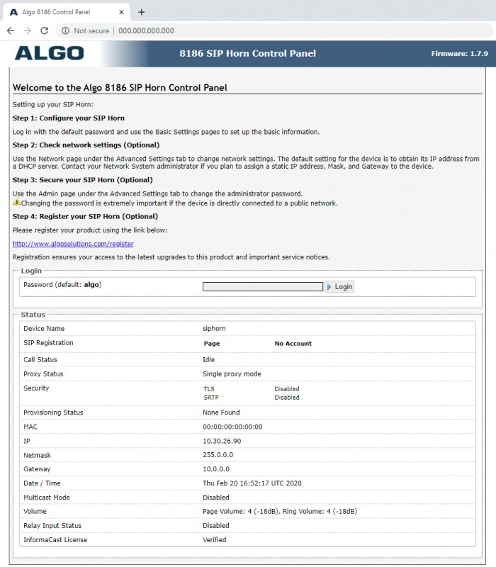
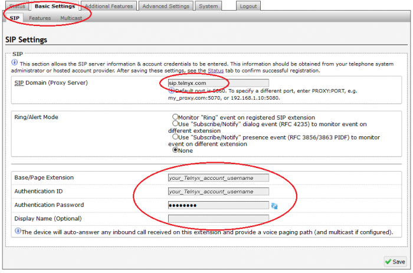
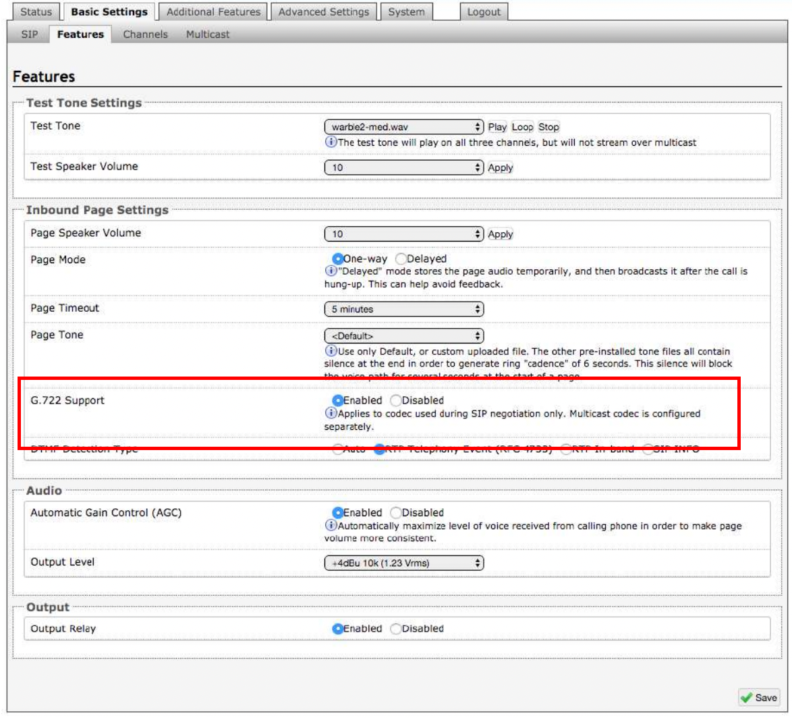

# Configuring Asterisk-Based PBXs and Algo Endpoints with Telnyx

*Part 5 of 5 — see also: [Part 1](configuring-asterisk-based-pbxs-and-algo-endpoints-with-telnyx--part-1.md), [Part 2](configuring-asterisk-based-pbxs-and-algo-endpoints-with-telnyx--part-2.md), [Part 3](configuring-asterisk-based-pbxs-and-algo-endpoints-with-telnyx--part-3.md), [Part 4](configuring-asterisk-based-pbxs-and-algo-endpoints-with-telnyx--part-4.md)*

This page describes how to connect Asterisk-based PBX platforms and SIP endpoints to Telnyx as a SIP provider. It covers raw Asterisk (both IP-authentication and credentials-based trunks), FreePBX V15, VitalPBX (credentials and IP authentication), and Algo 8xxx series SIP endpoints, including installation, trunk configuration, dialplan setup, codec selection, optional TLS/SRTP encryption, and basic troubleshooting.

## Algo 8xxx SIP Endpoints with Telnyx

[Algo](https://www.algotechnologies.co.za/about/) is a telecommunications manufacturer of SIP endpoints, as well as various other technologies including IP speakers, paging adapters, specialty handsets (PTT, PTM), strobe lights, clocks, push buttons, doorphones/intercoms, and specialty handsets. This document supports configuration of the Algo 8xxx series.

Additional documentation:

- [Algo user guides](https://www.algosolutions.com/resources/guides/)
- [Device firmware](https://www.algosolutions.com/?s=firmware&v=7516fd43adaa)

**Pre-requisites:**

- [Properly configured Telnyx Mission Control Portal](https://support.telnyx.com/en/articles/1176636-get-started-with-a-mission-control-account).
- At least one Telnyx SIP account/sub-account with the following features:
  - A valid caller ID must be indicated (if you want Algo to make outgoing calls to a specific destination — anonymous outgoing calls aren't possible).
  - If you want SIP traffic to be encrypted (and it's your choice), you will need to enable SIP-TLS for SRTP encryption.
- Ensure you are on the [most current Algo device firmware](https://www.algosolutions.com/?s=firmware&v=7516fd43adaa).

### Associate the SIP Credentials to Your Endpoint

1. Your Algo device should have an IP address assigned to it. To register your Algo SIP endpoint, open a web browser and enter this IP address.

   
2. Select the **Basic Settings** tab and then the **SIP** sub-tab and enter the following information:
   1. **SIP Domain (Proxy Server):** `sip.telnyx.com`
   2. **Base/Page Extension:** Your account/sub-account username
   3. **Authentication ID:** Your account/sub-account username
   4. **Authentication Password:** Your account/sub-account password
   5. **Display Name:** Your outbound caller ID. (Devices set to make outgoing calls require a caller ID to be configured on your Telnyx SIP account.)

   > **Note:** If you want to register additional extensions for ringing, paging, and emergency alerting, you will need to use unique credentials for the respective extension in the same way. You can use any combination of page, ring, and/or emergency alerts, so long as their credentials are unique.

   

### Enable SIP-TLS/SRTP Encryption (Optional)

1. Select the **Advanced Settings** tab, followed by the **Advanced SIP** tab and enter the following information:
   1. **SIP Transportation:** `TLS`
   2. **SDP SRTP Offer:** `Standard`, which ensures mandatory audio encryption for all calls.

      > **Note:** If the other party does not support audio encryption, any call attempt to that party will be rejected. If you don't want this to happen, set SDP SRTP Offer to `Optional`. All calls will be encrypted unless the other party does not support encryption. In that case, the call will not be encrypted.

   

   > **IMPORTANT for 8301 Users:** In order for a SIP server to validate the Algo device, an additional certificate has to be manually installed on the 8301. To add this user certificate file use a `.pem` filetype extension and have the file named `sipclient`. This is done by manually adding a file named `sipclient.pem`, which contains a device certificate and private key, to the `certs` folder (under the **Advanced Settings** tab File Manager). In future releases, `.crt`, `.cer`, and `.der` certificate extensions are also supported and you will not be restricted to naming the file `sipclient.pem`.

### Confirm Registration Success

1. Now select the **Status** tab. You will be on the **Device Status** tab.
2. Find the **Status** section and ensure that each extension's SIP registration shows as *Successful*.

   

### Enable Support for G-722 Codec (Optional)

This applies to the codec used during SIP negotiation only. Multicast codecs are configured separately.

1. Select the **Basic Settings** tab and then the **Features** sub-tab.
2. Find the **G-722 Support** field in the **Inbound Page Settings** section and use the radio buttons to enable this feature.

   

   > **Note:** Algo supports the following [audio codecs](https://telnyx.com/resources/codecs-affect-voip-sound-quality): G.711 u-law, G.711 A-law, G.722 Wideband.

## Algo Troubleshooting

### SIP Registration Status = "Rejected by Server"

If you see this error, it means that the Telnyx server got the connection request from your endpoint, but it didn't authorize the connection.

**Credentials**

In a case like this, the first thing to always check, and the most common issue, are incorrectly entered credentials.

1. Double-check your SIP account credentials (extension, authentication ID, and password) and make sure they're correct (including case).
2. If your credentials are correct, select the **Basic Settings** tab and then the **SIP** sub-tab.
   1. If the password doesn't appear correct, it's possible that your browser is auto-filling the password field. Make sure no auto-fill is occurring because of your browser settings.

**Transportation method**

If you're authenticating correctly, it could be possible that you didn't configure the SIP transportation correctly (i.e., you enabled encryption on the Algo side, but not the Telnyx side, or vice versa).

1. Select the **Advanced Settings** tab and then the **Advanced SIP** tab and ensure that your transportation you set here matches the configuration in your Telnyx Mission Control Portal.

**Address/port**

It is possible that you entered the incorrect address or port for the SIP server. In this case, the server doesn't know it should reject the request and will simply deny the connection. You will find this in the system log. To view the system log:

1. Select the **System** tab and then the **System Log** sub-tab.
2. If you see a *500 Internal Server error*, double-check that you provided the correct address/port for the SIP server.

### SIP Registration Status = "No reply from server"

If you see this error, it means that the Algo device isn't able to communicate with the phone server.

**No Internet?**

This is a really common issue. Make sure your internet connection is up and stable and try again.

**SIP Domain (Proxy Server)**

Ensure that the server is entered correctly.

1. Select the **Basic Settings** tab and then the **SIP** tab.
2. Double-check that the **SIP Domain (Proxy Server)** field is entered correctly.

**Firewall being extra careful**

If you have a firewall present, it could be blocking incoming packets from the server.

## Additional Resources

Review the [Get Started with a Mission Control Account](get-started-with-a-mission-control-account.md) guide to make sure your Telnyx Mission Control Portal account is set up correctly.

Additionally, check out:

- [Asterisk community help section](https://community.asterisk.org/) for extra support.
- [FreePBX support](https://www.freepbx.org/support/) for community or paid support.
- [FreePBX documentation](https://wiki.freepbx.org/#all-updates).
- [VitalPBX user guide](https://wiki.vitalpbx.com/wiki-category/vitalpbx/).
- [Algo user guides](https://www.algosolutions.com/resources/guides/).
- [Algo device firmware updates](https://www.algosolutions.com/?s=firmware&v=7516fd43adaa).
