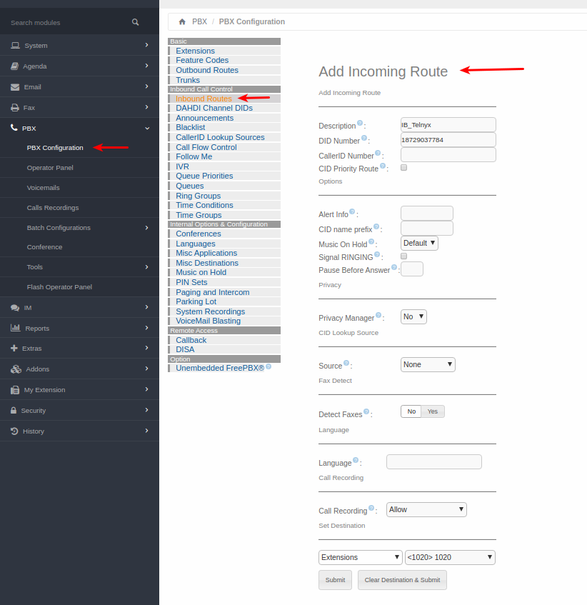

# Configuring Elastix and Epygi IP PBXs with Telnyx

*Part 1 of 5 — see also: [Part 2](configuring-elastix-and-epygi-ip-pbxs-with-telnyx--part-2.md), [Part 3](configuring-elastix-and-epygi-ip-pbxs-with-telnyx--part-3.md), [Part 4](configuring-elastix-and-epygi-ip-pbxs-with-telnyx--part-4.md), [Part 5](configuring-elastix-and-epygi-ip-pbxs-with-telnyx--part-5.md)*

This page consolidates Telnyx support documentation for configuring Elastix 4 (IP and credentials trunks), Elastix 5 (FQDN and credentials trunks), and Epygi QX-series IP PBXs to interoperate with Telnyx as a SIP provider. It covers prerequisites, installation, SIP trunk creation, and inbound/outbound routing for each platform.

## Overview

Telnyx supports integration with several IP PBX platforms, including Elastix 4, Elastix 5 (powered by 3CX), and Epygi QX-series appliances. This page consolidates the configuration guidance for each platform, covering both IP-based and credentials-based authentication methods where applicable.

Additional reference documentation for Elastix is available from 3CX:

- [Elastix admin guide](https://www.3cx.com/docs/manual/)
- [Elastix user guide](https://www.3cx.com/user-manual/)
- [Elastix support](https://www.3cx.com/support/)

Additional reference documentation for Epygi:

- [Epygi quick install guide](https://www.epygi.com/wp-content/uploads/2019/03/Install-Guide-20_500IPPBXs-v02.pdf)
- [Epygi product warranty information](http://206.81.0.143/warranty/)

## Prerequisites

Before configuring any of the PBX platforms below, complete the following in the Telnyx Mission Control Portal:

- Ensure your [Telnyx Mission Control Portal](https://support.telnyx.com/en/articles/1176636-get-started-with-a-mission-control-account) is configured properly.
- [Purchase a DID](https://portal.telnyx.com/#/app/numbers/search-numbers).
- [Set up your Telnyx SIP connection](https://portal.telnyx.com/#/app/connections).
- [Provision your number](https://portal.telnyx.com/#/app/numbers/my-numbers) (assign it to a SIP connection).
- [Create an outbound voice profile](https://portal.telnyx.com/#/app/outbound).
- Create the appropriate connection type on the Telnyx Mission Control Portal:
  - For Elastix 4 IP trunk: an [IP authentication connection](https://support.telnyx.com/en/articles/2602782-ip-authentication-with-tech-prefix).
  - For Elastix 4 credentials trunk and Elastix 5 credentials trunk: a [credentials-based connection](https://portal.telnyx.com/#/app/connections).
  - For Elastix 5 FQDN trunk: an [IP or FQDN connection](https://portal.telnyx.com/#/app/connections).
- Recommended: [Enable TLS to encrypt your traffic](https://support.telnyx.com/en/articles/1130711-does-telnyx-encrypt-communication).

## Elastix 4 Installation

Elastix 4 is no longer available through the original provider. Download the Elastix 4 ISO from the [Telnyx Dropbox archive](https://www.dropbox.com/sh/rzrdrpu0ocumu95/AABJeNgKkOkDCYLkSrsIuD3Aa?dl=0). Note any username/password combinations you set during installation — you will need them later.

1. Run the Elastix installer.

   
2. At the CentOS installation summary, configure:
   - **Date and Time** for your time zone.
   - **Install Destination** (select the hard drive created for this virtual machine).
   - **Keyboard**.
   - **Network and Hostname** — make sure this is turned *on*.

   
3. Click **Begin Installation**.
4. Configure user settings when prompted.

   
5. Set a root password and create a user. Remember these credentials.
6. While the installation continues, enter your SQL root password and admin password (used to log in to the GUI).

   

   
7. The virtual machine will reboot. Log in as root and Web GUI admin.

   
8. Copy the URL displayed and enter it in your browser to access the GUI.

   
9. Enter your username and password to access the Elastix system.

## Elastix 4 IP Trunk

Use this configuration when authenticating the Elastix 4 PBX to Telnyx by IP address rather than by SIP credentials.

### Add a SIP trunk

1. Log in to the Elastix GUI.

   
2. Navigate to **PBX > Tools > Asterisk File Editor** and filter for the `sip_nat.conf` file.
3. Enter your local network subnet and external IP in the `localnet=` and `externip=` fields.
4. Click **Save**, then **Reload Asterisk**.

   
5. Navigate to **PBX > PBX Configurations > Extensions > Add SIP Extension** and enter:
   - **User Extension:** the extension you wish to use for this trunk.
   - **Display Name:** a meaningful name.
   - **Outbound CID:** the [Telnyx number](https://portal.telnyx.com/#/app/numbers/my-numbers) you want to assign to this extension. Use the user extension and password along with the internal IP of your Elastix server to register this SIP extension.
   - **Asterisk Dial Options:** `tr`.
   - **Queue State Detection:** `Use state`.
   - **Secret:** your Telnyx account password for this extension.
   - **[DTMFmode](https://support.telnyx.com/en/articles/1130710-what-is-dtmf):** `RFC 2833`.
   - **NAT:** `No- RFC 3581`.

   
6. Click **Submit**, then **Apply Config**.
7. From **PBX > PBX Configurations**, click **Trunks** and add the following settings.

   **Outgoing SIP Settings:**
   - **Host:** `sip.telnyx.com`
   - **Type:** `peer`
   - **Qualify:** `Yes`
   - **Disallow:** `All`
   - **Allow:** `ulaw & alaw`

   **Inbound SIP Settings:**
   - **Host:** `sip.telnyx.com`
   - **Type:** `friend`
   - **Insecure:** `port,invite`
   - **Disallow:** `All`
   - **Allow:** `ulaw`
   - **DTMFmode:** `RFC 2833`
   - **NAT:** `force_rport,comedia`
   - **Registration string:** leave blank (this is an IP trunk).
   - **Dialed number manipulation rules:**
     - prepend: `1`; match pattern: `NXXNXXXXXX`
     - prepend: blank; match pattern: `1NXXNXXXXXX`

   > The above dial patterns are for 10- and 11-digit destinations; your own dial patterns may differ.

   
8. Click **Submit** and **Apply Config**.

### Configure outbound rules

1. Navigate to **PBX > PBX Configurations > Outbound Routes**, then **Add Route**.
2. Provide:
   - **Route Name:** a meaningful identifier.
   - **Route CID:** the [Telnyx number](https://portal.telnyx.com/#/app/numbers/my-numbers) to assign to this route.
   - **Dial Patterns:** enter your dial patterns as needed.
   - **Trunk Sequence:** `Telnyx`.
   - Configure any additional fields as required.

   
3. Click **Submit** and **Apply Config**.

### Configure inbound rules

1. Navigate to **PBX > PBX Configurations > Inbound Routes**, then **Add Incoming Route**.
2. Provide:
   - **Description:** a meaningful identifier.
   - **[DID Number](https://telnyx.com/resources/sip-did):** the [Telnyx number](https://portal.telnyx.com/#/app/numbers/my-numbers) to handle inbound calls.
   - **Extensions:** any extensions to register for inbound calling.
   - Configure any additional fields as required.

   
3. Click **Submit** and **Apply Config**.
