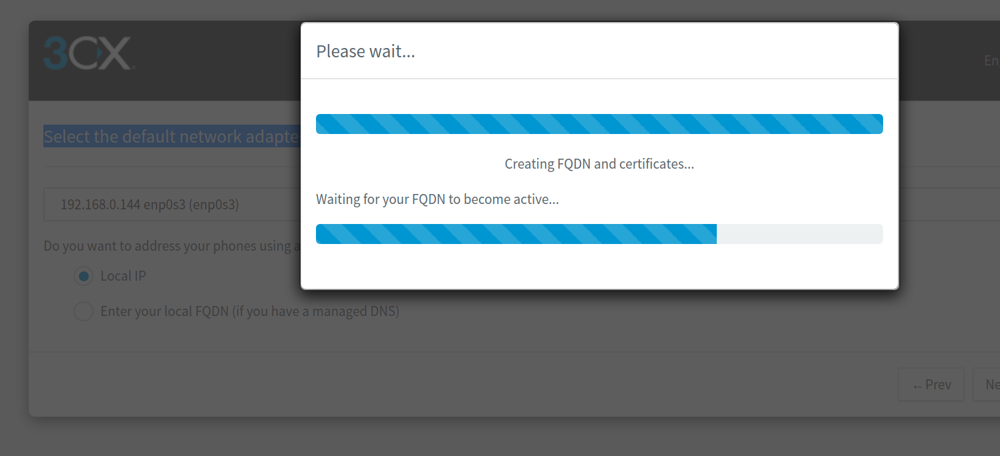
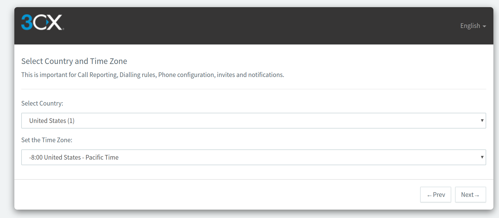
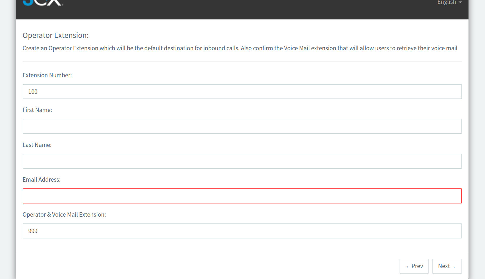
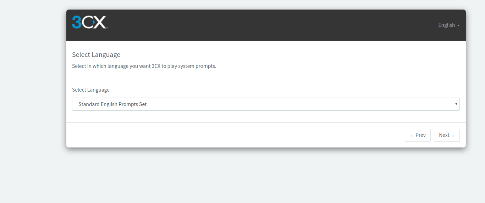

# Configuring Elastix and Epygi IP PBXs with Telnyx

*Part 2 of 5 — see also: [Part 1](configuring-elastix-and-epygi-ip-pbxs-with-telnyx--part-1.md), [Part 3](configuring-elastix-and-epygi-ip-pbxs-with-telnyx--part-3.md), [Part 4](configuring-elastix-and-epygi-ip-pbxs-with-telnyx--part-4.md), [Part 5](configuring-elastix-and-epygi-ip-pbxs-with-telnyx--part-5.md)*

This page consolidates Telnyx support documentation for configuring Elastix 4 (IP and credentials trunks), Elastix 5 (FQDN and credentials trunks), and Epygi QX-series IP PBXs to interoperate with Telnyx as a SIP provider. It covers prerequisites, installation, SIP trunk creation, and inbound/outbound routing for each platform.

## Elastix 4 Credentials Trunk

Use this configuration when authenticating the Elastix 4 PBX to Telnyx with SIP credentials rather than by IP.

### Add a SIP trunk

1. Log in to the Elastix GUI.

   
2. Navigate to **PBX > Tools > Asterisk File Editor** and filter for the `sip_nat.conf` file.
3. Enter your local network subnet and external IP in the `localnet=` and `externip=` fields.
4. Click **Save**, then **Reload Asterisk**.

   
5. Navigate to **PBX > PBX Configurations > Extensions > Add SIP Extension** and enter:
   - **User Extension:** the extension you wish to use for this trunk.
   - **Display Name:** a meaningful name.
   - **Outbound CID:** the [Telnyx number](https://portal.telnyx.com/#/app/numbers/my-numbers) you want to assign to this extension. Use the user extension and password along with the internal IP of your Elastix server to register this SIP extension.
   - **Asterisk Dial Options:** `tr`.
   - **Queue State Detection:** `Use state`.
   - **Secret:** your Telnyx account password for this extension.
   - **DTMFmode:** `RFC 2833`.
   - **NAT:** `No- RFC 3581`.

   
6. Click **Submit**, then **Apply Config**.
7. From **PBX > PBX Configurations**, click **Trunks** and add the following settings.

   **Outgoing SIP Settings:**
   - **Username:** your Telnyx account username.
   - **Secret:** your Telnyx account password.
   - **Host:** `sip.telnyx.com`.
   - **Type:** `friend`.
   - **Insecure:** `port, invite`.
   - **Qualify:** `Yes`.
   - **Disallow:** `All`.
   - **Allow:** `ulaw & alaw`.

   **Inbound SIP Settings:**
   - **Username:** your Telnyx account username.
   - **Secret:** your Telnyx account password.
   - **Fromdomain:** `sip.telnyx.com`.
   - **Host:** `sip.telnyx.com`.
   - **Type:** `friend`.
   - **Insecure:** `port,invite`.
   - **Qualify:** `Yes`.
   - **Disallow:** `All`.
   - **Allow:** `ulaw`.
   - **DTMFmode:** `RFC 2833`.
   - **NAT:** `force_rport,comedia`.
   - **Registration string:** `your_username:your_password@sip.telnyx.com`.
   - **Dialed number manipulation rules:**
     - prepend: `1`; match pattern: `NXXNXXXXXX`
     - prepend: blank; match pattern: `1NXXNXXXXXX`

   > The above dial patterns are for 10- and 11-digit destinations; your own dial patterns may differ.

   
8. Click **Submit** and **Apply Config**.

### Configure outbound rules

1. Navigate to **PBX > PBX Configurations > Outbound Routes**, then **Add Route**.
2. Provide:
   - **Route Name:** a meaningful identifier.
   - **Route CID:** the [Telnyx number](https://portal.telnyx.com/#/app/numbers/my-numbers) to assign to this route.
   - **Dial Patterns:** enter your dial patterns as needed.
   - **Trunk Sequence:** `Telnyx`.
   - Configure any additional fields as required.

   
3. Click **Submit** and **Apply Config**.

### Configure inbound rules

1. Navigate to **PBX > PBX Configurations > Inbound Routes**, then **Add Incoming Route**.
2. Provide:
   - **Description:** a meaningful identifier.
   - **[DID Number](https://telnyx.com/resources/sip-did):** the [Telnyx number](https://portal.telnyx.com/#/app/numbers/my-numbers) to handle inbound calls.
   - **Extensions:** any extensions to register for inbound calling.
   - Configure any additional fields as required.

   
3. Click **Submit** and **Apply Config**.

## Elastix 5 First-Time Setup

Elastix 5 is a high-performance turnkey PBX powered by 3CX. It is available on-premise on Windows, Linux, Raspberry Pi, or in the cloud. You will need an [Elastix license key](https://www.3cx.com/phone-system/download-phone-system/).

1. After installation, choose to run the configuration tool from the **web browser** (recommended) or the **command line**. A URL is provided for accessing the GUI.

   
2. Enter your license key and click **Next** to create a new install.

   
3. Confirm or override the detected public IP address, then click **Next**.
4. Choose whether your IP address is **static** or **dynamic**, then click **Next**.

   
5. Select the ports required for the 3CX Management console (defaults are populated).

   
6. Select the default network adapter.

   
7. Wait for the FQDN and certificates to be generated.

   
8. Select how many digits your extensions should have.

   
9. Enter an email for important system notifications.

   
10. Select your country and time zone.

    
11. Create an operator extension.

    
12. Optionally restrict outbound calling to specific countries.

    
13. Select your preferred language.

    
14. A congratulations page confirms the basic settings. Note the details — a copy is also emailed to the admin address.
15. Access the PBX interface using the FQDN or public IP. If the PBX is on your local LAN behind a firewall, apply port forwarding for the ports selected in step 5.
16. Log in with the username and password you created.

    
17. The dashboard appears.

    
18. Go to **Settings > Network** to confirm your network settings.
19. On the **Ports** tab, set **SIP Port** to `5060`.
20. On the **Public IP** tab, verify the **External IP Configuration** and that the correct network card interface is selected.

    > Ensure the connection IP on the Telnyx Mission Control Portal matches your static public IP. You can also use the FQDN for inbound calls and the IP for outbound calls.
