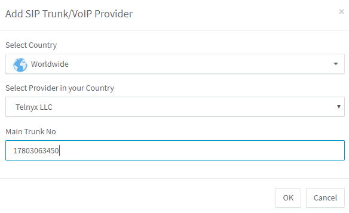
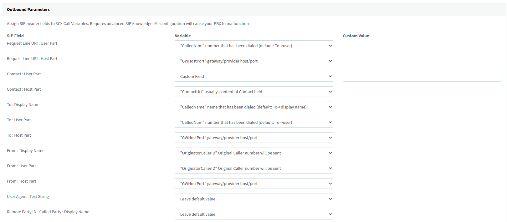
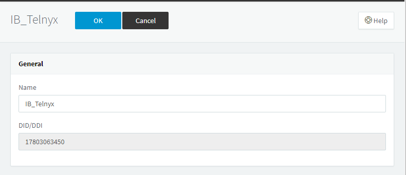

# Configuring Elastix and Epygi IP PBXs with Telnyx

*Part 3 of 5 — see also: [Part 1](configuring-elastix-and-epygi-ip-pbxs-with-telnyx--part-1.md), [Part 2](configuring-elastix-and-epygi-ip-pbxs-with-telnyx--part-2.md), [Part 4](configuring-elastix-and-epygi-ip-pbxs-with-telnyx--part-4.md), [Part 5](configuring-elastix-and-epygi-ip-pbxs-with-telnyx--part-5.md)*

This page consolidates Telnyx support documentation for configuring Elastix 4 (IP and credentials trunks), Elastix 5 (FQDN and credentials trunks), and Epygi QX-series IP PBXs to interoperate with Telnyx as a SIP provider. It covers prerequisites, installation, SIP trunk creation, and inbound/outbound routing for each platform.

## Elastix 5 FQDN Trunk

Use this configuration when authenticating the Elastix 5 PBX to Telnyx by IP or FQDN rather than by SIP credentials.

### Create a Telnyx SIP trunk

1. From the left-hand navigation, click **SIP Trunks**.
2. Click **+ Add SIP Trunk**.
3. In the pop-up, enter:
   - **Select Country:** `Worldwide`.
   - **Select Provider in your Country:** `Telnyx LLC`.
   - **Main Trunk No:** the [Telnyx number](https://portal.telnyx.com/#/app/numbers/my-numbers) you purchased.

   
4. Click **OK** to open the trunk configuration window.
5. On the **General** tab, in **Trunk Details**, provide:
   - **Enter name of Trunk:** `Telnyx LLC`.
   - **Registrar/Server/Gateway Hostname or IP:** `sip-anycast1.telnyx.com:5060` or `sip.telnyx.com:5060`.
   - **Outbound Proxy:** `sip.telnyx.com`.
   - **Number of SIM Calls:** your preferred number of simultaneous calls.

   
6. In the **Authentication** section, provide:
   - **Type of Authentication:** `Do not require - IP Based`.
   - **Authentication ID (aka SIP user ID):** the [Telnyx number](https://portal.telnyx.com/#/app/numbers/my-numbers) you purchased.
   - **Authentication Password:** leave blank.

   
7. In the **Route calls to** section, provide:
   - **Main Trunk number:** the default number (cross-verify with the Telnyx portal).
   - **Destination for calls during the office hours:** based on your requirement.
   - **Destination for calls outside the office hours:** based on your requirement.

   
8. On the **Options** tab:
   - **Require registration for:** `Do not require`.
   - Remove `GSM-FR` from **Assigned Codecs**.
9. Click **Apply**.
10. On the **Outbound Parameters** tab, in **SIP Field**:
    - **Contact User Part:** `Custom Field` (leave the custom value blank).

    
11. Click **Apply**, then **OK** at the top of the page.
12. The IP trunk is now live.

    

### Create inbound rules

1. From the left-hand navigation, click **Inbound Rules**.
2. Click **+Add DID Rule**.
3. In the **General** section, provide:
   - **Name:** a meaningful name for the rule.
   - **DID/DDI:** one of the DIDs you provisioned from Telnyx.

   
4. In the **Route calls to** section, provide:
   - **Main Trunk number:** the default number (cross-verify with the Telnyx portal).
   - **Destination for calls during the office hours:** based on your requirement.
   - **Destination for calls outside the office hours:** based on your requirement.

   

### Create outbound rules

1. From the left-hand navigation, click **Outbound Rules**.
2. Click **+Add**.
3. In the **General** section, provide:
   - **Rule Name:** a meaningful name.

   
4. In the **Apply this rule to these calls** section, provide:
   - **Calls to numbers starting with prefix:** leave empty.
   - **Calls from extension(s):** your extension numbers (e.g. `000`).
   - **Calls to numbers with a length of:** leave empty.

   
5. In the **Make outbound calls on** section, configure up to three routes. The first is the primary route; the second and third are backups. For each route, digits can be stripped or added. Strip 0 digits on Route 1 and 1 digit on the remaining two routes.

   This is one of the ways an outbound caller ID can be applied within 3CX. If applied on the outbound route, it applies to all calls through that route.

   

   

   > Before configuring an outbound caller ID, observe these naming conventions:
   > - Use **capital letters** for the Caller ID Name for clearer display on some devices.
   > - Do **not** use special characters.
   > - Some Canadian providers display no more than 15 characters — shorten or adapt your caller ID accordingly.
   > - **Spaces are allowed** in a caller ID name.
   > - Be familiar with [Telnyx's caller ID number policy](https://support.telnyx.com/en/articles/3546251-caller-id-number-policy).
   >
   > If you do not add an outbound caller ID on the outbound route, you can apply it per user or extension instead.

6. Click **OK**.
