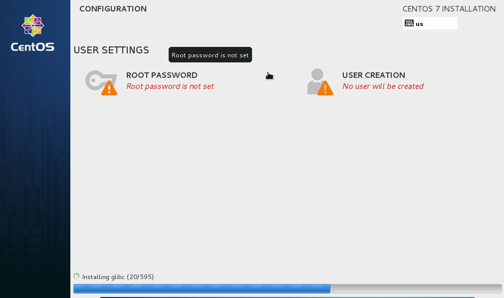
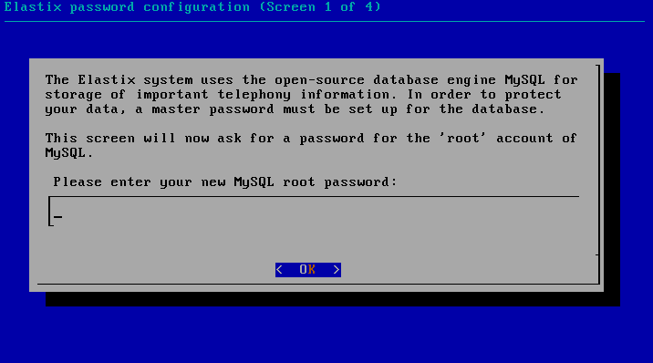
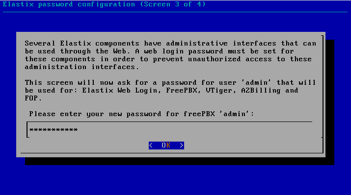
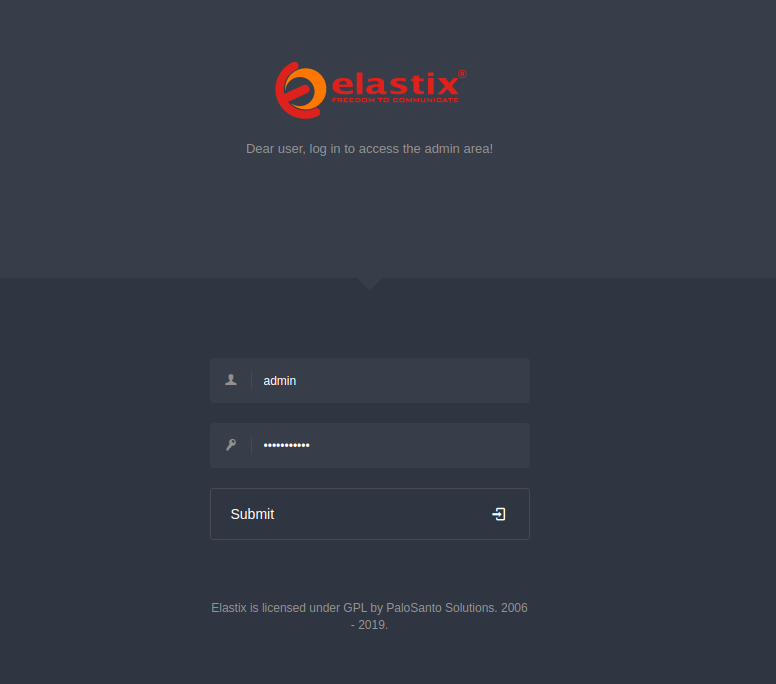
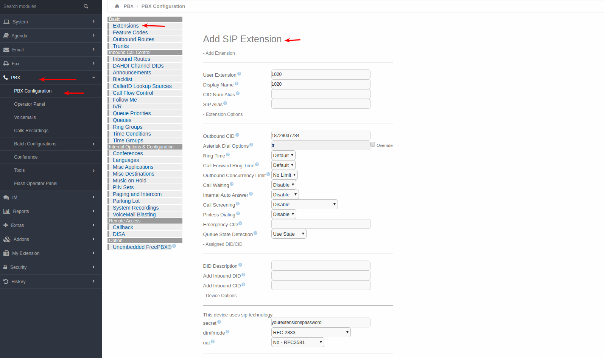
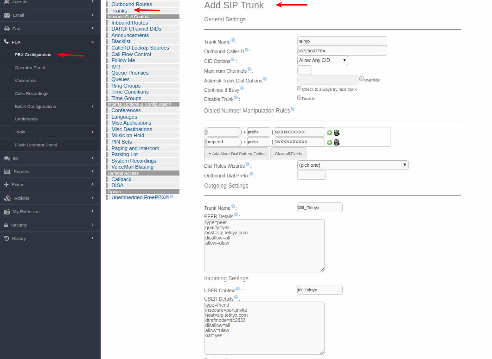

# Configuring Elastix PBX with Telnyx

*Part 1 of 3 — see also: [Part 2](configuring-elastix-pbx-with-telnyx--part-2.md), [Part 3](configuring-elastix-pbx-with-telnyx--part-3.md)*

This page explains how to configure Elastix 4 and Elastix 5 PBX systems with Telnyx using IP-based, FQDN, and credentials-based SIP trunks, including installation, trunk setup, and inbound/outbound routing. It also covers integrating Chiro8000 practice management software with Telnyx for SMS messaging and resetting a Telnyx account password.

## Overview

Elastix is a flexible PBX platform that can be deployed on-premise (Linux or Windows), self-hosted in your own cloud, or installed on a virtual machine. Powered by 3CX, it provides a unified communications solution with softphones for Android, iOS, Windows, and Mac, a web client, and integrated WebRTC video conferencing. Supported IP phones, trunks, and gateways are automatically configured using built-in templates.

This page covers how to connect Elastix 4 and Elastix 5 to Telnyx using both IP-based and credentials-based SIP trunks, plus related account and integration tasks.

Additional Elastix documentation is available from 3CX:

- [Elastix admin guide](https://www.3cx.com/docs/manual/)
- [Elastix user guide](https://www.3cx.com/user-manual/)
- [Elastix support](https://www.3cx.com/support/)

## Prerequisites

Before configuring any Elastix trunk with Telnyx, complete the following in the Telnyx Mission Control Portal:

- Configure your [Telnyx Mission Control Portal](https://support.telnyx.com/en/articles/1176636-get-started-with-a-mission-control-account) account.
- [Purchase a DID](https://portal.telnyx.com/#/app/numbers/search-numbers).
- [Set up your Telnyx SIP connection](https://portal.telnyx.com/#/app/connections).
- [Provision your number](https://portal.telnyx.com/#/app/numbers/my-numbers) (assign it to a SIP connection).
- [Create an outbound voice profile](https://portal.telnyx.com/#/app/outbound).
- Create the appropriate connection type on the Telnyx portal:
  - For IP-based trunks: an [IP authentication connection](https://support.telnyx.com/en/articles/2602782-ip-authentication-with-tech-prefix).
  - For credentials-based trunks: a [credentials-based connection](https://portal.telnyx.com/#/app/connections).
  - For FQDN trunks: an [IP or FQDN connection](https://portal.telnyx.com/#/app/connections).
- Recommended: [Enable TLS to encrypt your traffic](https://support.telnyx.com/en/articles/1130711-does-telnyx-encrypt-communication).

For Elastix 4, download the Elastix 4 ISO from the [Telnyx Dropbox link](https://www.dropbox.com/sh/rzrdrpu0ocumu95/AABJeNgKkOkDCYLkSrsIuD3Aa?dl=0) (V4 is no longer available through the provider). For Elastix 5, [download and install Elastix](https://www.3cx.com/community/threads/elastix-2-0-0-57-iso-download.112659/) and obtain an [Elastix license key](https://www.3cx.com/phone-system/download-phone-system/).

Record any username/password combinations you set during installation — you will need them later.

## Install Elastix 4

Because the provider no longer supports Elastix, follow this installation guide.

1. Run the Elastix installer.

   
2. At the CentOS installation summary, configure:
   - **Date and Time** for your time zone.
   - **Installation Destination** (select the hard drive created for this virtual machine).
   - **Keyboard** layout.
   - **Network and Hostname** — make sure this is turned *on*.

   
3. Click **Begin Installation**.
4. Configure user settings when prompted.

   
5. Set a root password and create a user. Remember these credentials.
6. While the installation continues, enter your SQL root password and admin password (used to log in to the GUI).

   

   
7. The virtual machine will reboot. You can now log in as root and as the Web GUI admin.

   
8. Copy the URL displayed after reboot and enter it in your browser to access the GUI.

   
9. Enter your username and password to reach the Elastix system.

## Configure Elastix 4 SIP Settings

Log in to the Elastix GUI.

### Update NAT settings

1. Go to **PBX > Tools > Asterisk File Editor** and filter for the `sip_nat.conf` file.
2. Enter your local network subnet and external IP in the `localnet=` and `externip=` fields.
3. Click **Save**, then **Reload Asterisk**.

### Add a SIP extension

1. Go to **PBX > PBX Configurations > Extensions > Add SIP Extension**.
2. Enter the following (leave unspecified fields blank unless required):
   - **User Extension:** the extension you wish to use for this trunk.
   - **Display Name:** a meaningful name.
   - **Outbound CID:** the Telnyx number you want to assign to this extension. Use the user extension, password, and internal IP of your Elastix server to register the SIP extension.
   - **Asterisk Dial Options:** `tr`.
   - **Queue State Detection:** `Use state`.
   - **Secret:** your Telnyx account password for this extension.
   - **DTMFmode:** `RFC 2833`.
   - **NAT:** `No- RFC 3581`.

   
3. Click **Submit**, then **Apply Config**.

## Configure an Elastix 4 IP Trunk

Use this configuration when your Telnyx connection uses IP authentication (no SIP registration).

1. In **PBX > PBX Configurations**, click **Trunks** and add a new trunk.
2. **Outgoing SIP Settings:**
   - **Host:** `sip.telnyx.com`
   - **Type:** `peer`
   - **Qualify:** `Yes`
   - **Disallow:** `All`
   - **Allow:** `ulaw & alaw`
3. **Inbound SIP Settings:**
   - **Host:** `sip.telnyx.com`
   - **Type:** `friend`
   - **Insecure:** `port,invite`
   - **Disallow:** `All`
   - **Allow:** `ulaw`
   - **DTMFmode:** `RFC 2833`
   - **NAT:** `force_rport,comedia`
   - **Registration string:** leave blank (this is an IP trunk).
   - **Dialed number manipulation rules:**
     - prepend: `1`; match pattern: `NXXNXXXXXX`
     - prepend: blank; match pattern: `1NXXNXXXXXX`

   > The above dial patterns are for 10- and 11-digit destinations; your own dial patterns may differ.

   
4. Click **Submit** and **Apply Config**.

## Configure an Elastix 4 Credentials Trunk

Use this configuration when your Telnyx connection uses SIP credentials (registration-based).

1. In **PBX > PBX Configurations**, click **Trunks** and add a new trunk.
2. **Outgoing SIP Settings:**
   - **Username:** your Telnyx account username.
   - **Secret:** your Telnyx account password.
   - **Host:** `sip.telnyx.com`
   - **Type:** `friend`
   - **Insecure:** `port, invite`
   - **Qualify:** `Yes`
   - **Disallow:** `All`
   - **Allow:** `ulaw & alaw`
3. **Inbound SIP Settings:**
   - **Username:** your Telnyx account username.
   - **Secret:** your Telnyx account password.
   - **Fromdomain:** `sip.telnyx.com`
   - **Host:** `sip.telnyx.com`
   - **Type:** `friend`
   - **Insecure:** `port,invite`
   - **Qualify:** `Yes`
   - **Disallow:** `All`
   - **Allow:** `ulaw`
   - **DTMFmode:** `RFC 2833`
   - **NAT:** `force_rport,comedia`
   - **Registration string:** `your_username:your_password@sip.telnyx.com`
   - **Dialed number manipulation rules:**
     - prepend: `1`; match pattern: `NXXNXXXXXX`
     - prepend: blank; match pattern: `1NXXNXXXXXX`

   > The above dial patterns are for 10- and 11-digit destinations; your own dial patterns may differ.

   
4. Click **Submit** and **Apply Config**.
