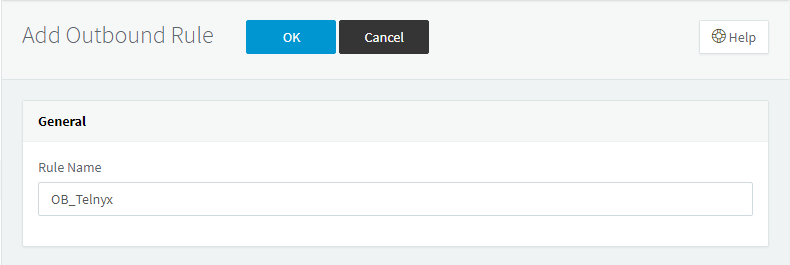
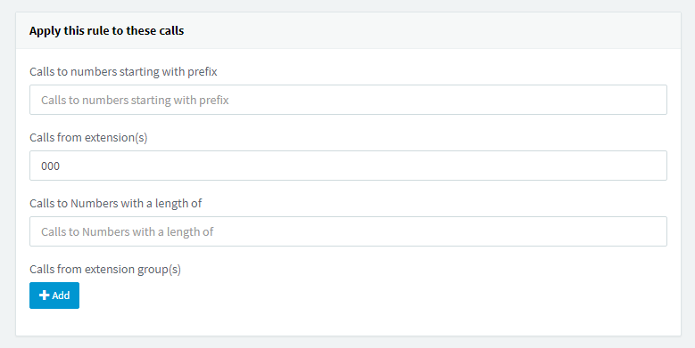
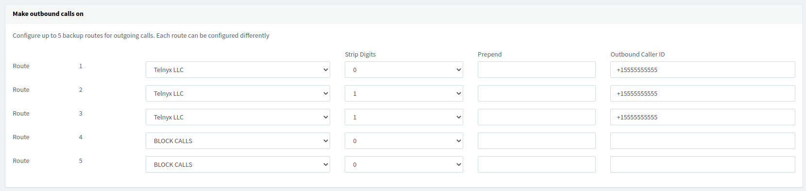
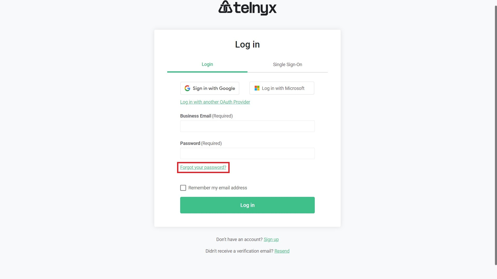
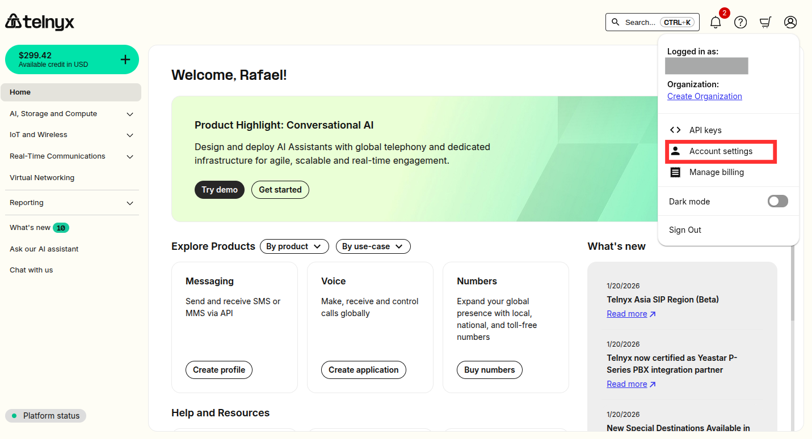
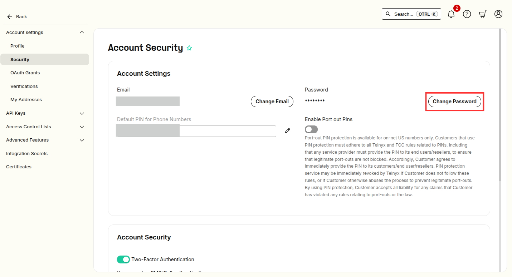
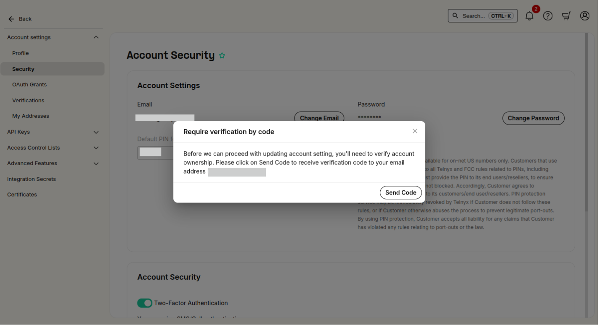
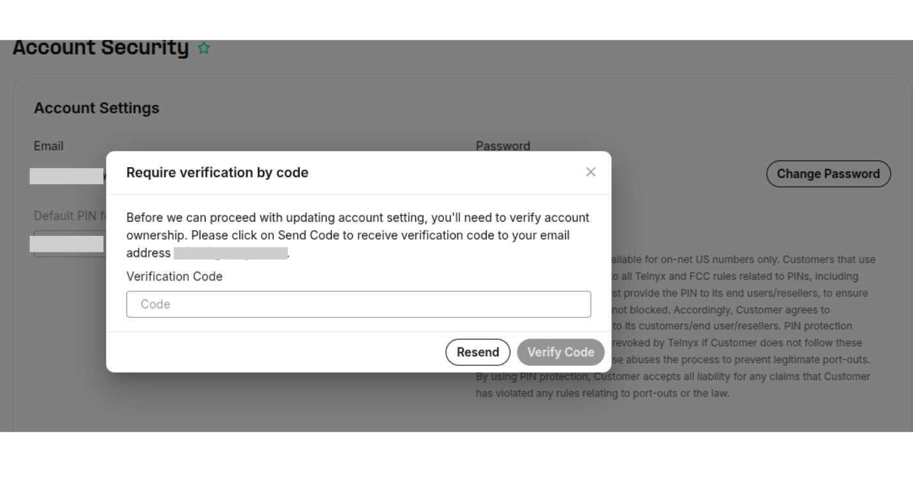

# Configuring Elastix PBX with Telnyx

*Part 3 of 3 — see also: [Part 1](configuring-elastix-pbx-with-telnyx--part-1.md), [Part 2](configuring-elastix-pbx-with-telnyx--part-2.md)*

This page explains how to configure Elastix 4 and Elastix 5 PBX systems with Telnyx using IP-based, FQDN, and credentials-based SIP trunks, including installation, trunk setup, and inbound/outbound routing. It also covers integrating Chiro8000 practice management software with Telnyx for SMS messaging and resetting a Telnyx account password.

## Create Elastix 5 Outbound Rules

1. From the left-hand navigation, click **Outbound Rules**.
2. Click **+ Add**.
3. In the **General** section, enter a meaningful **Rule Name**.

   
4. In the **Apply this rule to these calls** section, enter:
   - **Calls to numbers starting with prefix:** leave empty.
   - **Calls from extension(s):** your extension numbers (for example, `000`).
   - **Calls to numbers with a length of:** leave empty.

   
5. In the **Make outbound calls on** section, configure up to three routes. The first is the primary route; the second and third are backups. For each route, digits can be stripped or added. Strip 0 digits on Route 1 and strip 1 digit on the remaining two routes.

   This is one of the ways an outbound caller ID can be applied within 3CX. If applied on the outbound route, it applies to all calls that proceed through that route.

   

   

   > Before configuring an outbound caller ID, observe these naming conventions:
   > - Use **capital letters** for the Caller ID Name for clearer display on some devices.
   > - Do **not** use special characters — they will not be displayed.
   > - Some Canadian providers display no more than 15 characters; shorten or adapt your caller ID accordingly.
   > - **Spaces are allowed** in a caller ID name.
   > - Be familiar with [Telnyx's caller ID number policy](https://support.telnyx.com/en/articles/3546251-caller-id-number-policy).
   >
   > If you do not add an outbound caller ID on the outbound route, you can apply it per user or extension instead.

6. Click **OK** to complete the configuration.

You can now make and receive calls using Telnyx as your SIP provider.

## Chiro8000 and Telnyx Integration

Chiro8000 is a practice management software used by chiropractors. It can be paired with Telnyx to send SMS appointment reminders and other text messages.

### Costs

- Signing up is free with no monthly minimum. Sending messages to/from US local numbers costs less than a penny per message plus small taxes and fees. Most chiropractors spend $5–$10 per month on appointment reminder texts.
- Leasing a phone number costs $1 per month plus a $1 one-time activation fee. Most chiropractors only need one number.
- Telnyx is prepaid — add funds before sending messages or leasing numbers.

### Integration steps

1. Sign up at [telnyx.com/sign-up](https://telnyx.com/sign-up) or log in at [portal.telnyx.com](https://portal.telnyx.com/).
2. Add funds using the green plus icon at the top of the page.
3. [Purchase a number](https://support.telnyx.com/en/articles/4380325-search-and-buy-numbers). Most chiropractors use a Local number. Toggle **Try Improved Search** and ensure the **Features** parameter has **SMS** enabled.

   
4. [Create a messaging profile](https://support.telnyx.com/en/articles/3562059-setting-up-a-messaging-profile).
5. Assign the messaging profile to your phone number under **My Numbers**.
6. In Chiro8000, open the **Options** menu, then go to **Options > Calendar** and enable the **Enable Telnyx** checkbox. Open **Telnyx Configuration**, enter your Telnyx API key and the phone number purchased from the Telnyx portal, and click **Ok** twice.
7. In the Chiro8000 Calendar, select **Reminders** and configure your appointment reminder settings. Ensure you have sufficient funds to cover the messages you will send.

> As of December 1, 2024, sending from a US Local Phone Number requires 10DLC compliance. Toll-Free numbers also require a compliance process (Toll-Free Verification) but it is generally less expensive and faster. Contact the Telnyx Messaging Compliance team at [10DLCquestions@telnyx.com](mailto:10DLCquestions@telnyx.com) with questions.

### Optional steps

- [Set up low balance notifications](https://support.telnyx.com/en/articles/4277896-notification-settings) via **Account Settings > Advanced Features > Notifications**.
- Configure Auto Recharge at [portal.telnyx.com/#/billing/payment](https://portal.telnyx.com/#/billing/payment) after your first manual payment.
- Enable Two-Factor Authentication via **My Account > General > Security > Two-Factor Authentication**.
- Set daily spend limits in your outbound voice profile settings.

  

## Reset Your Telnyx Account Password

Your password must contain at least one punctuation mark or symbol, at least one upper-case letter, and must be at least 12 characters long.

### Method 1: Reset via the sign-in page

1. Go to the [Telnyx portal](https://portal.telnyx.com) and click **Forgot your password**.

   
2. Enter your registered email address and click **Reset password**. A reset link is emailed to you.

   
3. Open the email titled **Reset password instructions** and click **Change my password**.

   
4. On the **Change Password** page, enter the new password twice and click **Update password**.

   

### Method 2: Reset from account settings

1. In the [Telnyx portal](https://portal.telnyx.com), click the profile icon in the top right and choose **Account Settings**.

   
2. Select **Security** from the left sidebar.

   
3. Click **Change Password**.

   
4. Request a verification code by email and enter it when prompted.

   

   
5. Enter your current password and the new password twice, then click **Change Password**.

   

## Additional Resources

- [Getting started with Mission Control](https://support.telnyx.com/en/articles/1176636-get-started-with-a-mission-control-account)
- [Elastix admin guide](https://www.3cx.com/docs/manual/)
- [Elastix user guide](https://www.3cx.com/user-manual/)
- [Elastix support](https://www.3cx.com/support/)
- [Telnyx caller ID number policy](https://support.telnyx.com/en/articles/3546251-caller-id-number-policy)
- [Setting up a messaging profile](https://support.telnyx.com/en/articles/3562059-setting-up-a-messaging-profile)
- [Search and buy numbers](https://support.telnyx.com/en/articles/4380325-search-and-buy-numbers)
- [Notification settings](https://support.telnyx.com/en/articles/4277896-notification-settings)
