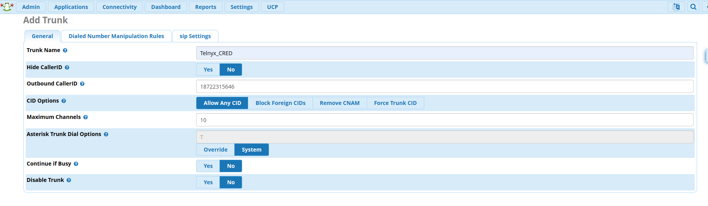
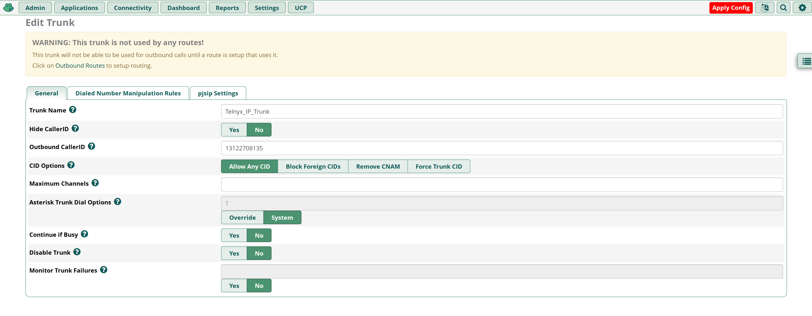
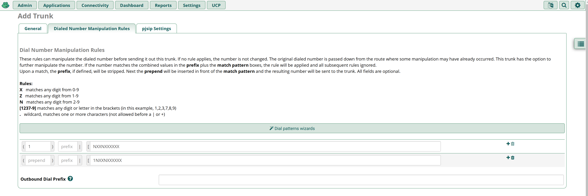

# Configuring FreePBX with Telnyx Credentials-Based SIP Trunks

*Part 3 of 4 — see also: [Part 1](configuring-freepbx-with-telnyx-credentials-based-sip-trunks--part-1.md), [Part 2](configuring-freepbx-with-telnyx-credentials-based-sip-trunks--part-2.md), [Part 4](configuring-freepbx-with-telnyx-credentials-based-sip-trunks--part-4.md)*

This page explains how to configure FreePBX (versions 13, 14, and 15) to use Telnyx as a SIP provider with credentials-based authentication, covering both ChanSIP and PJSIP channel drivers. It walks through installing FreePBX, configuring SIP settings, creating extensions, setting up trunks, and defining inbound and outbound routes.

## Configure the SIP Trunk

### FreePBX V13 ChanSIP Trunk

1. Make your way to **Connectivity → Trunks → Add Trunk → Add New Chan SIP Trunk**. You'll now be located in the **General** tab. Provide the following information:
   - **Trunk Name:** Your Outbound CID and the maximum channels you'd like for this trunk.

   

   ***Note:*** *Enter a Trunk name, your Outbound CID and the maximum channels you'd like for this trunk. If you choose not to set an Outbound CID on your trunk, then you must set an Outbound CID on each relevant extension. If you do not set a caller ID on either the trunk or each extension, then your calls will reach our SIP proxy without a valid caller ID. You may instead choose to enable a Caller ID Override in your SIP Connection's Outbound Options from within the Telnyx Portal. Please review our [caller ID number policy](https://support.telnyx.com/en/articles/3546251-caller-id-number-policy) for accepted formats.*

2. Click on the **Dialed Number Manipulation Rules** tab. You can leave this entire section in its default state, but you can also enter dial patterns here:
   - **For US numbers:**
     - prepend: *1*; match pattern: *NXXNXXXXXX*
     - prepend: blank; match pattern: *1NXXNXXXXXX*
   - **For international numbers:**
     - prepend: Country Dialing prefix; match pattern: *NXXNXXXXXX*
     - prepend: blank; match pattern: (Country Dialing prefix)*NXXNXXXXXX*

   

3. Click on the **Settings** tab and on the **General** sub-tab, provide the following:
   - **Username:** Your Telnyx account username
   - **Secret:** The password for your Telnyx trunk found under the connection → "show password" link in your Telnyx portal
   - **Authentication:** *Outbound*
   - **Registration:** *Send*
   - **Language Code:** *English* (or the language you wish to conduct calls in)
   - **SIP Server:** *sip.telnyx.com*
   - **SIP Server Port:** *5060* if you have not enabled TLS encryption. If you have, choose *5061*.
   - **Context:** *from-pstn*
   - **Transport:** *UDP* or *TCP* if you have not enabled TLS encryption. If you have, choose *TLS/TCP*.

   

4. Open the **Settings → Advanced** sub-tab and adjust the following:
   - **From Domain:** *sip.telnyx.com*

   

5. Open the **SIP Settings → Codecs** sub-tab and adjust the following:
   - Select *ulaw, alaw, gsm, g722, g729, Opus*. All other boxes should be unchecked, as these are the Telnyx-supported codecs.
   - If you plan to do any video communication, Telnyx supports the H264 video codec.

6. Proceed to the **SIP Settings** tab. In the sub tabs **outgoing and incoming**:

   **Outgoing settings for your SIP trunk:**
   - **username:** Your Telnyx SIP credentials username
   - **secret:** Your Telnyx SIP credentials password
   - **type:** *friend*
   - **qualify:** *Yes*
   - **insecure:** *port,invite*
   - **Host:** *sip.telnyx.com*
   - **Fromdomain:** *sip.telnyx.com*
   - **disallow:** *all*
   - **allow:** *ulaw&alaw*

   

   **Inbound settings for your SIP trunk:**
   - **username:** Your Telnyx SIP credentials username
   - **secret:** Your Telnyx SIP credentials password
   - **fromdomain:** *sip.telnyx.com*
   - **host:** *sip.telnyx.com*
   - **type:** *friend*
   - **insecure:** *port,invite*
   - **qualify:** *yes*
   - **disallow:** *all*
   - **allow:** *ulaw&alaw*
   - **dtmfmode:** *rfc2833*
   - **Register String:** Your Telnyx SIP credentials username:Your Telnyx SIP credentials password*@sip.telnyx.com/*Your Telnyx SIP credentials username

   **Example:** `dillin1234:mypassword123@sip.telnyx.com/dillin1234`

   

### FreePBX V13 PJSIP Trunk

The default behavior of FreePBX version 13 is to use chan_pjsip for endpoints and trunks.

1. Navigate to **Settings → Advanced Settings → Dialplan → Operational → SIP Channel Driver**.

   
2. Navigate to **Connectivity → Trunks** and click on **+Add Trunk** to expand its dropdown.
3. Select **Add SIP (chan_pjsip)** from this menu.

   
4. Click on **General Settings** and provide the following details:
   - **Trunk Name:** *Telnyx_userAuth*
   - **Outbound CallerID:** your_Telnyx_number
   - **CID Options:** *Allow Any CID*

   
5. Click on the **Dialed Number Manipulation Rules** tab. You can leave this entire section in its default state, but you can also enter dial patterns here:
   - **For US numbers:**
     - prepend: *1*; match pattern: *NXXNXXXXXX*
     - prepend: blank; match pattern: *1NXXNXXXXXX*
   - **For international numbers:**
     - prepend: Country Dialing prefix; match pattern: *NXXNXXXXXX*
     - prepend: blank; match pattern: (Country Dialing prefix)*NXXNXXXXXX*

   
6. Click on the **PJSIP Settings** tab and on the **General** sub-tab. Provide the following properties:
   - **Username:** Your Telnyx account username
   - **Secret:** The password for your Telnyx trunk found under the connection → "show password" link in your Telnyx portal
   - **Authentication:** *Outbound*
   - **Registration:** *Send*
   - **Language Code:** *English* (or the language you wish to conduct calls in)
   - **SIP Server:** *sip.telnyx.com*
   - **SIP Server Port:** *5060* if you have not enabled TLS encryption. If you have, choose *5061*.
   - **Context:** *from-pstn*
   - **Transport:** *UDP* or *TCP* if you have not enabled TLS encryption. If you have, choose *TLS/TCP*.

   
7. Open the **PJSIP Settings → Advanced** sub-tab and adjust the following:
   - **From Domain:** *sip.telnyx.com*

   
8. Open the **PJSIP Settings → Codecs** sub-tab and adjust the following:
   - Select *ulaw, alaw, gsm, g722, g729, Opus*. All other boxes should be unchecked, as these are the Telnyx-supported codecs.
   - If you plan to do any video communication, Telnyx supports the H264 video codec.

   
9. Click **Submit**, then **Apply Config**.

### FreePBX V14 ChanSIP Trunk

1. Make your way to **Connectivity → Trunks → Add Trunk → Add New Chan SIP Trunk**. You'll now be located in the **General** tab.
2. Enter a Trunk name, your Outbound CID and the maximum channels you'd like for this trunk.

   

   ***Note:*** *If you choose not to set an Outbound CID on your trunk, then you must set an Outbound CID on each relevant extension. If you do not set a caller ID on either the trunk or each extension, then your calls will reach our SIP proxy without a valid caller ID. You may instead choose to enable a Caller ID Override in your SIP Connection's Outbound Options from within the Telnyx Portal. Please review our [caller ID number policy](https://support.telnyx.com/en/articles/3546251-caller-id-number-policy) for accepted formats.*

3. Proceed to the **Dialed Number Manipulation Rules** tab. Depending on your use case, we've provided a simple dial pattern for US numbers below.

   

   **For US numbers:**
   - prepend: *1*; match pattern: *NXXNXXXXXX*
   - prepend: blank; match pattern: *1NXXNXXXXXX*

   **International:**
   - prepend: Country Dialing prefix; match pattern: *NXXNXXXXXX*
   - prepend: blank; match pattern: (Country Dialing prefix)*NXXNXXXXXX*

4. Still in the **Add Trunk** configuration tool, click on the **SIP Settings** tab and click on the **Outgoing** sub-tab. Make sure to specify:
   - **username:** your_sip_connection_credentials_based_telnyx_username
   - **secret:** your_sip_connection_credentials_based_telnyx_password
   - **type:** *friend*
   - **qualify:** *yes*
   - **insecure:** *port,invite*
   - **host:** *sip.telnyx.com*
   - **fromdomain:** *sip.telnyx.com*
   - **disallow:** *all*
   - **allow:** *ulaw*

   

5. Now click on the **Incoming** sub-tab. Make sure to specify:
   - **username:** your_sip_connection_credentials_based_telnyx_username
   - **secret:** your_sip_connection_credentials_based_telnyx_password
   - **type:** *friend*
   - **insecure:** *port,invite*
   - **host:** *sip.telnyx.com*
   - **dtmfmode:** *rfc2833*
   - **disallow:** *all*
   - **allow:** *ulaw*

   

### FreePBX V15 PJSIP Trunk

1. Make your way to **Connectivity → Trunks → Add Trunk → Add New PJSIP Trunk**. You'll now be located in the **General** tab.
2. Enter a Trunk name, your Outbound CID and the maximum channels you'd like for this trunk.

   

   ***Note:*** *If you choose not to set an Outbound CID on your trunk, then you must set an Outbound CID on each relevant extension. If you do not set a caller ID on either the trunk or each extension, then your calls will reach our SIP proxy without a valid caller ID. You may instead choose to enable a Caller ID Override in your SIP Connection's Outbound Options from within the Telnyx Portal. Please review our [caller ID number policy](https://support.telnyx.com/en/articles/3546251-caller-id-number-policy) for accepted formats.*

3. Proceed to the **Dialed Number Manipulation Rules** tab. Depending on your use case, we've provided a simple dial pattern for US numbers below.

   

   **For US numbers:**
   - prepend: *1*; match pattern: *NXXNXXXXXX*
   - prepend: blank; match pattern: *1NXXNXXXXXX*

   **International:**
   - prepend: Country Dialing prefix; match pattern: *NXXNXXXXXX*
   - prepend: blank; match pattern: (Country Dialing prefix)*NXXNXXXXXX*

4. Configure PJSIP Outbound Settings:

   

   - **Username:** as the credential based SIP Connections username from your Telnyx account.
   - **Auth Username:** as the credential based SIP Connections username from your Telnyx account.
   - **Secret:** as the credential based SIP Connections password from your Telnyx account.
   - **SIP Server:** as your preferred Telnyx SIP Proxy (*sip.telnyx.com* in this instance for USA).
   - **SIP Server Port:** *5060* if you are using UDP or TCP transport. *5061* if you are using TLS transport.

   

5. Click **Submit** and **Apply Config**.
6. You might see something like "**WARNING**: This trunk is not used by any routes! This trunk will not be able to be used for outbound calls until a route is setup that uses it."
