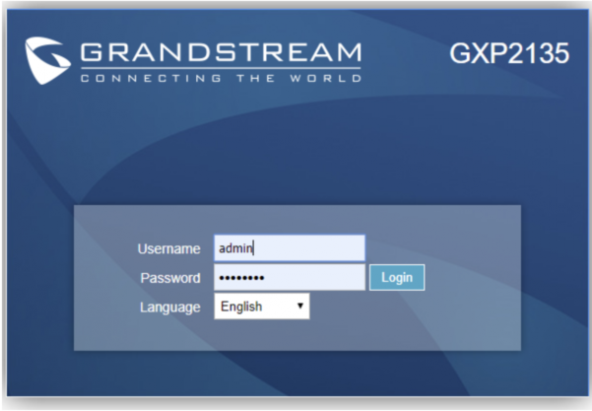
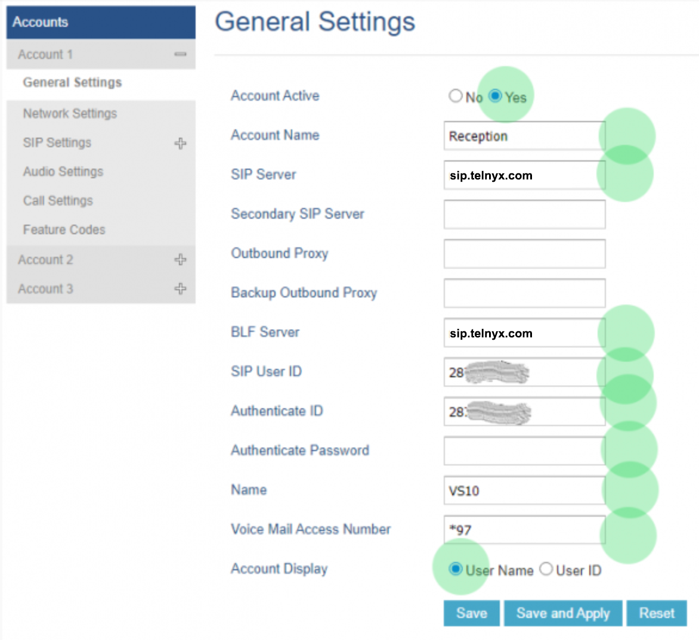
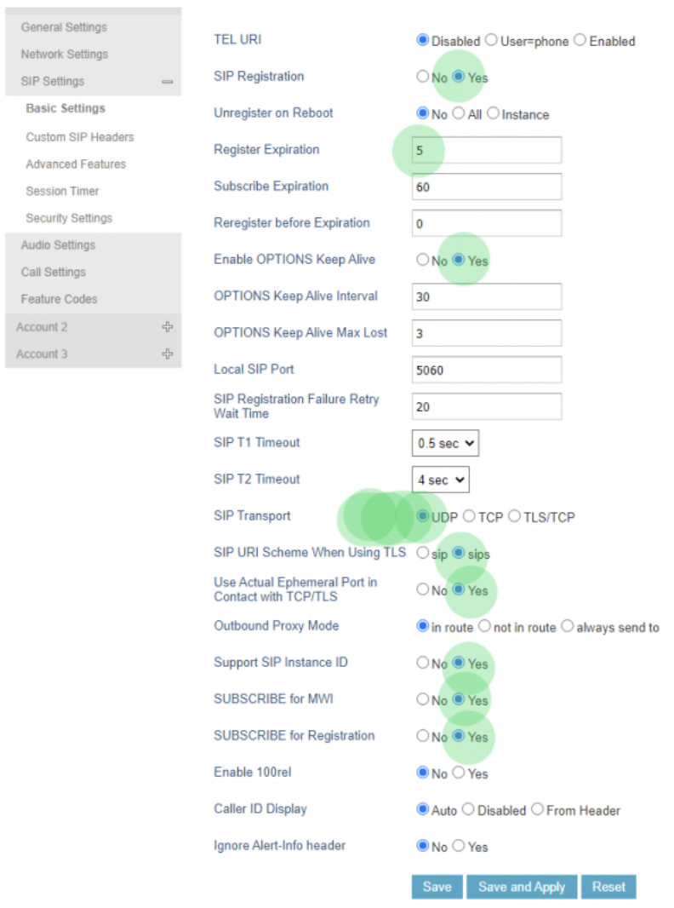

# Configuring Grandstream IP Phones with Telnyx

*Part 1 of 3 — see also: [Part 2](configuring-grandstream-ip-phones-with-telnyx--part-2.md), [Part 3](configuring-grandstream-ip-phones-with-telnyx--part-3.md)*

Step-by-step instructions for configuring Grandstream GXP16XX, GXP21XX, GXP1700, GRP260x, and GRP2612 series IP phones to register as SIP endpoints against a Telnyx Mission Control account, including account, network, SIP, and audio settings plus troubleshooting for common one-way audio and failed-call issues.

## Overview

Telnyx supports a wide range of Grandstream desktop IP phones as SIP endpoints. This page consolidates the configuration guidance for the GXP16XX (GXP1620/GXP1625/GXP1630), GXP21XX (GXP2135/GXP2170), GXP1700 series (GXP1760W, GXP1780/1782), GRP260x, and GRP2612/GRP2612P/GRP2612W families. The configuration flow is broadly the same across families: log into the phone's web UI, create a SIP trunk that points at `sip.telnyx.com`, and tune the SIP, network, and audio settings so the device registers and negotiates media cleanly with Telnyx.

For related setup guides, see [Grandstream HT802: Telnyx Setup](grandstream-ht802-telnyx-setup.md), [Grandstream: IP Auth Setup](grandstream-ip-auth-setup.md), [Grandstream UCM6xxx: SIP Trunks](grandstream-ucm6xxx-sip-trunks.md), and [Grandstream GXV3370](grandstream-gxv3370.md).

## Prerequisites

Before configuring any Grandstream device, complete the following in the Telnyx Mission Control Portal:

- Confirm your [Telnyx Mission Command Portal account is configured](https://support.telnyx.com/en/articles/1176636-get-started-with-a-mission-control-account).
- [Purchase a DID](https://portal.telnyx.com/#/app/numbers/search-numbers).
- [Set up a Telnyx SIP connection](https://portal.telnyx.com/#/app/connections) (credentials-based for the GRP and GXP1700 series).
- [Provision your number](https://portal.telnyx.com/#/app/numbers/my-numbers) by assigning it to a SIP connection.
- [Create an outbound voice profile](https://portal.telnyx.com/#/app/outbound).
- Recommended: [Enable TLS to encrypt your traffic](https://support.telnyx.com/en/articles/1130711-does-telnyx-encrypt-communication).

On the device side:

- Ensure the phone is running the [latest Grandstream firmware](https://www.grandstream.com/support/firmware) (or the [GRP26xx firmware upgrade guide](https://documentation.grandstream.com/knowledge-base/grp26xx-firmware-upgrade-guide/) for GRP devices).
- Connect the device to an ethernet port with internet access.
- Note the device's IP address from the phone's **Menu → Status → Network Status → IPv4 Address** screen. This IP is used to reach the web UI.

## Accessing the Grandstream Web UI

1. On a computer on the same network as the phone, open a browser and navigate to `http://<phone-ip-address>`.
2. Log in with the default credentials:
   - **Username:** `admin`
   - **Password:** `admin`
   - Note: Units manufactured from January 2017 onward have a unique random password printed on the back-of-unit sticker.

## Configuring the GXP16XX (GXP1620/GXP1625/GXP1630)

The [GXP1620/GXP1625](https://www.grandstream.com/products/ip-voice-telephony-gxp-series-ip-phones/gxp-series-basic-ip-phones/product/gxp1620/gxp1625) is aimed at small to mid-sized businesses with light to medium call volume. The [GXP1630](https://www.grandstream.com/products/ip-voice-telephony-gxp-series-ip-phones/gxp-series-basic-ip-phones/product/gxp1630) is the most powerful entry-level Basic IP phone, with 3 SIP accounts, 3 line keys, 4-way conferencing, HD audio, dual-switched Gigabit ports with PoE, 8 BLF/speed dial keys, and EHS support for Plantronics headsets.

### Account settings

1. From the top navigation, select **Accounts** → **Account 1** → **General Settings**.

   
2. Configure the following fields:
   - **SIP Server:** `sip.telnyx.com`
   - **Outbound Proxy:** `sip.telnyx.com`
   - **SIP User ID:** Your Telnyx SIP account username
   - **Authenticate ID:** Your Telnyx SIP account username
   - **Authenticate Password:** Your Telnyx SIP account password
   - **Name:** Caller ID name (use capital letters, no special characters, ≤15 characters for some Canadian carriers).
   - **Voice Mail Access Number:** `*97`

   

### Network settings

In **Accounts → Account 1 → Network Settings**:

- **DNS Mode:** `A Record`
- **NAT Traversal:** `Keep-Alive`

### SIP settings

In **Accounts → Account 1 → SIP Settings → Basic Settings**:

- **SIP Registration:** `Yes`
- **Register Expiration:** `5` (minutes)
- **Enable OPTIONS Keep Alive:** `Yes`
- **Local SIP Port:** `5060` (UDP/TCP) or `5061` (TLS)
- **SIP Transport:** `UDP` or `TCP` (or `TLS/TCP` if TLS is enabled)

### Audio settings

In **Accounts → Account 1 → Audio Settings**, choose any Telnyx-supported codec:

- `ulaw (g711u)`
- `alaw (g711a)`
- `g722`
- `g729`

Click **Save and Apply** when finished.

## Configuring the GXP21XX (GXP2135/GXP2170)

The [GXP21XX](https://www.grandstream.com/products/ip-voice-telephony-gxp-series-ip-phones/gxp-series-high-end-ip-phones/product/gxp2170) is a high-end IP phone family with 12 line keys, a 4.3" color LCD, 48 digital on-screen speed dial/BLF keys, dual Gigabit PoE ports, SRTP/TLS encryption, and zero-configuration support with Grandstream UCM IP PBXs. The setup is nearly identical to the GXP1630/GXP2135 flow.

### Account settings

1. Click **Accounts** in the top menu, then expand the account to configure and click **General Settings**.

   

   
2. Enter the following:
   - **Account Name:** A descriptive name
   - **SIP Server:** `sip.telnyx.com`
   - **SIP User ID:** Telnyx SIP account username
   - **Authentication ID:** Telnyx SIP account username
   - **Authenticate Password:** Telnyx SIP account password
   - **Name:** Caller ID (capital letters, no special characters, ≤15 characters for some Canadian carriers)
   - **Voice Mail Access Number:** `*97`

   

### SIP settings

In **Accounts → Account 1 → SIP Settings → Basic Settings**:

- **SIP Registration:** `Yes`
- **Register Expiration:** `5` (minutes)
- **Enable OPTIONS Keep Alive:** `Yes`
- **Local SIP Port:** `5060` (UDP/TCP) or `5061` (TLS)
- **SIP Transport:** `UDP` or `TCP` (or `TLS/TCP` if TLS is enabled)

### Custom SIP headers and audio

In **Accounts → Account X → SIP → Custom SIP Header**, set:

- **Use Privacy Header:** `Yes`
- **Use P-Preferred-Identity Header:** `Yes`
- **Use X-Grandstream-PBX Header:** `No`
- **Use P-Access-Network-Info Header:** `No`
- **Use P-Emergency-Info Header:** `No`

In **Accounts → Account X → SIP → Audio Settings**, choose `G729A/B` or `G722` as the preferred Vocoder.

Click **Save and Apply**.
