# Configuring SIP Endpoints and Softphones with Telnyx

*Part 2 of 3 — see also: [Part 1](configuring-sip-endpoints-and-softphones-with-telnyx--part-1.md), [Part 3](configuring-sip-endpoints-and-softphones-with-telnyx--part-3.md)*

Step-by-step instructions for registering a variety of SIP-compatible softphones, IP phones, and hardware endpoints (Linphone, Yealink, Zoiper variants, Algo 8xxx, NCH Express Talk, Zoiper Communicator) with the Telnyx Mission Control Portal, including credential setup, encryption (TLS/SRTP), caller ID configuration, and voicemail enablement.

## Zoiper

[Zoiper](https://www.zoiper.com) is a cross-platform VoIP softphone supporting voice, video, and instant messaging on Windows, Mac, Linux, iOS, Android, and Windows Phone. It supports multiple encryption protocols and offers call-center features such as auto-answer, call transfer, recording, provisioning, and click-2-dial CRM integration.

### Zoiper 5 Pro

Pre-requisites: a [Zoiper 5 Pro license](https://www.zoiper.com/en/shop/buy/zoiper5?cid=main-nav) and a Telnyx credentials-based connection.

1. Click **Activate your Premium license** and follow the activation wizard. Activation credentials come from Zoiper, not Telnyx.

   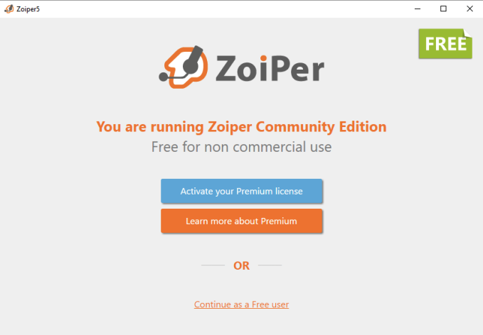
2. On the login screen, click **Activate online** (or offline if needed).

   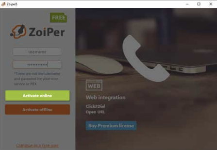
3. Click **Create account**.

   
4. Choose your location, select your country, type "Telnyx" to filter providers, and select Telnyx.

   
5. Click **Next** to accept the auto-detected protocols.

   
6. Configure sound, video, and microphone settings (see the [Zoiper 5 user guide](https://www.zoiper.com/pdf/User%20Guide%20Zoiper%205%20v.1.0.7.pdf), page 16).

   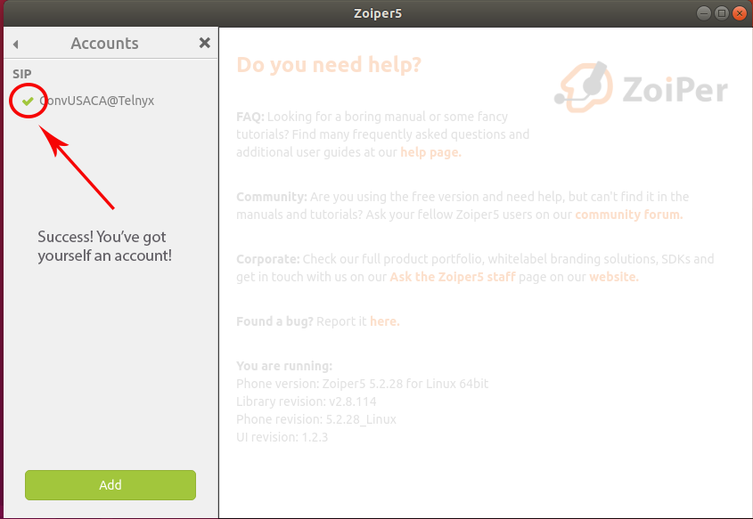
7. Click the account name to open account settings.

   

#### Activating Zoiper 5 Pro Offline

1. From the login screen, click **Activate offline**.

   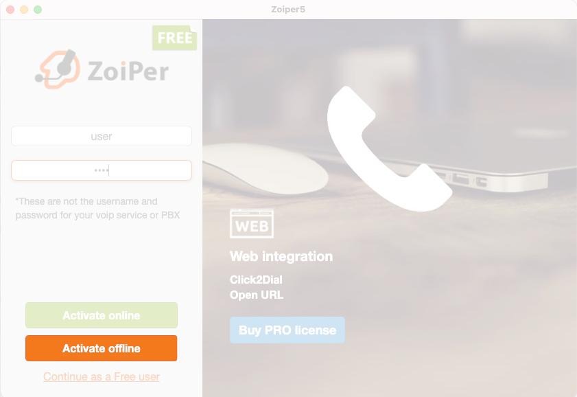
2. A file named `Zoiper<ComputerName>.certificate` is generated. Locations:
   - All-users install: `\Zoiper5\` folder.
   - Current-user install: `%USERPROFILE%\AppData\Romaing\Zoiper5` on Windows, or `~/Library/Application Support` or `~/Library/Preferences` on Mac.
3. Email the certificate to [register5@shop.zoiper.com](mailto:register5@shop.zoiper.com) and save the returned certificate in the same folder.

> Windows may hide known file extensions or auto-append one. Right-click the file, choose **Properties**, and remove any extension Windows added.

#### Zoiper 5 Advanced Settings

Click **Advanced** from the account settings view.

**Audio Codecs:** Scroll to the Audio Codecs section and use the arrows to move desired codecs to the right.

**Network Settings:** In the Network Related section, set:
- **Registration expire mode:** Custom
- **Registration expiry:** 300
- **NAT keep alive time-out:** Custom
- **Keep alive custom interval:** 30

**Call Encryption (TLS/SRTP):**
1. Enable **Encrypted SIP Traffic** on the account. If enabled while the device sends UDP/TCP or RTP, calls will be rejected with error code 488.

   
2. For sub-accounts, enable in **Sub accounts > Manage sub-accounts > Advanced Options**.

   
3. In **Advanced > SIP Credentials**, set:
   - **Domain:** `sip.telnyx.com`
   - **Username:** Account/sub-account name.
   - **Password:** SIP password.
4. In **Network Related**, set **Transport:** TLS.
5. In **Encryption**, set **SRTP Key Negotiation:** SDES.

   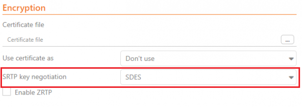

A green closed padlock next to the call profile indicates a secure call.

### Zoiper 3 (Mac)

1. Download, install, and run Zoiper.
2. If you have a business license, log in with the email used to purchase and the password Zoiper emailed you.
   - **Activate online:** click **Activate online**.
   - **Activate offline:** click **Activate offline** to generate `Zoiper<ComputerName>.certificate` in `~/Library/Zoiper3/`. Email it to [register4@shop.zoiper.com](mailto:register5@shop.zoiper.com) and save the returned certificate in the same folder.
3. Open **Settings > Create a new account**.

   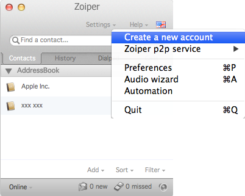
4. Select **SIP** (Telnyx does not support IAX or XMPP) and click **Next**.

   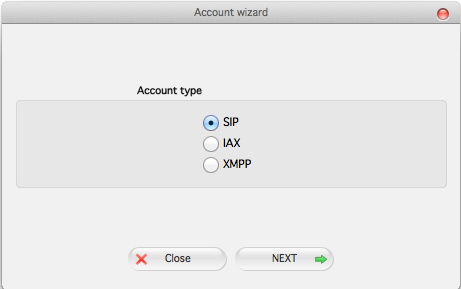
5. Enter your Telnyx credentials. **Domain/outbound proxy:** `sip.telnyx.com`. Click **Next**.

   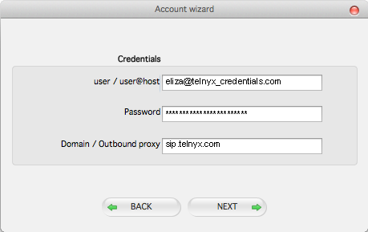
6. Provide an account name and click **Next**.

   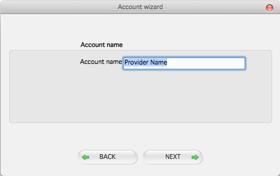
7. Zoiper connects to the Telnyx server.

   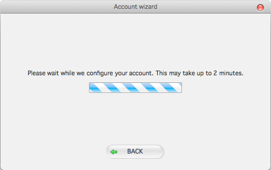

### Zoiper 3 (Linux)

The Linux flow mirrors the Mac flow with these differences:
- The offline certificate folder is `~/.Zoiper`.
- The activation email is [register4@shop.zoiper.com](mailto:register5@shop.zoiper.com).

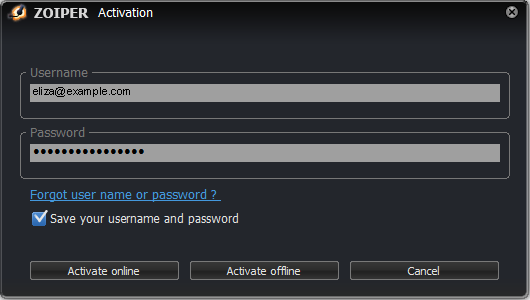
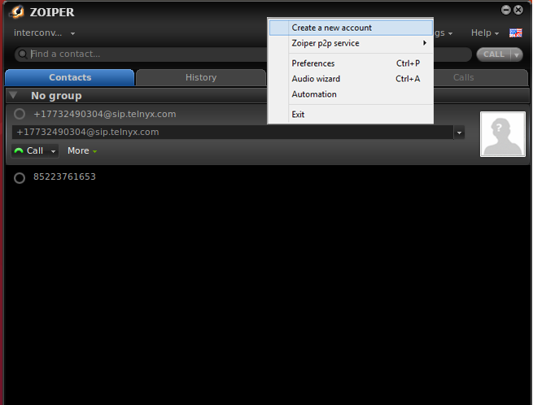
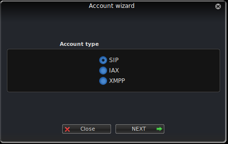
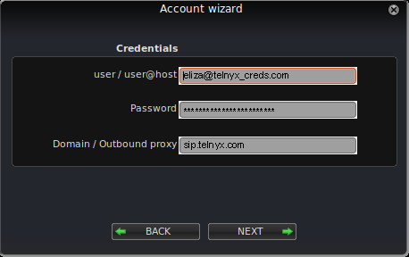
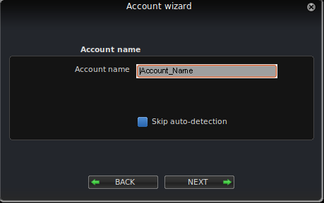
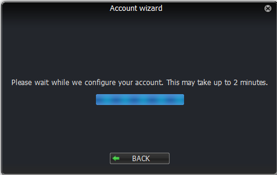

### Zoiper Communicator

[Zoiper Communicator](https://digitalvoice.ca/softphone_zoiper_dl.php) is a free IAX & SIP softphone for Windows combining voice, video, fax, instant messaging, and presence. The Zoiper Service is optional and can be skipped at startup.

1. Open **Settings** and select **Create New Account**.

   
2. Enter an account name and click **OK**.

   
3. On the **SIP Account Options** page, enter:
   - **Domain:** `sip.telnyx.com`
   - **Username:** Main Telnyx account or sub-account username.
   - **Password:** Main Telnyx account or sub-account password.
   - **Caller ID Name:** Preferred name (see caller ID conventions below).

   
4. Click **OK**.

   

For Zoiper 3, see the [Zoiper 3 user guide](https://www.zoiper.com/en/support/home/article/34/Installation_%26_configuration_manuals_Zoiper_3).

### Zoiper Troubleshooting

If Zoiper cannot configure the account, verify:
- The server hostname is correct (spelling, periods vs. commas).
- The username and password are correct.
- The server is responsive.
- A firewall or security settings are not blocking access (use offline activation if needed).
- The account needs additional configuration.

If everything is correct, select **I know what I am doing, save this information anyway** and click **NEXT** to complete configuration manually.

