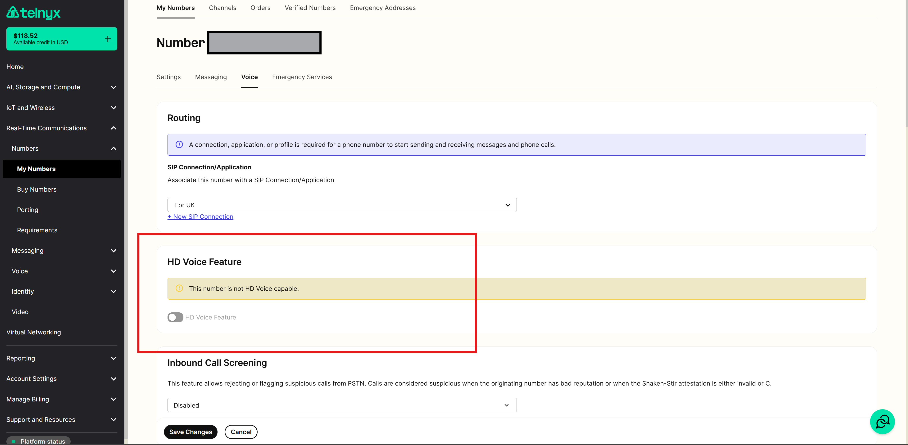
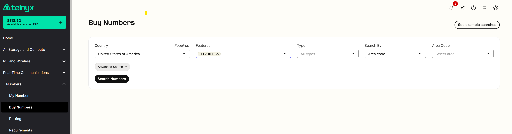

# Configuring Softphones and Devices with Telnyx

*Part 4 of 4 — see also: [Part 1](configuring-softphones-and-devices-with-telnyx--part-1.md), [Part 2](configuring-softphones-and-devices-with-telnyx--part-2.md), [Part 3](configuring-softphones-and-devices-with-telnyx--part-3.md)*

Step-by-step instructions for configuring Bria Solo (X-Lite), Grandstream Wave Lite (iOS and Android), the Grandstream GDS3710 video door system with Wave Lite, and the Grandstream GXV3370 IP video phone to work with Telnyx SIP trunks, plus an overview of the HD Voice number feature and its codec requirements.

## HD Voice Number Feature

The HD Voice Number Feature enhances audio quality for PSTN calls made and received to and from eligible numbers within the United States and other supported countries. Unlike traditional PSTN calls that often use a fixed narrowband codec such as G.711, HD Voice leverages wideband codecs like AMR-WB to deliver higher audio quality.

HD Voice calls require both endpoints to support and agree upon a compatible wideband codec during the negotiation process. The negotiation considers available bandwidth, device capabilities, and network conditions to optimize call quality. If wideband support is unavailable, the system falls back to a suitable narrowband codec via transcoding.

### Supported carriers

The call must be destined or originated from one of the following supported carriers:

- **US carriers:** AT&T, T-Mobile, Verizon
- **Germany carriers:** Outbox
- **Austria carriers:** Yuutel
- **Australia:** All major carriers

The call must be destined or originated on a mobile phone device that supports wideband codecs and is registered on a local 5G/LTE network.

Within the Telnyx portal, your SIP connection must have one of the following wideband codecs enabled: OPUS, G.722, or AMR-WB. The SIP device involved in the call must also support the selected codec.

### Codec overview

- **Opus:** Adaptable and efficient, dynamically adjusts to varying network conditions while delivering exceptional audio quality.
- **AMR-WB (Adaptive Multi-Rate Wideband):** Provides a broader frequency range, capturing more natural tonal nuances in speech for higher fidelity audio.
- **G.722:** Standard for high-quality speech and audio compression with an extended frequency response range, ensuring crisp and clear voice reproduction even at lower bitrates.

> While these conditions significantly increase the probability of experiencing HD audio, HD audio cannot be guaranteed due to the unpredictable nature of PSTN networks.

### Receiving a call with HD Voice

For inbound calls to have HD voice support, the following conditions must be met:

- The incoming call must originate on an AMR-WB-enabled device located in at least 4G/LTE coverage area from one of the supported carriers listed above.
- The call must be routed to a Telnyx number with the HD voice feature enabled.

The HD Voice feature can be enabled in the **Number Voice** settings:

In the **My Numbers** overview page, the HD Voice option will be enabled for that number and is visible under the services column.

Customers can also search for HD Numbers in the [Buy Numbers](https://portal.telnyx.com/#/numbers/buy-numbers) section of the portal.

- The call must be routed to a SIP Connection configured with AMR-WB, G.722, or Opus HD voice codecs. SIP Connection codecs can be configured under **SIP Trunking** > **SIP Connections** > **Inbound configuration** > **Expert Settings**.
- The SIP device receiving the call must support one of the above-mentioned codecs.

### Making an outbound call with HD Voice

For outbound calls to have HD voice support, the following conditions must be met:

- The SIP device initiating the call must use one of the following codecs: AMR-WB, G.722, or Opus.
- The call must be received on an AMR-WB-enabled device located in at least 4G/LTE coverage area from the supported carriers list.
- The Telnyx number used to make the outbound call must have HD Voice enabled (also applied to CLI override).

### Geographic availability

This feature is restricted to numbers in the coverage area list above.

### Frequently asked questions

- **"This number is not HD Voice capable" banner:** Appears for international, toll-free, and some +1 US longcode numbers that are not currently supported. The feature is currently supported only on +1 US longcode numbers, with some +1 area codes not yet enabled. Use the feature toggle in the number buy section of Mission Control to find HD-Voice-compatible numbers.

  
- **What carriers support HD Voice?** All calls in the listed regions that meet the conditions will have HD Voice: AT&T, T-Mobile, Verizon (US); Outbox (Germany); Yuutel (Austria); all major carriers (Australia).
- **Recommended SIP devices:** Any SIP device that supports one of the three supported HD Voice codecs.
- **Codec mismatch during a call:** The call will be transcoded. If the mismatch is between two HD codecs (for example, OPUS and AMR-WB), audio quality will still be HD. If the mismatch is between an HD codec and a non-HD codec (for example, PCMU and AMR-WB), audio quality will not be HD.
- **Fallback to narrowband codec:** Handled by transcoding the audio.
- **Interruptions during fallback:** Codecs are negotiated at the start of the call, so there are no interruptions.
- **Bandwidth requirements:** HD Voice codecs have variable bit rates, but a high-speed internet connection is required for best results.
- **Expanding carrier support:** Yes, more carriers will be added in the future.
- **International numbers:** Support is expanding outside the US and more countries will be added as they come online for HD voice.
- **Checking device support for wideband codecs:** Read the user manual and check the section about supported codecs.
- **Mid-month enablement and proration:** As of July 2025, there are no MRCs (monthly recurring charges) associated with HD Voice; it is free.
- **Billing reflection:** Since HD Voice is now free, it will not be charged on your monthly statement.

## Additional resources

- Review the [getting started guide](https://support.telnyx.com/en/articles/1176636-get-started-with-a-mission-control-account) to make sure your Telnyx Mission Control Portal account is set up correctly.
- See [SIP Connection Types](sip-connection-types.md) for details on credentials-based connections.
- See [Does Telnyx encrypt communication?](https://support.telnyx.com/en/articles/1130711-does-telnyx-encrypt-communication) for guidance on enabling TLS.
