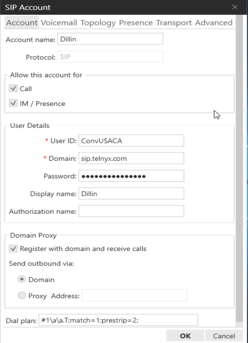
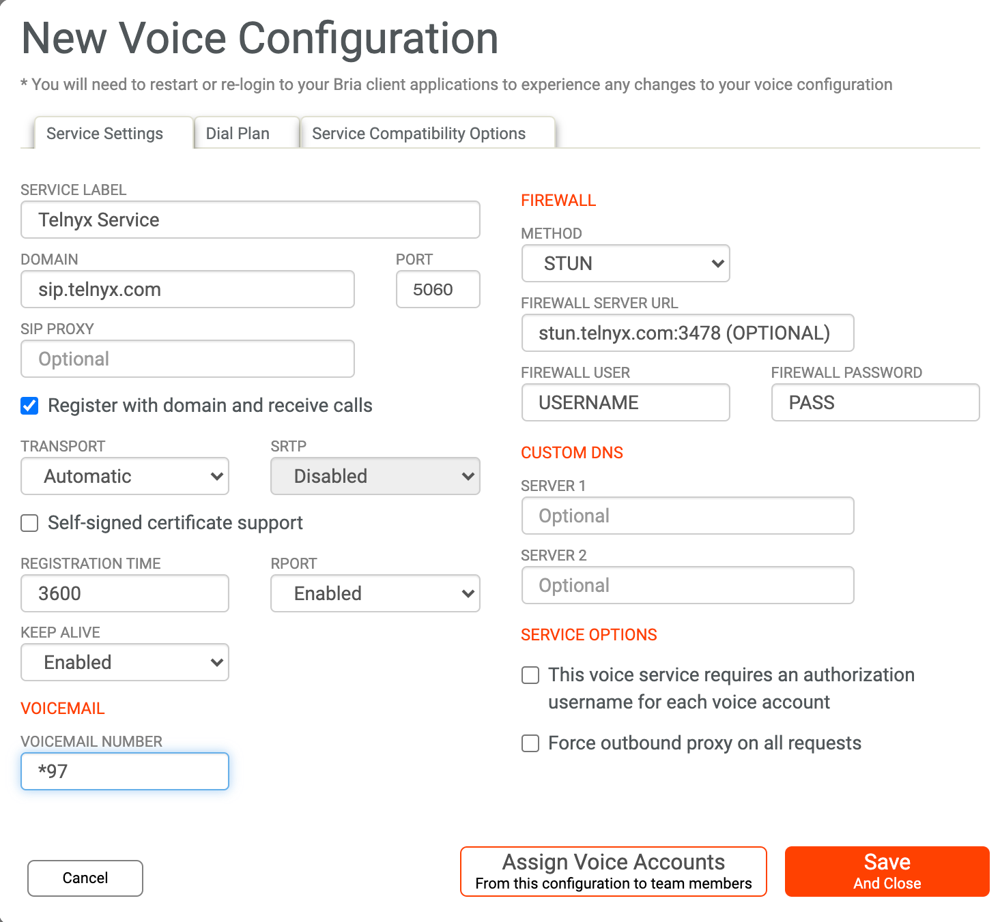
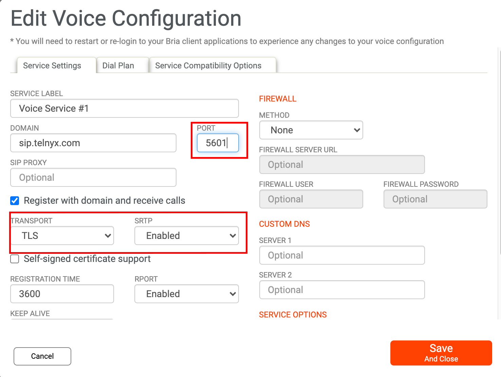
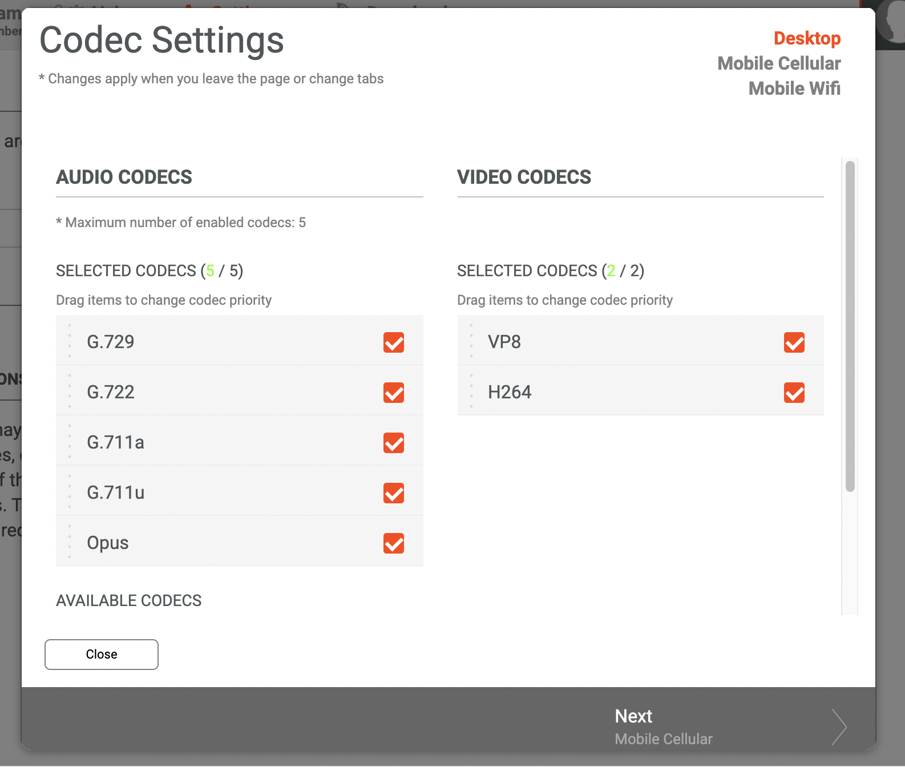
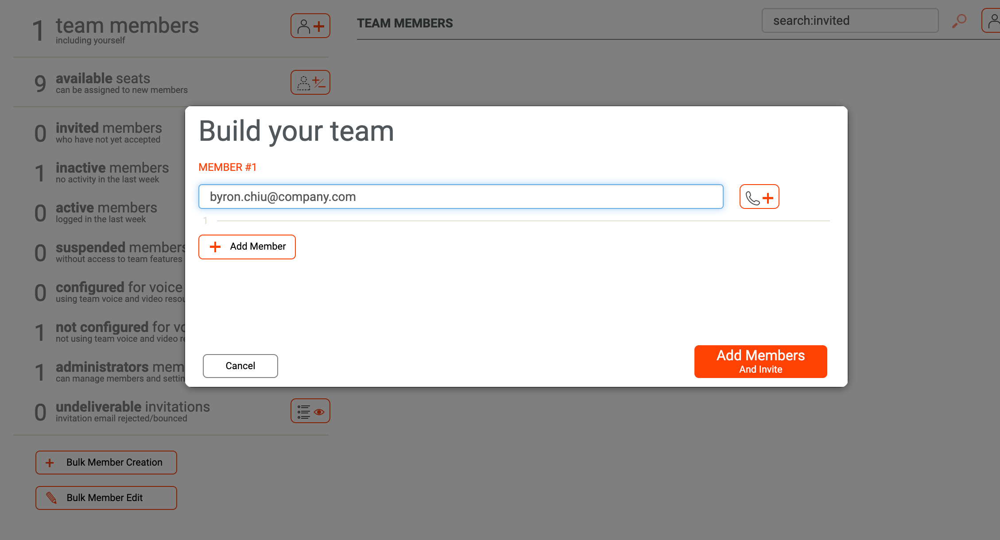

# Configuring Softphones and SIP Endpoints with Telnyx

*Part 1 of 3 — see also: [Part 2](configuring-softphones-and-sip-endpoints-with-telnyx--part-2.md), [Part 3](configuring-softphones-and-sip-endpoints-with-telnyx--part-3.md)*

Consolidated Telnyx setup guides for CounterPath Bria Solo (X-Lite), CounterPath Bria Teams, Grandstream Wave Lite on iOS and Android, and the Grandstream GDS3710 video door system paired with Wave Lite. Each section walks through prerequisites, SIP account creation, call settings, codecs, and optional STUN or TLS configuration against Telnyx's SIP infrastructure.

## Overview

This page consolidates Telnyx setup guides for several softphone and SIP endpoint clients, including CounterPath Bria Solo (X-Lite), CounterPath Bria Teams, Grandstream Wave Lite for iOS and Android, and the Grandstream GDS3710 video door system paired with Wave Lite. Each client is configured to register against Telnyx's SIP infrastructure using a credentials-based connection created in Mission Control Portal.

## Prerequisites

Before configuring any of the clients below, ensure the following in your Telnyx Mission Control Portal:

- Your Mission Control account is set up correctly.
- You have purchased a DID and provisioned it to a SIP connection.
- You have created a credentials-based connection and assigned it to the DID and an outbound voice profile.
- You have created an outbound voice profile.
- (Recommended) TLS is enabled to encrypt your traffic.

## Configuring Bria Solo (X-Lite)

Bria Solo (also known as X-Lite) is a CounterPath softphone for Windows and Mac that lets users transition to VoIP.

1. Open Bria Solo/X-Lite.
2. From the main menu, choose **Softphone > Account Settings**.

   
3. In the Accounts window, fill out the following fields:
   - **Account Name:** A meaningful identifier for the account.
   - **Protocol:** Read-only, always SIP.
   - **Calls** (Windows) / **Used for Call** (Mac): Check to allow outbound calls.
   - **IM/Presence** (Windows) / **Presence** (Mac): Check to share presence and send IMs.
   - **User ID:** The Telnyx-provided account ID.
   - **Domain:** `sip.telnyx.com`
   - **Password:** The Telnyx-provided softphone password.
   - **Display Name:** The name shown in the Bria title bar and to remote parties.
   - **Authorization Name:** Complete only if Telnyx provided one (used in place of the User ID for registration when needed).
   - **Register with domain and receive calls:** Check to receive incoming calls. Clear this if your service does not include inbound calling, otherwise registration may fail.
   - **Send outbound via:** Select if Telnyx requires traffic to be directed to proxies discovered via the domain. If selected, also fill in the Address field with the IP provided by Telnyx.
   - **Dial Plan:** Provided by Telnyx and read-only.

   
4. Click **OK** to register the softphone with `sip.telnyx.com`. If everything is correct, the account will be enabled successfully.

   

## Configuring CounterPath Bria Teams

Bria Teams is a team-communication solution that combines voice, messaging, presence, and screen share in a single managed dashboard. Each team member requires a sub-account in the Bria Teams dashboard.

Minimum OS requirements: Windows 10, Mac 10.13, Android 5.0, iOS 11.

### Link your Bria Portal with Telnyx

1. From the Bria Portal, click **Voice and Video** in the top navigation.
2. Click the phone icon or the **Add Voice Configuration** button.
3. On the Add Service screen, click **Configure SIP Settings** (Telnyx is not on the pre-configured provider list).

   
4. On the **New Voice Configuration** screen, fill in:
   - **Service Label:** For your own reference.
   - **Domain:** `sip.telnyx.com`
   - **Port:** `5060`
   - **Register with domain and receive calls:** Checked.
   - **Transport:** Automatic.
   - **Keep Alive:** Enabled.
   - **Voicemail Number:** `*97`
   - **Service Options:** Checked — this voice service requires an authorization username for each voice account.
   - **Firewall Method:** Stun (optional).
   - **Firewall Server URL:** `stun.telnyx.com:3478`
   - **Username / Password:** Telnyx firewall credentials (contact support).

   
5. Click **Save And Close**. If you already have voice accounts configured, click **Assign Voice Accounts From this configuration to team members** instead.
6. Test the setup from the Bria Portal client. On desktop, click the arrow beside **Auto Select**; on mobile, go to **Settings > Accounts**. Both accounts should show a green icon.

### (Optional) Configure security and encryption settings

1. In the Bria Portal, click **Voice and Video** in the top navigation.
2. Click **Edit Configuration** on the voice service you want to encrypt.

   
3. Update:
   - **Port:** `5061`
   - **Transport:** TLS
   - **SRTP:** Enabled
   - **Register with Domain and Receive Calls:** Checked.

   

### Configure a dial plan

A dial plan modifies how calls are placed — for example, transforming a number, adding a prefix such as `9` to reach an outside line, or selecting which account to use based on the dialed prefix. Bria uses its own [dial plan syntax](https://docs.counterpath.com/docs/PortalUG/clients/UserGuides/Desktop/calls/deskDialPlan.htm).

### Configure audio and video codecs

1. Open the Bria Portal client or web app and click **Settings and Preferences**.

   
2. Click **Configure Codecs**.
3. In the **Codecs** section, click the gear icon.

   
4. Choose and prioritize the codecs. Telnyx supports:
   - Audio: `ulaw (g711u)`, `alaw (g711a)`, `g722`, `g729`
   - Video: `H264`

   

### Link a team member to an account and SIP profile

1. Click the **Team Members** tab.

   
2. From the left-hand navigation, click the button next to **team members**.

   
3. Enter the new team member's email address. To assign them to a SIP profile, click the phone button next to the email field.

   
4. Provide:
   - **VOICE SERVICE:** The voice service to assign (defaults if only one is configured).
   - **SIP USERNAME/CALL EXTENSION:** The team member's Telnyx username.
   - **SIP/VOICE PASSWORD:** The team member's Telnyx password.
   - **CALL DISPLAY:** Outbound Caller ID Name. Use capital letters, no special characters, max 15 characters, spaces allowed.

   

The new member receives an email link to download and install the softphone, then sets a password using the same email address.
