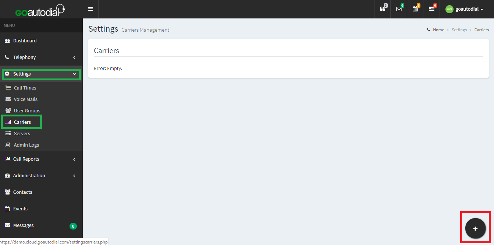
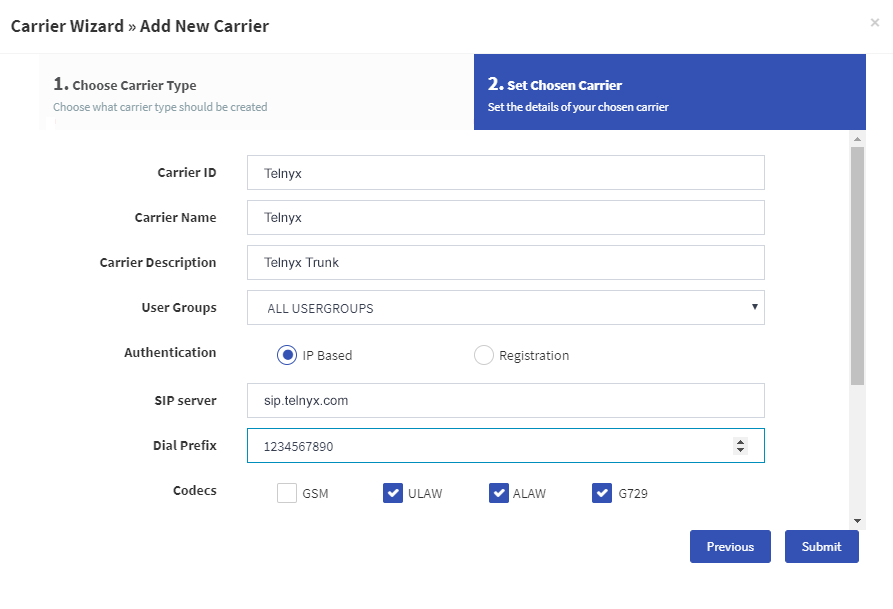
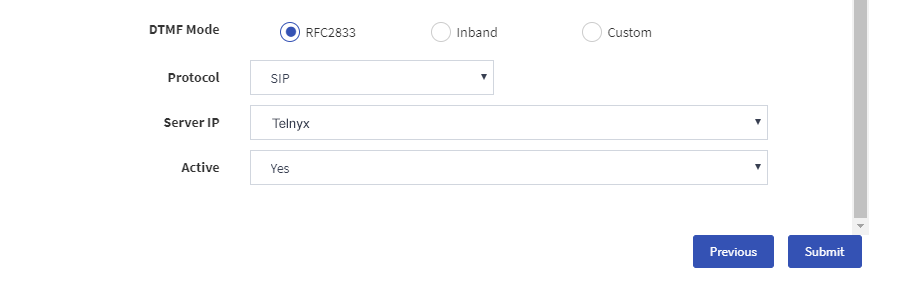
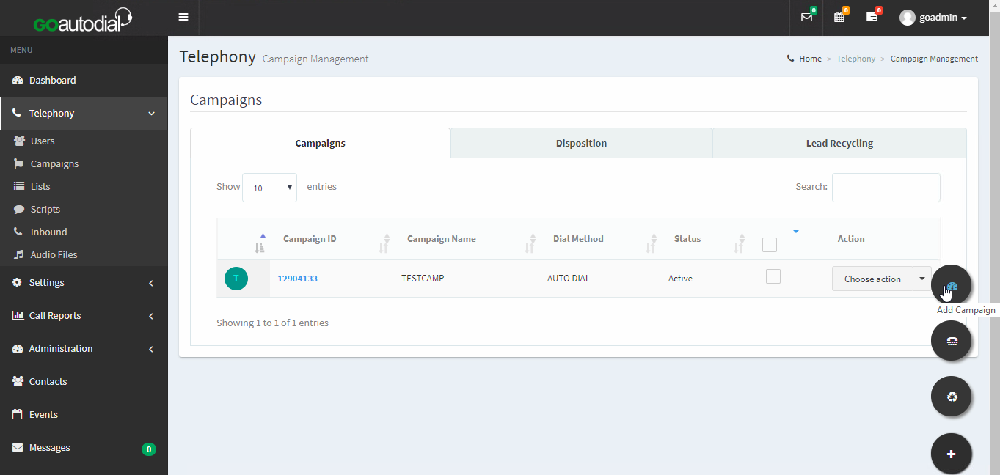
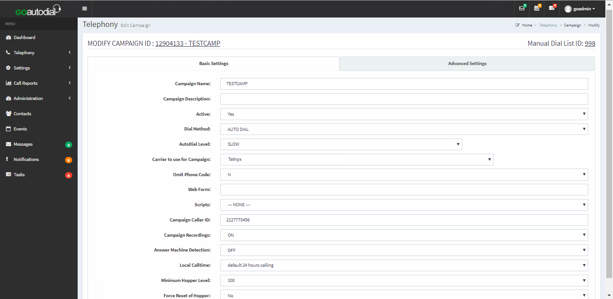
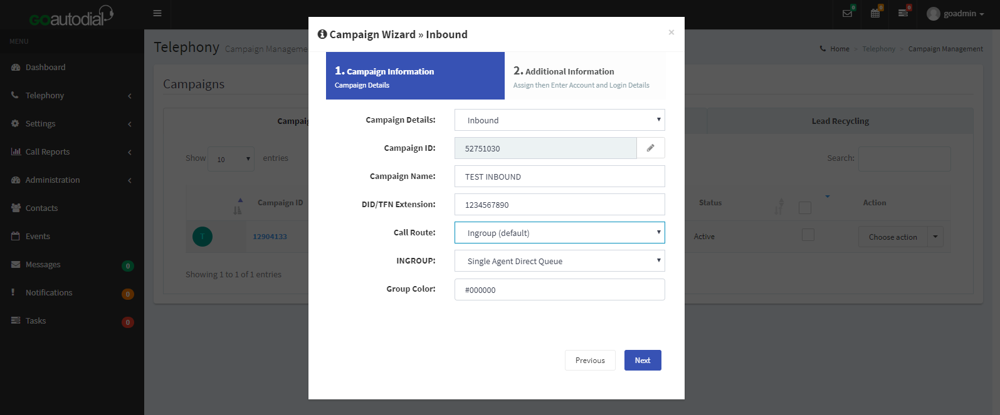
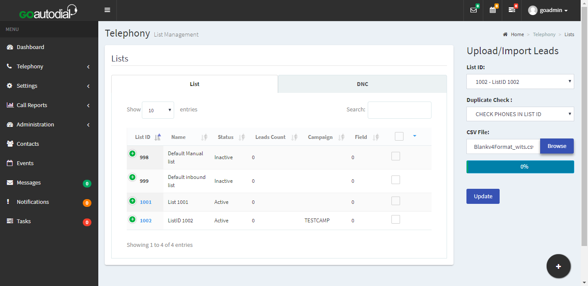
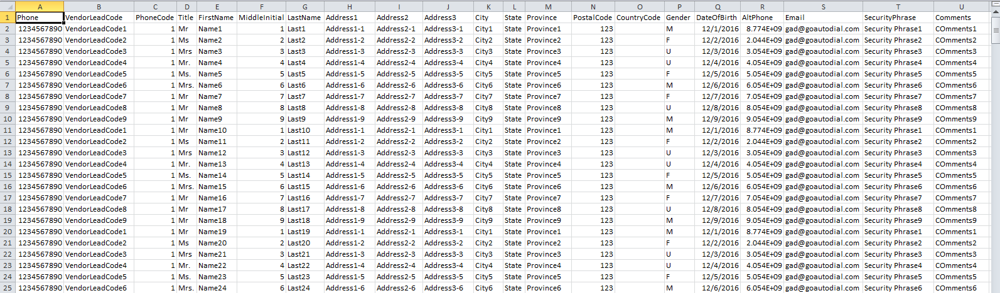

# Configuring Telnyx SIP Trunks with Third-Party PBX and Contact Center Platforms

*Part 3 of 4 — see also: [Part 1](configuring-telnyx-sip-trunks-with-third-party-pbx-and-contact-center-platforms--part-1.md), [Part 2](configuring-telnyx-sip-trunks-with-third-party-pbx-and-contact-center-platforms--part-2.md), [Part 4](configuring-telnyx-sip-trunks-with-third-party-pbx-and-contact-center-platforms--part-4.md)*

This page consolidates Telnyx guidance for configuring SIP trunks between the Telnyx Mission Control Portal and a range of third-party PBX, dialer, and contact center platforms, including Avaya, Vicidial, OSDial, and GOautodial. It covers both IP-based and credentials-based authentication, dialplan setup, outbound and inbound campaign configuration, and lead import for contact center use cases, alongside notes on reseller support, call center service availability, Linksys ATA dialplan syntax, and the deprecation of the legacy Access Control List feature.

## GOautodial PBX Configuration

GOautodial is a free, enterprise-grade open source omni-channel contact center system designed and built for businesses of all sizes. It supports predictive, preview, and manual dialing, inbound IVR and ACD, a CRM, and a real-time dashboard for tracking agent activities.

### Configure a SIP Trunk

1. Log into your GOautodial dashboard page and, in the left-hand navigation, find **Settings** and expand it.
2. Click on **Carriers** to open the Carriers page and then click the **+** sign in the lower right corner to add a new carrier.

   
3. You will be asked to choose a carrier type. In this case, choose *Manual*.
4. In the Add New Carrier wizard, provide the following values:

   1. **Carrier ID:** *Telnyx*
   2. **Carrier Name:** *Telnyx*
   3. **Carrier Description:** You can use whatever makes the most sense to you. In this example, we simply named it *Telnyx Trunk*.
   4. **User Group:** *All User Groups*
   5. **Authentication:** *IP-Based* (for IP authentication) or *Registration* (for username/password authentication)
   6. **Username:** Your Telnyx account username (credentials-based only)
   7. **Password:** Your Telnyx account password (credentials-based only)
   8. **SIP Server / Server IP/Host:** *sip.telnyx.com* (for IP-based, see the IP authentication article for the Server IP)
   9. **Dial Prefix:** The dial prefix setting will automatically dial a predefined number before every number you dial. For example, if your telephone system requires a 9 to dial an outside number, or a country-prefix to dial another country.
   10. **Codecs:** Set codec preferences here. Telnyx supports the following audio codecs: ulaw (g711u), alaw (g711a), g722, and g729.
   11. **DTMF Mode:** *RFC2833*
   12. **Protocol:** *SIP*
   13. **Port:** *5060* if you have not enabled TLS encryption. If you have, choose *5061* (credentials-based only).
   14. **Active:** *Yes* (if you wish to activate the trunk now. Otherwise, you can activate it in the future by going back to your Carriers page and editing your trunk.)

   

   

### Add Account Details and Dial Plan

Still on the **Carrier** page, with your newly created trunk open, click **Advance Configuration** and confirm or provide the following:

**Account Entry:**

```
Account Entry: [telnyx]
disallow=all
allow=ulaw
allow=alaw
type=friend
dtmfmode=rtc2833
qualify=yes
nat=yes
host=sip.telnyx.com
insecure=invite
```

**Dialplan Entry:**

```
exten => _X.,1,AGI(agi://127.0.0.1:4577/call_log)
exten => _NXXNXXXXXX.,1,Dial(SIP/${EXTEN}@telnyx)
exten => _1NXXNXXXXXX.,1,Dial(SIP/${EXTEN}@telnyx)
exten => _6468688074,1,Dial(SIP/8001@default)
exten => _16468688074,1,Dial(SIP/8001@default)
```

### Set Up an Outbound Campaign

1. Log into your portal as an administrator. From the left-hand navigation, expand **Telephony** and click **Campaigns**.

   
2. Click the **+** to add a new campaign. When prompted for the **Campaign Type**, select *Outbound*.

   
3. Click the link in the **Campaign ID** column to check the campaign settings. On the **Basic Settings** tab ensure that you set:

   1. **Dial Method:** *Manual, Auto_Dial* or *Predictive*
   2. **Auto Dial Level:** *Slow*, *Normal*, *Max*, or *High*
   3. **Carrier to use for this Campaign:** *Telnyx*. If this option isn't available, revisit the SIP trunk configuration to ensure that you have added Telnyx as a carrier.

   
4. Click **Update** once done.

### Set Up an Inbound Campaign

1. Log into your portal as an administrator. From the left-hand navigation, expand **Telephony** and click **Campaigns**.

   
2. Click the **+** to add a new campaign. When prompted for the **Campaign Type**, select *Inbound*.

   
3. Complete the fields in the **Campaign Wizard > Inbound** and ensure that:

   1. **Call Route:** *Ingroup (default)*

   
4. Once your campaign has been created, return to the Campaigns screen (**Telephony > Campaigns**) and click the link in the **Campaign ID** column to check the campaign settings. On the **Basic Settings** tab ensure that you set:

   1. **Carrier to use for this Campaign:** *Telnyx*. If this option isn't available, revisit the SIP trunk configuration to ensure that you have added Telnyx as a carrier.

   
5. Now click on the **Advanced Settings** tab and ensure that:

   1. **INBOUND GROUPS:** Select all options that you'll require:
      - **AGENTDIRECT:** *Single Agent Direct Queue*
      - **AGENTDIRECT_CHAT:** *Single Agent Direct Queue for Chats*
   2. **Allowed Transfer Groups:** Select all options that you'll require:
      - **AGENTDIRECT:** *Single Agent Direct Queue*
      - **AGENTDIRECT_CHAT:** *Single Agent Direct Queue for Chats*

   

Be sure to advise your agent to always select the ingroup on the **INBOUND CAMPAIGN** once they log in.

### Import Your List of Call Leads

1. Log into your GOautodial dashboard page and, in the left-hand navigation, find **Telephony** and expand it.
2. Click on **List** to open the List page and then click the **+** sign in the lower right corner to add a new list of leads.

   
3. Now you'll upload a .csv file containing your leads. Make sure that you've followed the lead file format illustrated in the following image and save as .csv comma delimited. (To view this image in full size, right-click on the image and select **Open Image in New Tab** from the context menu.)

   
4. Lead status will be posted after you have successfully uploaded your lead file. Click **OK** once this upload is complete.

   

There are a number of other activities that do not involve Telnyx that you will want to complete in order to maximize your GOautodial experience.

Additional resources: [GOautodial documentation](https://goautodial.org/projects/goautodialce/wiki), [GOautodial forums](https://goautodial.org/projects/goautodialce/boards), [GOautodial github](https://goautodial.org/), [GOautodial system structure](https://goautodial.org/projects/goautodialce/wiki/GOautodial_System_Structure), and [FAQ](https://goautodial.org/projects/goautodialce/wiki/FAQ).

## Reselling Telnyx Services

Telnyx supports resellers. The Telnyx Mission Control platform was designed to support multi-tenant environments and enable users to easily segregate traffic, implement tagging for organization, and pull reports all in real-time. All the functionality of Mission Control is built upon the Telnyx API, which is publicly available. Many customers have taken advantage of this to implement ordering and provisioning of services within their own platforms.
