# Configuring Thirdlane and 3CX PBXs with Telnyx

*Part 2 of 6 — see also: [Part 1](configuring-thirdlane-and-3cx-pbxs-with-telnyx--part-1.md), [Part 3](configuring-thirdlane-and-3cx-pbxs-with-telnyx--part-3.md), [Part 4](configuring-thirdlane-and-3cx-pbxs-with-telnyx--part-4.md), [Part 5](configuring-thirdlane-and-3cx-pbxs-with-telnyx--part-5.md), [Part 6](configuring-thirdlane-and-3cx-pbxs-with-telnyx--part-6.md)*

Step-by-step guidance for connecting Thirdlane and 3CX (V18 and V20) IP-PBX systems to Telnyx as a SIP trunk provider, including trunk creation, inbound/outbound routing, extension setup, and SMS gateway configuration, along with notes on 3CX and Telnyx compatibility.

## Thirdlane PBX Setup

### Thirdlane Pre-requisites

In addition to the Telnyx pre-requisites above, complete the following Thirdlane-side setup:

- [Download](https://www.thirdlane.com/products/multi-tenant-pbx) and [install](https://www.dropbox.com/s/w3c5oamhsnp4s26/PBXManagerAdminGuide.pdf?dl=0) Thirdlane PBX (trial — contact Thirdlane to provision an account).
- Follow the [Getting Started and Configuration Manager steps](https://www.thirdlane.com/docs/platform/installing).
- Perform a [default setup on Thirdlane](https://www.thirdlane.com/docs/platform/default-values).
- [Configure TLS transport](https://www.thirdlane.com/docs/platform/tls-transport).
- [Configure security settings](https://www.thirdlane.com/docs/platform/trusted-ips).
- [Create an ICE server](https://www.thirdlane.com/docs/platform/ice-servers) (as of version 10.0.1, Thirdlane automatically installs and configures a STUN and TURN server).
- [Configure dialplan variables](https://www.thirdlane.com/docs/platform/dialplan-variables).
- Optional but recommended: [Create a dialplan script](https://www.thirdlane.com/docs/platform/dialplan-scripts), configure [default hold music](https://www.thirdlane.com/docs/platform/default-music-on-hold), and set basic [inbound](https://www.thirdlane.com/docs/platform/inbound-permissions) and [outbound](https://www.thirdlane.com/docs/platform/outbound-dialing-permissions) permissions.

### Create a SIP Trunk

A [SIP trunk](https://telnyx.com/products/sip-trunks) connects Thirdlane PBX with Telnyx for calls, SMS, and routing.

> **Note:** When you create a new trunk, Thirdlane Configuration Manager prefills the form with values from your [default setup](https://www.thirdlane.com/docs/platform/default-values).

1. In the Thirdlane PBX portal, expand **Telephony Settings** in the left-hand menu and click **Trunks**.
2. Select **Create Trunk** and provide:
   - **Name:** Unique alphanumeric name (no spaces or special characters).
   - **Status:** Referenced by default Thirdlane outbound route scripts; allows temporarily disabling the trunk.
   - **Description:** Optional.
   - **Available to tenants:** Multi-tenant only — make the trunk available to all tenants or restrict to one.
   - **Host:** IP address of the VoIP provider's gateway/proxy, or `dynamic` for friend-type trunks.
   - **Outbound proxy:** `sip.telnyx.com`
   - **Context:** Default `from-outside` context for external inbound providers.
   - **User Name:** Your Telnyx SIP trunk/account username.
   - **Password:** Your Telnyx SIP trunk/account password.
   - **Enabled codecs:** Telnyx supports `ulaw (g711u)`, `alaw (g711a)`, `g722`, and `g729`.
   - **Disabled codecs:** Any unsupported or unwanted codecs.
   - **Encryption:** Choose from Enforce, Reject, Negotiate (encrypted first), or Negotiate (unencrypted first).
   - **DTMF mode:** `In-audio, RFC2833`.
   - **Quality (ms):** `No` (no keepalive wait).
   - **Other Options:** Additional `key=value` options, one per line.
   - **Registration:** Leave blank.

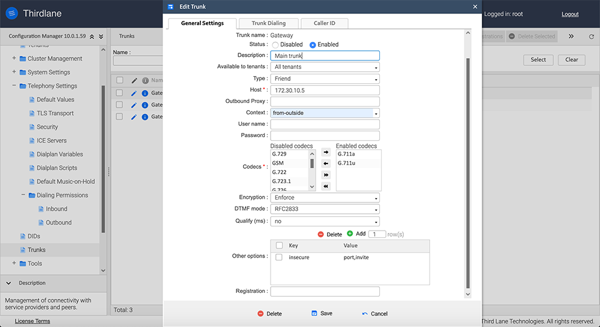

> **Note:** Deleting a trunk that is used by an outbound route will invalidate that route.

### Configure Trunk Dialing

Configure how the trunk interprets dialed numbers (for example, stripping a leading `9`):

1. Expand **System Management** in the left-hand menu and click **Trunks**.
2. Edit the trunk and select the **Trunk Dialing** tab.
3. Provide:
   - **Number of digits to strip:** Digits removed from the front of a dialed number.
   - **String to prepend:** String prepended to the dialed number (can also be set in outbound routes).
   - **Dial command options:** Options prepended to the dial command string.
   - **SIP Header:** Up to 4 custom SIP headers, e.g. `X-Custom-Header:VALUE`.

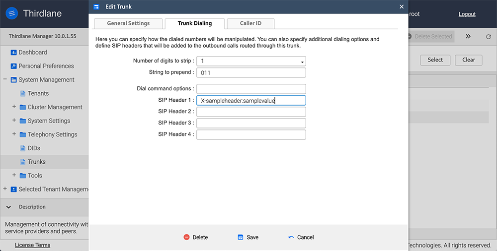

### Configure Caller ID

Adjust Caller ID on outbound calls based on the trunk dialing configuration:

1. Expand **System Management** and click **Trunks**.
2. Edit the trunk and select the **Caller ID** tab.
3. Set **Number of digits to strip** and **String to prepend** as needed.

### Set Up Phone Numbers Using Provisioned DIDs

1. Expand **System Management > Telephony Settings** and click **Phone Numbers** (or **DIDs** in some setups).
2. Use the filter controls above the list to view **All**, **Assigned to tenants**, **Unassigned numbers**, **Assigned to the currently selected tenant**, or **Phone numbers in use**.
3. To add a range, enter the **From** and **To** values, optionally set a **Prepend** prefix, and check **Assign** to assign to the current tenant.
4. Click **Add Phone Numbers**.

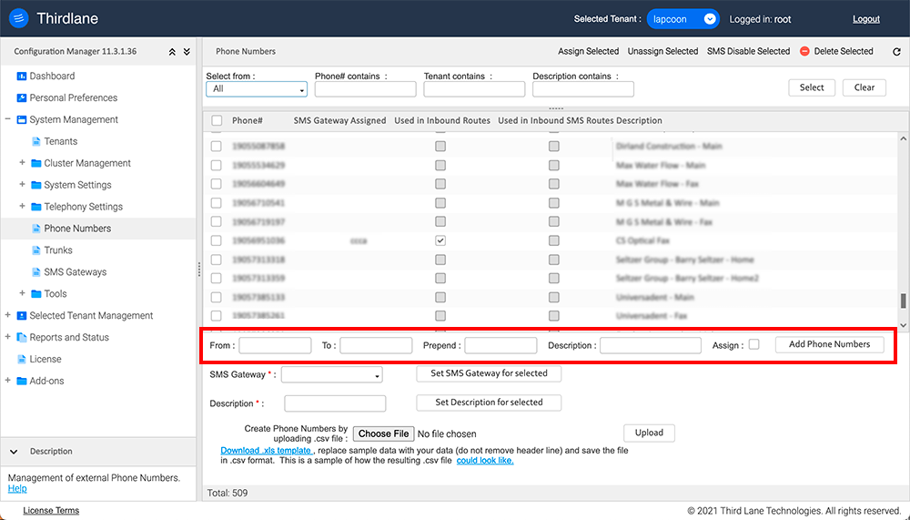

> **Note:** You can also add phone numbers in bulk by uploading a `.csv` file.

### Configure Inbound Routes

1. Expand **Selected Tenant Management** in the left-hand navigation.
2. Under **Call Routing**, select **Inbound routes**.

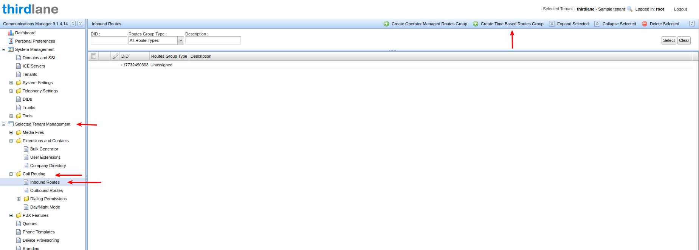

3. Select **Time Based Routes Group**, then **Add Route**, fill in the details, and press **Save**.

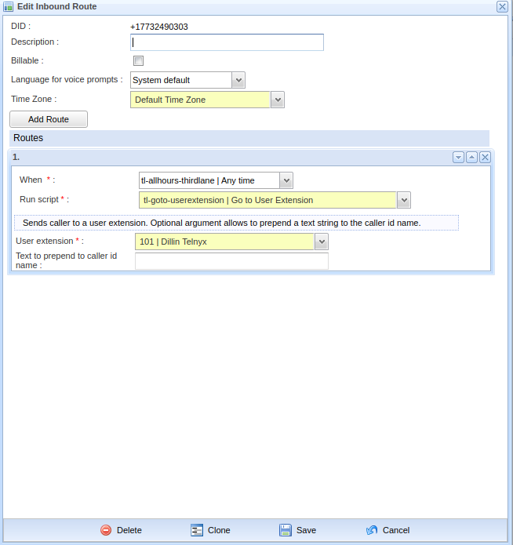

Inbound calling to your DID is now ready. Register your client to the PBX using the extension's username and password; the domain is the public IP of your PBX server.

### Assign and Unassign Numbers to a Tenant

**To assign:**

1. Expand **System Management** and select **DIDs**.

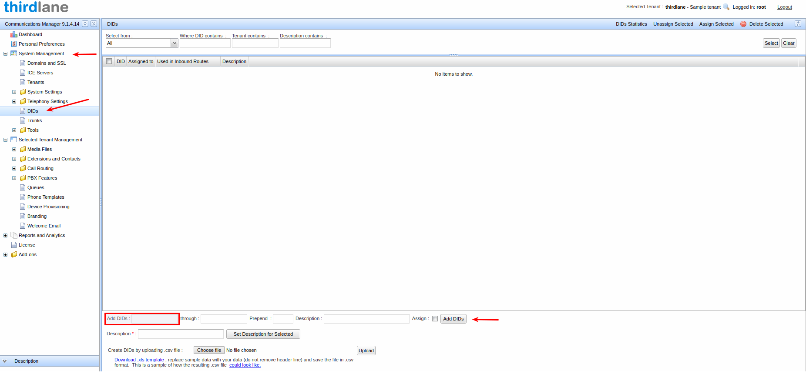

2. Check the box beside the number(s) you want to enable.
3. Click **Assign Selected** in the top-right.

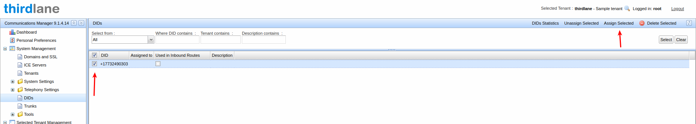

**To unassign:**

1. Select the number(s) using the checkbox and click **Unassign Selected** in the top navigation.

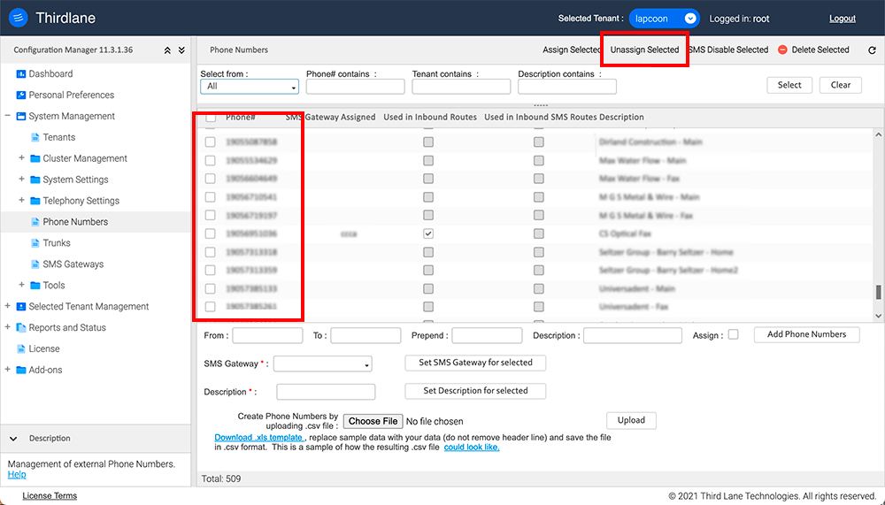

> **Note:** You cannot unassign a number currently in use without first deleting its corresponding inbound route.

### Create Extensions for Assigned Numbers

1. Navigate to **Selected Tenant Management** and expand the dropdown, then click **Extensions and Contacts > User Extensions**.

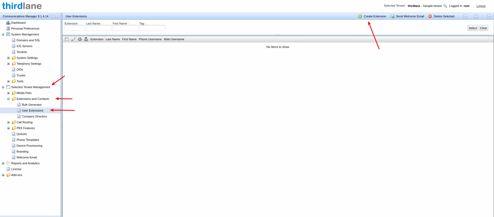

2. Click **Create Extension** and open the **Basic** tab.
3. Enter the first name, last name, and extension number, then click **Save**.

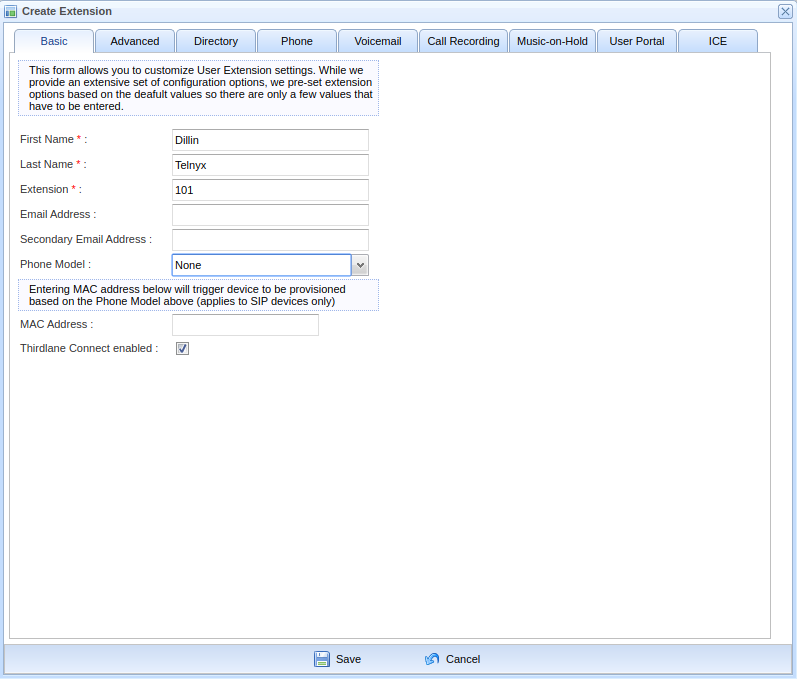

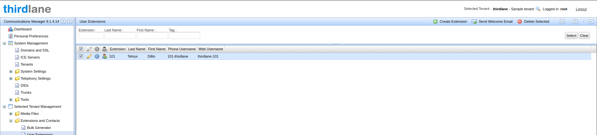

4. Open the new extension for editing (pencil icon) and click the **Phone** tab.
5. Note the **SIP User name** and **Password** — these, along with your server IP, are used to register devices to the PBX.

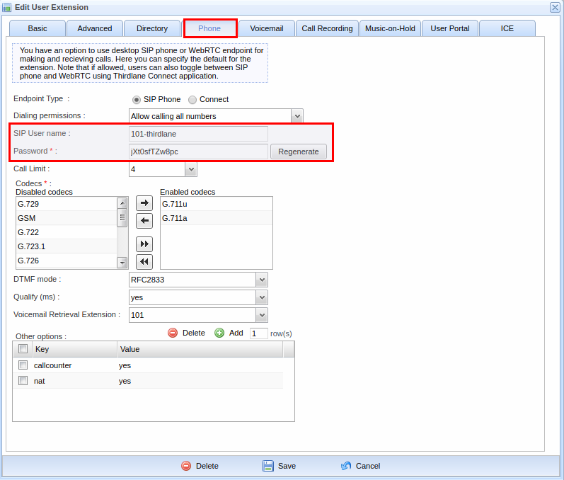

6. Return to the **DID** section. The DID should now show **Used in Inbound Routes** enabled and associated with the extension (e.g., 101).

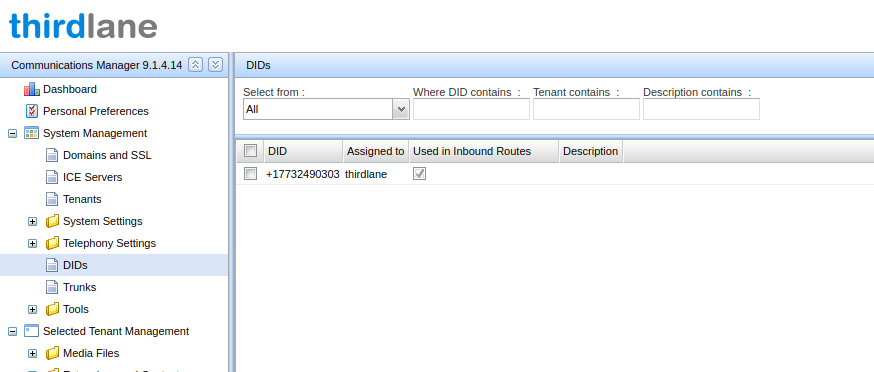

### Configure SMS Gateway

1. Expand **System Management** and click **SMS Gateways**.
2. Click **Create** and provide:
   - **Name:** Unique alphanumeric name.
   - **Provider:** `Telnyx`
   - **Description:** Optional.
   - **Domain:** Domain used to receive inbound SMS and status callbacks.
   - **API Key:** Provisioned from Telnyx.

After creation, the Configuration Manager generates a URL for inbound SMS and status callbacks. Specify these URLs in your Telnyx Mission Control Portal.

> **Note:** Deleting an SMS gateway used by an inbound route will invalidate that route.

### Enable SMS for Phone Numbers

1. Expand **System Management** and click **Phone Numbers**.
2. Select the number(s) to SMS-enable.
3. Use the **SMS Gateway** dropdown to choose a configured gateway.
4. Click **Set SMS Gateway for selected**.
5. After enabling, assign numbers to users in **Inbound SMS Routes**.

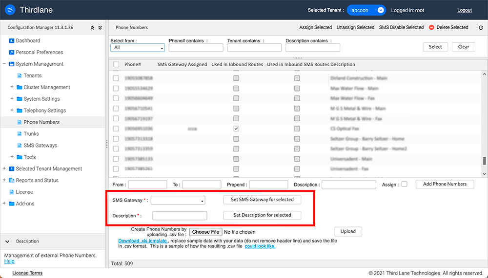

### Thirdlane Post-requisites

Refer to Thirdlane's documentation for the remaining configuration:

- Configure extensions and contacts via the [Bulk Generator](https://www.thirdlane.com/docs/platform/bulk-generator), [User Extensions](https://www.thirdlane.com/docs/platform/user-extensions), and [Company Directory](https://www.thirdlane.com/docs/platform/company-directory).
- Configure call routing: [inbound routes](https://www.thirdlane.com/docs/platform/inbound-routes), [outbound routes](https://www.thirdlane.com/docs/platform/outbound-routes), [dialing permissions](https://www.thirdlane.com/docs/platform/tenant-outbound-dialing-permissions#!), and [day/night mode](https://www.thirdlane.com/docs/platform/daynight-mode).
- Configure [inbound SMS routing](https://www.thirdlane.com/docs/platform/inbound-sms-routes).
- Configure additional [Thirdlane-side PBX features](https://www.thirdlane.com/docs/platform/pickup-groups#!).
