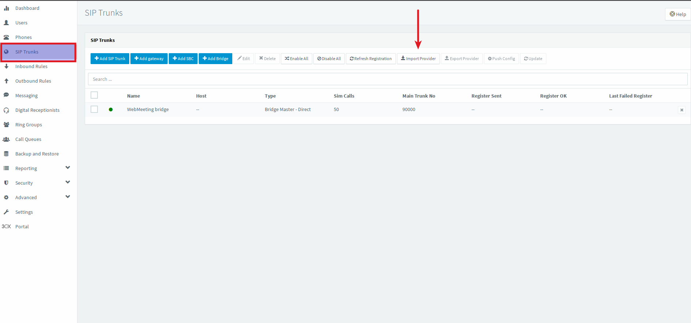
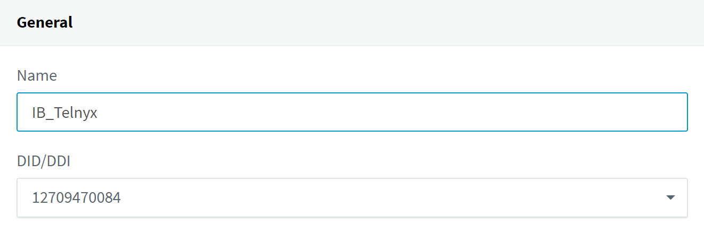
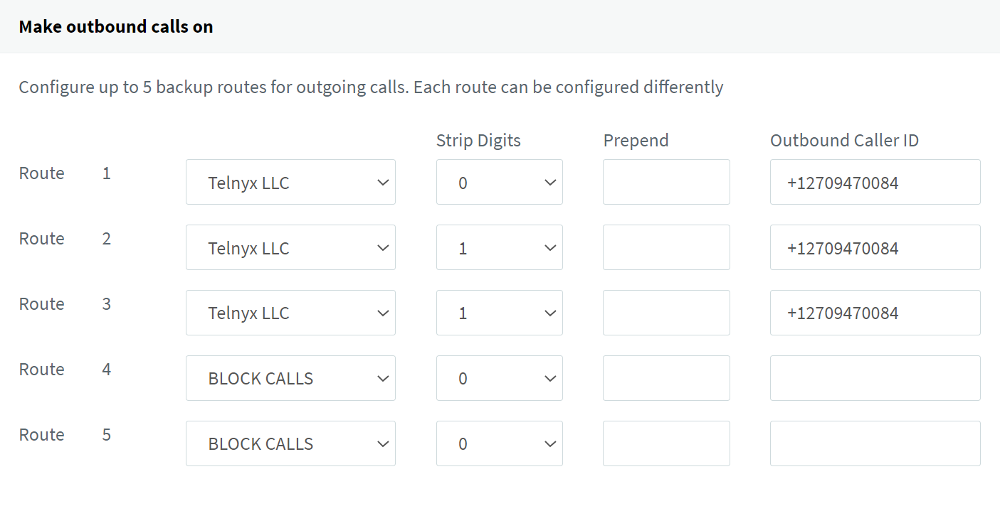
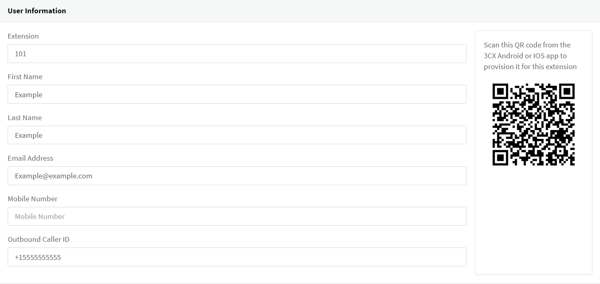
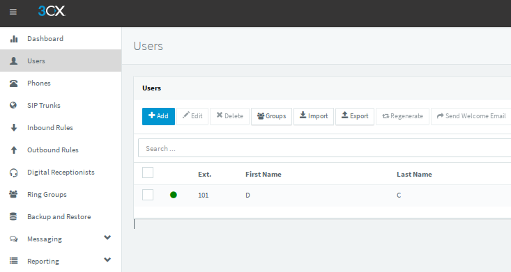
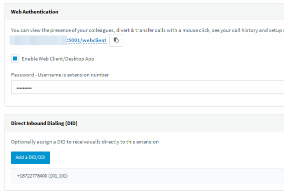
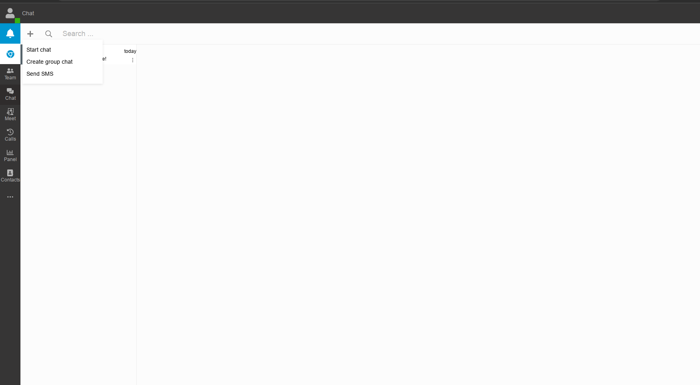
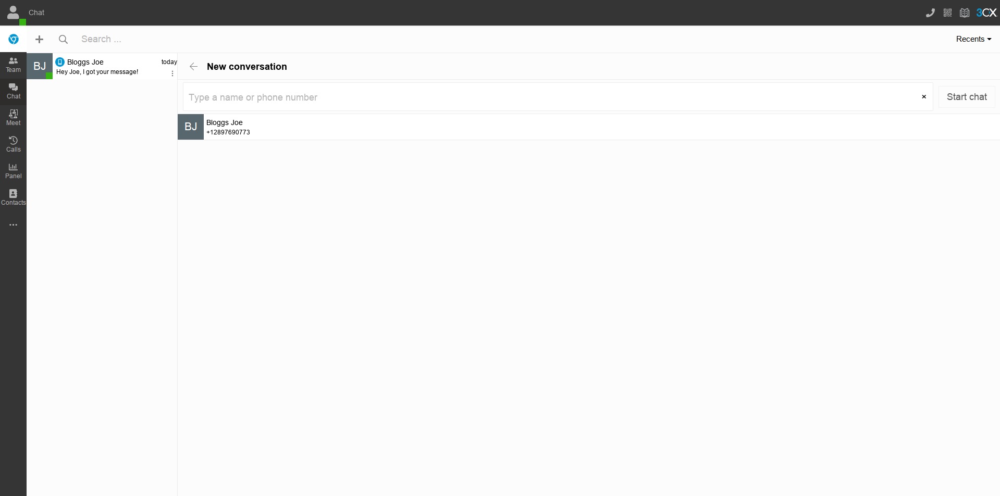

# Configuring Thirdlane and 3CX PBXs with Telnyx

*Part 4 of 6 — see also: [Part 1](configuring-thirdlane-and-3cx-pbxs-with-telnyx--part-1.md), [Part 2](configuring-thirdlane-and-3cx-pbxs-with-telnyx--part-2.md), [Part 3](configuring-thirdlane-and-3cx-pbxs-with-telnyx--part-3.md), [Part 5](configuring-thirdlane-and-3cx-pbxs-with-telnyx--part-5.md), [Part 6](configuring-thirdlane-and-3cx-pbxs-with-telnyx--part-6.md)*

Step-by-step guidance for connecting Thirdlane and 3CX (V18 and V20) IP-PBX systems to Telnyx as a SIP trunk provider, including trunk creation, inbound/outbound routing, extension setup, and SMS gateway configuration, along with notes on 3CX and Telnyx compatibility.

## 3CX V18 PBX Setup

### 3CX V18 Pre-requisites

- [Set up and configure your Telnyx Mission Control Portal](https://support.telnyx.com/en/articles/5717957-zoiper-5-pro-telnyx-setup#h_dc5df9cfdf).
- Have created a credentials-based or IP-based [SIP connection](https://portal.telnyx.com/#/voice/connections) on Telnyx, assigned to a DID and outbound profile.
- Have created a [messaging profile](https://portal.telnyx.com/#/programmable-messaging/profiles) on Telnyx, assigned to a DID.
- [Download](https://www.3cx.com/phone-system/download-links/) and [install](https://www.3cx.com/docs/manual/) 3CX. During installation, 3CX provides a username and password for the web interface.

> **Note:** 3CX detects your public IP and lets you specify whether it is static or dynamic. You can configure 3CX with an FQDN (3CX provides one to ensure it resolves to your public IP and to generate certificates). Choose your default network adapter and decide whether extensions use the local IP or FQDN. Finally, choose your preferred HTTP/HTTPS ports for accessing the 3CX web interface.

### Perform the Basic Setup

1. Log into 3CX with the credentials provided during installation.

2. On the **Extension Length** tab, specify the extension length (default is 3). This cannot be changed later.

3. Click **Next**.
4. On the **Admin Email** tab, enter an email for system notifications.

5. Click **Next**.
6. On the **Timezone** tab, set your timezone.

7. Click **Next**.
8. On the **Operator** tab, specify a default operator extension (default destination for inbound calls and voicemail).

9. Click **Next**.
10. On the **Allowed Countries** tab, select regions permitted for outgoing calls.

11. Click **Next**.
12. On the **Prompt set** tab, select the language for automated prompts.

13. Click **Next**.
14. On the **Registration** tab, enter your personal details to register your setup.

### Confirm Network Settings

1. Click the **Ports** tab and ensure the SIP port is set to `5060`.
2. Click the **Public IP** tab and verify your public IP and selected network card interface.
3. Click **Settings > Network Settings > Public IP** and ensure the connection IP on the portal matches your static public IP.

### Create a Telnyx SIP Trunk (V18)

1. Click **SIP Trunks** in the left-hand navigation.
2. Click **Import Provider** near the top of the screen.
3. In the pop-up:
   - Upload the `telnyx.pv.xml` file (available at the end of the source article; try incognito mode or another browser if you cannot access it, or contact Telnyx support).
   - Enter the main trunk number.

4. Click **OK** to open the trunk configuration window.
5. On the **General** tab, under **Trunk Details**:
   - **Enter name of Trunk:** `Telnyx LLC`
   - **Registrar/Server/Gateway Hostname or IP:** `sip-anycast1.telnyx.com:5060` or `sip.telnyx.com:5060`
   - **Outbound Proxy:** Leave blank unless using a proxy.
   - **Number of SIM Calls:** Set your preferred simultaneous call count.

6. **Authentication** section:
   - **Register/Account based:**
     - **Authentication ID:** Username from the Telnyx connection.
     - **Authentication Password:** Password from the Telnyx connection.
     - **3 Way Authentication:** Do not enable.

   - **IP based (Do not require):**
     - Use this to send/receive calls from the public IP of your 3CX instance.
     - Leave **Authentication ID** and **Authentication Password** empty.
     - Do not enable 3 Way Authentication.

7. **Route calls to** section:
   - **Main Trunk number:** Verify against the number purchased on the Telnyx portal.
   - **Destination for calls during office hours / outside office hours:** Set per your requirements.

8. Other sub-tabs are pre-populated with Telnyx-recommended settings from the XML file. Click **OK** when satisfied.
9. In the **SMS** sub-tab:
   - **API Key:** Generate at [Telnyx API Keys](https://portal.telnyx.com/#/api-keys) and paste.
   - **Provider URL:** `https://api.telnyx.com/v2/messages`
   - **Copy webhook URL:** Copy from [Telnyx Programmable Messaging Profiles](https://portal.telnyx.com/#/programmable-messaging/profiles) and paste into your messaging profile.

10. Click **OK**. Your Telnyx trunk is now live.

### Configure Inbound Rule (V18)

1. Click **Inbound Rules** in the left navigation.
2. Click **+Add DID Rule**.
3. **General** section:
   - **Name:** `IB_Telnyx` (or any identifying name).

4. **Route calls to** section:
   - **Destination for calls during office hours:** `Extension` and select your desired extension (commonly `000`).

### Configure Outbound Rule (V18)

1. Click **Outbound Rules** in the left navigation.
2. Click **+Add**.
3. **General** section:
   - **Name:** `OB_Telnyx` (or any identifying name).

4. **Apply this rule to these calls** section:
   - **Calls to numbers starting with prefix:** Leave empty.
   - **Calls from extension(s):** Enter the extension numbers (e.g., `000`).
   - **Calls to Numbers with a length of:** Leave empty.

5. **Make outbound calls on:** Configure up to 3 routes. Strip 0 digits on Route 1 and 1 digit on Routes 2 and 3. Apply an outbound caller ID here to apply it to all calls on this route.

> **Note:** If you do not set an outbound caller ID on the route, you can apply it per user/extension. If no caller ID is set, calls may reach Telnyx without one — apply a Caller ID Override from your SIP Connection's outbound options in the Telnyx Portal, or calls will be rejected. See the [caller ID number policy](https://support.telnyx.com/en/articles/3546251-caller-id-number-policy).

For more on dialing format rules, see [3CX's outbound rules guide](https://www.3cx.com/blog/voip-howto/outbound-rules-a-complete-example/). Click **OK** when finished.

### Outbound Rule Example: 911 Emergency Calls

The outbound rule feature supports complex routing, including backup routes and number-type-specific routing. Example for 911:

See [3CX's outbound rules support article](https://www.3cx.com/blog/voip-howto/outbound-rules-a-complete-example/) for additional examples.

### Configure Extension for Messaging (V18)

1. In the **Users** section, add or edit an extension (e.g., 101) associated with one of your configured DIDs.

2. On the **General** tab, scroll to the bottom and assign the DID to the extension. (In V18 Update 5 and later, you no longer need to enable SMS on the associated DID separately.)

3. Click **OK** at the top of the page to make inbound and messaging live for the extension.

### Test the 3CX Webclient (V18)

1. During initial setup, you received an email from 3CX with a link to the webclient and the extension's username and password.
2. Visit the link and log in.
3. In the **Contacts** section, click the `+` icon to add a contact (name and mobile number), then save.

4. In the **Chat** section, click `+` then **Send SMS**.

5. Choose the contact, type your message, and press Enter.

6. Replies appear in the chat.

