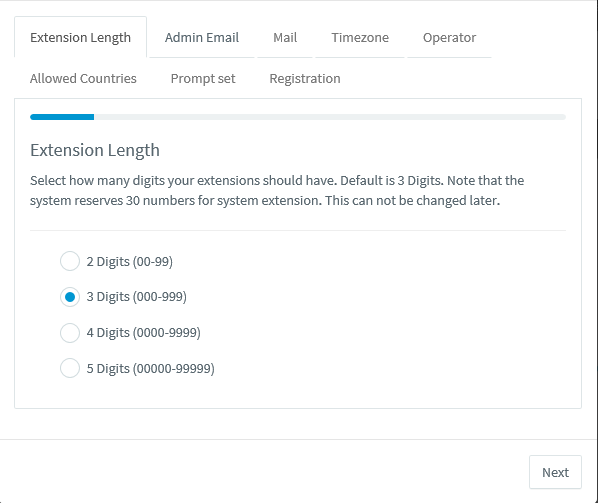
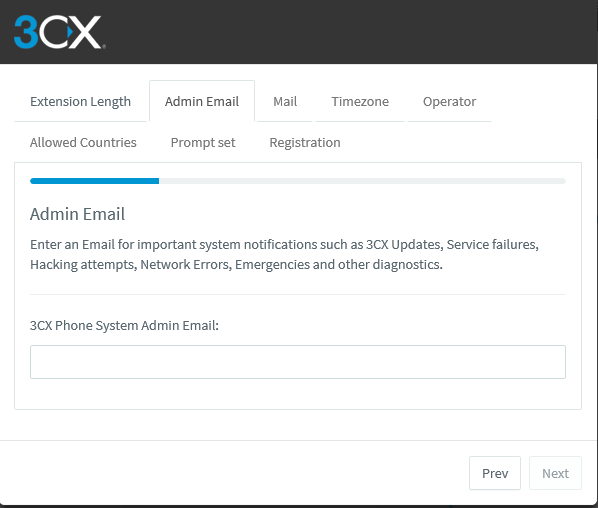
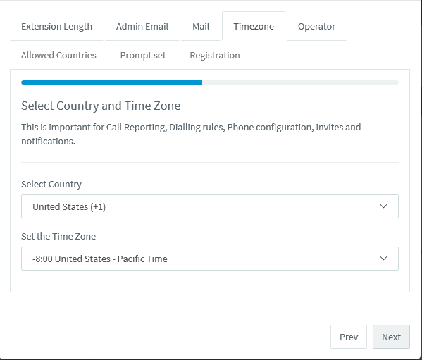
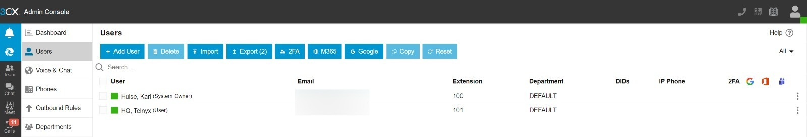
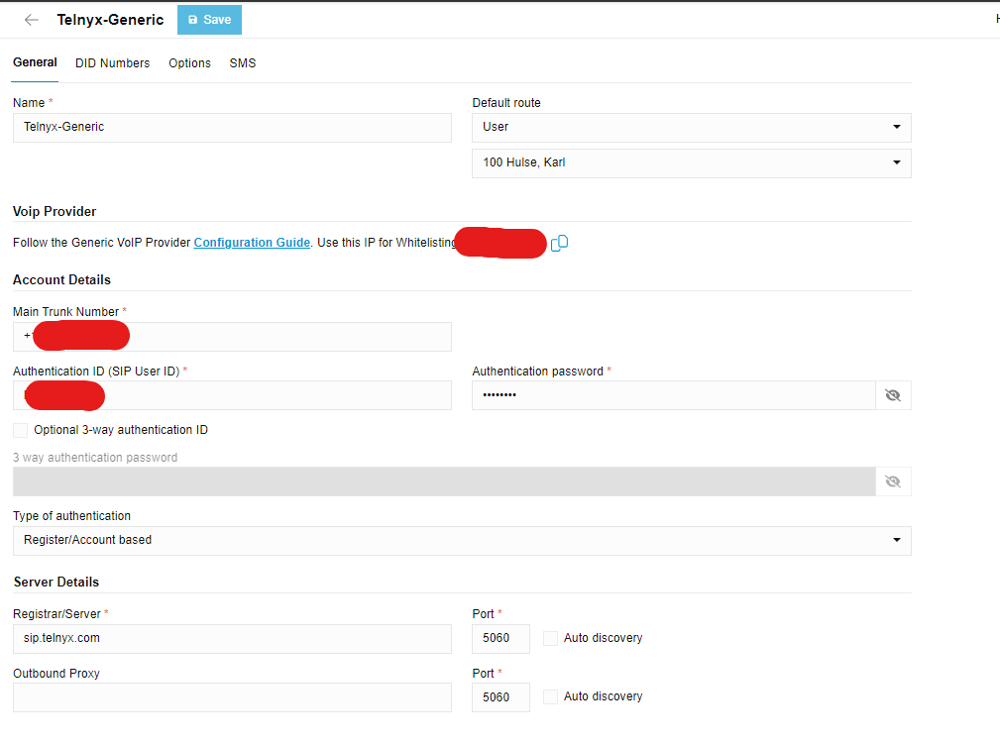
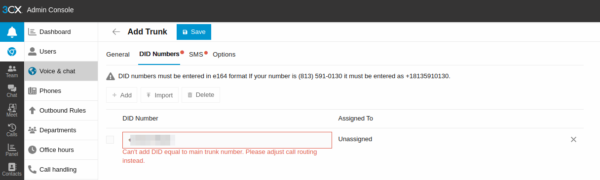
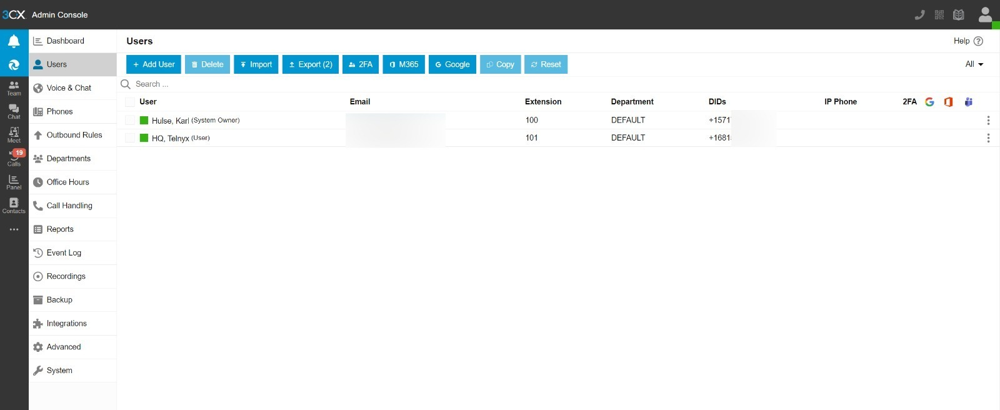
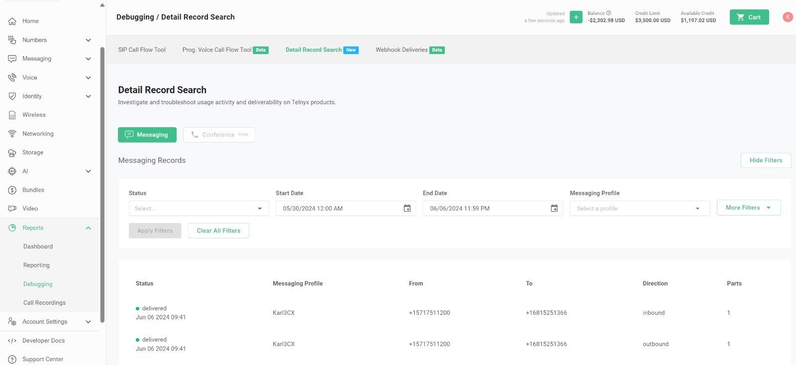
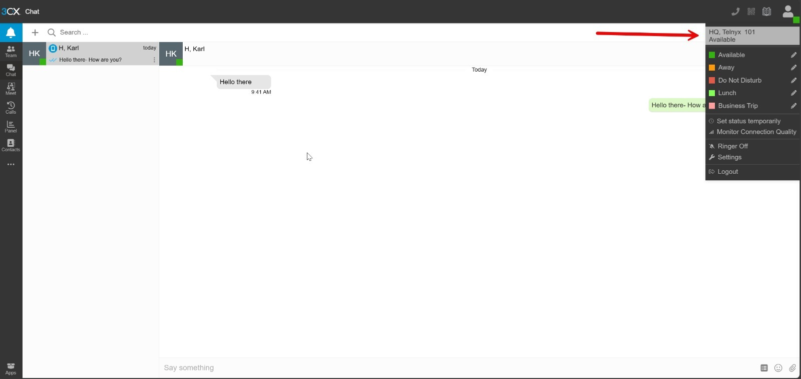

# Configuring Thirdlane and 3CX PBXs with Telnyx

*Part 5 of 6 — see also: [Part 1](configuring-thirdlane-and-3cx-pbxs-with-telnyx--part-1.md), [Part 2](configuring-thirdlane-and-3cx-pbxs-with-telnyx--part-2.md), [Part 3](configuring-thirdlane-and-3cx-pbxs-with-telnyx--part-3.md), [Part 4](configuring-thirdlane-and-3cx-pbxs-with-telnyx--part-4.md), [Part 6](configuring-thirdlane-and-3cx-pbxs-with-telnyx--part-6.md)*

This page covers how to configure Telnyx as a SIP provider for Thirdlane and 3CX (V18 and V20) PBX systems, including trunk creation, inbound/outbound routing, caller ID, SMS gateway setup, and compatibility considerations between 3CX and Telnyx.

## 3CX V20 PBX Configuration (Build 20.0.5.551)

> **Important Notes:**
> - You may need to acquire a license from 3CX when installing this version.
> - V20 has an entirely new management console named "Admin Console", now part of the 3CX client. Users can switch to the admin console directly from the 3CX client without needing a separate login or URL.
> - Telnyx is no longer a supported carrier on 3CX. Ensure your 3CX version supports third-party vendors (providers not officially supported by 3CX). The example below uses a hosted 3CX PRO instance.

### Pre-requisites

- [Set up and configure your Telnyx Mission Control Portal](https://support.telnyx.com/en/articles/5717957-zoiper-5-pro-telnyx-setup#h_dc5df9cfdf)
- Create a credentials-based, IP, or FQDN-based [SIP connection](https://portal.telnyx.com/#/app/connections) on your Telnyx Mission Control Portal account, assigned to purchased numbers (DIDs) and an outbound profile
- Create a [messaging profile](https://portal.telnyx.com/#/app/programmable-messaging/profiles) on your Telnyx Mission Control Portal account, assigned to purchased numbers (DIDs)
- [Download](https://www.3cx.com/phone-system/download-links/) and [install](https://www.3cx.com/docs/manual/) 3CX

### Basic Setup

The basic setup mirrors the V18 flow:

1. Log into 3CX with the credentials provided during installation.

2. On the **Extension Length** tab, specify your extension length (default is 3). This **cannot** be changed later.

3. Click **Next**.
4. On the **Admin Email** tab, enter an email for system notifications.

5. Click **Next**.
6. On the **Timezone** tab, set your timezone.

7. Click **Next**.
8. On the **Operator** tab, specify a default operator extension.

9. Click **Next**.
10. On the **Allowed Countries** tab, select all regions permitted for outgoing calls. You can also configure this later via **Admin -> Advanced** and selecting **Allowed Country Codes**.

11. Click **Next**.
12. On the **Prompt set** tab, select the language for automated prompts.

13. Click **Next**.
14. On the **Registration** tab, enter your personal details to register your setup.

### Confirm Admin -> Advanced Settings

1. Click the admin cog in the bottom left corner of the console and select **Advanced**.
2. Click the **IP Blacklist** tab and ensure you allow the appropriate Telnyx [SIP Signaling](https://sip.telnyx.com/#signaling-addresses) and [Media IP Addresses](https://sip.telnyx.com/#media). A `.json` file is attached at the end of the source article for importing all Signaling and Media IPs.
3. Click the **Network** tab:
   - Choose which IP is the default internet-facing IP address (default gateway) for the **Network Interface Card**
   - Set the **External IP Configuration** with either a static IP address or Dynamic IP Address. The IP address or FQDN of your instance is required for your [SIP Connection](https://support.telnyx.com/en/articles/4245868-sip-connection-types) in your Telnyx account
   - For hosted instances, these settings are preconfigured

### Create Users

1. Click the admin cog in the bottom left corner of the console and select **Users**.
2. Create users so you can assign them DIDs for inbound and outbound calls, set their outbound caller ID, and configure other important settings.
3. Click **Add User** — you'll be brought to the **General** user settings where you can enter first and last name.
4. Click **Save**.

5. The example creates a dummy user called "Telnyx HQ" with extension 101.

> **Note:** When user extensions are created with an email included, they receive an email with their account details.

### Create a Telnyx SIP Trunk

1. Click the admin cog in the bottom left corner of the console and select **Voice & Chat**.
2. Click **Add SIP Trunk** → **Add Trunk**.
3. In the pop-up window:
   - **Name:** Enter the name of your trunk
   - **Default Route:** By default, set to the 3CX Owner (change as needed)
4. Under **VoIP Provider**:
   - **Country:** Select the country corresponding to your location — `US`, `Europe`, `Australia`, or `Canada`
   - **Provider:** Choose `Generic VoIP Provider`
5. **Main Trunk Number:** Enter the Telnyx number you wish to use for your 3CX instance
6. For credential-based authentication:
   - **Authentication ID:** Enter your trunk's username
   - **Authentication Password:** Enter your trunk's password
7. **Type of Authentication:** Select `Register/Account Based`
8. **Server Details:**
   - **Server:** Enter `sip.telnyx.com` (or the appropriate server based on your signaling server: `sip.telnyx.com`, `sip.telnyx.ca`, `sip.telnyx.com.au`, `sip.telnyx.eu`)
   - **Port:** `5060`

After configuring the trunk, it should appear in green, indicating it's up and running. You may see a warning message: "Untested provider: Quality and reliability not guaranteed." This message can be safely disregarded.

#### Add DIDs

1. Click the **DID Numbers** tab.

2. These are the other numbers purchased on your Telnyx account. You can import them through a file or enter them manually. Note: you can't add a DID equal to the main trunk number. The trunk number is automatically added once you save your first DID.

#### Configure SMS

1. Click the **SMS** tab.
2. **Enable Messaging:** Enable messaging on the DID by entering your Telnyx account's API Key.
   - **API Key:** Generate at [Telnyx API Keys](https://portal.telnyx.com/#/app/api-keys) and paste it in
3. **Copy Webhook URL:**
   - Visit [Telnyx Programmable Messaging Profiles](https://portal.telnyx.com/#/app/programmable-messaging/profiles)
   - Copy and paste the Webhook URL into the messaging profile you've created to enable inbound and outbound messaging
4. **Provider URL:** Enter Telnyx's Provider URL for SMS/MMS services: `https://api.telnyx.com/v2/messages`
5. Click **Save**.
6. Return to **Users** and configure the DID for your user.

The user is now successfully assigned a DID to make and receive calls and messages.

7. Return to **Voice & Chat** — the Telnyx trunk is registered in green and ready to handle calls.

### Configure Outbound Rules

1. Click the **Admin** cog in the bottom left corner of the console and select **Outbound Rules**.
2. **Calls to numbers starting with prefix:** Leave empty
3. **Calls from extension(s):** Enter the specific extension numbers (e.g., `100, 101`)
4. **Calls to Numbers with a length of:** Leave empty
5. **Make outbound calls on:** Configure up to 5 routes (the second and third serve as backups):
   - Route 1: Strip 0 digits
   - Routes 2 & 3: Strip 1 digit

> **Note:** Outbound rules may vary per customer depending on specific needs (e.g., dialing different countries or using different trunk configurations). Adjust routes and strip digits accordingly.

6. **Outbound Caller ID:** One of the ways to apply an outbound caller ID within 3CX. If applied to the outbound route, it applies to all calls through that route.

7. Click **Save**.

#### Outbound Call Example

1. Visit the **Contacts** section in the left sidebar of the management console and create a new contact with the number in +E.164 format.

2. Use 3CX's built-in WebRTC calling functionality and click the phone icon to call the test number. The WebRTC component pops up on the right-hand side. Allow the website access to your microphone and speaker.

3. 3CX WebRTC client may change `+` to `001` as the international exit code. You can see this with an error from **Advanced -> Event Logs**:

   `Call or Registration to 0017266002345@(Ln.10000@Telnyx LLC) has failed. sip:192.76.120.10:5060;lr replied: Not Found (404)`

4. If your users want to dial internationally, add a new outbound rule.

   In this scenario, for calls prepended with `001`, strip the first two digits `00` and replace with `+`. Test the outbound call again.

#### Outbound Call Important Notes

- If you don't add an outbound caller ID on the outbound route, apply it at the user level settings instead.
- If a caller ID is not set through 3CX, calls may reach Telnyx without a caller ID. Apply a Caller ID Override from your SIP Connection's outbound options in the Telnyx Portal, otherwise calls will be rejected. See the [caller ID number policy](https://support.telnyx.com/en/articles/3546251-caller-id-number-policy) for accepted number formats.
- 3CX typically requires number formats in +E.164 format. Ensure your SIP Connection's inbound [ANI/DNIS number formats](https://support.telnyx.com/en/articles/1130706-sip-connection-number-formats) are set to +E.164 to avoid rejection of inbound calls by the 3CX system.
- For additional outbound rule examples, see 3CX's [support article](https://www.3cx.com/blog/voip-howto/outbound-rules-a-complete-example/).

#### Inbound Call Example

1. For testing, use user extension 100.
2. Download the 3CX iOS app from the app store and open it.
3. The app prompts you to return to the management console and click the **QR Code icon** (next to the phone icon) in the top right.

   You can also find each user's individual QR code within the **Users** section.
4. Click **Scan QR code** on your phone, allow camera access, and point it at the QR code shown on the management console.
5. To ensure calls to the main trunk number go to this user, return to the **Users** section, click the user, and assign the main trunk number configured at the beginning.
6. Save the settings. Ringing the main trunk number should now reach the 3CX app on your personal phone.
7. Notes:
   - The call comes into the management console

   - And into the mobile app on your phone

   - Missed calls are directed to voicemail, and if the user has an email set, they receive an email notification.

#### Send and Receive Messages Example

1. For testing, use the mobile app to compose an SMS from user extension 100 to user extension 101 to see inbound and outbound messages in one flow.
2. Visit the **Chats** section on the mobile app and click the pencil square icon.
3. A menu opens with options:
   - Compose Chat
   - Compose Group Chat
   - Compose SMS
4. Choose **Compose SMS**.
5. Make sure user extension 101 is added as a contact so it can be looked up on the phone. Alternatively, allow the 3CX app access to your contacts.
6. Compose your message and send it.

7. You can also see these messages in the [Messaging Report](https://portal.telnyx.com/#/app/debugging/detail-records-search) section of your account.

8. Log in as user extension 101 in the management console (using credentials received via email and 2FA setup). You can see messages from user extension 100 and reply.

