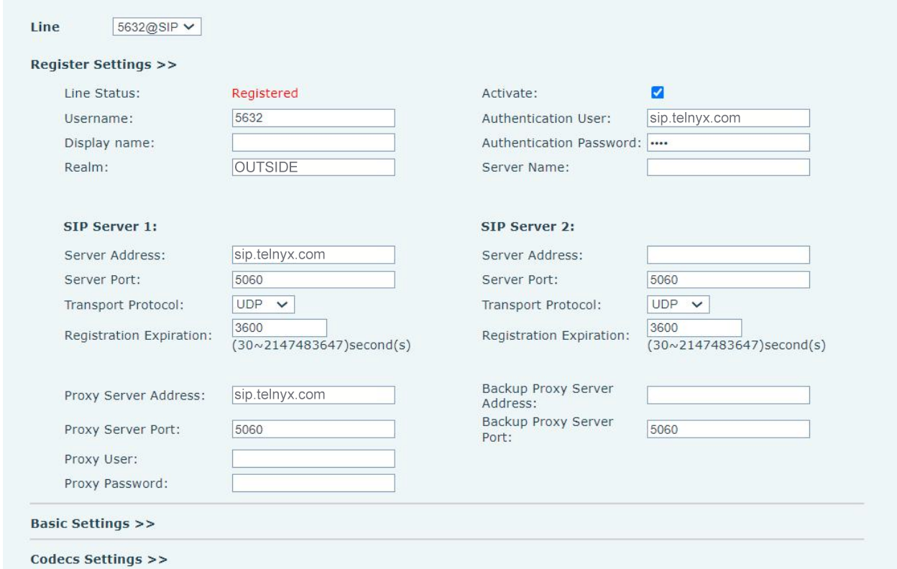

# Fanvil IP Phones: Telnyx Setup

*Part 1 of 2 — see also: [Part 2](fanvil-ip-phones-telnyx-setup--part-2.md)*

Step-by-step Telnyx setup guides for the Fanvil X4/X4G, X2C/X2P/X2CP, X7 series, V-series, X-series, and XU series IP phones, covering SIP trunk configuration, codec selection, and optional TLS encryption.

## Overview

Telnyx supports a wide range of Fanvil IP desk phones. This page consolidates the setup instructions for the following Fanvil models and series:

- **Fanvil X4/X4G** — 4-line IP phone with dual 10/100 Mbps (X4G: 10/100/1000 Mbps) network ports, integrated PoE, and a second DSS color screen supporting up to 30 DSS keys. See the [Fanvil X4/X4G product page](https://www.fanvil.com/Product/info/id/72.html).
- **Fanvil X2C/X2P/X2CP** — Call center IP phones with HD voice, EHS, supervision, LED buttons, and a foot pedal switch. The X2CP supports 2 lines; the X2C/X2P features a 2.8" 320x240 color LCD. See the [X2CP product page](https://www.fanvil.com/Product/info/id/96.html) and the [X2C/X2P product page](https://www.fanvil.com/Product/info/id/64.html).
- **Fanvil X7 series** — High-end enterprise phones including the X7 (20 SIP lines, 7" capacitive touch, 127 DSS keys, Bluetooth, Wi-Fi), X7C (20 SIP lines, 5" color screen, 60 DSS keys), and X7A (Android 9.0, 20 SIP lines, 7" color touchscreen, 112 DSS keys, optional CM60 USB camera). See the [X7](https://www.fanvil.com/Product/info/id/93.html), [X7C](https://www.fanvil.com/Product/info/id/94.html), and [X7A](https://www.fanvil.com/Product/info/id/124.html) product pages.
- **Fanvil V-series** — Includes the V67 flagship smart video phone (adjustable 7" touchscreen, HD video, 10-party audio conferencing, Miracast), V65 prime business phone (adjustable 4.3" touchscreen, 6-party audio conferencing), V64 prime business phone (3.5" color LCD), and V62 essential business phone (graphical dot-matrix screen). See the [V67](https://www.fanvil.com/Product/info/id/157.html), [V65](https://www.fanvil.com/Product/info/id/158.html), [V64](https://www.fanvil.com/Product/info/id/159.html), and [V62](https://www.fanvil.com/Product/info/id/160.html) product pages.
- **Fanvil X-series** — Covers all X-series IP phones except the X4/X4G and X2C/X2CP. See the [Fanvil X-series product index](https://fanvil.com/products/p1/x/index.html).
- **Fanvil XU series** — Includes the X6U (4.3" main LCD plus two 2.4" side LCDs, 60 DSS keys), X5U (3.5" main LCD plus one 2.4" side LCD, 60 DSS keys), X4U (2.8" main LCD plus one 2.4" side LCD, 12 SIP lines, 30 DSS keys), X3U (2.8" color LCD, 6 SIP lines), and X3U Pro (2.8" color display, 6 SIP lines, 2 DSS keys). See the [X6U](https://www.fanvil.com/Product/info/id/106.html), [X5U](https://www.fanvil.com/Product/info/id/108.html), [X4U](https://www.fanvil.com/Product/info/id/109.html), [X3U](https://www.fanvil.com/Product/info/id/110.html), and [X3U Pro](https://www.fanvil.com/Product/info/id/142.html) product pages.

## Pre-requisites

Before configuring any Fanvil phone with Telnyx:

- Ensure that your Telnyx Mission Control Portal is configured properly.
- RECOMMENDED: Enable TLS to encrypt your traffic.
- Make sure your phone is running the latest firmware (see the Additional Resources section for each model).
- Make sure you can log into the web GUI. Refer to the Web Management section of your phone's user manual for instructions.

## Fanvil X4/X4G Setup

### Get your phone's IP address

1. From your IP phone go to **OK > Status > IP Address** to obtain its IP address.
2. From a computer on the same physical network, open a web browser and enter this IP address. Prepend it with `http://`.
3. Log in for the first time with the following default credentials (change them after first login):
   - **Username:** `admin`
   - **Password:** `admin`

### Create a SIP account in the Fanvil web portal

1. Click on **Lines** in the left-hand menu.
2. Click on the **SIP** tab and provide the following:
   - **Username:** Your Telnyx account username
   - **Display name:** Your caller ID. Use capital letters, no special characters (spaces are allowed), and keep under 15 characters for Canadian providers.
   - **Authentication name:** Your Telnyx account username
   - **Authentication Password:** Your Telnyx account password
   - **Server Name:** `sip.telnyx.com`
   - **Register Address:** `sip.telnyx.com`
   - **Register Port:** `5060` for UDP, `5061` for TLS
   - **Proxy Server Address:** `sip.telnyx.com`
   - **Backup Proxy Server Address:** `sip.telnyx.com`
   - **Backup Proxy Server Port:** `5060` for UDP, `5061` for TLS
   - **Activate:** Check this box to activate
3. Click **Apply**.
4. Refresh the page to ensure that your new SIP account shows as registered.

## Fanvil X2C/X2P/X2CP, X7 Series, V-Series, X-Series, and XU Series Setup

The configuration steps for these models are nearly identical. The X2C/X2P/X2CP uses a slightly older interface layout (Basic Settings section), while the X7 series, V-series, X-series, and XU series use the Register Settings section. Both flows are documented below.

### Configure a line with a Telnyx SIP trunk

1. Log into your web GUI and navigate to **Line > SIP**.
2. Use the **Line** dropdown to select a SIP line to configure.

**For the X2C/X2P/X2CP (Basic Settings section):**

- **Username:** The SIP connection username.
- **Display Name:** Your caller ID. Use capital letters, no special characters (spaces are allowed), and keep under 15 characters for Canadian providers.
- **Authentication Name:** The SIP connection username.
- **Authentication Password:** The SIP connection password.
- **SIP Proxy Server Address:** `sip.telnyx.com` (also used as outbound proxy and backup proxy server address)
- **SIP Proxy Server Port:** `5060` for TCP/UDP, `5061` for TLS
- **Outbound Proxy Address:** `sip.telnyx.com`
- **Outbound Proxy Port:** `5060` for TCP/UDP, `5061` for TLS
- **Realm:** Enter the name of the realm to which the SIP interface is connected.

**For the X7 series, V-series, X-series, and XU series (Register Settings section):**

- **Username:** The SIP connection username.
- **Display Name:** Your caller ID. Use capital letters, no special characters (spaces are allowed), and keep under 15 characters for Canadian providers.
- **Realm:** Enter the name of the realm to which the SIP interface is connected.
- **Authentication Name:** The SIP connection username.
- **Authentication Password:** The SIP connection password.
- **Server Name:** `sip.telnyx.com`

**SIP Server 1 sub-section (X7 series, V-series, X-series, XU series):**

- **Server Address:** `sip.telnyx.com`
- **Server Port:** `5060` for TCP/UDP, `5061` for TLS
- **Transport Protocol:** Choose `TCP` or `UDP` unless you are encrypting traffic and have set up encryption on your Telnyx portal. In this case, choose `TLS`.

You can optionally configure the **SIP Server 2** section as well.

### Configure voice and video settings

1. From the line you configured, expand the **Codecs Settings** section.
2. Set the priority and availability of audio and video codecs by adding or removing them from the list. Telnyx supports the following codecs:

**Audio:**

- `ulaw(g711u)`
- `alaw(g711a)`
- `g722`
- `g729`

**Video:**

- `H264`

### (Optional) Upload a TLS certificate

If you are encrypting traffic with TLS, you'll need to upload a TLS certificate.

1. In the **Lines > SIP section**, find the **Advanced Settings** sub-section:
   - **DTMF Type:** `RFC 2833`
   - **Transportation Protocol:** Choose `TCP` or `UDP` unless you are encrypting traffic and have set up encryption on your Telnyx portal. In this case, choose `TLS`.
     - Note: If you are encrypting traffic, you'll need to go into **Lines > Dial Peer** and make sure the **Port** setting is changed to `5061`.
   - **RTP Encryption:** (Optional) Enable this if you're using TLS.
   - **RTP Encryption Key:** (Optional) Obtain a key from [crt.sh](https://crt.sh/?id=1199354).
2. Navigate to **Line > Basic Settings** and find the **STUN Settings** section and set:
   - **TLS Certification File:** Obtain a certificate from [crt.sh](https://crt.sh/?id=1199354).
