# FreePBX Trunk Settings With Telnyx

*Part 1 of 3 — see also: [Part 2](freepbx-trunk-settings-with-telnyx--part-2.md), [Part 3](freepbx-trunk-settings-with-telnyx--part-3.md)*

This page explains how to configure FreePBX (V13, V14, and V15) IP trunks with Telnyx using either Chan_SIP or PJSIP, covering installation, basic settings, SIP configuration, extensions, trunk setup, outbound and inbound routing, and Telnyx Noise Suppression options for SIP connections.

## Overview

[FreePBX](https://www.freepbx.org/) is a web-based open source GUI that controls and manages Asterisk (PBX), an open source communication server. FreePBX is licensed under the GNU General Public License (GPL) and can be installed manually or as part of the pre-configured FreePBX Distro that includes the system OS, Asterisk, FreePBX GUI, and assorted dependencies.

> **Note:** Telnyx recommends using PJSIP as an upgrade from Chan_SIP, as Chan_SIP is outdated and the majority of users are moving to PJSIP, which provides a number of more future-proof options and is still actively being improved by the community. You can find out more about PJSIP [here](https://www.pjsip.org/about.htm).

Additional documentation and resources:
- [FreePBX support](https://www.freepbx.org/support/)
- [FreePBX documentation](https://wiki.freepbx.org/#all-updates)

## Prerequisites

Before configuring a FreePBX IP trunk with Telnyx, complete the following:

- [Download](https://www.freepbx.org/downloads/) and [install](https://sangomakb.atlassian.net/wiki/spaces/PP/pages/10682958/PBX+Platforms+Home) FreePBX (V13, V14, or V15 depending on your environment)
- [Configure your Telnyx Mission Control Portal](https://support.telnyx.com/en/articles/1176636-get-started-with-a-mission-control-account)
- [Set up an IP connection on your Telnyx Mission Control Portal](https://portal.telnyx.com/#/app/connections)
- RECOMMENDED: [Enable TLS to encrypt your traffic](https://support.telnyx.com/en/articles/1130711-does-telnyx-encrypt-communication)

For PJSIP trunks, you must have created an [IP connection](https://portal.telnyx.com/#/app/connections) on your Telnyx Mission Control Portal account and assigned this connection to a DID and outbound profile in order to make and receive calls.

## Install FreePBX

The installation steps vary slightly by version:

- **FreePBX V13**: Full install via Asterisk 13.
- **FreePBX V14 and V15**: Full install via Asterisk 16.

General installation flow:

1. Load the ISO onto your server or virtual machine and select a full install.

   

   

   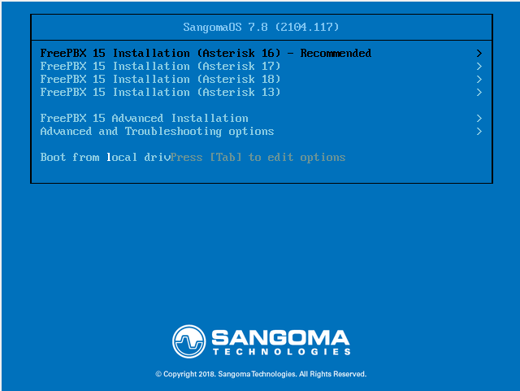

2. Confirm your network settings.

   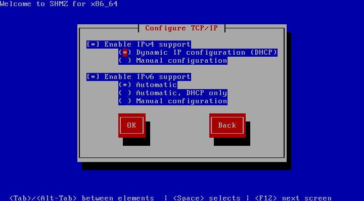

3. Choose and confirm your root password. The installation cannot complete until this is set.

   

   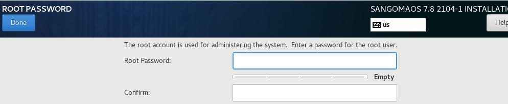

4. Wait while your packages are installed (this can take 15+ minutes and requires internet access).

   

5. Enter your root username and password at the Linux console.

   

6. Note the IP address of your PBX after logging in.

7. Enter the IP address of the new PBX into your web browser. The first time you do so, you'll be asked to create the admin username and admin password. These credentials are used to access the FreePBX web interface and do not change the Root password.

   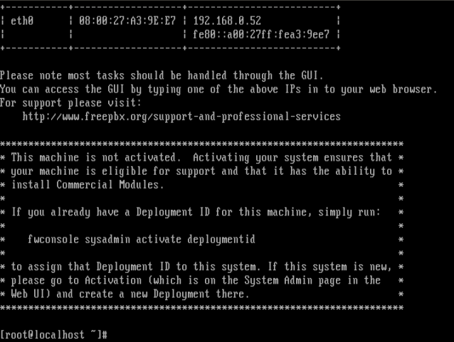

   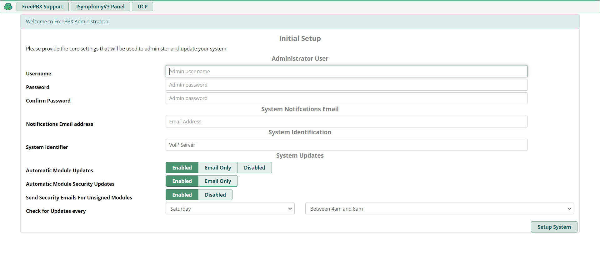

8. Once submitted, log in to the admin panel with the username and password set up in the previous step.

## Configure Basic Settings

The main FreePBX screen offers four options:

- **FreePBX Administration** — configure your PBX. Use the admin username and password you configured during installation. This section is what most people refer to as "FreePBX."
- **User Control Panel** — where a user can log in to make web calls, set up phone buttons, view voicemails, send and receive faxes, use SMS & XMPP messaging, view conferences, and more, depending on what you have enabled for the user. See [User Control Panel (UCP) 14+](https://wiki.freepbx.org/pages/viewpage.action?pageId=74318855) for more information.
- **Operator Panel** — a screen that allows an operator to control calls (requires additional licensing).
- **Get Support** — takes you to a web page about various official support options for FreePBX.

1. Enter the username, password, and admin email address to create your account.

   

2. Once your account is created, you'll be brought to the dashboard. Select **FreePBX Administration** and enter your username and password.

3. Follow the process to activate your FreePBX.

   

4. Select your default locales.

   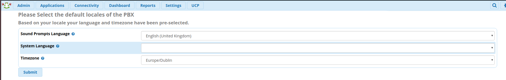

   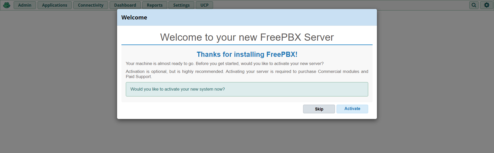

   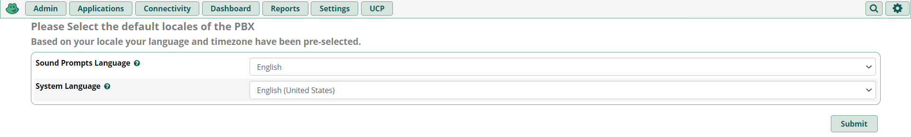

5. You'll be presented with some firewall details and other suggestions. You are welcome to set this up based on your requirements.

6. Once you're back at the dashboard, you'll see more detail.

   

   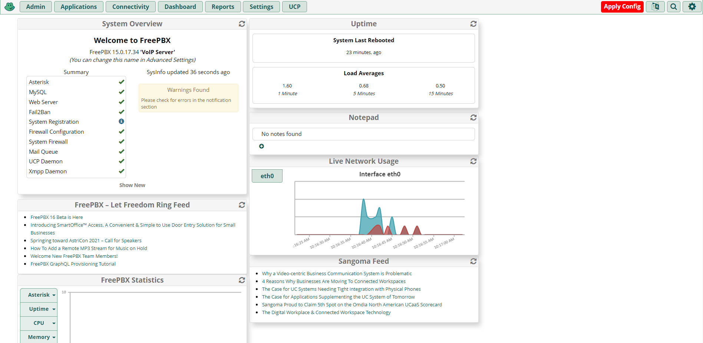

## Configure SIP Settings

At this point you can confirm network settings and configure your [SIP trunks](https://telnyx.com/products/sip-trunks) and extensions.

1. Make your way to **Settings → Asterisk SIP Settings** to confirm your network settings.
2. Populate the **external** and **local** network addresses under **General SIP Settings** and either **Chan SIP Settings** (for Chan_SIP trunks) or **PJSIP Settings** (for PJSIP trunks).
3. Click **Submit** and then **Apply Config**.

   

   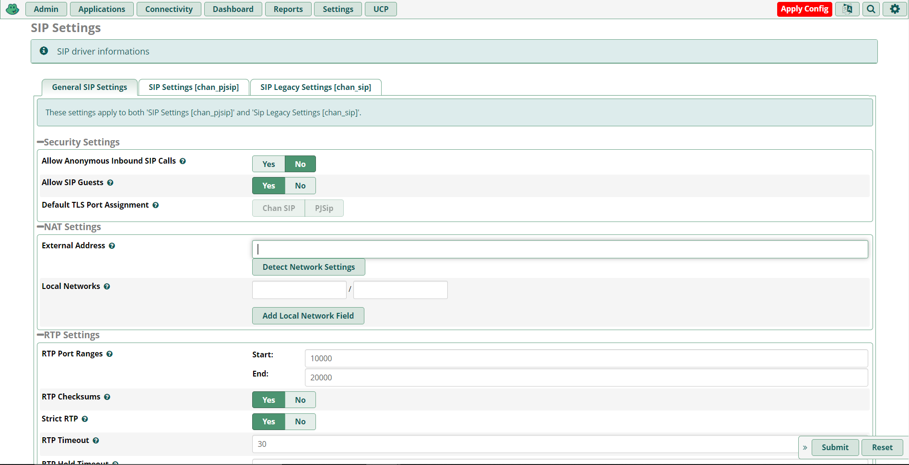

## Configure Extensions

### Chan_SIP Extensions

1. Make your way to **Applications → Extensions → Add Extension → Add New Chan SIP Extension**. The **Outbound CID** is the [number you purchased](https://portal.telnyx.com/#/app/numbers/my-numbers) from your Telnyx Mission Control Portal. The extension's secret may need to be populated under the **Other** tab.

   

   > **Note:** If you do not set an Outbound CID for your extension, you will need to enable this on your trunk.
   >
   > **Note:** This device uses CHAN_SIP technology listening on Port 5160 (UDP — this is a NON STANDARD port).

2. Click **Submit** and **Apply Config**.

For testing purposes, you can now use your SIP client to register with FreePBX using the username, password/secret, and local IP address of your FreePBX.

### PJSIP Extensions

1. Make your way to **Applications → Extensions → Add Extension → Add New Chan PJSIP Extension**. The **Outbound CID** is the [number you purchased](https://portal.telnyx.com/#/app/numbers/my-numbers) from your Telnyx Mission Control Portal. The extension's secret may need to be populated under the **Other** tab.

   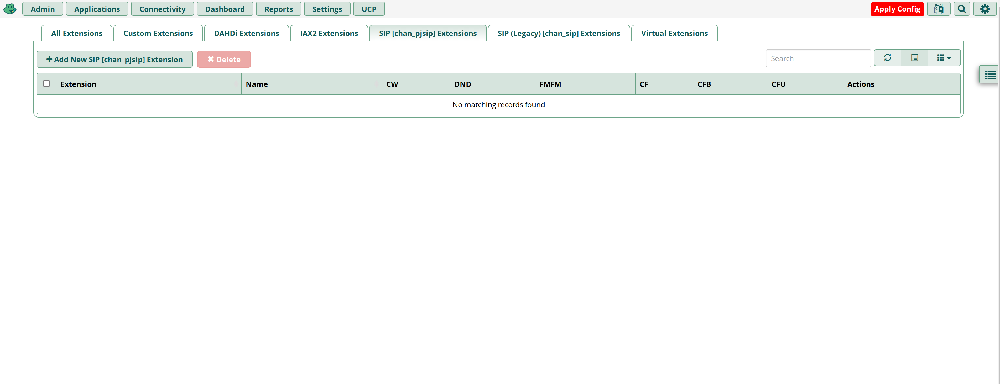

   > **Note:** If you do not set an Outbound CID for your extension, you will need to enable this on your trunk.
   >
   > This device uses **PJSIP** technology listening on Port 5060 (UDP).

2. Click **Submit** and **Apply Config**.

   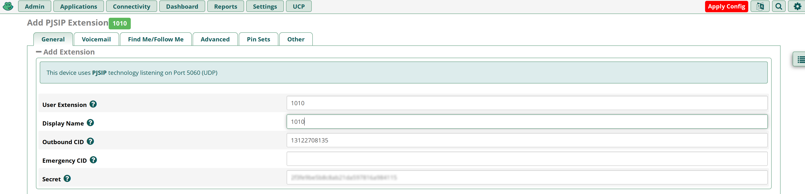

For testing purposes, you can now use your SIP client to register with FreePBX using the username, password/secret, and local IP address of your FreePBX.
