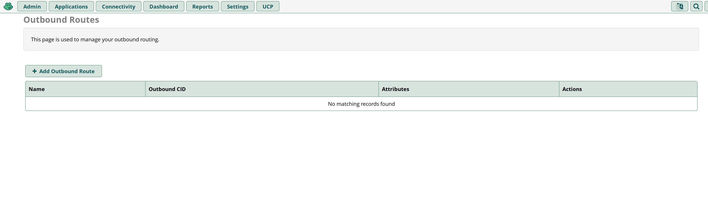
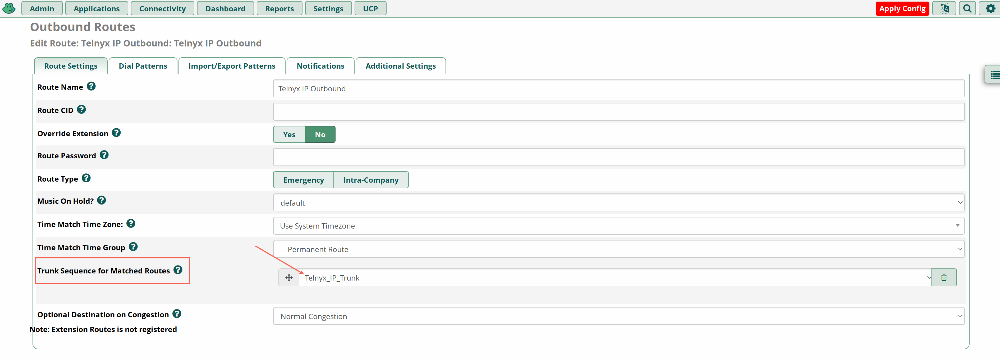
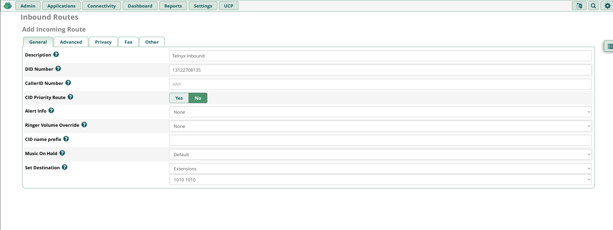

# FreePBX Trunk Settings with Telnyx

*Part 2 of 2 — see also: [Part 1](freepbx-trunk-settings-with-telnyx--part-1.md)*

Step-by-step instructions for configuring FreePBX (V13, V14, and V15) IP trunks with Telnyx using both Chan_SIP and PJSIP, including installation, SIP settings, extensions, trunk configuration, outbound/inbound routing, and dial pattern examples.

## Configure a Trunk

1. Make your way to **Connectivity → Trunks → Add Trunk → Add New Chan SIP Trunk** (or **Add New PJSIP Trunk** for PJSIP). You'll now be located in the **General** tab.
2. Enter a Trunk name, your Outbound CID, and the maximum channels you'd like for this trunk.

   

   

   > **Note:** If you choose not to set an Outbound CID on your trunk, then you must set an Outbound CID on each relevant extension. If you do not set a caller ID on either the trunk or each extension, then your calls will reach our SIP proxy without a valid caller ID. You may instead choose to enable a Caller ID Override in your SIP Connection's Outbound Options from within the Telnyx Portal. Please review our [caller ID number policy](https://support.telnyx.com/en/articles/3546251-caller-id-number-policy) for accepted formats.

3. Proceed to the **Dialed Number Manipulation Rules** tab. Depending on your use case, use the simple dial patterns below.

   

   

   **For US numbers:**
   1. prepend: `1`; match pattern: `NXXNXXXXXX`
   2. prepend: blank; match pattern: `1NXXNXXXXXX`

   **International:**
   1. prepend: Country Dialing prefix; match pattern: `NXXNXXXXXX`
   2. prepend: blank; match pattern: (Country Dialing prefix)`NXXNXXXXXX`

## Configure Outbound and Inbound Settings (Chan_SIP)

1. Still in the **Add Trunk** configuration tool, click on the **SIP Settings** tab and click on the **Outgoing** sub-tab. Specify:
   - **type:** `friend`
   - **qualify:** `yes`
   - **insecure:** `port,invite`
   - **host:** `sip.telnyx.com`
   - **fromdomain:** `sip.telnyx.com`
   - **disallow:** `all`
   - **allow:** `ulaw`

   

2. Now click on the **Incoming** sub-tab. Specify:
   - **type:** `friend`
   - **insecure:** `port,invite`
   - **host:** `sip.telnyx.com`
   - **dtmfmode:** `rfc2833`
   - **disallow:** `all`
   - **allow:** `ulaw`

   

## Configure PJSIP Outbound Settings

1. Since you have created an IP-based SIP Connection in your Mission Control Portal account, you do not need to specify any registration details. Specify:
   - **Registration** — Select `None`.
   - **SIP Server** — Your preferred Telnyx SIP Proxy (`sip.telnyx.com` for USA).
   - **SIP Server Port** — `5060`
2. Click **Submit** and **Apply Config**.
3. You might see a warning: "This trunk is not used by any routes! This trunk will not be able to be used for outbound calls until a route is setup that uses it."
4. Click on **Outbound Routes** to set up routing.

## Configure Outbound Routing

1. Make your way to **Connectivity → Outbound Routes → Add Outbound Route**.
2. Enter the route name, route CID, and specify the Telnyx IP trunk for this outbound route.

   

   
3. In **Route Settings**:
   - Set the route name.
   - Ensure the Telnyx Trunk is selected for the trunk sequence.

   
4. In **Dial Patterns**, use the dial pattern wizards to make all the dial patterns that apply to you.

   
5. Click **Generate Routes**, **Submit**, and **Apply Config**.

## Configure Inbound Routing

1. Make your way to **Connectivity → Inbound Routes → Add Inbound Route**.
2. Enter the route name description, DID associated with this route, and specify the extension that should be associated when calls are received to the DID.

   
3. Click **Submit** and **Apply Config**.

> **Note:** By default, when creating a SIP Connection in the Telnyx Mission Control Portal, the number formats for the ANI and DNIS will be set to E.164. This means Telnyx will send the dialled number in the SIP INVITE to your FreePBX system with 11 digits. As the [DID number](https://telnyx.com/resources/sip-did) above is in 11 digit format, the call will be accepted and routed to the extension. However, you can control the number formats as you desire and can read more about it [here](https://support.telnyx.com/en/articles/1130706-sip-connection-number-formats).

That's it — you've now completed the configuration of your FreePBX IP Trunk and can make and receive calls by using Telnyx as your SIP provider!

## Additional Resources

Review our [getting started guide](https://support.telnyx.com/en/articles/1176636-get-started-with-a-mission-control-account) to make sure your Telnyx Mission Control Portal account is set up correctly.

Additionally, check out:

- FreePBX's [help section](https://www.freepbx.org/support/) for community or paid support
- [FreePBX support](https://www.freepbx.org/support/)
- [FreePBX documentation](https://wiki.freepbx.org/#all-updates)

## Related Articles

- [FreePBX V14: IP Trunk - ChanSIP](freepbx-v14-ip-trunk-chansip.md)
- [FreePBX V15 IP Trunk - ChanSIP Tutorial](freepbx-v15-ip-trunk-chansip-tutorial.md)
- [FreePBX V15: IP Trunk - PJSIP](freepbx-v15-ip-trunk-pjsip.md)
- [Configuring a FreePBX V13 Credentials Trunk](configuring-a-freepbx-v13-credentials-trunk.md)
- [FreePBX V14: Credentials - ChanSIP](freepbx-v14-credentials-chansip.md)
- [Setting Up FreePBX V15 with Telnyx API](setting-up-freepbx-v15-with-telnyx-api.md)
- [Fanvil X1/X1P: IP Phone](fanvil-x1-x1p-ip-phone.md)
