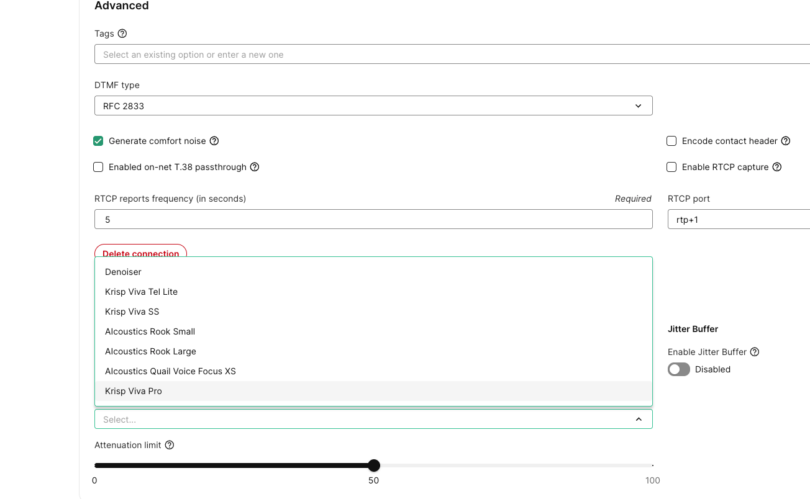

# FreePBX Trunk Settings With Telnyx

*Part 3 of 3 — see also: [Part 1](freepbx-trunk-settings-with-telnyx--part-1.md), [Part 2](freepbx-trunk-settings-with-telnyx--part-2.md)*

This page explains how to configure FreePBX (V13, V14, and V15) IP trunks with Telnyx using either Chan_SIP or PJSIP, covering installation, basic settings, SIP configuration, extensions, trunk setup, outbound and inbound routing, and Telnyx Noise Suppression options for SIP connections.

## Noise Suppression on Telnyx SIP Connections

Noise Suppression cleans up audio on your Telnyx voice traffic by removing background noise, isolating the primary speaker, or both. The result is clearer audio for human listeners, more accurate speech-to-text transcription, and better Voice AI Agent performance.

### Application Scope

Setting Noise Suppression at the connection level affects all numbers associated with that connection and overrides any configuration set on individual numbers. This is the recommended approach for centralized management and consistent audio quality across all calls on a trunk.

You can apply noise suppression to specific call directions — inbound, outbound, or both. **Charges apply per direction**, so selecting "both" incurs charges for each direction separately. See the [Voice API pricing page](https://telnyx.com/pricing/voice-api) for current rates.

### Configuring Noise Suppression

**At the Connection level (recommended):**

1. Log in to the [Mission Control Portal](https://portal.telnyx.com).
2. Navigate to **Voice → SIP Trunking**.
3. Select the SIP connection you want to configure.
4. Open the **Configuration** tab and scroll to the **Advanced** section.
5. In the **Noise Suppression** subsection, choose a model and a direction.
6. Click **Save**.

**Via API:**

You can also configure noise suppression programmatically. Use the `noise_suppression` parameter in connection or number configuration requests, or call `suppression_start` on an active call and pass a `noise_suppression_engine` value with your chosen model. See the [Noise Suppression developer documentation](https://developers.telnyx.com/docs/voice/programmable-voice/noise-suppression) for details.

### Direction Options

| Setting | What it does |
| --- | --- |
| **Inbound only** | Applies noise reduction to audio entering the Telnyx network and destined for the customer. Cleans up audio you receive. |
| **Outbound only** | Applies noise reduction to audio leaving the Telnyx network from the customer. Cleans up audio you send. |
| **Both** | Applies noise reduction in both directions. Highest impact on call clarity, but billed per direction. |
| **Disabled** | Turns the feature off. Audio passes through unprocessed. |

### Choosing a Model

Telnyx supports five noise suppression engines. Each is tuned for a different point in the audio pipeline, so the right choice depends on what's downstream — a human listener, an STT engine, or a voice AI agent — and where the speaker sits relative to the microphone.

| Use case | Recommended model |
| --- | --- |
| General-purpose, lightweight default | Denoiser |
| Standard SIP / telephony, contact centers | Krisp Viva Tel Lite |
| WebRTC and browser-based calls | Krisp Viva Pro |
| Smart speakers, conference rooms, far-field mics | Krisp Viva SS |
| Human listening with reverb / room acoustics | AIcoustics Rook Small |
| Human listening in demanding acoustic conditions | AIcoustics Rook Large |
| Voice AI Agents and STT pipelines | AIcoustics Quail Voice Focus S |

**Denoiser** — A lightweight, general-purpose noise suppression model, not specialized for any particular use case. Use when basic noise reduction is needed on non-critical audio paths.

**Krisp Viva Tel Lite** — Designed for standard SIP trunk and Call Control voice calls. The right choice for the vast majority of human-to-human voice calls; handles typical agent-environment noise like keyboard clicks, HVAC, and nearby conversations. Use when standard VoIP calls, IVR systems, or contact centers are in play.

**Krisp Viva Pro** — Optimized for WebRTC and browser-based calls where you need to isolate a single primary speaker from competing voices. Handles multi-talk scenarios and echo well. Use when browser-based softphones, video calls, or scenarios with multiple nearby speakers are involved.

**Krisp Viva SS** — Built for smart-speaker and far-field microphone setups where the speaker is at a distance from the mic. Handles ambient noise differently than close-talk models, tuned to pick up speech from across the room while suppressing environmental noise. Use when smart speakers, conference-room hardware, and far-field microphones are involved.

**AIcoustics Rook Small** — The go-to model for AI assistant calls. Handles both noise suppression and reverberation removal, which is critical for AI voice where echo and room effects degrade LLM understanding. Use when Telnyx AI Assistants, conversational AI, or agent-handoff flows are involved.

**AIcoustics Rook Large** — Same architecture as AIcoustics Rook Small but scaled up for tough acoustic environments, high reverb rooms, heavy background noise, or when maximum quality is needed. Use when demanding acoustic conditions or high-value AI calls where quality is critical are involved.

**AIcoustics Quail Voice Focus S** — Purpose-built for machine consumers, STT pipelines, and Voice AI agents. Preserves the phonetic structure that transcription engines and voice agents depend on while suppressing competing voices and background noise. Optimized for close-microphone input. Audio may sound different to a human listener — that's by design. Use when Telnyx Voice AI Assistants, conversational AI, transcription pipelines, voice analytics, or close-mic setups are involved.

## Additional Resources

- Review the [getting started guide](https://support.telnyx.com/en/articles/1176636-get-started-with-a-mission-control-account) to make sure your Telnyx Mission Control Portal account is set up correctly.
- FreePBX's [help section](https://www.freepbx.org/support/) for community or paid support.
- [FreePBX documentation](https://wiki.freepbx.org/#all-updates).
- [Telnyx SIP Trunking Configurations](https://support.telnyx.com/en/collections/3968237-telnyx-sip-trunking-configurations)
- [Voice API: Noise Suppression](https://developers.telnyx.com/docs/voice/programmable-voice/noise-suppression)

## Related Articles

- [FreePBX Trunk Settings With Telnyx](freepbx-trunk-settings-with-telnyx--part-1.md)
- [Configuring a FreePBX V13 Credentials Trunk](configuring-a-freepbx-v13-credentials-trunk.md)
- [FreePBX V14: IP Trunk - ChanSIP](freepbx-v14-ip-trunk-chansip.md)
- [FreePBX V14: Credentials - ChanSIP](freepbx-v14-credentials-chansip.md)
- [FreePBX V15 IP Trunk - ChanSIP Tutorial](freepbx-v15-ip-trunk-chansip-tutorial.md)
- [FreePBX V15: IP Trunk - PJSIP](freepbx-v15-ip-trunk-pjsip.md)
- [Setting Up FreePBX V15 with Telnyx API](setting-up-freepbx-v15-with-telnyx-api.md)
