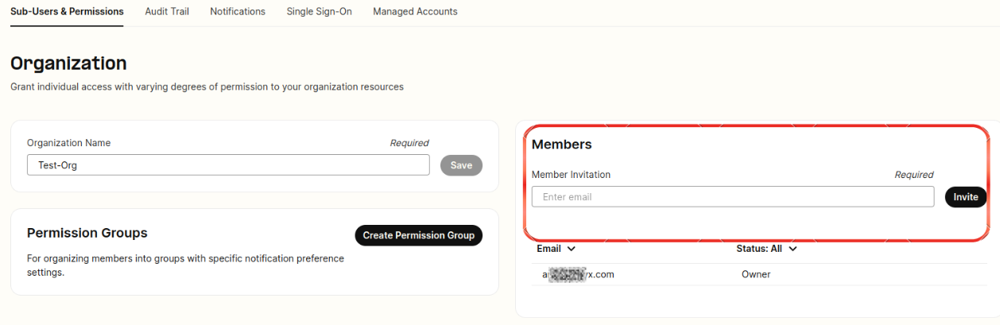
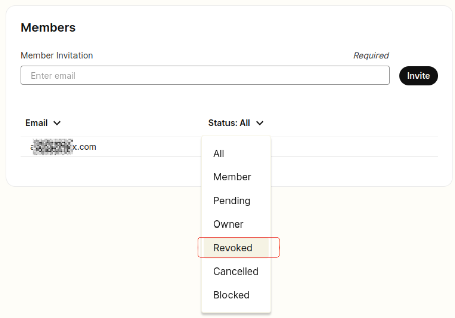
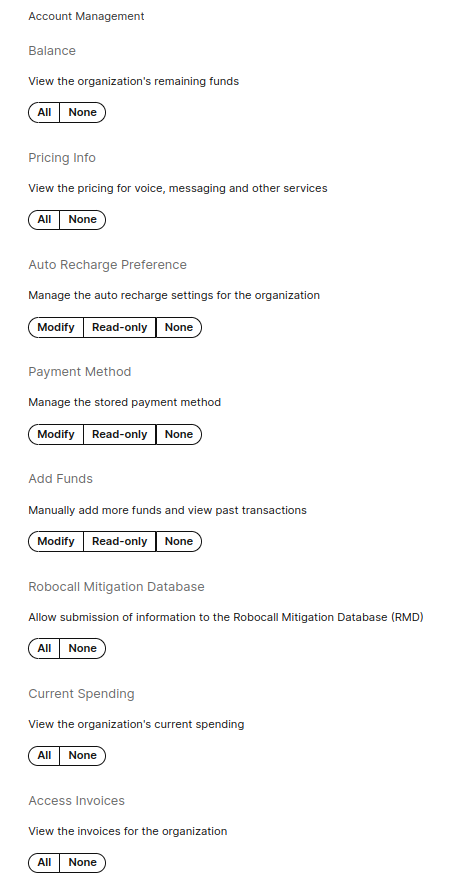
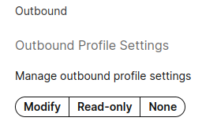
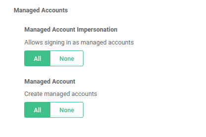
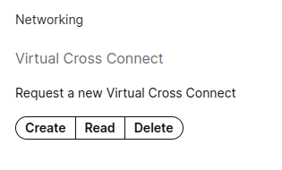
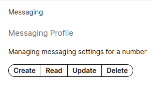
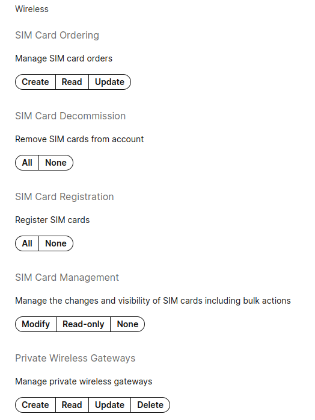
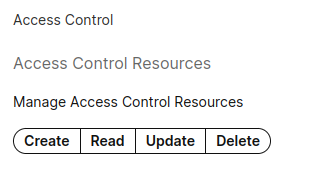

# Get Started with Organizations

*Part 1 of 2 — see also: [Part 2](get-started-with-organizations--part-2.md)*

User Organizations let a single Telnyx account owner tie multiple sub-accounts together under one umbrella entity, delegating scoped permissions through groups. This page covers how to create an organization, invite and manage sub-members, configure permission groups, and understand the technical and operational limits of the feature.

## What Are User Organizations?

User Organizations (often just called "organizations") let multiple Telnyx user accounts be tied together into one larger umbrella entity. Every organization is headed by a single account — the **organization owner** — who is fully privileged by default and can manage the permissions of every user in the organization.

Sub-accounts (also called sub-members or sub-users) are limited by a permissions system that controls which resources they can and cannot access. Permissions are managed at the **group level** rather than per user, so the same permissions can be assigned to any number of sub-accounts at once.

All user organizations share a single net running balance and a single payment method. Organizations are not intended as a reseller mechanism for giving customers direct access to a Telnyx account; for that use case, see [Managed Accounts](managed-accounts.md).

## Where to Find Organizations in the Portal

The Organizations section lives under **Account Settings → Advanced Features** in the sidebar of the Mission Control Portal.

[Go to Organizations in the portal](https://portal.telnyx.com/#/app/advanced-features/organizations)

## Setting Up an Organization

A non-organization user may start an organization once they are **Level 1 verified**. After creating an organization, the owner can send email invitations to others to join as sub-members, and can see and manage any invitations that have not yet been accepted.

### Inviting Sub-Members

Invitations are sent to invite people to join an organization. A user must **not** already be signed up with Telnyx in order to be invited. Once the invitee accepts, they become a sub-member of the organization.

Invitations can be revoked after being sent to prevent them from being used to sign up for the organization. Revoking an invitation does not prevent the person from signing up for Telnyx entirely — if they do sign up, they will simply be a separate, non-organization account.

**Invitation limits:**

- Invites are limited to **10 per hour**, including deleted and revoked invites.
- You cannot have more than **10 invites open** at any given time.
- An invitation can only be **resent up to 5 times**, and can only be resent every 5 minutes.

### Inviting an Existing Telnyx User

It is not possible to invite a member who already has an existing Telnyx account. The member must contact [support@telnyx.com](mailto:support@telnyx.com) and request that their account be cancelled and their email freed up so the organization owner can add them.

## Groups and Permissions

Once a sub-member has accepted an invitation, the owner can create a permission group and add the member to it. The group defines exactly what the user is allowed to do.

For example, a "billing permissions" group with one member assigned would let that member assist with payments, downloading invoices, pricing, and so on.

### Available Permission Sets

As an organization owner, you can delegate the exact permission set required to each sub-member based on the tasks they will help complete. The recommended approach is to name each permission group after the permissions it grants.

#### Account Management Permissions

Manage general account preferences such as balance, pricing, auto-recharge, payment method, adding funds, and invoices.

#### Connection Management Permissions

Create, read, update and delete connections or applications.

#### Numbers Permissions

Manage Bulk Number Updates, Channel Settings, Number (DID) Settings, Number Deletions, Number Purchasing, and Telephone Data Integration settings.

#### Outbound Permissions

Manage outbound profile settings by toggling Modify, Read-only, and None options.

#### Reporting Permissions

Enable access to generate Detail Requests, Usage Reports, and Monthly charge reports.

#### Number Porting Permissions

Create new port requests, manage existing requests, and manage port-out requests.

#### Managed Accounts Permissions

Allow the ability to create managed accounts and impersonate them (login as).

#### Networking Permissions

Manage Virtual Cross Connect Requests by providing permission to create, read, or delete.

#### Messaging Permissions

Manage messaging settings for a number through create, read, update, and delete operations on messaging profiles.

#### Organization Management Permissions

Manage users in the organization — invite new users, cancel invitations, and cancel active accounts. Manage organization groups, group membership, and the permissions given to groups. This permission should be considered **admin-level**, as it allows the holder to grant any user, including themselves, any number of permissions.

#### Wireless Permissions

Manage SIM card orders, registering and decommissioning SIM cards. Manage the changes and visibility of SIM cards including bulk actions. Manage private wireless gateways.

#### Access Control List (ACL) Permissions

Manage Access Control Resources, giving the ability to create, read, update, and delete any ACL entries.

#### Call Recording Permissions

Manage call recording settings, giving the ability to create, read, update, and delete call recordings.

### Example Permission Configuration

In the example below, a sub-member has been granted a combination of permissions that lets them view the account balance and pricing information, modify auto-recharge preferences for payments, modify payment methods, add funds, and view start-of-month invoices generated from the previous month.

## Limitations on Ownership

A sub-account cannot "own" most things in the system, such as numbers, connections, or outbound profiles. Instead, sub-accounts interact with things owned by the organization owner, which are exposed to sub-users via the organization permission system.

A sub-account also cannot have its own payment information. Any payments a sub-account performs (if granted the permission) are made on behalf of the organization owner.
